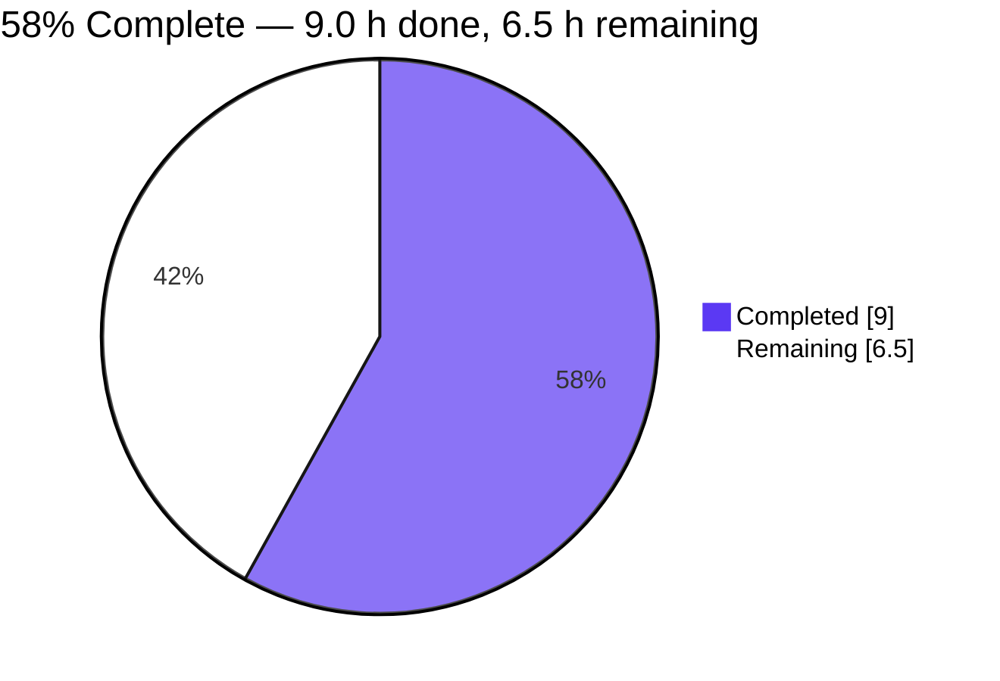
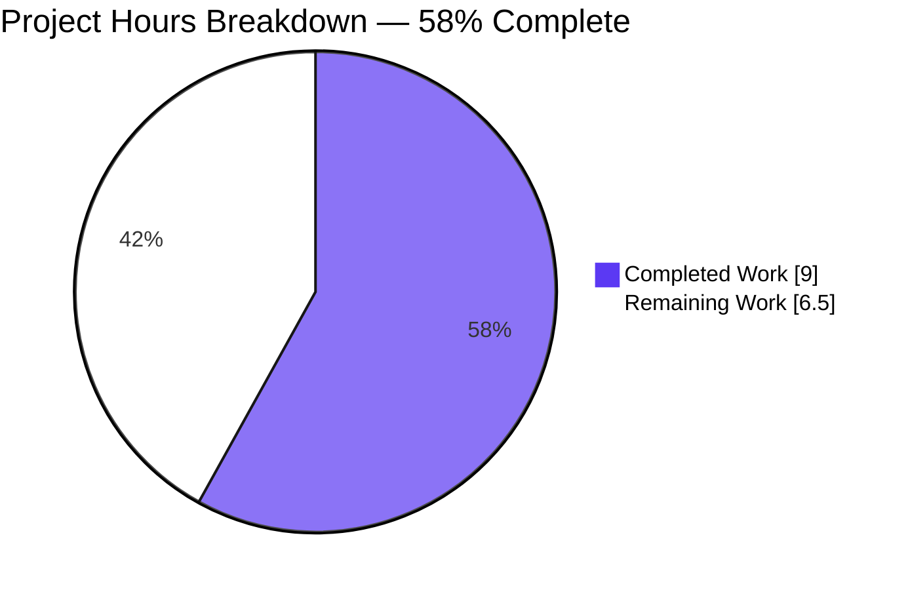
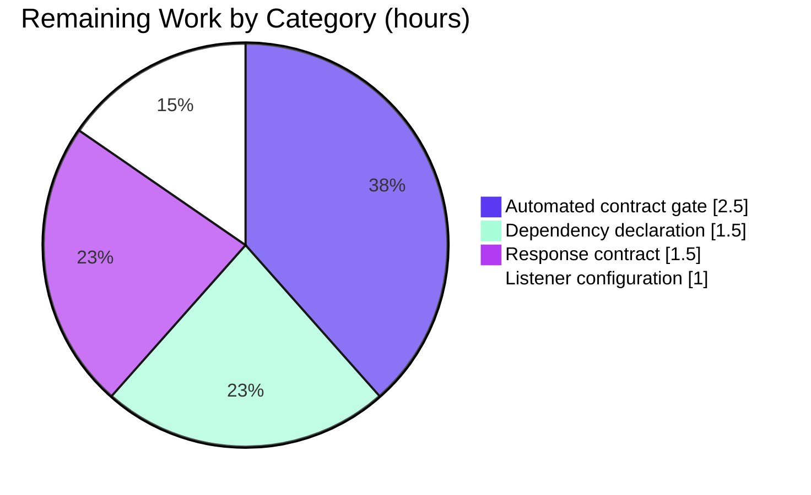

# 1. Executive Summary

## 1.1 Project Overview

This repository is a two-file Node.js demonstration service. `server (1).js` starts an HTTP listener on port 3000 whose handler answers every request with the fixed body `Hello, World!`. This change adds a one-line JSDoc summary above that handler and creates `README.md` holding the project name, the install command and the run command. Its reader is a developer picking the repository up cold: the README is the tree's only documentation and doubles as the runbook. No behaviour, dependency, manifest or deployment surface changed.

## 1.2 Completion Status

**58% complete — 9.0 hours delivered of 15.5 total.** Completion % = (9.0 / 15.5) × 100 = 58%.



| Metric | Hours |
| --- | --- |
| Total Hours | 15.5 |
| Completed Hours (AI + Manual) | 9.0 |
| Remaining Hours | 6.5 |

Both requested deliverables are delivered and verified. The remaining 6.5 hours are path-to-production work this change does not carry: dependency declaration and pinning, an automated contract gate, the response contract, and listener configuration (Section 2.2).

## 1.3 Key Accomplishments

- ✅ `server (1).js` documents its handler with one JSDoc summary line, byte-exact to the specified wording.
- ✅ The summary matches real behaviour: every valid request gets the same 14-byte body.
- ✅ `README.md` is the project's first documentation — name, install and run commands in five lines.
- ✅ Both commands agree with the code they document.
- ✅ The runbook was exercised from a clean checkout: install → boot → serve → stop.
- ✅ 102 checks passed across content conformance, syntax, the HTTP contract, methods and paths, concurrency, lifecycle and browser rendering.
- ✅ Scope held to two files: one inserted line and a five-line README.
- ✅ No secrets, no request input, no injection sink and no placeholder code.

## 1.4 Critical Unresolved Issues

**0 of the 2 requested deliverables are incomplete** — the summary and the README are both present and verified. Four accepted caveats remain open:

| Issue | Impact | Owner | ETA |
| --- | --- | --- | --- |
| `lodash` is required by `server (1).js:1` but no manifest or lockfile declares it, so a clean checkout adopts whatever the registry serves | Medium — reproducibility; following the README's install line also leaves `package.json`/`package-lock.json` in a tree that tracks neither | Repository owner | Next maintenance cycle |
| No automated gate of any kind: no test, lint, format, type-check, build, coverage or security tooling exists; the declared gate is a syntax check | Medium — the documented contract is protected only by manual execution | Repository owner | Next maintenance cycle |
| Responses carry no `Content-Type` and there is no 404 or error path; the catch-all answers every path with 200 | Low — clients must MIME-sniff the body, and an unknown resource cannot be signalled | Repository owner | When the endpoint gains behaviour |
| The listener binds every interface while the startup log states loopback, and the port is fixed at 3000 | Low to Medium — reachable off-loopback on a shared host; the documented run command fails where port 3000 is taken | Platform or repository owner | Before any shared-host or deployed use |

## 1.5 Access Issues

No access issues identified. The one dependency installs from the public npm registry, which was reachable, and the service needs no credentials, secrets, databases, external APIs or environment variables.

## 1.6 Recommended Next Steps

1. [High] Declare and pin the runtime dependency so a clean checkout is reproducible. (1.5 h)
2. [High] Add a CI contract gate asserting HTTP 200, `Content-Length: 14` and the exact body. (2.5 h)
3. [Medium] Set the response's `Content-Type` explicitly and decide the 404 and error behaviour. (1.5 h)
4. [Low] Make the listener's host and port externally configurable and reconcile the startup log. (1.0 h)

# 2. Project Hours Breakdown

## 2.1 Completed Work Detail

| Component | Hours | Description |
| --- | --- | --- |
| Inline request-handler summary — `server (1).js` | 1.0 | One JSDoc summary line added at column 0 directly above the handler; the file's only comment; the minimal-diff constraint respected. |
| Repository README — `README.md` | 1.5 | Created with the project name, the install command and the run command; both commands derived from the code and the tracked path; the excluded sections deliberately omitted. |
| Content verification of both deliverables | 2.5 | Byte-exact comparison against the specified literals, insertion-only proof against the previous revision, formatting and line-ending checks, and the syntax gate. |
| End-to-end runbook exercise | 3.0 | Dependency install, service boot, HTTP contract bytes, the 35-case method × path matrix, 50-way concurrency, port-collision behaviour, restart and port release, and browser rendering. |
| Scope-boundary and repository-hygiene checks | 1.0 | Confirming no manifest, lockfile, test, environment change, rename or extra file, plus placeholder and secret sweeps over both files. |
| **Total** | **9.0** | |

## 2.2 Remaining Work Detail

| Category | Hours | Priority |
| --- | --- | --- |
| Declare and pin the runtime dependency (manifest plus lockfile pinning the verified version; README install line reconciled) | 1.5 | Medium |
| Automated contract gate wired to CI (smoke test asserting HTTP 200, `Content-Length: 14` and the exact body, run alongside the syntax check) | 2.5 | Medium |
| Response contract decisions (`Content-Type` on the served body; 404 and error behaviour for the catch-all) | 1.5 | Medium |
| Listener configuration (externally supplied host and port; startup log reconciled with the address actually bound) | 1.0 | Low |
| **Total** | **6.5** | |

Completed hours in Section 2.1 (9.0) plus remaining hours in Section 2.2 (6.5) equal the 15.5 total project hours in Section 1.2, giving 9.0 / 15.5 = 58% complete.

# 3. Test Results

Every result below was executed directly against the delivered files and the running service. Coverage is not reported because the repository ships no coverage tooling.

| Area / Category | Framework | Tests | Passed | Failed | Coverage | What This Proves |
| --- | --- | --- | --- | --- | --- | --- |
| Documentation content conformance | Byte-exact comparison (Python) | 6 | 6 | 0 | Not reported — no coverage tooling in the repository | Both deliverables match the specified content byte for byte, and the server file's change is a pure insertion. |
| Source syntax and change shape | `node --check` plus git diff inspection | 3 | 3 | 0 | Not reported | The server file parses, and the change is one insertion with zero deletions. |
| HTTP response contract | curl (headers and body bytes) | 3 | 3 | 0 | Not reported | Every request is answered `HTTP/1.1 200 OK` with a 14-byte `Hello, World!\n` body. |
| Method × path matrix | curl | 35 | 35 | 0 | Not reported | The catch-all answers every method and path with identical bytes, HEAD returning headers only. |
| Concurrency | curl driven through `xargs -P 10` | 50 | 50 | 0 | Not reported | The service answers 50 simultaneous requests without error or dropped connection. |
| Lifecycle and port collision | Node, curl and a socket probe | 2 | 2 | 0 | Not reported | A second listener on the same port fails cleanly with `EADDRINUSE` while the first keeps serving, and stopping the process by its own pid releases the port. |
| Browser rendering | Headless Chrome at 1280×800 | 3 | 3 | 0 | Not reported | All three URLs render as plain text with the expected body, zero console messages and no failed request. |
| **Total** | | **102** | **102** | **0** | | |

**No automated test suite exists.** The project's declared test paths yield nothing to run: `npm test` exits 254 because no manifest defines a script, and Node's built-in runner reports `# tests 0 / # pass 0 / # fail 0`. Every result above is a check executed against the running service and the delivered files.

**Not Covered**

- Nothing in this repository is exercised by an automated test, so a future edit to the handler or to the README is caught by nothing. Before release, add the contract gate described in Section 2.2 and let it assert the status, `Content-Length` and exact body.
- The response header set is not asserted as a contract and no client that refuses to MIME-sniff the body was tried; decide the `Content-Type` and pin it with a test.
- No error, 404 or failure path was exercised because none exists: the handler reads no request input and holds no state, so there is no branch to drive.
- No authentication, session, data store, cache, message queue, configuration file, environment variable or scheduled task was exercised — the service has none of them and integrates with nothing external.
- Malformed requests (invalid request lines, unknown methods, oversized headers, conflicting `Content-Length`/`Transfer-Encoding`) were answered by Node's own parser with 400/431 or a closed socket. That is framework behaviour, not application logic, and carries no application test.

# 4. Runtime Validation & UI Verification

- ✅ **Startup** — `node "server (1).js"` from the repository root logs exactly `Server running at http://127.0.0.1:3000/` (one line, 41 bytes) and binds TCP 3000.
- ✅ **Dependency installation** — `CI=true npm install --no-save --no-package-lock lodash` installs lodash 4.18.1 and creates no manifest or lockfile; without it startup stops with `Cannot find module 'lodash'` at `server (1).js:1:11`.
- ✅ **Primary endpoint** — `GET /` returns `HTTP/1.1 200 OK`, `Content-Length: 14`, body `Hello, World!` followed by a newline.
- ✅ **Catch-all routing** — 35 method × path combinations (GET, POST, PUT, PATCH, DELETE, OPTIONS, HEAD across `/`, `/index.html`, `/some/arbitrary/path`, `/?x=1`, `/favicon.ico`) all returned 200.
- ✅ **Browser surface** — three navigations at 1280×800 rendered as plain text with the expected body, zero console messages of any type, 6 of 6 requests 200, and the query string echoed nowhere in the page.
- ✅ **Concurrency** — 50 simultaneous requests all returned 200.
- ✅ **Lifecycle** — a second listener on the same port exits with `Error: listen EADDRINUSE` while the first keeps serving; the process stopped cleanly by its own pid and the port was released.
- ⚠ **Response interface** — the response carries only `connection`, `content-length`, `date` and `keep-alive`: no `Content-Type` and no security headers, so clients rely on MIME sniffing, and no 404 or error response exists to exercise.
- ⚠ **Port handling** — the documented port is a literal; where another process holds 3000 the documented command fails with `EADDRINUSE`. A port-substituted copy inside the repository boots and serves 200/14, though its printed log line still names 3000.
- ❌ **Not exercised at runtime** — authentication, sessions, any data store, cache, message queue, configuration file, environment variable, scheduled task and every third-party integration. None exists in the tree, so no flow of that kind was driven; the only runtime surface is the single HTTP endpoint.

# 5. Compliance & Quality Review

## 5.1 Compliance Matrix

| # | Deliverable | Benchmarked expectation | Status | Progress |
| --- | --- | --- | --- | --- |
| 1 | One-line handler summary in `server (1).js` | Exactly one `/** ... */` line above the handler, with no tags, extra paragraph or example | ✅ Pass | 100% |
| 2 | Comment placement | Column 0, immediately above the handler statement | ✅ Pass | 100% |
| 3 | Minimal-diff constraint | The server file gains the comment line and nothing else | ✅ Pass | 100% |
| 4 | Summary accuracy | The comment states the handler's real behaviour for every request | ✅ Pass | 100% |
| 5 | `README.md` content | Project name, install command and run command; under 15 lines; no excluded section | ✅ Pass | 100% |
| 6 | README command accuracy | Both commands name real artifacts in the tree | ✅ Pass | 100% |
| 7 | Runbook executability | Install then run brings the service up and serving from a clean checkout | ✅ Pass | 100% |
| 8 | Scope boundary | No other file added, renamed, removed or modified | ✅ Pass | 100% |
| 9 | Security hygiene | No secret, no request input path, no injection sink, no `eval`/`exec`/filesystem surface | ✅ Pass | 100% |
| 10 | Dependency declaration and reproducibility | A manifest and lockfile declare and pin the runtime dependency | ⚠ Gap | 0% — outside this change's scope; see 5.2 |
| 11 | Automated quality gates | Tests, lint, coverage or a security scan protect the delivered behaviour | ⚠ Gap | 0% — a syntax check is the only gate |
| 12 | Production hardening | Response header contract, error handling, bound host, configurable port | ⚠ Gap | 0% — deliberately out of scope; see 5.2 |

## 5.2 AAP & Rule Divergences and Gaps

Seven departures were established. None of them affects the correctness of the delivered content; each is a decision a human should confirm or close.

| # | What the AAP / Rule Required | What Was Delivered Instead | Why It Diverged | Impact | Remediation |
| --- | --- | --- | --- | --- | --- |
| D1 | The comment goes "above the request handler in `server.js`" | The comment is in `server (1).js`, the tracked file, under its existing name | The request named a file the repository does not have; the plan resolved it to the existing file and renaming was out of scope | None on content; the README's run command must name the real path | None required — keep name and README aligned if the file is ever renamed |
| D2 | Run a `--no-fix` linter over each modified file | No linter run; byte-exact comparison, structural inspection and the syntax gate instead | No linter binary exists on the host and no lint configuration exists in the tree, so the step had no target | None on the delivered content; style findings may appear if a linter is introduced later | Add lint tooling deliberately, then expect and triage findings |
| D3 | The edited server file expected at 232 bytes and the README at 63 | 245 bytes and 76 bytes, matching the specified literals exactly | The mandated comment measures 59 characters, not the 46 the expectation assumed; shrinking it would have deleted specified content | Any acceptance check asserting 232/63 misreports correct files | None in this repository — the files are right; align any size assertion with the delivered content |
| D4 | Commit every legitimate non-temporary file | The install product (`node_modules/`) and the browser-evidence directory were left uncommitted | Both are build and capture artifacts, and the sanctioned non-manifest install was used precisely to avoid writing a manifest or lockfile | A fresh clone has no dependency and must run the documented install before starting | Keep them untracked; the dependency is declared through D5's remediation |
| D5 | The change adds no package, manifest or lockfile, and the README documents the install the code needs | The README's `npm install lodash` is verbatim as specified; no manifest or lockfile was added | The plan fixed the README content and excluded manifests, lockfiles and dependencies from scope | The install resolves an unpinned version, and running it verbatim writes `package.json` and `package-lock.json` into a tree that tracks neither | Declare and pin the dependency, and decide whether the README should state the working directory (1.5 h) |
| D6 | Ship a repository whose delivered behaviour is protected | No test suite, runner, CI workflow, lint, coverage or security tooling exists; the gate is a syntax check | Test suites and test files were explicitly out of scope for a documentation-only change | The documented contract is protected only by manual execution; later edits pass silently | Add the contract gate and wire it to CI (2.5 h) |
| D7 | Apply production hardening where the delivered behaviour reaches clients | No `Content-Type`, no security or caching headers, no 404 or error handling, no bound host and a fixed port literal | The scope boundary names 404 handlers, error handlers, environment-variable configuration and unrequested hardening as out of scope | Browsers MIME-sniff the body; the endpoint is reachable off-loopback while the log says loopback; the run command fails where port 3000 is taken | Set the header contract, decide the error behaviour and configure the listener (2.5 h) |

**D1 — file name.** The request asked for the comment "above the request handler in `server.js`". The repository tracks the file as `server (1).js`, the only JavaScript file in the tree, and the plan resolved the discrepancy by putting the comment in the existing file under its current name — which is what line 3 does. Renaming was excluded because the run command at `README.md:5` must name a path that exists, and because further edits to that file were outside the change's boundary. Nothing is outstanding: the comment sits where the request intended, in the file the repository actually has.

**D2 — linter run.** The delivery rules require a `--no-fix` linter run over each modified file. Neither `eslint`, `markdownlint`, `mdl`, `remark` nor `prettier` exists on this host, and the tree carries no lint configuration of any kind, so the step had no target. In its place the delivered content was compared byte for byte against the specified literals, inspected structurally (`od`, line-ending, whitespace and CR/TAB checks) and passed through `node --check "server (1).js"`, which exits 0. The reader should treat this as a check that was skipped rather than passed: introduce lint tooling deliberately, then expect findings in both files.

**D3 — size expectations.** The delivery instructions expected the edited server file at 232 bytes and the README at 63. The files are 245 and 76 bytes because the specified comment measures 59 characters rather than the 46 the instruction assumed (185 + 59 + 1 = 245), and the README is 71 characters plus five line feeds (76). Reaching the smaller figures would mean deleting characters from content the specification fixes verbatim, which the change was not permitted to do, so the literals were applied unchanged. Any automated acceptance check still asserting 232 or 63 bytes will misreport these files as wrong; the assertion should follow the delivered content.

**D4 — uncommitted artifacts.** The working tree contains an untracked `node_modules/` holding the installed dependency and an untracked directory of browser screenshots. The general instruction is to commit every legitimate non-temporary file; these were deliberately left out because they are build and capture artifacts, and the sanctioned install form was chosen specifically to avoid writing `package.json` or `package-lock.json`. Nothing a reader needs is missing from history — both deliverables are committed in `bbc452d` and `c72e472`. The consequence to know about is that a fresh clone has no dependency and will not start until the documented install runs.

**D5 — undeclared dependency and the install line.** `server (1).js:1` requires `lodash` although the repository tracks no manifest or lockfile, and the README's install line at `README.md:3` is exactly the command the specification fixed. Run verbatim in this tree, it resolves the current release rather than a pinned version, and npm also writes `package.json` and `package-lock.json` beside the code, so a reader following the README ends with a working tree that no longer matches the two tracked files. The text could not be tightened without changing specified content. Decide whether to declare and pin the dependency, and whether the README should state that both commands are run from the repository root.

**D6 — no automated gate.** The change deliberately ships no test suite, runner, CI workflow, lint, format, type-check, coverage or security tooling; the only gate in the tree is `node --check "server (1).js"`. Consequently the delivered behaviour — the 200 status, `Content-Length: 14` and the exact 14-byte body — is protected by nothing but manual execution, and any later edit to the handler or to the README passes silently. Every claim in this guide was established by running the service directly against the delivered files. Section 2.2 carries 2.5 hours to add the contract gate that closes this gap.

**D7 — no hardening.** The response path was left exactly as found: no `Content-Type`, no security or caching headers, no 404 or error handling, no bound host and a fixed port literal. The scope boundary names 404 handlers, error handlers, environment-variable configuration and any unrequested hardening as out of scope, so their absence is a recorded non-requirement rather than a defect. Two consequences deserve a decision: browsers fall back to MIME sniffing (observed as `text/plain`), and `listen(3000)` binds every interface while the startup log states `127.0.0.1` (`server (1).js:6`), a mismatch any security review will flag. Section 2.2 carries 2.5 hours for both.

# 6. Risk Assessment

| Risk | Category | Severity | Probability | Mitigation | Status |
| --- | --- | --- | --- | --- | --- |
| No automated protection: no test, lint, format, type-check, build, coverage or security tooling exists, and the only gate is a syntax check | Technical | Medium | High | Land the contract gate from Section 2.2 and run it in CI beside `node --check "server (1).js"` | Open |
| The runtime dependency is undeclared and unpinned: `server (1).js:1` requires `lodash` with no manifest or lockfile, so a clean checkout adopts whatever the registry serves | Technical | Medium | Medium | Declare the dependency with a pinned version and commit the lockfile (1.5 h) | Open |
| Fixed port 3000: the port is a literal in the tracked file, so the documented run command fails with `EADDRINUSE` wherever the port is taken | Operational | Medium | Medium on a workstation, High on a shared host | Supply host and port externally and document the default (1.0 h) | Open |
| Wildcard bind against a loopback log: `listen(3000)` passes no host argument, so the endpoint answers on every interface while the startup log states `127.0.0.1` (`server (1).js:6`) | Security | Low | Medium | Bind to an explicit host and make the log state the address actually bound (part of the 1.0 h listener work) | Open |
| Response interface is unspecified: no `Content-Type`, no security or caching headers, and no 404 or error path, so clients MIME-sniff the body and unknown resources answer 200 | Integration | Low | High for clients that do not sniff | Set the header contract and decide the error behaviour, then pin both with a test (1.5 h) | Open |
| Working tree is not self-contained and the runbook mutates it: `node_modules/` is required but untracked, and the documented install line writes `package.json` and `package-lock.json` into a tree that tracks neither | Operational | Low | Medium | Declare and pin the dependency, and reconcile the README install line (1.5 h) | Open |
| Minimal observability: the only operational signal is a single startup line — no health endpoint, no request logging, no metrics — so a served-but-wrong deployment looks identical to a healthy one | Operational | Low | Low | Add a health check and request logging if the service is kept beyond a demonstration | Open |

No integration risk exists beyond the response interface: the service integrates with no database, cache, message queue, credential, third-party API or scheduled task, and it consumes no request input.

# 7. Visual Project Status

**Delivery status by hours** — completed work (dark blue) against remaining work (white). The values match Section 1.2 and Section 2.2 exactly.



**Remaining work by category** — the same 6.5 hours as Section 2.2, split by the four categories that carry them.



| Remaining work | Hours | Priority | Share of remaining |
| --- | --- | --- | --- |
| Automated contract gate | 2.5 | Medium | 38% |
| Dependency declaration and pinning | 1.5 | Medium | 23% |
| Response contract decisions | 1.5 | Medium | 23% |
| Listener configuration | 1.0 | Low | 15% |
| **Total** | **6.5** | | **100%** |

# 8. Summary & Recommendations

The requested documentation is delivered and verified. `server (1).js` carries a single one-line JSDoc summary above its request handler, byte-exact to the specified wording and the file's only comment, and `README.md` exists as the project's first documentation with the project name, the one install command and the run command. The change is exactly what was asked for and nothing more: one inserted line in the server file, five lines in the README, no rename, no manifest, no lockfile, no test, no configuration change, and no alteration to the endpoint's behaviour. Both documented commands were checked against the code they describe — the install names the one module the file loads, and the run command names the tracked path character for character, quoted for its space and parentheses.

What proves it: 102 executed checks passed at 100%, covering byte-exact content conformance, the syntax gate, the HTTP response contract, 35 method × path combinations, 50-way concurrency, the listener lifecycle including a clean `EADDRINUSE` failure and port release, and browser rendering at 1280×800 with zero console messages. The documented runbook was exercised from a clean checkout in its documented order — install, then run — and brought the service up serving `HTTP/1.1 200 OK` with `Content-Length: 14` and the exact body `Hello, World!`.

Against that, the completion figure is **58% (9.0 of 15.5 hours)** because the accounting also carries the path-to-production work the change deliberately does not include. Three areas are unmet by design and make up the whole of the remaining 6.5 hours: the runtime dependency is required by `server (1).js:1` but declared nowhere, so a clean checkout is not reproducible and following the README's install line leaves manifests in a tree that tracks neither; no automated gate of any kind protects the delivered behaviour, so the documented contract rests on manual execution; and the response path carries no `Content-Type`, no error or 404 handling, no bound host and a fixed port literal. Seven divergences are documented in Section 5.2, including the file-name resolution, the skipped linter run, the size expectations the mandated content necessarily exceeds, and the deliberately uncommitted build artifacts.

The critical path to production is short and specific. First, declare and pin the dependency so the documented install is reproducible and leaves the working tree consistent (1.5 h). Second, add the contract gate and run it in CI together with the syntax check, converting this guide's claims into an automated guarantee (2.5 h). Third, decide the response's content type and error behaviour, then pin them with a test (1.5 h). Fourth, make the listener's host and port externally configurable and reconcile the startup log with the address bound (1.0 h). Nothing on that path changes the documentation itself; each item protects or completes it.

Success metrics for a reader picking this repository up cold: a clean clone plus the README's two commands yields a serving endpoint on the documented port; the documented status and body are reproducible byte for byte; and the request handler's behaviour is described where a developer first looks for it. All three hold today. The dependency declaration and the automated gate are what keep them holding as the code changes.

**Production readiness: ready to ship as documentation, with the listed follow-ups.** The two deliverables are complete, byte-exact, syntactically valid, integration-correct and verified end to end, and no divergence blocks their release — they are the artefact this change was asked for. What is not production-ready is the wider demonstration service they document: no declared dependency, no automated protection, no response header or error contract, and a listener fixed in port and open on every interface. Those were explicitly outside this change's boundary and are recorded as the repository owner's next decisions rather than as defects of the documentation.

# 9. Development Guide

**System prerequisites** — Node.js 22.x (verified on v22.23.3) and npm (verified 11.18.0), a POSIX shell, and `curl` for the smoke test. Nothing else is required: no database, cache, message queue, build tool, container or environment variable. The service reads no environment variables at all.

**Repository layout**

```
server (1).js    the entire application — one HTTP server, six lines
README.md        project name, install command, run command
node_modules/    created by the install step below; deliberately untracked
```

The application file's name contains a space and parentheses, so always quote it in shell commands.

**Step 1 — install the one dependency.** Run from the repository root:

```bash
cd "$(git rev-parse --show-toplevel)"
CI=true npm install --no-save --no-package-lock lodash
node -p "require('lodash/package.json').version"    # prints 4.18.1
```

Expected: exit 0, one package installed, and no `package.json` or `package-lock.json` created. The flags matter: the repository tracks no manifest, and the plain form `npm install lodash` would write both files into a tree that tracks neither. This step is mandatory — `server (1).js:1` loads `lodash`, so without it startup stops with `Cannot find module 'lodash'`.

**Step 2 — check the syntax.** There is no build, bundler or compile stage; the syntax check is the project's only gate:

```bash
node --check "server (1).js"     # no output, exit 0
```

**Step 3 — start the service.** Run it from the repository root; the command uses a relative path:

```bash
node "server (1).js"
```

Expected output, exactly one line:

```
Server running at http://127.0.0.1:3000/
```

Keep the quotes — without them the shell rejects the command with `syntax error near unexpected token '('`.

**Step 4 — verify it serves.**

```bash
curl -sS -i http://127.0.0.1:3000/
```

Expected:

```
HTTP/1.1 200 OK
Date: <timestamp>
Connection: keep-alive
Keep-Alive: timeout=5
Content-Length: 14

Hello, World!
```

Any method and any path returns those same 14 bytes:

```bash
curl -sS -o /dev/null -w '%{http_code} %{size_download}\n' -X POST http://127.0.0.1:3000/anything
# 200 14
curl -sS -D - -o body.txt http://127.0.0.1:3000/ && od -An -tx1 body.txt
# 48 65 6c 6c 6f 2c 20 57 6f 72 6c 64 21 0a
```

**Step 5 — stop the service.** Start it in the background so it prints its pid, then stop it by that pid:

```bash
node "server (1).js" > server.log 2>&1 &
echo $!                 # prints the pid
kill <pid>
```

`ss`, `lsof` and `netstat` are not installed in every environment; confirm the port was released with a socket probe instead:

```bash
python3 -c "import socket; s=socket.socket(); s.settimeout(1)
try:
    s.connect(('127.0.0.1',3000)); print('BUSY')
except Exception:
    print('FREE')"
```

**Troubleshooting**

| Symptom | Cause | Resolution |
| --- | --- | --- |
| `Error: Cannot find module 'lodash'` (exit 1, frame `server (1).js:1:11`) | the dependency is not installed in this checkout | run Step 1 from the repository root |
| `Error: Cannot find module '/some/path/server (1).js'` | the command was run from another directory | run it from the repository root, or pass an absolute path |
| `bash: syntax error near unexpected token '('` | the file name was not quoted | quote it: `node "server (1).js"` |
| `Error: listen EADDRINUSE: address already in use :::3000` | another process holds port 3000 | stop that process, or run a port-substituted copy (below) |
| `npm error enoent Could not read package.json` | `npm test` was run, but the repository defines no manifest or scripts | there is no test suite; use Step 2 and Step 4 instead |
| The startup log names 3000 but requests fail on your substituted port | in a substituted copy only the `listen` argument changes, not the log string | trust the port you substituted; the log text is fixed in the source |

**Running on a different port.** The port is a literal in the tracked file, so use a scratch copy rather than editing it. Keep the copy inside the repository so `require('lodash')` still resolves:

```bash
mkdir -p .run && sed 's/listen(3000/listen(31650/' "server (1).js" > .run/server.js
node .run/server.js
curl -sS -i http://127.0.0.1:31650/
```

Never commit the scratch directory, and leave the tracked file's port literal unchanged.

**Example usage and expected behaviour**

- `GET /` → `200`, body `Hello, World!` (14 bytes including the newline).
- `POST /some/arbitrary/path` with a JSON body → `200` and the same body; the request body is never read. For bodies of about 1 MB or more the client's remaining writes may fail after the response is delivered, because the handler answers without consuming it.
- `HEAD /` → `200` with headers only.
- Unknown paths and `/favicon.ico` → `200` with the same body: there is no 404.
- Query strings are ignored and never echoed into the response.
- Malformed requests (invalid request line, unknown method token, headers over 16 KB, conflicting `Content-Length`/`Transfer-Encoding`) are rejected or closed by Node's HTTP parser before the handler runs.

**What is deliberately absent.** No test suite, lint, format, type-check or build tooling; no manifest, lockfile, container, CI pipeline, configuration file or environment variable. Do not add a manifest or lockfile by accident — the repository tracks neither today, and Section 2.2 describes the work to change that deliberately.

# 10. Appendices

## A. Command Reference

| Purpose | Command (run from the repository root unless noted) | Expected result |
| --- | --- | --- |
| Install the dependency | `CI=true npm install --no-save --no-package-lock lodash` | exit 0; lodash 4.18.1; no manifest or lockfile written |
| Confirm the dependency | `node -p "require('lodash/package.json').version"` | `4.18.1` |
| Syntax check (the repository's only gate) | `node --check "server (1).js"` | no output, exit 0 |
| Start the service | `node "server (1).js"` | `Server running at http://127.0.0.1:3000/` |
| Start in the background | `node "server (1).js" > server.log 2>&1 & echo $!` | prints the process id |
| Smoke test | `curl -sS -i http://127.0.0.1:3000/` | `HTTP/1.1 200 OK`, `Content-Length: 14`, body `Hello, World!` |
| Check another method/path | `curl -sS -o /dev/null -w '%{http_code} %{size_download}\n' -X POST http://127.0.0.1:3000/any` | `200 14` |
| Inspect the body bytes | `curl -sS -o body.txt http://127.0.0.1:3000/ && od -An -tx1 body.txt` | `48 65 6c 6c 6f 2c 20 57 6f 72 6c 64 21 0a` |
| Stop the service | `kill <pid>` | process ends; port released |
| Probe port availability | `python3 -c "import socket; s=socket.socket(); s.settimeout(1); ..."` | prints `FREE` or `BUSY` (`ss`, `lsof` and `netstat` may be absent) |
| Run on another port | `mkdir -p .run && sed 's/listen(3000/listen(31650/' "server (1).js" > .run/server.js && node .run/server.js` | serves on 31650; never commit `.run/` |
| Review the change | `git diff --stat f0ba73b..HEAD` | 2 files changed, 6 insertions, 0 deletions |

## B. Port Reference

| Port | Purpose | Source | Notes |
| --- | --- | --- | --- |
| 3000 | The service's only listener | `server (1).js:6`, literal in `.listen(3000, ...)` | Hard-coded; no environment override. The startup log names `http://127.0.0.1:3000/`, but no host argument is passed to `listen`, so the socket binds the dual-stack wildcard. |
| — | Health check, metrics, admin or debug ports | none | The service exposes no other port and no health endpoint. |

## C. Key File Locations

| Path | Contents |
| --- | --- |
| `server (1).js:1` | `const _ = require('lodash');` — the dependency the install step satisfies; the binding is never used. |
| `server (1).js:3` | The one-line JSDoc summary describing the request handler — the only comment in the tree. |
| `server (1).js:4-6` | The whole application: the catch-all request listener, the fixed 14-byte response, and the listener with its startup log. |
| `README.md:1,3,5` | Project name, install command, run command — the complete documentation. |
| `node_modules/` | Created by the install step; untracked and deliberately absent from git. |

## D. Technology Versions

| Component | Version | Notes |
| --- | --- | --- |
| Node.js | v22.23.3 (verified) | CommonJS; the HTTP server uses only the built-in `http` module. |
| npm | 11.18.0 (verified) | Used solely to install the dependency. |
| lodash | 4.18.1 (verified as resolved) | Required at `server (1).js:1` and never invoked. The repository pins no version. |
| Python | 3.13.7 (verified) | Not a project dependency; used only for socket probes and byte-level comparisons in environments without `ss`/`lsof`. |

## E. Environment Variable Reference

None. The application reads no environment variables (`process.env` does not appear in the tree), takes no configuration file and requires no secrets. The only variable used anywhere in the workflow is `CI=true`, set for the install command to keep npm non-interactive.

## F. Developer Tools Guide

| Task | Tool | Note |
| --- | --- | --- |
| Parse check | `node --check "server (1).js"` | The only gate the project has; there is no build, bundler or type checker. |
| Exercising the contract | `curl` | Assert the status, `Content-Length: 14` and the exact body bytes; there is no test suite to run. |
| Port inspection | `python3` socket probe | `ss`, `lsof`, `netstat` and `nc` are not guaranteed to be installed. |
| Change inspection | `git diff --stat`, `git diff --numstat`, `git log` | The full change is two files, six inserted lines. |
| Style and linting | none available | No linter or formatter is installed and no configuration exists; if one is introduced later, expect findings in both files. |

## G. Glossary

| Term | Meaning here |
| --- | --- |
| Catch-all handler | The single request listener that answers every method and every path; it contains no routing, so no path is special-cased and no 404 exists. |
| EADDRINUSE | The error a second process gets when the port is already held; the documented run command fails this way where 3000 is taken. |
| JSDoc summary | A single `/** ... */` comment line; here it is a one-line summary above the handler statement, not a per-symbol documentation block. |
| Minimal diff | The constraint that the changed file gains the new line and nothing else — no reflowed lines, no line-ending or whitespace changes. |
| MIME sniffing | What browsers do when no `Content-Type` is sent; Chrome renders this response as `text/plain` on that basis. |
| Manifest / lockfile | `package.json` and the lockfile npm writes beside it; the repository tracks neither, which is why the install step needs explicit flags. |
| Smoke test | A minimal end-to-end check that the service starts and answers; here the `curl` request in Section 9. |
