# Technical Specification

# 1. Introduction

## 1.1 Executive Summary

### 1.1.1 Project Overview

The repository holds one minimal Node.js HTTP service. Its entire implementation is the file `server (1).js` at the repository root: five lines, 185 bytes, added in the repository's only commit (`f0ba73b`, "Add files via upload", 6 October 2026). The `main` and `0610_02` branches contain the same single file. There is no README, dependency manifest, lockfile, configuration, test suite, CI pipeline or documentation.

When the file runs, it creates an HTTP server with Node.js's built-in `http` module, listens on TCP port 3000, and answers every request with the fixed plain-text body `Hello, World!\n`. The file also loads the third-party `lodash` package, never uses it, and declares it nowhere.

| Attribute | Observed Value | Evidence |
|---|---|---|
| Language / module system | JavaScript, CommonJS (`require`) | `server (1).js` lines 1, 3 |
| Runtime | Node.js; no version pinned in the repository | Absence of any manifest at the root |
| Network listener | TCP port 3000, bound to all interfaces (`::`) | `server (1).js` line 5; runtime check |
| Response | `200 OK`, body `Hello, World!\n` (14 bytes) | `server (1).js` line 4; runtime check |
| Third-party dependency | `lodash`, bound to `_`, unused and undeclared | `server (1).js` line 1 |
| Startup status from a clean checkout | Fails with `Cannot find module 'lodash'` | Runtime check |

### 1.1.2 Core Problem Addressed

The repository does not state a business problem. Its code does one thing: it brings up a reachable HTTP endpoint with a known, unchanging response. That is the canonical "Hello, World" server pattern, which teams use as:

- a baseline proving that a Node.js runtime can start a process and accept HTTP connections;
- a connectivity or smoke-test target whose response can be checked byte for byte;
- a starting scaffold for building a real service.

The file name and commit history suggest the file was uploaded ad hoc rather than developed inside the repository. The ` (1)` suffix is typical of a duplicate browser download, and the commit message "Add files via upload" is typical of a web upload. This is an inference from metadata, not a documented intent.

### 1.1.3 Key Stakeholders and Users

The repository identifies no stakeholders. The parties below are derived from the code and the git metadata.

| Stakeholder | Role Relative to the System | Basis |
|---|---|---|
| Repository author (`lakshya-blitzy`) | Contributed the only file and commit | Git commit `f0ba73b` |
| Developers / maintainers | Run, read and extend the scaffold | Single-file source in `server (1).js` |
| Operators | Start the process and provide the runtime, lodash and a free port 3000 | `listen(3000, …)` and `require('lodash')` in `server (1).js` |
| HTTP clients | Any unauthenticated client that can reach port 3000 | Request handler ignores every request attribute |

### 1.1.4 Value Proposition and Business Impact

The system has no business logic, data handling or user-facing features, so it produces no measurable business impact on its own. Its value is technical and narrow:

- **Minimal surface:** the server logic uses only Node.js's built-in `http` module, with no framework, routing or middleware.
- **Deterministic output:** every request, whatever its method, path, headers or body, gets the same 14-byte response, which makes verification trivial.
- **Fast comprehension:** the whole system can be read in seconds, which suits demonstration, onboarding and environment validation.

One defect limits even this value. The `require('lodash')` on line 1 of `server (1).js` makes startup depend on a package that the repository neither declares nor uses. In a clean checkout the process exits before it starts listening.


## 1.2 System Overview

### 1.2.1 Project Context

#### Business Context and Market Positioning

The repository has no product positioning, target market or business documentation. Technically it is a reference-grade minimal Node.js web server, the smallest program that accepts HTTP connections and returns a response. It competes with nothing and supports no business line. Its role is foundational: it is a starting point or a verification artifact.

#### Current System Limitations

The git history holds a single commit, so the system replaces or upgrades nothing. The limitations below belong to the current implementation in `server (1).js`. Each was confirmed by reading the code and running it.

| Limitation | Effect | Evidence |
|---|---|---|
| `lodash` required but undeclared (no `package.json`) | Startup fails with `MODULE_NOT_FOUND` unless lodash is installed externally | Line 1; no manifest at the root |
| `lodash` binding `_` never used | The dependency adds risk and gives nothing | Lines 1–5 |
| Port hard-coded to `3000`; no host argument | Changing the port means editing code; the server binds to all interfaces (`::`) | Line 5; runtime `server.address()` check |
| Startup log advertises `http://127.0.0.1:3000/` | The message suggests a loopback-only bind that is not what happens | Line 5 |
| No `Content-Type` or explicit status code set | Clients get `200 OK` with no declared media type | Line 4; runtime response headers |
| No server `'error'` listener | A port conflict crashes the process (`EADDRINUSE :::3000`) | Line 5; runtime check |
| File name contains a space and parentheses | The launch command must be quoted: `node "server (1).js"` | Repository root listing |

#### Integration with the Existing Enterprise Landscape

The code connects to no enterprise system. It reads no environment variables or configuration files. It talks to no database, message broker, cache, identity provider, external API or observability platform. It touches the outside world only through:

- the Node.js runtime and its built-in `http` module;
- the `lodash` package, which must be resolvable through Node's module lookup;
- a TCP listener on port 3000;
- one line written to standard output at startup.

### 1.2.2 High-Level Description

#### Primary System Capabilities

| Capability | Behavior | Source |
|---|---|---|
| HTTP listening | Accepts HTTP/1.1 connections on port 3000, all interfaces | `server (1).js` line 5 |
| Uniform response | Ends every response with `Hello, World!\n` | `server (1).js` line 4 |
| Startup notification | Logs `Server running at http://127.0.0.1:3000/` once listening | `server (1).js` line 5 |
| Connection reuse | Node.js defaults apply (`Connection: keep-alive`, `Keep-Alive: timeout=5`) | Runtime response headers |

#### Major System Components

The system has no classes, named functions or exports. It is made of the four inline elements below, all in `server (1).js`.

| Component | Location | Responsibility |
|---|---|---|
| Lodash import | Line 1 | Loads `lodash` into `_`; its only effect is the startup dependency |
| HTTP server factory | Line 3 | `require('http').createServer(...)` builds the server instance |
| Request handler (anonymous arrow function) | Lines 3–4 | Ignores `req` and calls `res.end('Hello, World!\n')` |
| Listener and startup callback | Line 5 | `.listen(3000, …)` opens the socket; the callback logs the startup URL |

#### Core Technical Approach

The file runs top to bottom as a CommonJS script. It chains server creation directly to `listen`, keeps no reference to the server instance, and uses no framework, router or middleware. All request handling runs on Node.js's single-threaded event loop inside one process. The core pattern is:

```javascript
require('http').createServer((req, res) => {
  res.end('Hello, World!\n');
}).listen(3000, () => console.log('Server running at http://127.0.0.1:3000/'));
```

The diagram below traces startup, including the lodash and port-conflict failure paths, and the handling of a request.

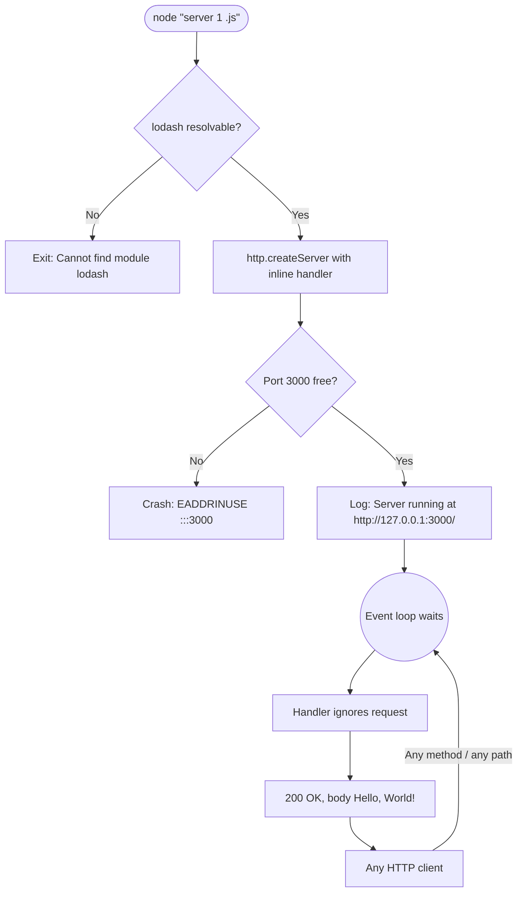
```mermaid
flowchart TD
    Launch([node &quot;server 1 .js&quot;]) --> LoadLodash{lodash resolvable?}
    LoadLodash -- No --> FailModule[Exit: Cannot find module lodash]
    LoadLodash -- Yes --> CreateServer[http.createServer with inline handler]
    CreateServer --> Listen{Port 3000 free?}
    Listen -- No --> FailPort[Crash: EADDRINUSE :::3000]
    Listen -- Yes --> LogStart[Log: Server running at http://127.0.0.1:3000/]
    LogStart --> Idle((Event loop waits))
    Client[Any HTTP client] -->|Any method / any path| Idle
    Idle --> Handler[Handler ignores request]
    Handler --> Respond[200 OK, body Hello, World!]
    Respond --> Client
```

### 1.2.3 Success Criteria

#### Measurable Objectives

The repository defines no objectives, tests or acceptance criteria. The objectives below come from the code's observable behavior. Each can be checked automatically.

| Objective | Measure | Expected Value | Current Status |
|---|---|---|---|
| Process starts | Startup log line on stdout | `Server running at http://127.0.0.1:3000/` | Fails in a clean checkout (lodash missing) |
| Listener available | Bound address and port | `::`, port `3000` | Met once lodash is resolvable |
| Correct status | HTTP status for any method and path | `200 OK` | Met (GET `/`, POST `/any/path` verified) |
| Correct payload | Response body and length | `Hello, World!\n`, `Content-Length: 14` | Met |

#### Critical Success Factors

- **Dependency resolution:** `lodash` must be resolvable from the file's location, or line 1 of `server (1).js` must be removed. Nothing else blocks startup in a clean environment.
- **Runtime availability:** a Node.js runtime with CommonJS support. The repository pins no version; the behavior above was observed on Node.js v22.23.3.
- **Port availability:** TCP port 3000 must be free on the host, because the code has no fallback or error handling.
- **Correct invocation:** the file name must be quoted on the command line because it contains a space and parentheses.

#### Key Performance Indicators

The code defines and instruments no KPIs. It emits no metrics, request logs, health endpoints or timing data. The only operational signals are the presence of the startup log line and the HTTP responses themselves. Any availability or latency KPI would have to be measured outside the process.


## 1.3 Scope

### 1.3.1 In-Scope

#### 1.3.1.1 Core Features and Functionalities

**Must-Have Capabilities**

These are the only capabilities `server (1).js` implements, so all of them are in scope.

| Capability | Description | Source |
|---|---|---|
| HTTP server creation | Builds a server with the Node.js built-in `http` module | Line 3 |
| Fixed-response handling | Returns `Hello, World!\n` for every request | Line 4 |
| Port binding | Listens on TCP port 3000 on all interfaces | Line 5 |
| Startup logging | Prints one readiness line to stdout | Line 5 |

**Primary User Workflows**

| Workflow | Actor | Steps | Outcome |
|---|---|---|---|
| Start the service | Operator | Make `lodash` resolvable, then run `node "server (1).js"` | Process listens on port 3000 and logs the startup URL |
| Request the endpoint | HTTP client | Send any request (any method, path or body) to port 3000 | `200 OK`, body `Hello, World!\n` |
| Stop the service | Operator | Terminate the process (for example with a signal) | Process exits; no shutdown logic is defined |

**Essential Integrations**

| Integration | Type | Purpose | Evidence |
|---|---|---|---|
| Node.js `http` module | Built-in runtime module | HTTP server and request handling | Line 3 |
| `lodash` | Third-party npm package | Loaded at startup; never used | Line 1 |
| Standard output | Process stream | Startup message via `console.log` | Line 5 |

**Key Technical Requirements**

- A Node.js runtime that executes CommonJS modules. No version is pinned; behavior was verified on Node.js v22.23.3.
- `lodash` installed where Node.js module resolution can find it from the file's directory. The repository has no `package.json` to supply it.
- TCP port 3000 free on the host.
- The file name `server (1).js` quoted when invoked.

#### 1.3.1.2 Implementation Boundaries

**System Boundaries**

The system is one Node.js process running one source file. Its outer boundary is the TCP socket on port 3000. Its only other output is one line to standard output at startup. It keeps no in-process state between requests and starts no child processes, workers or outbound connections.

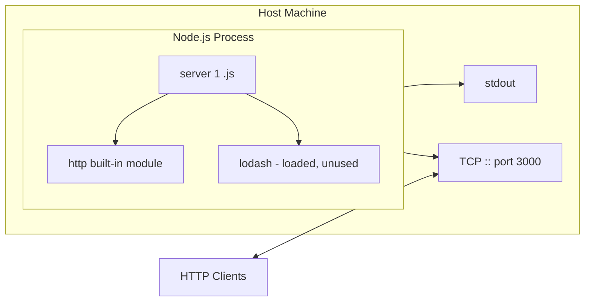
```mermaid
flowchart LR
    subgraph Host[Host Machine]
        subgraph NodeProc[Node.js Process]
            Script[server 1 .js]
            HttpMod[http built-in module]
            Lodash[lodash - loaded, unused]
            Script --> HttpMod
            Script --> Lodash
        end
        Stdout[stdout]
        Port[TCP :: port 3000]
    end
    NodeProc --> Stdout
    NodeProc --> Port
    Clients[HTTP Clients] <--> Port
```

**User Groups Covered**

| User Group | Coverage | Basis |
|---|---|---|
| Anonymous HTTP clients | Every client that can reach port 3000; no authentication or authorization | Handler ignores `req` (line 4) |
| Operators / developers | Run the process manually from a shell | No scripts, service definitions or containers present |

**Geographic and Market Coverage**

None is defined. The response is a fixed English string with no localization, content negotiation or region-specific behavior. Reachability depends only on the host's network exposure. Because the server binds to all interfaces (`::`), any network path that reaches the host can reach it.

**Data Domains Included**

None. The system reads no request data: method, URL, headers and body are all ignored. It stores, transforms and transmits no business data. The only data it handles are two string literals in `server (1).js`: the response body `Hello, World!\n` and the startup message.

### 1.3.2 Out-of-Scope

#### Excluded Features and Capabilities

The capabilities below are absent from the repository. Each was confirmed against the full contents of `server (1).js` and the repository root.

| Feature / Capability | Status | Observable Consequence |
|---|---|---|
| Routing and method handling | Not implemented | All paths and methods get the same response |
| Request parsing (query, headers, body) | Not implemented | Request input has no effect |
| Response metadata (`Content-Type`, explicit status) | Not implemented | Node.js defaults to `200` with no media type |
| HTTPS / TLS | Not implemented | Plain HTTP only |
| Authentication and authorization | Not implemented | Endpoint is open to all clients |
| Configuration (env vars, config files, CLI flags) | Not implemented | Port and messages are hard-coded |
| Error handling and resilience | Not implemented | A port conflict crashes the process |
| Graceful shutdown | Not implemented | No signal handlers or connection draining |
| Logging, metrics and health checks | Not implemented beyond one startup line | No operational telemetry |
| Persistence and state | Not implemented | No storage of any kind |
| Dependency manifest (`package.json`, lockfile) | Absent | `lodash` must be installed manually |
| Automated tests and CI/CD | Absent | No automated verification |
| Containerization and deployment descriptors | Absent | Manual execution only |

#### Future Phase Considerations

The repository has no roadmap, issues or TODO markers. The work below is not planned anywhere. It is the work the code itself shows to be needed before the scaffold can grow:

- declare `lodash` in a `package.json`, or remove the unused import on line 1;
- make the port and bind host configurable, and make the startup message match the real bind address;
- set an explicit status code and `Content-Type` on responses;
- add a server `'error'` handler and graceful shutdown;
- rename the file to remove the space and parentheses.

#### Integration Points Not Covered

- Databases, caches and file storage
- Message queues and event streams
- External or third-party HTTP APIs (the process makes no outbound calls)
- Identity and access management providers
- Logging, monitoring and tracing platforms
- Reverse proxies, load balancers and service discovery (the code has no awareness of them)

#### Unsupported Use Cases

| Use Case | Reason Unsupported |
|---|---|
| Running from a clean checkout without extra setup | `require('lodash')` fails; no manifest supplies the package |
| Production traffic serving | No TLS, auth, error handling, telemetry or shutdown handling |
| Serving dynamic content, files or APIs | The handler returns one fixed string |
| Loopback-only exposure as the log message implies | `listen(3000)` with no host binds to all interfaces |
| Running on a port other than 3000 without code changes | The port is a hard-coded literal |
| Running several instances on one host | The second instance crashes with `EADDRINUSE` |


## 1.4 References

- `server (1).js` - The whole implementation: the unused, undeclared `lodash` import (line 1); HTTP server creation with Node.js's built-in `http` module (line 3); the fixed `Hello, World!\n` response handler (line 4); the hard-coded port 3000 listener and the startup log message (line 5).
- `/` (repository root) - Contains only `server (1).js`. No README, `package.json`, lockfile, configuration, tests, CI or deployment files exist, which establishes the out-of-scope items and the missing-manifest limitation.
- Git history (commit `f0ba73b`, branches `main` and `0610_02`) - A single commit, "Add files via upload", by `lakshya-blitzy` on 6 October 2026, adding the one file. Both branches have identical content.
- Runtime verification of `server (1).js` on Node.js v22.23.3 - Confirmed that startup fails with `Cannot find module 'lodash'` in a clean checkout; that the server returns `200 OK` with `Content-Length: 14` and no `Content-Type` for any method and path; that it binds to `::` port 3000; and that a second instance crashes with `EADDRINUSE`.


# 2. Product Requirements

## 2.1 Feature Catalog

The repository has no requirements documents, README, issue tracker content or roadmap. This catalog is therefore derived from the behavior of the only source file, `server (1).js`, as committed in `f0ba73b` (branches `main` and `0610_02`). It lists five features, one for each functional element of the file. All five are implemented. No feature is proposed or in development, and the future work listed in Section 1.3.2 is not planned anywhere in the repository, so the catalog leaves it out.

Priorities reflect each feature's role in serving the fixed HTTP response. The repository assigns no priorities of its own.

| ID | Feature Name | Category | Priority / Status |
|---|---|---|---|
| F-001 | HTTP Server Initialization | Core HTTP Infrastructure | Critical / Completed |
| F-002 | Uniform Fixed-Response Handling | Request Processing | Critical / Completed |
| F-003 | TCP Listener on Port 3000 | Network Connectivity | Critical / Completed |
| F-004 | Startup Readiness Logging | Observability / Operations | Medium / Completed |
| F-005 | Lodash Module Loading | Dependency Management | Low / Completed (undeclared) |

### 2.1.1 F-001: HTTP Server Initialization

| Attribute | Value |
|---|---|
| Unique ID | F-001 |
| Feature Name | HTTP Server Initialization |
| Feature Category | Core HTTP Infrastructure |
| Priority Level | Critical |
| Status | Completed |
| Source | `server (1).js` line 3 |

**Description**

- **Overview:** When the script loads, it calls `require('http').createServer(...)` with one inline request listener and no options object. The resulting `http.Server` instance is never assigned to a variable. `.listen()` is chained onto it directly (F-003).
- **Business Value:** This creates the HTTP endpoint, which is the system's only product. Nothing else in the file serves traffic.
- **User Benefits:** Developers and operators get a working HTTP server built only on Node.js's built-in `http` module, with no framework, router or middleware to install or learn.
- **Technical Context:** The file is a CommonJS script. Because `createServer` gets no options, Node.js defaults govern parsing and connection limits. On Node.js v22.23.3 these are a 16,384-byte header limit, `headersTimeout` 60,000 ms, `requestTimeout` 300,000 ms and `keepAliveTimeout` 5,000 ms. The code keeps no reference to the server, so it cannot close the server, attach event handlers or change settings after creation.

**Dependencies**

| Dependency Type | Dependency |
|---|---|
| Prerequisite Features | F-005: line 1 must succeed before line 3 runs |
| System Dependencies | Node.js runtime that executes CommonJS. No version is pinned; behavior was verified on v22.23.3 |
| External Dependencies | None. `http` is a Node.js built-in module |
| Integration Requirements | Hosts F-002's handler as its request listener; F-003 binds this instance |

### 2.1.2 F-002: Uniform Fixed-Response Handling

| Attribute | Value |
|---|---|
| Unique ID | F-002 |
| Feature Name | Uniform Fixed-Response Handling |
| Feature Category | Request Processing |
| Priority Level | Critical |
| Status | Completed |
| Source | `server (1).js` lines 3–4 |

**Description**

- **Overview:** The anonymous arrow function `(req, res) => { res.end('Hello, World!\n'); }` ignores the request object. It ends every response with the same 14-byte body.
- **Business Value:** The response is deterministic and byte-exact, which makes the endpoint usable as a connectivity or smoke-test target (Section 1.1.2).
- **User Benefits:** A client can confirm that the server is reachable with any method and any path, and always gets a predictable answer.
- **Technical Context:** The handler sets no status code and no headers. Node.js supplies `200 OK`, `Date`, `Connection: keep-alive`, `Keep-Alive: timeout=5` and `Content-Length: 14`. No `Content-Type` is sent. For `HEAD` requests Node.js sends the headers without a body. The handler never reads the request method, URL, query string, headers or body.

**Dependencies**

| Dependency Type | Dependency |
|---|---|
| Prerequisite Features | F-001: the handler is registered as the server's request listener |
| System Dependencies | Node.js `http` default response behavior (status, framing, keep-alive) |
| External Dependencies | None |
| Integration Requirements | Receives requests that reach the server through F-003's listener on port 3000 |

### 2.1.3 F-003: TCP Listener on Port 3000

| Attribute | Value |
|---|---|
| Unique ID | F-003 |
| Feature Name | TCP Listener on Port 3000 |
| Feature Category | Network Connectivity |
| Priority Level | Critical |
| Status | Completed |
| Source | `server (1).js` line 5 |

**Description**

- **Overview:** `.listen(3000, callback)` binds the server to TCP port 3000. No host argument is given, so the server binds to the unspecified address `::`, which means all interfaces.
- **Business Value:** It makes the endpoint reachable to clients.
- **User Benefits:** The port is fixed and well known, so nothing needs to be configured before connecting.
- **Technical Context:** The port is a numeric literal. No environment variable, CLI flag or configuration file can override it. The server has no `'error'` listener, so if port 3000 is already in use, the process crashes with an unhandled `EADDRINUSE` error.

**Dependencies**

| Dependency Type | Dependency |
|---|---|
| Prerequisite Features | F-001: `.listen` is chained onto the server instance |
| System Dependencies | The host TCP stack, with port 3000 free. Network exposure is governed by the host and its firewall |
| External Dependencies | None |
| Integration Requirements | Accepts connections from any HTTP client; on success, invokes F-004's callback |

### 2.1.4 F-004: Startup Readiness Logging

| Attribute | Value |
|---|---|
| Unique ID | F-004 |
| Feature Name | Startup Readiness Logging |
| Feature Category | Observability / Operations |
| Priority Level | Medium |
| Status | Completed |
| Source | `server (1).js` line 5 |

**Description**

- **Overview:** The listen callback `() => console.log('Server running at http://127.0.0.1:3000/')` writes one line to standard output once the socket is bound.
- **Business Value:** This line is the system's only operational signal that the service is up.
- **User Benefits:** Operators get a readiness message and a URL they can open.
- **Technical Context:** The callback fires once, on the server's `listening` event. The URL is a hard-coded literal, not derived from `server.address()`. It advertises `127.0.0.1`, but the real bind address is `::`. The system has no per-request logging, log levels or structured log format.

**Dependencies**

| Dependency Type | Dependency |
|---|---|
| Prerequisite Features | F-003 directly (the callback runs only after a successful bind); F-001 and F-005 transitively |
| System Dependencies | The process's standard output stream |
| External Dependencies | None |
| Integration Requirements | Whatever captures stdout (a terminal or a supervisor). The repository defines none |

### 2.1.5 F-005: Lodash Module Loading

| Attribute | Value |
|---|---|
| Unique ID | F-005 |
| Feature Name | Lodash Module Loading |
| Feature Category | Dependency Management |
| Priority Level | Low: it contributes no function, yet it blocks startup when missing |
| Status | Completed as committed; declared in no manifest |
| Source | `server (1).js` line 1 |

**Description**

- **Overview:** `const _ = require('lodash');` loads the lodash package into `_`. No later line references `_`.
- **Business Value:** None observed. No functional code uses the package.
- **User Benefits:** None. It adds a setup step that the repository does not document.
- **Technical Context:** Node.js resolves `'lodash'` synchronously through its CommonJS lookup of `node_modules` folders, starting from the file's directory. The repository has no `package.json` or lockfile, so no version is pinned and any installed version satisfies the `require`. In a clean checkout the process throws `Error: Cannot find module 'lodash'` (`MODULE_NOT_FOUND`) and exits with code 1 before line 3 runs.

**Dependencies**

| Dependency Type | Dependency |
|---|---|
| Prerequisite Features | None; it is the file's first statement |
| System Dependencies | The Node.js CommonJS module loader and the file system |
| External Dependencies | The `lodash` npm package, any version, installed separately from the repository |
| Integration Requirements | Gates F-001 through F-004: if lodash fails to resolve, none of them runs |

## 2.2 Functional Requirements

Each requirement below states a behavior of `server (1).js` that can be tested. The repository has no automated tests. Every acceptance criterion was checked by running the file on Node.js v22.23.3. For F-001 to F-004, lodash was made resolvable for the check. For the F-005 failure path, the file was run in a clean checkout. Priority (Must-Have / Should-Have / Could-Have) reflects how much the system's purpose of serving a fixed HTTP response depends on the requirement. The repository defines no performance targets or compliance obligations. Where the tables give performance or data values, they are observed values.

### 2.2.1 F-001: HTTP Server Initialization

**Requirement Details**

| Requirement ID | Description | Acceptance Criteria | Priority / Complexity |
|---|---|---|---|
| F-001-RQ-001 | Create an HTTP server with Node.js's built-in `http.createServer` when the script loads | With lodash resolvable, `node "server (1).js"` produces a server that answers HTTP/1.1 requests. No third-party HTTP package is involved | Must-Have / Low |
| F-001-RQ-002 | Register exactly one request listener: the inline handler of F-002 | Requests of every method and path get identical responses (GET `/`, POST `/any/path`, PUT `/x?y=1`) | Must-Have / Low |
| F-001-RQ-003 | Run as a CommonJS script in a single Node.js process | Starts without ESM flags or `"type": "module"`; creates no worker, cluster member or child process | Must-Have / Low |
| F-001-RQ-004 | Apply Node.js default server options, since no options object is passed | A 20 KB request header is rejected with `431 Request Header Fields Too Large`. The server reports `headersTimeout` 60000, `requestTimeout` 300000 and `keepAliveTimeout` 5000 ms | Should-Have / Low |

**Technical Specifications**

| Requirement ID | Input Parameters | Output / Response | Performance and Data Requirements |
|---|---|---|---|
| F-001-RQ-001 | Request-listener function; no options | One `http.Server` instance, unassigned, with `.listen` chained | One synchronous call at startup; no data stored |
| F-001-RQ-002 | `(req, res)` for each request | Delegates to F-002 | No per-request state |
| F-001-RQ-003 | Shell command `node "server (1).js"` (file name quoted) | One process on one event loop | Single-threaded execution |
| F-001-RQ-004 | Node.js defaults | `431` for headers over 16,384 bytes; default timeouts enforced | Header limit 16,384 bytes |

**Validation Rules**

| Rule Type | Rule | Evidence |
|---|---|---|
| Business Rules | One server per process, with no routing, middleware or framework | Line 3 |
| Data Validation | Application code performs none. Node.js rejects oversized headers (`431`) before the handler runs | Runtime check |
| Security Requirements | None implemented: plain `http` (not `https`), no authentication, no rate limiting | Line 3 |
| Compliance Requirements | None defined; no data is processed | Repository root |

### 2.2.2 F-002: Uniform Fixed-Response Handling

**Requirement Details**

| Requirement ID | Description | Acceptance Criteria | Priority / Complexity |
|---|---|---|---|
| F-002-RQ-001 | Return the body `Hello, World!\n` for every request, whatever its method, path, query, headers or body | GET `/`, POST `/any/path`, and PUT `/x?y=1` with body `abc` each return exactly `Hello, World!\n` | Must-Have / Low |
| F-002-RQ-002 | Respond `200 OK` through Node.js's default status, since no `statusCode` is set | The status line is `HTTP/1.1 200 OK` for every request that reaches the handler | Must-Have / Low |
| F-002-RQ-003 | Send only Node.js's default response headers | Headers are `Date`, `Connection: keep-alive`, `Keep-Alive: timeout=5` and `Content-Length: 14`. No `Content-Type` is present | Should-Have / Low |
| F-002-RQ-004 | Send headers without a body for `HEAD` requests | `HEAD /` returns `200 OK` with `Date`, `Connection` and `Keep-Alive` headers, and no body or `Content-Length` | Could-Have / Low |
| F-002-RQ-005 | Keep no state between requests; finish each response with one `res.end` call | Repeated requests and 200 concurrent requests all return `200` with the same body | Should-Have / Low |

**Technical Specifications**

| Requirement ID | Input Parameters | Output / Response | Performance and Data Requirements |
|---|---|---|---|
| F-002-RQ-001 | `req` (ignored): method, URL, headers, body | Body `Hello, World!\n`, 14 bytes | Constant work per request; no I/O |
| F-002-RQ-002 | Any request that reaches the handler | `200 OK` | None beyond F-002-RQ-001 |
| F-002-RQ-003 | Any non-`HEAD` request | The four default headers listed above | `Content-Length: 14` |
| F-002-RQ-004 | Method `HEAD` | Status line and headers only | No body sent |
| F-002-RQ-005 | Sequential or concurrent requests | Identical responses | No shared mutable data |

**Validation Rules**

| Rule Type | Rule | Evidence |
|---|---|---|
| Business Rules | One fixed response; no routing, content negotiation or localization | Line 4 |
| Data Validation | None. Request data is never read | Line 4 |
| Security Requirements | Application code consumes no request input. The response carries no security headers and no `Content-Type`. The endpoint is open to every client | Line 4; runtime headers |
| Compliance Requirements | No personal or business data is read, stored or returned | Line 4 |

### 2.2.3 F-003: TCP Listener on Port 3000

**Requirement Details**

| Requirement ID | Description | Acceptance Criteria | Priority / Complexity |
|---|---|---|---|
| F-003-RQ-001 | Listen on TCP port 3000, which is a hard-coded literal | After startup, a request to `http://127.0.0.1:3000/` returns `200 OK` | Must-Have / Low |
| F-003-RQ-002 | Bind to the unspecified address, because no host argument is given | `server.address()` reports address `::` and port `3000` | Should-Have / Low |
| F-003-RQ-003 | Terminate on a port conflict, because the server has no `'error'` listener | A second instance exits with `Error: listen EADDRINUSE: address already in use :::3000` and prints no startup line | Should-Have / Low |

**Technical Specifications**

| Requirement ID | Input Parameters | Output / Response | Performance and Data Requirements |
|---|---|---|---|
| F-003-RQ-001 | Port `3000` (no environment variable, flag or configuration file) | A listening TCP socket | Port 3000 must be free |
| F-003-RQ-002 | Host argument omitted | Socket bound to `::` | None |
| F-003-RQ-003 | Port 3000 already bound | Uncaught `EADDRINUSE`; the process exits | No retry or fallback port |

**Validation Rules**

| Rule Type | Rule | Evidence |
|---|---|---|
| Business Rules | One listener on port 3000 per host | Line 5; `EADDRINUSE` check |
| Data Validation | Not applicable: the port is a literal and takes no external input | Line 5 |
| Security Requirements | None implemented. Binding to all interfaces exposes plaintext HTTP to every network path that reaches the host | Runtime `server.address()` check |
| Compliance Requirements | None defined | Repository root |

### 2.2.4 F-004: Startup Readiness Logging

**Requirement Details**

| Requirement ID | Description | Acceptance Criteria | Priority / Complexity |
|---|---|---|---|
| F-004-RQ-001 | Print `Server running at http://127.0.0.1:3000/` to stdout once the listener is bound | stdout contains exactly that line, once | Should-Have / Low |
| F-004-RQ-002 | Print the line only after a successful bind | The line is absent when lodash is missing or port 3000 is in use | Should-Have / Low |
| F-004-RQ-003 | Produce no output for individual requests | Serving requests adds no lines to stdout or stderr | Could-Have / Low |

**Technical Specifications**

| Requirement ID | Input Parameters | Output / Response | Performance and Data Requirements |
|---|---|---|---|
| F-004-RQ-001 | The server's `listening` event (the listen callback) | One stdout line, a string literal | One synchronous `console.log`; no log file |
| F-004-RQ-002 | A failed startup (F-005-RQ-002 or F-003-RQ-003) | No readiness line | None |
| F-004-RQ-003 | Incoming requests | No output | No access log is kept |

**Validation Rules**

| Rule Type | Rule | Evidence |
|---|---|---|
| Business Rules | The message is fixed, not derived from `server.address()` | Line 5 |
| Data Validation | None | Line 5 |
| Security Requirements | The message advertises `127.0.0.1`, but the server binds `::`, so the log understates network exposure | Line 5; runtime check |
| Compliance Requirements | None defined. No audit or access trail exists | Line 5 |

### 2.2.5 F-005: Lodash Module Loading

**Requirement Details**

| Requirement ID | Description | Acceptance Criteria | Priority / Complexity |
|---|---|---|---|
| F-005-RQ-001 | Resolve `lodash` through Node.js module resolution as the first statement, binding it to `_` | With lodash resolvable from the file's directory, execution continues to server creation (F-001) | Could-Have / Low |
| F-005-RQ-002 | Abort startup when lodash cannot be resolved | In a clean checkout the process throws `Error: Cannot find module 'lodash'` (`MODULE_NOT_FOUND`), exits with code 1, never listens and prints no startup line | Could-Have / Low |
| F-005-RQ-003 | Call no lodash API | `_` is not referenced on lines 2–5 | Could-Have / Low |

**Technical Specifications**

| Requirement ID | Input Parameters | Output / Response | Performance and Data Requirements |
|---|---|---|---|
| F-005-RQ-001 | Module specifier `'lodash'`, any installed version | Module object bound to `_` | Loaded once, synchronously, at startup; version unpinned |
| F-005-RQ-002 | lodash absent from every reachable `node_modules` | Uncaught error thrown from `node:internal/modules/cjs/loader`; exit code 1 | Startup ends before any socket is opened |
| F-005-RQ-003 | None | No functional effect | None |

**Validation Rules**

| Rule Type | Rule | Evidence |
|---|---|---|
| Business Rules | lodash must load before the server is created, because of statement order | Lines 1 and 3 |
| Data Validation | No version or integrity check, because no manifest or lockfile exists | Repository root |
| Security Requirements | Third-party code of unknown version runs at startup with full process privileges | Line 1; repository root |
| Compliance Requirements | The repository has no license file or dependency inventory, so the package's license terms are not recorded | Repository root |

## 2.3 Feature Relationships

All five features sit in the five lines of `server (1).js`. Their relationships come from statement order and method chaining, not from module boundaries: the file defines no functions, classes or exports.

### 2.3.1 Feature Dependency Map

Each feature depends only on the ones before it in execution order. If an upstream step fails, F-005 at line 1 or F-003's bind at line 5, nothing downstream runs.

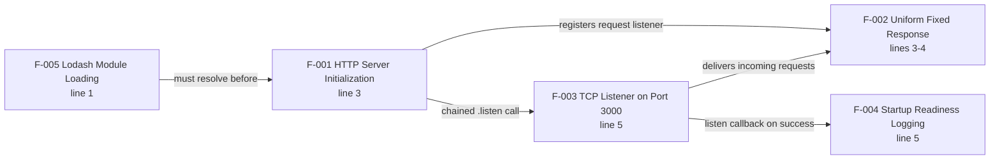
```mermaid
flowchart LR
    F005[F-005 Lodash Module Loading<br/>line 1] -->|must resolve before| F001[F-001 HTTP Server Initialization<br/>line 3]
    F001 -->|registers request listener| F002[F-002 Uniform Fixed Response<br/>lines 3-4]
    F001 -->|chained .listen call| F003[F-003 TCP Listener on Port 3000<br/>line 5]
    F003 -->|listen callback on success| F004[F-004 Startup Readiness Logging<br/>line 5]
    F003 -->|delivers incoming requests| F002
```

The runtime interaction across features, from launch to a served request:

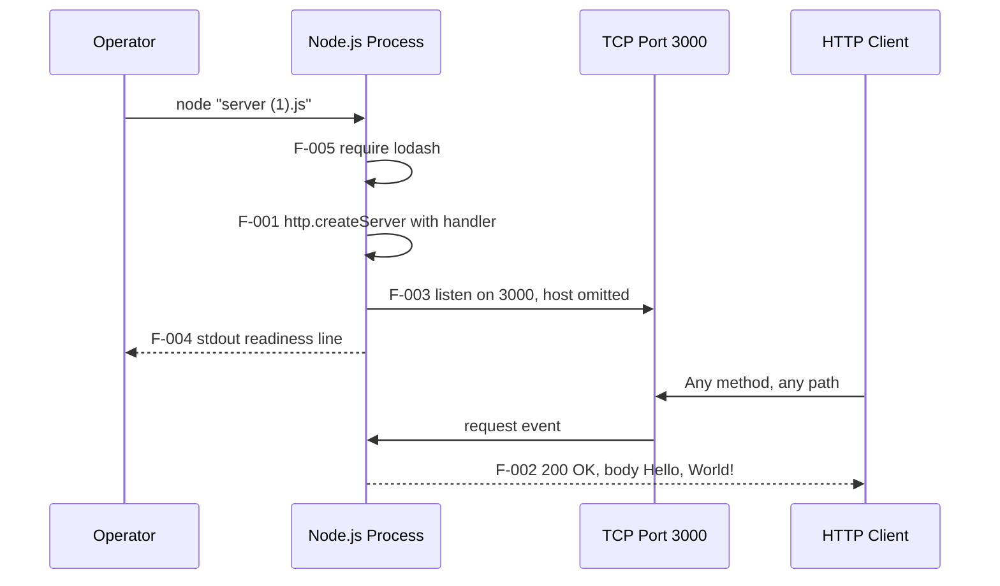
```mermaid
sequenceDiagram
    participant Op as Operator
    participant Proc as Node.js Process
    participant Sock as TCP Port 3000
    participant Client as HTTP Client
    Op->>Proc: node "server (1).js"
    Proc->>Proc: F-005 require lodash
    Proc->>Proc: F-001 http.createServer with handler
    Proc->>Sock: F-003 listen on 3000, host omitted
    Proc-->>Op: F-004 stdout readiness line
    Client->>Sock: Any method, any path
    Sock->>Proc: request event
    Proc-->>Client: F-002 200 OK, body Hello, World!
```

Related process flowcharts in this specification:

- **Section 1.2.2, Core Technical Approach:** a startup and request flowchart that includes the lodash (`MODULE_NOT_FOUND`) and port-conflict (`EADDRINUSE`) failure paths behind F-005-RQ-002 and F-003-RQ-003.
- **Section 1.3.1.2, System Boundaries:** a boundary diagram placing the script, the `http` module, lodash, stdout and port 3000 within the host.

### 2.3.2 Integration Points

| Integration Point | Type | Features | Evidence |
|---|---|---|---|
| Node.js CommonJS module loader | Runtime service | F-005 (`lodash`), F-001 (`http`) | Lines 1, 3 |
| Node.js `http` module | Built-in library | F-001, F-002, F-003 | Lines 3–5 |
| TCP socket `::`, port 3000 | Network interface to HTTP clients | F-003, F-002 | Line 5; runtime check |
| Process standard output | Output stream | F-004 | Line 5 |

The system makes no outbound connections and uses no databases, caches, queues, identity providers or external APIs (Section 1.2.1).

### 2.3.3 Shared Components

| Shared Component | Shared By | Nature of Sharing |
|---|---|---|
| The anonymous `http.Server` instance | F-001, F-002, F-003, F-004 | Created by F-001; holds F-002's listener; bound by F-003, which then fires F-004's callback. Nothing keeps a reference to it |
| Line 5 of `server (1).js` | F-003, F-004 | Port `3000` appears twice, once in the `listen` call and once in the log string. The two values are independent literals |
| `server (1).js` | All features | The only source file; there is no modular separation |

### 2.3.4 Common Services

All common services are supplied by the Node.js runtime. The repository implements none of its own.

| Runtime Service | Used By | Role |
|---|---|---|
| Event loop | F-002, F-003, F-004 | Dispatches the `listening` event and every request event on one thread |
| HTTP parser and response defaults | F-001, F-002 | Parses requests, enforces the 16 KB header limit, sets the status code and response headers |
| `console` | F-004 | Writes the readiness line to stdout |
| Uncaught-error handling | F-003, F-005 | Ends the process on `EADDRINUSE` or `MODULE_NOT_FOUND` |

## 2.4 Implementation Considerations

The considerations below come from the code as written in `server (1).js` and from runtime checks on Node.js v22.23.3. The repository defines no performance, scalability or security targets. Where performance is described, the values are observed behavior, not commitments.

### 2.4.1 F-001: HTTP Server Initialization

| Consideration | Detail | Evidence |
|---|---|---|
| Technical Constraints | No reference to the server is kept, so it cannot be closed, given handlers or reconfigured. The Node.js version is not pinned | Line 3; no manifest |
| Performance Requirements | Construction is one synchronous call at startup. No tuning options are passed, so Node.js defaults apply | Line 3 |
| Scalability Considerations | One process on one event-loop thread. No cluster or worker threads, so the server runs on a single CPU core | Line 3 |
| Security Implications | Plain HTTP with no TLS, authentication or rate limiting. The only protections are Node.js defaults: a 16 KB header limit, a 60 s header timeout and a 300 s request timeout | Line 3; runtime check |
| Maintenance Requirements | No tests, linting or manifest. The file name contains a space and parentheses, so it must be quoted in every invocation | Repository root |

### 2.4.2 F-002: Uniform Fixed-Response Handling

| Consideration | Detail | Evidence |
|---|---|---|
| Technical Constraints | The handler is an inline anonymous function with no routing structure. The status code and headers are implicit Node.js defaults | Lines 3–4 |
| Performance Requirements | Each request does one `res.end` with a constant string, with no I/O or parsing in application code. 200 concurrent requests all returned `200` | Line 4; runtime check |
| Scalability Considerations | The handler is stateless, so every instance returns the same response. One event loop bounds throughput | Line 4 |
| Security Implications | Request input is never read, so application code has no input-handling surface. No `Content-Type` or security headers are sent | Line 4; runtime headers |
| Maintenance Requirements | The body is a hard-coded literal. Changing it means editing line 4, and no test guards the exact output | Line 4 |

### 2.4.3 F-003: TCP Listener on Port 3000

| Consideration | Detail | Evidence |
|---|---|---|
| Technical Constraints | The port is the literal `3000`, with no host argument and no environment variable or CLI configuration | Line 5 |
| Performance Requirements | Node.js keep-alive (`Keep-Alive: timeout=5`) lets clients reuse a connection for repeated requests | Runtime headers |
| Scalability Considerations | One instance per host. A second instance crashes with `EADDRINUSE :::3000` | Runtime check |
| Security Implications | The bind to `::` exposes the service on all interfaces. The host's firewall and network alone decide who can reach it | Runtime `server.address()` check |
| Maintenance Requirements | No `'error'` handler and no graceful shutdown. Stopping the server means terminating the process, and no signal handlers exist | Line 5 |

### 2.4.4 F-004: Startup Readiness Logging

| Consideration | Detail | Evidence |
|---|---|---|
| Technical Constraints | The message is a literal, so it cannot report the real bind address or port | Line 5 |
| Performance Requirements | One synchronous stdout write at startup | Line 5 |
| Scalability Considerations | No structured, per-request or per-instance logging, so multiple instances cannot be told apart from their output | Line 5 |
| Security Implications | The loopback URL `127.0.0.1` understates the real `::` exposure. There is no access log for auditing | Line 5; runtime check |
| Maintenance Requirements | The port in the message must be kept in step with the `listen` argument by hand | Line 5 |

### 2.4.5 F-005: Lodash Module Loading

| Consideration | Detail | Evidence |
|---|---|---|
| Technical Constraints | No `package.json` exists. lodash must be installed separately, somewhere Node.js module resolution can find it from the file's directory | Line 1; repository root |
| Performance Requirements | The whole module is loaded synchronously at startup, which costs load time and memory for no functional use | Lines 1–5 |
| Scalability Considerations | Every deployment target must provide lodash by hand. Clean or automated environments fail at startup with exit code 1 | Runtime check |
| Security Implications | Unpinned third-party code runs in the process for no benefit. The unknown version means vulnerabilities cannot be tracked | Line 1; repository root |
| Maintenance Requirements | `_` is unreferenced, so removing line 1 would not change request handling. It would only remove the startup dependency | Lines 1–5 |

## 2.5 Traceability Matrix

### 2.5.1 Requirement-to-Implementation Traceability

Every requirement traces to a line of `server (1).js`. No automated test exists for any of them, so each one was verified by running the file on Node.js v22.23.3. F-001 to F-004 were checked with lodash made resolvable; F-005-RQ-002 was checked in a clean checkout.

| Requirement ID | Source Location | Verification and Result | Related Specification |
|---|---|---|---|
| F-001-RQ-001 | Line 3 `createServer` | Runtime: server answers HTTP/1.1. Passes only when lodash is resolvable | 1.3.1.1 HTTP server creation |
| F-001-RQ-002 | Lines 3–4 handler | Runtime: GET, POST and PUT on different paths give identical responses. Passed | 1.2.2 Major System Components |
| F-001-RQ-003 | Lines 1–5 (`require`, no workers) | Code inspection plus runtime start. Passed | 1.2.2 Core Technical Approach |
| F-001-RQ-004 | Line 3 (no options) | Runtime: 20 KB header returns `431`; timeout properties read. Passed | 1.2.1 Current System Limitations |
| F-002-RQ-001 | Line 4 `res.end` | Runtime: body `Hello, World!\n` for every method and path. Passed | 1.3.1.1 Fixed-response handling |
| F-002-RQ-002 | Line 4 (no `statusCode`) | Runtime: `HTTP/1.1 200 OK`. Passed | 1.2.3 Measurable Objectives |
| F-002-RQ-003 | Line 4 (no `setHeader`) | Runtime: four default headers, no `Content-Type`. Passed | 1.2.1 Current System Limitations |
| F-002-RQ-004 | Line 4 | Runtime: `HEAD /` returns `200` with no body. Passed | 1.2.2 Primary System Capabilities |
| F-002-RQ-005 | Line 4 | Runtime: 200 concurrent requests all returned `200`. Passed | 1.3.1.2 System Boundaries |
| F-003-RQ-001 | Line 5 `listen(3000, …)` | Runtime: request to `127.0.0.1:3000` returns `200`. Passed | 1.3.1.1 Port binding |
| F-003-RQ-002 | Line 5 (no host) | Runtime: `server.address()` reports `::`. Passed | 1.2.1 Current System Limitations |
| F-003-RQ-003 | Line 5 (no `'error'` listener) | Runtime: second instance crashes with `EADDRINUSE :::3000`. Passed | 1.3.2 Unsupported Use Cases |
| F-004-RQ-001 | Line 5 callback | Runtime: one readiness line on stdout. Passed | 1.3.1.1 Startup logging |
| F-004-RQ-002 | Line 5 callback | Runtime: no line on a lodash or port failure. Passed | 1.2.2 Core Technical Approach (flowchart) |
| F-004-RQ-003 | Lines 3–5 | Runtime: requests produce no output. Passed | 1.2.3 Key Performance Indicators |
| F-005-RQ-001 | Line 1 `require('lodash')` | Runtime: startup proceeds when lodash is resolvable. Passed | 1.3.1.1 Essential Integrations |
| F-005-RQ-002 | Line 1 | Runtime in a clean checkout: `MODULE_NOT_FOUND`, exit code 1. Passed | 1.2.1 Current System Limitations |
| F-005-RQ-003 | Lines 2–5 | Code inspection: `_` is unreferenced. Passed | 1.1.4 Value Proposition |

### 2.5.2 Feature-to-Scope Traceability

| Feature | Scope Capability (Section 1.3.1.1) | Success Objective (Section 1.2.3) | Related Limitation (Section 1.2.1) |
|---|---|---|---|
| F-001 | HTTP server creation | Process starts | No reference kept; Node.js defaults only |
| F-002 | Fixed-response handling | Correct status; correct payload | No `Content-Type` or explicit status code |
| F-003 | Port binding | Listener available | Hard-coded port; no `'error'` listener |
| F-004 | Startup logging | Process starts (log line present) | Log advertises `127.0.0.1`, not the real bind address |
| F-005 | Essential Integrations: `lodash` | Process starts (currently fails) | lodash required but undeclared and unused |

## 2.6 Assumptions, Constraints and Requirement Versioning

### 2.6.1 Assumptions

| ID | Assumption | Impact if Invalid |
|---|---|---|
| A-001 | The requirements describe the system as built. The repository records no stated intent: no README, requirements, issues or code comments | Intended behavior may differ from F-001 to F-005 |
| A-002 | Node.js default behaviors (status `200`, keep-alive headers, timeouts, 16 KB header limit) are as observed on v22.23.3. Other versions were not checked | F-001-RQ-004, F-002-RQ-003 and F-002-RQ-004 may not hold on other runtimes |
| A-003 | lodash is installed separately whenever F-001 to F-004 are run or tested | Without it, only F-005-RQ-002 can be observed |
| A-004 | The real bind address (`::`) is the requirement; the `127.0.0.1` in the log is display text | If loopback-only binding was intended, F-003-RQ-002 records a defect, not a requirement |
| A-005 | Feature priorities were assigned from each feature's role in serving the response. The repository defines none | Priorities may need revision once stakeholders state intent |

### 2.6.2 Constraints

| ID | Constraint | Affected Requirements | Source |
|---|---|---|---|
| C-001 | The port is hard-coded to `3000`; there is no environment, flag or file configuration | F-003-RQ-001, F-004-RQ-001 | Line 5 |
| C-002 | No dependency manifest or lockfile, so the lodash version is unpinned and unverified | F-005-RQ-001, F-005-RQ-002 | Repository root |
| C-003 | The Node.js runtime version is not pinned | F-001-RQ-004, F-002-RQ-003 | Repository root |
| C-004 | Single process; no error handling or graceful shutdown | F-001-RQ-003, F-003-RQ-003 | Lines 3–5 |
| C-005 | The file name `server (1).js` must be quoted on the command line | F-001-RQ-003 | Repository root |
| C-006 | No automated tests or CI exist, so verification is manual | All requirements | Repository root |

### 2.6.3 Requirement Version Tracking

| Version | Date | Baseline | Change Summary |
|---|---|---|---|
| 1.0 | 2026-10-06 | Commit `f0ba73b` ("Add files via upload"), identical on `main` and `0610_02` | Initial baseline: 5 features (F-001 to F-005) and 18 requirements, documented from `server (1).js` |

All 18 requirements are at version 1.0. IDs follow `F-XXX` for features and `F-XXX-RQ-YYY` for requirements, numbered in sequence within each feature. A change to `server (1).js` that alters any behavior above should add a new row to this table and update the affected rows in Sections 2.2 and 2.5.

## 2.7 References

- `server (1).js` - The only source file and the basis for every feature and requirement: the unused, undeclared `require('lodash')` (line 1, F-005); `http.createServer` with an inline listener (line 3, F-001); the fixed `Hello, World!\n` response (line 4, F-002); `listen(3000, …)` with no host (line 5, F-003); and the readiness `console.log` (line 5, F-004).
- `/` (repository root) - Contains only `server (1).js`. The absence of a README, `package.json`, lockfile, configuration, license, tests, CI and deployment files establishes constraints C-001 to C-006 and the lack of documented intent (A-001).
- Git history (commit `f0ba73b`, branches `main` and `0610_02`) - The single commit "Add files via upload", used as the requirement baseline for version 1.0.
- Runtime verification on Node.js v22.23.3 - Confirmed `MODULE_NOT_FOUND` with exit code 1 in a clean checkout; with lodash resolvable: `200 OK` with `Content-Length: 14` and no `Content-Type` for GET, POST and PUT; a body-less `HEAD` response; `431` for a 20 KB header; default `headersTimeout` 60000, `requestTimeout` 300000 and `keepAliveTimeout` 5000 ms; bind to `::` port 3000; `EADDRINUSE` on a second instance; and 200 concurrent requests all returning `200`.
- Section 1.1 Executive Summary - Use-case framing (smoke-test and connectivity target) and the value proposition, cross-referenced by F-002 and F-005-RQ-003.
- Section 1.2 System Overview - The current limitations, components, the startup and request flowchart, and the success criteria, used in the traceability matrix and for related flowcharts.
- Section 1.3 Scope - In-scope capabilities, the system-boundary diagram, out-of-scope items and unsupported use cases, which map to features F-001 to F-005.

# 3. Technology Stack

## 3.1 Programming Languages

The repository contains one source file, `server (1).js`. It is the same on `main` and `0610_02` (commit `f0ba73b`), so the system uses exactly one programming language. The project-wide default stack names Python for the backend and TypeScript for frontends. The repository uses neither. This section documents the system as built.

### 3.1.1 Languages by Component

| Component | Language | Standard and Module System | Evidence |
|---|---|---|---|
| HTTP server (the whole system) | JavaScript | ECMAScript 2015+ syntax (`const`, arrow functions); CommonJS `require` | `server (1).js` lines 1–5 |
| Build, configuration, infrastructure, tests | None | No JSON manifests, YAML pipelines, shell scripts, HTML/CSS or TypeScript exist | Repository root (one file only) |

The language features in use are:

- `const` binding: line 1 (`const _ = require('lodash');`).
- Arrow functions: the request handler on lines 3–4 and the listen callback on line 5.
- CommonJS module loading: `require('lodash')` on line 1 and `require('http')` on line 3. The file has no `import`/`export` statements and no `module.exports`.

### 3.1.2 Selection Rationale

The repository records no rationale. It has no README, comments or design notes (Section 2.6.1, assumption A-001). The reasons below follow from what the code does, not from stated intent:

- **No compilation step.** Plain JavaScript runs directly on Node.js, so the source file is also the deployable artifact (Section 3.6).
- **Server in one statement.** The JavaScript-plus-Node.js pairing provides an HTTP server through the built-in `http` module. Lines 3–5 create, configure and start it as one chained expression.
- **Event-driven fit.** A fixed-response handler (Section 1.2.2) does no blocking work, which suits Node.js's single-threaded event loop.

### 3.1.3 Constraints and Dependencies

| Constraint | Detail | Impact |
|---|---|---|
| Module format is CommonJS | No `package.json` declares `"type": "module"`, and the file uses `require`, so Node.js loads it as CommonJS | Converting to ES modules would require a manifest or a `.mjs` rename and rewriting both `require` calls |
| Runtime is mandatory | JavaScript here runs only in the Node.js runtime. It uses Node-specific `require` and the `http` module, so it cannot run in a browser | Node.js version compatibility is covered in Section 3.2.3 |
| No static typing or linting | No TypeScript, JSDoc types, ESLint or formatter configuration exists | Defects such as the unused `_` binding (line 1) are not caught automatically |
| File name contains a space and parentheses | `server (1).js` must be quoted in every shell invocation | See Section 2.6.2, constraint C-005 |

The ES2015 syntax sets no practical minimum version, because every currently supported Node.js release line supports `const` and arrow functions. The binding constraints come from the runtime (Section 3.2) and from the undeclared `lodash` dependency (Section 3.3).

## 3.2 Frameworks & Libraries

The system uses no application framework. The project-wide default stack names Flask for the backend. Instead, `server (1).js` builds directly on the Node.js runtime and its built-in `http` module. Its one third-party library, `lodash`, is loaded but never used.

### 3.2.1 Core Runtime and Platform Modules

| Component | Version | Role | Evidence |
|---|---|---|---|
| Node.js runtime | v22.23.3 observed ("Jod" LTS line); **not pinned** by the repository | Runs the script, provides `require`, the event loop and `console` | Runtime check; no `package.json` `engines`, `.nvmrc` or `.node-version` |
| V8 (embedded in Node.js) | 12.4.254.21-node.57 | JavaScript engine that runs `server (1).js` | `process.versions` on v22.23.3 |
| llhttp (embedded in Node.js) | 9.4.3 | HTTP/1.1 request parser behind the `http` module | `process.versions` on v22.23.3 |
| libuv (embedded in Node.js) | 1.51.0 | Event loop and TCP socket I/O for the port 3000 listener | `process.versions` on v22.23.3 |
| `http` (Node.js built-in module) | Ships with the runtime | `createServer` builds the server; `listen(3000, …)` binds it | `server (1).js` lines 3 and 5 |

The script uses the `http` module's defaults, as observed on v22.23.3 (Sections 2.4.1 and 2.4.3):

| Default | Value | Effect on the System |
|---|---|---|
| Status code | `200` | Every response is `200 OK` with no explicit `statusCode` |
| Keep-alive | `Connection: keep-alive`, `Keep-Alive: timeout=5` | Clients can reuse connections for 5 seconds |
| Maximum header size | 16 KB | Larger request headers get `431` before the handler runs |
| `headersTimeout` / `requestTimeout` | 60 s / 300 s | The only protection against slow clients |
| Bind address | `::`, all interfaces | Applies because `listen` gets no host argument |

### 3.2.2 Supporting Libraries

| Library | Version | Usage in Code | Status |
|---|---|---|---|
| `lodash` | Undeclared; whatever copy the host can resolve. Latest on npm is 4.18.1 | `const _ = require('lodash');` (line 1). `_` is never referenced | Startup dependency with no function; see Section 3.3 |

The code uses no web framework (Express, Koa, Fastify), router, middleware, templating engine, logging library or test library. `console.log` (line 5) is the only output mechanism.

### 3.2.3 Compatibility Requirements

The only verified runtime is Node.js v22.23.3, the version every behavior in Sections 1.2 and 2.2 was observed on (Section 2.6.1, assumption A-002). The table maps the published Node.js release schedule onto this system:

| Release Line | Schedule Status (as of 2026-10-06) | Latest Release | Suitability |
|---|---|---|---|
| v20 "Iron" | End of life 2026-04-30 | v20.20.2 | Not recommended: receives no security fixes |
| v22 "Jod" | Maintenance LTS until 2027-04-30 | v22.23.3 | **Verified.** Use for reproducing documented behavior |
| v24 "Krypton" | Active LTS; maintenance from 2026-10-20; end of life 2028-04-30 | v24.21.0 | Should work, since only `http`/CommonJS basics are used; not verified |
| v26 | Current; LTS from 2026-10-28; end of life 2029-04-30 | v26.10.0 | Not verified |

Other compatibility requirements:

- **lodash ↔ Node.js:** lodash 4.18.1 loads on Node.js v22.23.3. With it installed in a local `node_modules`, the server started and answered `GET /` with `200 OK` and a 14-byte body.
- **Module resolution:** `lodash` must be resolvable through Node.js's lookup from the directory containing `server (1).js` (Section 3.3.3).
- **Protocol:** the `http` module serves plain HTTP/1.1 only. TLS would need the `https` module and certificates, and HTTP/2 would need `http2`. Neither is used.

### 3.2.4 Justification and Security Implications

| Choice | Justification (derived from code) | Security Implication |
|---|---|---|
| Built-in `http` instead of a framework | One fixed response needs no routing, middleware or parsing. No framework dependency has to be installed or patched | No security headers, rate limiting, request logging or authentication. The Node.js defaults in Section 3.2.1 are the only safeguards |
| Unpinned Node.js runtime | Any installed Node.js can run the file without setup | Hosts may run an end-of-life line (for example v20, which reached end of life on 2026-04-30) that receives no security fixes |
| Unused `lodash` import | No functional justification exists | Adds third-party code to the process with nothing gained (Section 3.3.4) |

### 3.2.5 Component Integration

The diagram shows how the components in this section depend on each other, from source lines down to the host socket.

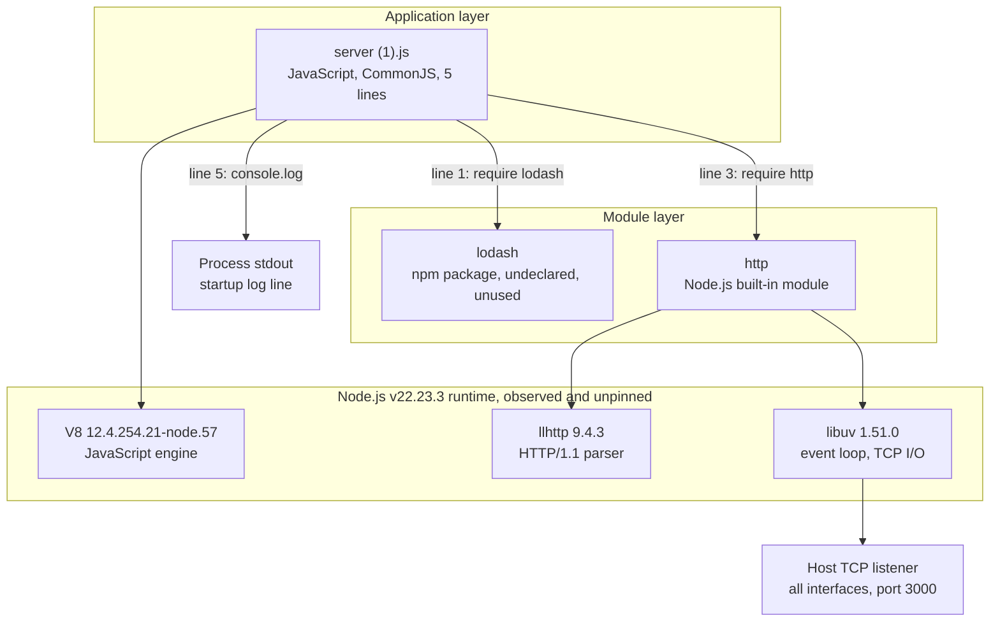
```mermaid
flowchart TB
    subgraph AppLayer["Application layer"]
        Script["server (1).js<br/>JavaScript, CommonJS, 5 lines"]
    end
    subgraph ModLayer["Module layer"]
        Lodash["lodash<br/>npm package, undeclared, unused"]
        HttpMod["http<br/>Node.js built-in module"]
    end
    subgraph RtLayer["Node.js v22.23.3 runtime, observed and unpinned"]
        V8["V8 12.4.254.21-node.57<br/>JavaScript engine"]
        Llhttp["llhttp 9.4.3<br/>HTTP/1.1 parser"]
        Libuv["libuv 1.51.0<br/>event loop, TCP I/O"]
    end
    Sock["Host TCP listener<br/>all interfaces, port 3000"]
    Out["Process stdout<br/>startup log line"]
    Script -->|"line 1: require lodash"| Lodash
    Script -->|"line 3: require http"| HttpMod
    Script -->|"line 5: console.log"| Out
    HttpMod --> Llhttp
    HttpMod --> Libuv
    Script --> V8
    Libuv --> Sock
```

## 3.3 Open Source Dependencies

### 3.3.1 Dependency Inventory

The repository has no `package.json`, lockfile or vendored `node_modules`. Its dependencies can only be read from the `require` calls in `server (1).js`:

| Dependency | Type | Declared Version | Source / Registry |
|---|---|---|---|
| `lodash` | Third-party open-source package (MIT licence) | None. Not declared anywhere | npm public registry (`registry.npmjs.org`); source `github.com/lodash/lodash` |
| `http` | Node.js built-in module | Bundled with the runtime (Section 3.2.1) | None; ships with Node.js |

`lodash` has no transitive dependencies: installing it adds exactly one package. The system's whole third-party footprint is therefore one package, required on line 1 and never used.

### 3.3.2 Version Landscape for lodash

Because no version is declared, a host can satisfy line 1 with any lodash copy it can resolve. The npm registry lists these recent releases:

| Version | Published | Notes |
|---|---|---|
| 4.17.21 | 2021-02-20 | Long-standing release; affected by the advisories in Section 3.3.4 |
| 4.17.23 | 2026-01-21 | Still within the affected range of two advisories |
| 4.18.0 | 2026-03-31 | First 4.18 release |
| 4.18.1 | 2026-04-01 | Current `latest` dist-tag. `npm audit` reports 0 vulnerabilities |

### 3.3.3 Integration Requirements

For line 1 to succeed, Node.js must find `lodash` in a `node_modules` folder in the script's directory or one of its parents. A clean checkout has none, so the process exits with code 1 and `MODULE_NOT_FOUND` (Section 2.6.1, assumption A-003).

A minimal manifest with this dependency was verified outside the repository:

```json
{ "private": true, "dependencies": { "lodash": "^4.18.1" } }
```

With it, `npm install` resolved `https://registry.npmjs.org/lodash/-/lodash-4.18.1.tgz` and recorded a SHA-512 integrity hash in the lockfile. `require('lodash').VERSION` returned `4.18.1`, and the server started and served `200 OK`. This manifest is not part of the repository. It shows the smallest change that would close constraint C-002 (Section 2.6.2).

### 3.3.4 Security Implications

`npm audit` against lodash 4.17.21 reports these advisories, all fixed in 4.18.1, a non-breaking upgrade:

| Advisory | Severity | Affected Range | Weakness |
|---|---|---|---|
| GHSA-r5fr-rjxr-66jc | High (CVSS 8.1) | `>=4.0.0 <=4.17.23` | Code injection via `_.template` imports key names (CWE-94) |
| GHSA-f23m-r3pf-42rh | Moderate (CVSS 6.5) | `<=4.17.23` | Prototype pollution via array-path bypass in `_.unset` and `_.omit` (CWE-1321) |
| GHSA-xxjr-mmjv-4gpg | Moderate | `>=4.0.0 <=4.17.22` | Prototype pollution in `_.unset` and `_.omit` |

What this means for the system:

- **No reachable call path today.** The code never calls `_.template`, `_.unset`, `_.omit` or any other lodash function, so request data cannot reach the vulnerable functions.
- **Unknown version, untracked risk.** With no manifest or lockfile, nothing records which lodash copy a host loads. Audit tools have nothing to scan, and a vulnerable copy in a parent `node_modules` would load silently.
- **No integrity verification.** Without a lockfile, the code loaded at startup is not checked against a known hash.
- **Remediation options.** Remove line 1, which changes no request behavior (Section 2.4.5). Or declare and lock `lodash` at `^4.18.1` as shown in Section 3.3.3.

## 3.4 Third-Party Services

The system uses no third-party services. `server (1).js` makes no outbound network calls, reads no environment variables or credentials, and loads no service SDK (Section 1.2.1). The table compares the default stack's service categories with the repository.

| Category | Default Stack Entry | Repository Status | Evidence |
|---|---|---|---|
| External APIs and integrations | Not specified | None. The process only accepts inbound HTTP on port 3000 | `server (1).js` lines 3–5 |
| Authentication services | Auth0 | Not used. Every request is answered anonymously with `200 OK` | Line 4; no auth code or configuration |
| Monitoring and observability | Not specified | None. The only signal is one startup line on stdout; there are no metrics, traces, health endpoint or request logs | Line 5 |
| Cloud services | AWS | Not used. No SDK, account configuration or infrastructure definitions exist | Repository root |

The only external system the stack touches is the npm public registry, and only when an operator installs `lodash` by hand (Section 3.3.3). The repository contains no install step that contacts it.

**Security implication:** with no identity provider or edge service, anyone who can reach port 3000 on any host interface gets access. Exposure is controlled entirely by the host's firewall and network placement (Section 2.4.3).

## 3.5 Databases & Storage

The system has no database, cache or storage layer. The default stack's MongoDB is not used.

| Concern | Status | Evidence |
|---|---|---|
| Primary and secondary databases | None. No database driver, connection string or query code | `server (1).js` lines 1–5 |
| Data persistence | None. The handler reads no request data and writes nothing. Every response is the literal `Hello, World!\n` | Line 4 |
| Caching | None at the application level. Because the response is constant, no cache is needed for correctness | Line 4 |
| File or object storage | None. No `fs` usage, uploads or object-store client | Lines 1–5 |
| Logs | The one startup line goes to stdout. Whether it is kept depends on the process supervisor; the application stores nothing | Line 5 |

Because the process is fully stateless, instances are interchangeable: restarting one loses no data, and any number of instances on separate hosts return the same output (Section 2.4.2).

## 3.6 Development & Deployment

The repository contains no development, build, packaging or delivery tooling. Every file on every branch is `server (1).js`. The default stack's Docker, Terraform and GitHub Actions are not used.

### 3.6.1 Development Tools

| Tool Category | In Repository | Observed in Verification Environment |
|---|---|---|
| Runtime | Not pinned (no `engines`, `.nvmrc`, `.node-version`) | Node.js v22.23.3 |
| Package manager | None (no `package.json` or lockfile) | npm 11.18.0, installed separately from the npm 10.9.9 that ships with Node.js v22.23.3 |
| Linting / formatting | None (no ESLint, Prettier or EditorConfig files) | — |
| Testing | None (no test files or test framework) | Behavior verified manually with `curl` (Section 2.6.2, constraint C-006) |
| Version control | Git: branches `main` and `0610_02`, both at single commit `f0ba73b` ("Add files via upload") | — |

The commit message and the ` (1)` suffix in the file name suggest the file was uploaded through a web interface rather than committed from a development workspace. This is an inference; the repository does not record it.

### 3.6.2 Build System

There is no build step. The script runs unchanged, with no transpilation, bundling, minification or asset pipeline. The source file is the deployable artifact.

```bash
node "server (1).js"
```

The quotes are required because the file name contains a space and parentheses (Section 2.6.2, constraint C-005).

### 3.6.3 Containerization and Infrastructure

| Concern | Status | Consequence |
|---|---|---|
| Container image | No `Dockerfile`, `.dockerignore` or Compose file | No reproducible runtime image. Node.js version and `lodash` presence vary by host |
| Infrastructure as Code | No Terraform or other IaC definitions | Host, network and firewall setup are outside the repository |
| Runtime configuration | Port `3000` is a literal; no environment variables | Each host or container can run only one instance on port 3000 (Section 2.4.3) |
| Process supervision | No service unit, process manager or signal handling | Restarts after a crash (for example `EADDRINUSE`) depend on external tooling |

Any container image would have to supply three things the repository does not: a pinned Node.js base image, an installed `lodash` (or line 1 removed), and a published port 3000. The server binds to `::`, so a containerised instance is reachable through the published port without code changes.

### 3.6.4 CI/CD

No pipeline exists: there is no `.github/workflows/` or other CI configuration. No checks run on commit, so a clean checkout reaches its first failure (`MODULE_NOT_FOUND`) only when someone runs it. No automated tests, dependency audit or deployment exist.

### 3.6.5 Deployment Flow (As Built)

The diagram traces the manual path from checkout to a serving process, including the two failure points the stack itself creates.

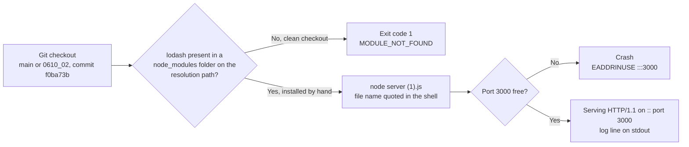
```mermaid
flowchart LR
    Clone["Git checkout<br/>main or 0610_02, commit f0ba73b"] --> Provide{"lodash present in a<br/>node_modules folder on the<br/>resolution path?"}
    Provide -- "No, clean checkout" --> FailMod["Exit code 1<br/>MODULE_NOT_FOUND"]
    Provide -- "Yes, installed by hand" --> Launch["node server (1).js<br/>file name quoted in the shell"]
    Launch --> PortFree{"Port 3000 free?"}
    PortFree -- "No" --> FailPort["Crash<br/>EADDRINUSE :::3000"]
    PortFree -- "Yes" --> Serving["Serving HTTP/1.1 on :: port 3000<br/>log line on stdout"]
```

### 3.6.6 Tooling Gaps and Security Implications

| Missing Artifact | Risk | Related Constraint |
|---|---|---|
| `package.json` with `engines` and dependencies | Startup fails on clean hosts; runtime and `lodash` versions drift between hosts | C-002, C-003 |
| Lockfile | No integrity hashes; no basis for `npm audit` or automated dependency updates | C-002 |
| CI pipeline | Regressions and vulnerable dependencies go undetected | C-006 |
| Container image or IaC | Deployments cannot be reproduced; network exposure on `::` is not controlled by code | C-001 |

## 3.7 References

#### Repository Files and Folders

- `server (1).js` - Sole source file: JavaScript in CommonJS format; `require('lodash')` (line 1, unused); built-in `http` server (lines 3–4); `listen(3000)` and startup log (line 5)
- `` (repository root) - Only `server (1).js` plus `.git`. No `package.json`, lockfile, `node_modules`, `.nvmrc`, Dockerfile, IaC, CI workflows, linters or tests; every branch (`main`, `0610_02`) at single commit `f0ba73b`

#### Technical Specification Cross-References

- Section 1.2 System Overview - Limitations, core technical approach, startup flow, Node.js v22.23.3 as the observed runtime
- Section 2.4 Implementation Considerations - Node.js `http` defaults, bind to `::`, security and maintenance considerations per feature
- Section 2.6 Assumptions, Constraints and Requirement Versioning - Assumptions A-001 to A-003; constraints C-001 to C-003, C-005, C-006; baseline `f0ba73b`

#### External Sources

- [web] npm public registry (`registry.npmjs.org`, lodash package metadata) - lodash `latest` 4.18.1; release dates for 4.17.21, 4.17.23, 4.18.0 and 4.18.1; MIT licence; source repository
- [web] GitHub Advisory Database via `npm audit` (GHSA-r5fr-rjxr-66jc, GHSA-f23m-r3pf-42rh, GHSA-xxjr-mmjv-4gpg) - lodash advisories, severities and affected ranges, fixed in 4.18.1
- [web] https://nodejs.org/dist/index.json - Latest release per Node.js line (v20.20.2, v22.23.3, v24.21.0, v26.10.0) and bundled npm version (10.9.9 for v22.23.3)
- [web] https://raw.githubusercontent.com/nodejs/Release/main/schedule.json - Node.js LTS, maintenance and end-of-life dates for v20, v22, v24 and v26

# 4. Process Flowchart

## 4.1 System Workflows

The system is one five-statement CommonJS script, `server (1).js`, at commit `f0ba73b`. It defines no routes, jobs, queues or integrations, so its workflows are short and fully deterministic. The application code has **no conditional statements**. Every decision point below is made either implicitly, when a statement throws, or by the Node.js runtime's HTTP layer acting on its defaults. All behaviour was confirmed by running the file on Node.js v22.23.3 (assumption A-002, Section 2.6.1).

| ID | Workflow | Trigger | Source (features) |
|---|---|---|---|
| WF-01 | Process Startup | Operator runs `node "server (1).js"` | Lines 1, 3, 5 (F-005, F-001, F-003, F-004) |
| WF-02 | Request–Response | An HTTP request arrives on port 3000 | Lines 3–4 plus Node.js defaults (F-002) |
| WF-03 | Connection Lifecycle | The server accepts a TCP connection | Node.js defaults only: parser limits, timeouts, keep-alive |
| WF-04 | Process Termination | A signal or an uncaught error | No handlers in code; Node.js default behaviour (constraint C-004) |

### 4.1.1 Core Business Processes

#### End-to-End User Journeys

The system has two actors. The **operator** starts and stops the process and reads its console output. The **HTTP client** is any tool or program that sends requests. Neither actor authenticates, and nothing is configured.

| Step | Operator Journey (WF-01, WF-04) | HTTP Client Journey (WF-02, WF-03) |
|---|---|---|
| 1 | Check out `main` or `0610_02` (both at `f0ba73b`) | Open a TCP connection to any host interface on port 3000 |
| 2 | Make `lodash` resolvable from the file's directory. The repository does not document this step (A-003) | Send a request with any method, path, query, headers or body |
| 3 | Run `node "server (1).js"`. The quotes are required (C-005) | Receive `200 OK` and the 14-byte body `Hello, World!\n` |
| 4 | Wait for `Server running at http://127.0.0.1:3000/` on stdout | Optionally reuse the connection (`Connection: keep-alive`) |
| 5 | Stop with Ctrl+C (SIGINT, exit 130) or SIGTERM (exit 143) | The server closes the idle connection about 6 s after the last response |

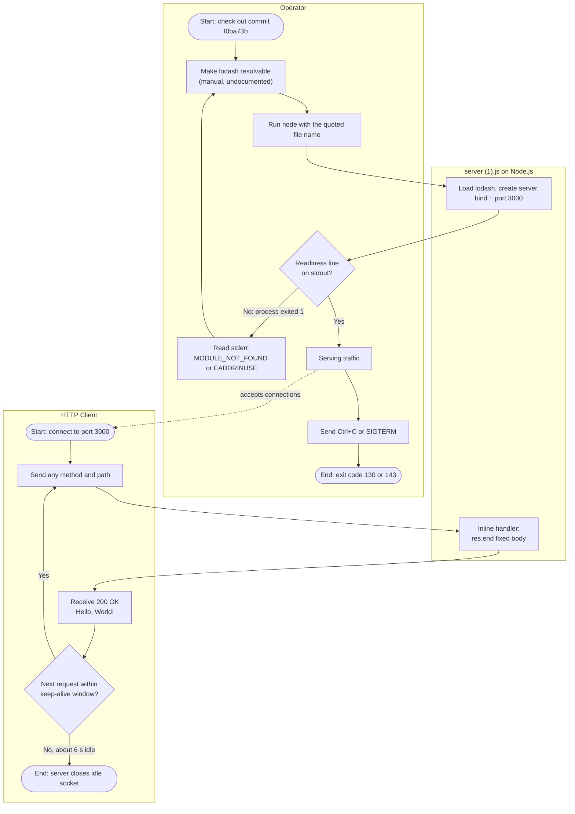
```mermaid
flowchart TB
    subgraph OperatorLane["Operator"]
        O1(["Start: check out commit f0ba73b"])
        O2["Make lodash resolvable<br/>(manual, undocumented)"]
        O3["Run node with the quoted file name"]
        O4{"Readiness line<br/>on stdout?"}
        O5["Read stderr:<br/>MODULE_NOT_FOUND or EADDRINUSE"]
        O6["Serving traffic"]
        O7["Send Ctrl+C or SIGTERM"]
        O8(["End: exit code 130 or 143"])
    end
    subgraph ServerLane["server (1).js on Node.js"]
        S1["Load lodash, create server,<br/>bind :: port 3000"]
        S2["Inline handler:<br/>res.end fixed body"]
    end
    subgraph ClientLane["HTTP Client"]
        C1(["Start: connect to port 3000"])
        C2["Send any method and path"]
        C3["Receive 200 OK<br/>Hello, World!"]
        C4{"Next request within<br/>keep-alive window?"}
        C5(["End: server closes idle socket"])
    end
    O1 --> O2 --> O3 --> S1 --> O4
    O4 -- "No: process exited 1" --> O5 --> O2
    O4 -- Yes --> O6
    O6 --> O7 --> O8
    O6 -.->|"accepts connections"| C1
    C1 --> C2 --> S2 --> C3 --> C4
    C4 -- Yes --> C2
    C4 -- "No, about 6 s idle" --> C5
```

#### System Interactions

| Interaction | Parties | Mechanism | Evidence |
|---|---|---|---|
| Dependency resolution | Script, CommonJS loader, file system | Synchronous `require('lodash')` walks `node_modules` folders upward from the file's directory | Line 1 |
| Server construction | Script, Node.js `http` built-in | `require('http').createServer(handler)` with no options object | Line 3 |
| Socket bind | `http.Server`, host TCP stack | `.listen(3000, cb)` with no host argument binds `::` (all interfaces) | Line 5; Section 2.2.3 |
| Readiness output | Listen callback, stdout | One `console.log` of a string literal | Line 5 |
| Request parsing | Client, Node.js HTTP parser | Node.js parses and limits the request before the handler runs | Runtime checks (400, 431, 408) |
| Response | Handler, client socket | `res.end('Hello, World!\n')` with Node.js default status and headers | Line 4 |

#### Decision Points

| ID | Decision | Made By | Yes Path | No Path |
|---|---|---|---|---|
| D1 | Is `lodash` resolvable? | CommonJS loader (implicit throw at line 1) | Continue to line 3 | `MODULE_NOT_FOUND`, exit 1, no listener (F-005-RQ-002) |
| D2 | Is port 3000 free? | Node.js `net` layer (implicit `'error'` at line 5) | `listening` event, readiness line | Unhandled `EADDRINUSE :::3000`, exit 1 (F-003-RQ-003) |
| D3 | Is the request syntactically valid HTTP? | Node.js HTTP parser | Continue | `400 Bad Request`, `Connection: close` |
| D4 | Are request headers at most 16,384 bytes? | Node.js HTTP parser | Continue | `431 Request Header Fields Too Large` (F-001-RQ-004) |
| D5 | Are headers complete before `headersTimeout`? | Node.js connection checker | Dispatch to handler | `408 Request Timeout`, socket closed |
| D6 | Is the method `HEAD`? | Node.js response writer | Status line and headers only | Headers plus 14-byte body (F-002-RQ-004) |
| D7 | Does the next request arrive within the keep-alive window? | Node.js keep-alive timer | Reuse the socket | Server closes the socket |

The handler itself never branches. Every request that passes D3–D5 gets the same `200 OK` response (F-002-RQ-001, F-002-RQ-002).

#### Error Handling Paths

| Error Path | Workflow | Who Observes It | Outcome |
|---|---|---|---|
| `lodash` missing | WF-01 | Operator (stack trace on stderr) | Process exits with code 1 before any socket opens |
| Port 3000 in use | WF-01 | Operator (stack trace on stderr) | New process exits with code 1. The process already holding the port is unaffected |
| Malformed request, oversized headers, header timeout | WF-02, WF-03 | Client only (400 / 431 / 408) | That socket is closed. The server keeps serving and logs nothing |
| Client aborts mid-request | WF-03 | Nobody | The socket is discarded and the next request succeeds |
| Server not running | All | Client (connection refused) | No response. Recovery is a manual restart |
| SIGINT / SIGTERM | WF-04 | Operator (exit code) | Immediate termination with no drain of in-flight connections |

Detection, retry, fallback and recovery for each path are specified in Section 4.3.2.

### 4.1.2 Integration Workflows

#### Data Flow Between Systems

The process exchanges data with four external parties: the file system, through module loading; stdout and stderr; network clients; and its parent process, through the exit code. It reads no environment variables, configuration files or command-line arguments (Section 1.2.1).

| Flow | Source → Destination | Data | Frequency |
|---|---|---|---|
| Module load | `node_modules/lodash` → process memory | The lodash module object, bound to `_` and never used | Once, synchronously, at startup |
| Readiness signal | Process → stdout | `Server running at http://127.0.0.1:3000/` | Once, after a successful bind |
| Fatal diagnostics | Process → stderr | Node.js stack trace (`MODULE_NOT_FOUND`, `EADDRINUSE`) | Only on startup failure |
| Request | Client → server socket | HTTP/1.1 request bytes. The application never reads them | Per request |
| Response | Server socket → client | `200 OK`, default headers, `Hello, World!\n` | Per request |
| Exit status | Process → parent shell or supervisor | `1` (startup failure), `130` (SIGINT), `143` (SIGTERM) | Once, at termination |

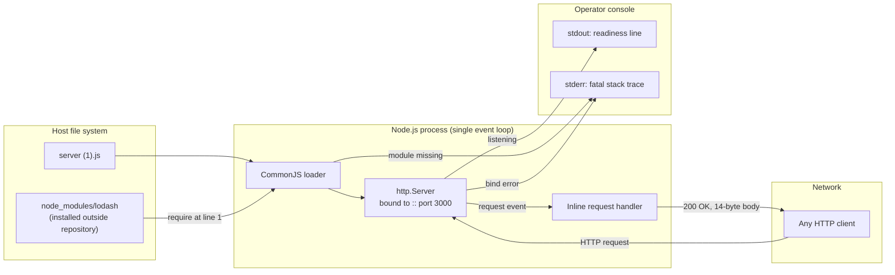
```mermaid
flowchart LR
    subgraph HostFS["Host file system"]
        Lodash["node_modules/lodash<br/>(installed outside repository)"]
        Script["server (1).js"]
    end
    subgraph NodeProc["Node.js process (single event loop)"]
        Loader["CommonJS loader"]
        HttpSrv["http.Server<br/>bound to :: port 3000"]
        Handler["Inline request handler"]
    end
    subgraph Console["Operator console"]
        StdOut["stdout: readiness line"]
        StdErr["stderr: fatal stack trace"]
    end
    subgraph Net["Network"]
        Client["Any HTTP client"]
    end
    Script --> Loader
    Lodash -->|"require at line 1"| Loader
    Loader -->|"module missing"| StdErr
    Loader --> HttpSrv
    HttpSrv -->|"listening"| StdOut
    HttpSrv -->|"bind error"| StdErr
    Client -->|"HTTP request"| HttpSrv
    HttpSrv -->|"request event"| Handler
    Handler -->|"200 OK, 14-byte body"| Client
```

#### API Interactions

The system exposes one implicit endpoint. Its contract is fixed by line 4 and by Node.js defaults.

| Attribute | Contract |
|---|---|
| Protocol / transport | HTTP/1.1 over plaintext TCP; no TLS |
| Address | All interfaces (`::`), port `3000` (hard-coded, constraint C-001) |
| Methods / paths / query | Any; all ignored |
| Request headers / body | Ignored by the application. Node.js limits headers to 16,384 bytes |
| Authentication / versioning | None |
| Response status | `200 OK` (Node.js default) |
| Response headers | `Date`, `Connection: keep-alive`, `Keep-Alive: timeout=5`, `Content-Length: 14` (no `Content-Length` for `HEAD`); no `Content-Type` |
| Response body | `Hello, World!\n` (14 bytes; none for `HEAD`) |

```bash
curl -i -X POST http://127.0.0.1:3000/any/path   # HTTP/1.1 200 OK ... Hello, World!
```

#### Event Processing Flows

All runtime behaviour is driven by Node.js event-loop events. The script registers listeners for two of them. The rest fall back to Node.js defaults.

| Event | Listener Registered in Code | Resulting Behaviour |
|---|---|---|
| `http.Server` `'request'` | Inline arrow function passed to `createServer` (line 3) | Ends the response with the fixed body |
| `http.Server` `'listening'` | Callback passed to `listen` (line 5) | Writes the readiness line once |
| `http.Server` `'error'` | None | The error is thrown as uncaught and the process exits with code 1 (observed for `EADDRINUSE`) |
| `http.Server` `'clientError'` | None | Node.js replies `400`, `431` or `408` as appropriate and closes the socket |
| Process `SIGINT` / `SIGTERM` | None | Default termination (exit 130 / 143) |

#### Batch Processing Sequences

None exist. The code schedules no jobs, timers, queues, workers or background tasks. The only periodic activity belongs to Node.js internals: the connection checker that enforces `headersTimeout` and `requestTimeout` every 30,000 ms, and per-socket keep-alive timers (Section 4.2.1).

## 4.2 Flowchart Requirements

This section gives the flowchart elements for each workflow in Section 4.1 and the validation rules that apply along each path. The diagrams themselves are in Section 4.4.

### 4.2.1 Workflow Flowchart Specifications

#### WF-01 Process Startup (F-005 → F-001 → F-003 → F-004)

| Element | Specification |
|---|---|
| Start point | Operator runs `node "server (1).js"` |
| Process steps | 1. `require('lodash')` (line 1). 2. `require('http').createServer(handler)` (line 3). 3. `.listen(3000, cb)` (line 5). 4. `cb` logs the readiness line |
| Decision diamonds | D1 lodash resolvable? D2 port 3000 free? |
| End points | Success: process idles on the event loop, listening on `::` port 3000. Failure: exit code 1 |
| System boundaries | Shell, Node.js process, file system (`node_modules`), host TCP stack, stdout/stderr |
| User touchpoints | The operator's launch command; the stdout readiness line; the stderr stack trace on failure |
| Error states / recovery | `MODULE_NOT_FOUND` → install lodash or delete line 1, then relaunch. `EADDRINUSE` → free port 3000 or edit line 5, then relaunch. Both are manual |
| Timing | Synchronous. Startup to first successful response took about 39 ms in the verification sandbox (observed, not a target) |

#### WF-02 Request–Response (F-002)

| Element | Specification |
|---|---|
| Start point | Request bytes arrive on an accepted connection |
| Process steps | 1. Node.js parses the request line and headers. 2. Node.js emits `'request'`. 3. The handler calls `res.end('Hello, World!\n')`. 4. Node.js writes the status, default headers and body (no body for `HEAD`) |
| Decision diamonds | D3 valid syntax? D4 headers ≤ 16,384 bytes? D5 headers complete in time? D6 method `HEAD`? |
| End points | `200 OK` sent; or `400` / `431` / `408` sent and the socket closed |
| System boundaries | Client ↔ host network ↔ Node.js HTTP parser ↔ application handler |
| User touchpoints | The client's request and the response it receives. Nothing is shown to the operator |
| Error states / recovery | Parser rejections go to the client only. The server stays up and needs no recovery |
| Timing | About 0.40 ms total on loopback, 0.06 ms of it connect time (observed). 200 concurrent requests all returned `200` (Section 2.2.2) |

#### WF-03 Connection Lifecycle

| Element | Specification |
|---|---|
| Start point | TCP connection accepted on `::` port 3000 |
| Process steps | Accept → parse → respond → idle keep-alive → reuse or close |
| Decision diamonds | D5 headers complete before the deadline? D7 next request inside the keep-alive window? |
| End points | Server-initiated close (idle timeout, `408`, `400`, `431`) or client-initiated close or abort |
| System boundaries | Node.js `http` / `net` internals only; no application code runs |
| User touchpoints | The client sees a reused connection or a closed socket |
| Error states / recovery | A client abort discards the socket. Other connections are unaffected and the next request succeeds (verified) |
| Timing | See the timing table below |

#### WF-04 Process Termination

| Element | Specification |
|---|---|
| Start point | SIGINT, SIGTERM, or an uncaught exception |
| Process steps | Node.js default handling ends the process at once. There is no `server.close()`, drain or cleanup |
| Decision diamonds | None in code |
| End points | Exit code 130 (SIGINT), 143 (SIGTERM) or 1 (uncaught error) |
| System boundaries | Operating system signal delivery; parent shell or supervisor |
| User touchpoints | The operator's signal; the exit code; for clients, connection refused afterwards |
| Error states / recovery | In-flight and idle keep-alive sockets are dropped. A restart must be done by hand or by an external supervisor; the repository has none (Section 3.6.3) |
| Timing | Immediate |

#### Timing and SLA Considerations

The repository defines no SLA, latency target or availability objective (Section 1.2.3). The only timing constraints in force are Node.js defaults, because `createServer` gets no options object. Values below were read from a server instance on v22.23.3 and, where marked, confirmed by measurement.

| Timer / Limit | Default Value | Effect When Exceeded | Verification |
|---|---|---|---|
| `headersTimeout` | 60,000 ms | `408 Request Timeout`, socket closed | Measured: `408` after about 89.5 s for incomplete headers |
| `connectionsCheckingInterval` | 30,000 ms | How often the header and request deadlines are checked, so a `408` arrives 60–90 s after the connection starts | Reported; consistent with the measurement above |
| `requestTimeout` | 300,000 ms | `408` if the whole request is not received in time | Reported; not exercised |
| `keepAliveTimeout` (+ `keepAliveTimeoutBuffer`) | 5,000 ms (+ 1,000 ms) | Idle keep-alive socket closed by the server | Measured: closed about 6,011 ms after the response |
| `server.timeout` | 0 | No socket inactivity timeout | Reported |
| `maxRequestsPerSocket` | 0 | No limit on requests per connection | Reported |
| `maxHeaderSize` | 16,384 bytes | `431 Request Header Fields Too Large` | Measured with a 20 KB header |

Because the Node.js version is not pinned (constraint C-003), these values can change with the runtime.

### 4.2.2 Validation Rules

#### Business Rules at Each Step

| Workflow Step | Rule | Enforced By | Evidence |
|---|---|---|---|
| WF-01 module load | lodash must load before the server is created | Statement order | Lines 1, 3 (F-005-RQ-001) |
| WF-01 bind | One listener on port 3000 per host; no fallback port | Host TCP stack | Line 5 (F-003-RQ-001, F-003-RQ-003) |
| WF-01 readiness | The readiness line is printed only after a successful bind, and its text is a literal (`127.0.0.1`), not the real bind address (`::`) | `listening` callback | Line 5 (F-004-RQ-001, F-004-RQ-002) |
| WF-02 handling | Every request gets one fixed response, with no routing, content negotiation or per-request state | Inline handler | Line 4 (F-002-RQ-001, F-002-RQ-005) |
| WF-02 response | Status and headers are Node.js defaults; no `Content-Type` | Node.js `http` | Line 4 (F-002-RQ-002, F-002-RQ-003) |
| WF-04 shutdown | No graceful shutdown; termination is immediate | Node.js defaults | Lines 3–5 (constraint C-004) |

#### Data Validation Requirements

The application validates nothing: it never reads `req`. All request validation comes from the Node.js HTTP parser and runs before the handler.

| Check | Limit | Enforced By | Failure Response |
|---|---|---|---|
| HTTP syntax | Valid HTTP/1.x request line and headers | Node.js parser | `400 Bad Request`, `Connection: close` (sent for request line `GARBAGE`) |
| Header size | ≤ 16,384 bytes | Node.js parser | `431 Request Header Fields Too Large` |
| Header arrival | Headers complete within 60 s, checked every 30 s | Node.js connection checker | `408 Request Timeout` |
| Request arrival | Whole request within 300 s | Node.js connection checker | `408 Request Timeout` |
| Method, path, query, body | None | Not validated | Always `200 OK` |
| Dependency version / integrity | None; no manifest or lockfile | Not validated (constraint C-002) | Any installed lodash is accepted |

#### Authorization Checkpoints

The workflows contain **no** authorization checkpoint. Any client that can reach the host on port 3000 is served.

| Control | Status | Consequence |
|---|---|---|
| Authentication | None | Every request is anonymous |
| Authorization / roles | None | No checkpoint exists in WF-02 |
| Network access control | None in code; binds `::`, all interfaces | Exposure is set by the host firewall and network only (Section 2.4.3) |
| Transport security | Plain `http`; no TLS | Requests and responses travel in cleartext |
| Rate limiting / quotas | None | Throughput is bounded only by the single event loop |

#### Regulatory Compliance Checks

None are defined or needed for the current behaviour. The process reads, stores and returns no personal or business data (F-002 compliance rules, Section 2.2.2). It keeps no access logs, so there is no retention obligation, and also no audit trail (Section 2.2.4). The repository has no license file or dependency inventory, so the license terms of the separately installed lodash are not recorded (Section 2.2.5).

## 4.3 Technical Implementation

### 4.3.1 State Management

#### State Transitions

The application keeps no state of its own. The only state is held by the Node.js process and its sockets, so two state machines describe the system. Section 4.4.5 diagrams both.

**Process lifecycle (WF-01, WF-04)**

| State | Entered When | Next State(s) |
|---|---|---|
| Launching | The shell starts `node "server (1).js"` | Loading Dependencies |
| Loading Dependencies | Line 1 runs `require('lodash')` | Server Created; or Terminated (exit 1, `MODULE_NOT_FOUND`) |
| Server Created | Line 3 returns an unreferenced `http.Server` | Binding |
| Binding | Line 5 calls `listen(3000)`. The script body has now finished, and the open handle keeps the event loop alive | Listening; or Terminated (exit 1, `EADDRINUSE`) |
| Listening | The `'listening'` event fires and the readiness line is printed | Terminated (exit 130 on SIGINT, 143 on SIGTERM) |
| Terminated | Process exit | None. Restart is external |

**Connection lifecycle (WF-02, WF-03)**

| State | Entered When | Next State(s) |
|---|---|---|
| Accepted | A TCP connection arrives on `::` port 3000 | Reading Request |
| Reading Request | Bytes are being parsed | Dispatched; or Rejected (`400`, `431`, `408`); or Closed (client abort) |
| Dispatched | `'request'` emitted to the handler | Responded |
| Responded | `res.end` finishes the response | Idle Keep-Alive |
| Idle Keep-Alive | Waiting for the next request | Reading Request (reuse); or Closed (about 6 s idle, or the client closes) |
| Rejected | Node.js has sent an error status | Closed |
| Closed | Socket destroyed | None |

#### Data Persistence Points

There are none. The process opens no database, writes no file, and keeps no session store. The readiness line and any fatal stack trace go to stdout and stderr. They persist only if the parent shell or a supervisor redirects them, and the repository configures neither (Section 3.6.3).

#### Caching Requirements

| Layer | Behaviour |
|---|---|
| Application cache | None. The response is a string literal rebuilt per call, with no lookups to cache |
| HTTP caching | None. No `Cache-Control`, `ETag`, `Last-Modified` or `Expires` headers are sent |
| Module cache | Node.js's CommonJS loader keeps `lodash` and `http` in its module cache for the life of the process. This is runtime behaviour, not application logic |

#### Transaction Boundaries

Each request–response exchange is a self-contained unit that starts when the request is dispatched and ends at `res.end`. Requests share no mutable data and run no multi-step operations, so there is nothing to commit or roll back (F-002-RQ-005). The server instance is never assigned to a variable, so no code can change its state after creation (Section 2.4.1). The `_` binding is held for the life of the process and never read.

### 4.3.2 Error Handling

#### Error Catalogue

| ID | Error | Detection Point | Handling / Outcome | Recovery |
|---|---|---|---|---|
| E-01 | `Cannot find module 'lodash'` (`MODULE_NOT_FOUND`) | Line 1 (`server (1).js:1:11`) | Not caught. Stack trace on stderr; exit 1; no socket opened | Make lodash resolvable or delete the unused line 1, then relaunch |
| E-02 | `listen EADDRINUSE: address already in use :::3000` | Line 5, through the server's `'error'` event | No `'error'` listener, so it is uncaught. Stack trace on stderr; exit 1 | Free port 3000 or edit the literal on lines 5 (port and message), then relaunch |
| E-03 | Malformed request | Node.js HTTP parser | Default `clientError` handling: `400 Bad Request`, socket closed | Client corrects the request |
| E-04 | Headers over 16,384 bytes | Node.js HTTP parser | `431 Request Header Fields Too Large`, socket closed | Client reduces its headers |
| E-05 | Headers or request not complete in time | Node.js connection checker | `408 Request Timeout`, socket closed | Client retries |
| E-06 | Client aborts mid-request | Socket close | Socket discarded silently; the server keeps serving | None required |
| E-07 | SIGINT / SIGTERM | Operating system | No handler. Immediate exit (130 / 143); open sockets dropped | External restart |
| E-08 | Server not running | Client connect | Connection refused | Operator restarts the process |

The request handler cannot fail: it performs one `res.end` with a constant string and no I/O.

#### Retry Mechanisms

The code implements no retries. Startup failures (E-01, E-02) are final for that process, with no backoff or re-bind attempt. Recovering from request-level errors (E-03 to E-05, E-08) is up to the client. Restarting the process after E-07, or after a crash, needs an external supervisor, and the repository provides none (Section 3.6.3).

#### Fallback Processes

None exist. There is no alternate port, no degraded mode when lodash is absent, and no secondary response path. Because the response is a constant, there is no upstream data source that would need a fallback.

#### Error Notification Flows

| Channel | Carries | Recipient |
|---|---|---|
| stderr | Node.js stack trace for E-01 and E-02 | Operator console or a supervisor's log capture |
| Process exit code | `1` (E-01, E-02), `130` (SIGINT), `143` (SIGTERM) | Parent shell or supervisor |
| HTTP status | `400`, `431`, `408` for E-03 to E-05 | The affected client only |
| Server-side logs, metrics, alerts | None | Nobody. Request errors leave no trace on the server (F-004-RQ-003, Section 1.2.3) |

#### Recovery Procedures

1. **E-01 (missing lodash):** install lodash in a `node_modules` folder on the file's resolution path, or delete line 1, which no other line references (F-005-RQ-003). Relaunch with `node "server (1).js"`.
2. **E-02 (port conflict):** find and stop the process holding TCP port 3000 with host tooling. Alternatively, change the literal `3000` on line 5 and the URL in the same line's log message together (Section 2.4.4). Relaunch.
3. **E-07 / unexpected exit:** relaunch by hand. Clients get connection refused (E-08) until the readiness line appears again.
4. **Verify recovery:** confirm the readiness line on stdout, then confirm that `curl -i http://127.0.0.1:3000/` returns `200 OK` with `Content-Length: 14`.

## 4.4 Required Diagrams

The diagrams below model the behaviour of `server (1).js` exactly as observed on Node.js v22.23.3. Decision IDs (D1–D7) refer to Section 4.1.1 and error IDs (E-01–E-08) to Section 4.3.2. They extend the summary startup flowchart in Section 1.2.2 and the deployment flow in Section 3.6.5.

### 4.4.1 High-Level System Workflow

Swim lanes separate the operator, the application code, the Node.js runtime and the HTTP client. Only the four nodes in the `server (1).js` lane are application code; every decision is made in the runtime lane.

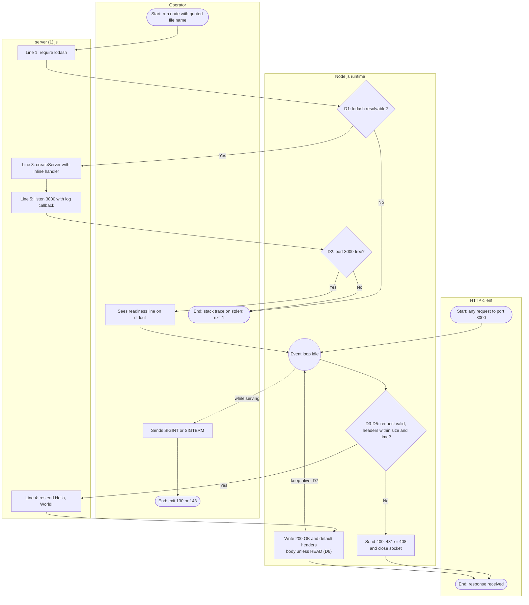
```mermaid
flowchart TB
    subgraph LaneOp["Operator"]
        OpStart(["Start: run node with quoted file name"])
        SeeReady["Sees readiness line on stdout"]
        SeeErr(["End: stack trace on stderr, exit 1"])
        SendSig["Sends SIGINT or SIGTERM"]
        OpStop(["End: exit 130 or 143"])
    end
    subgraph LaneApp["server (1).js"]
        L1["Line 1: require lodash"]
        L3["Line 3: createServer with inline handler"]
        L5["Line 5: listen 3000 with log callback"]
        H4["Line 4: res.end Hello, World!"]
    end
    subgraph LaneRt["Node.js runtime"]
        Resolve{"D1: lodash resolvable?"}
        Bind{"D2: port 3000 free?"}
        Idle(("Event loop idle"))
        Parse{"D3-D5: request valid,<br/>headers within size and time?"}
        Reject["Send 400, 431 or 408<br/>and close socket"]
        Write["Write 200 OK and default headers<br/>body unless HEAD (D6)"]
    end
    subgraph LaneCl["HTTP client"]
        Req(["Start: any request to port 3000"])
        Resp(["End: response received"])
    end
    OpStart --> L1 --> Resolve
    Resolve -- No --> SeeErr
    Resolve -- Yes --> L3 --> L5 --> Bind
    Bind -- No --> SeeErr
    Bind -- Yes --> SeeReady --> Idle
    Req --> Idle --> Parse
    Parse -- No --> Reject --> Resp
    Parse -- Yes --> H4 --> Write --> Resp
    Write -->|"keep-alive, D7"| Idle
    Idle -.->|"while serving"| SendSig --> OpStop
```

### 4.4.2 Detailed Process Flows per Core Feature

The five features of Section 2.1 run in a fixed chain: F-005 → F-001 → F-003 → F-004 at startup, then F-002 for every request.

#### 4.4.2.1 F-005 Lodash Module Loading (line 1)

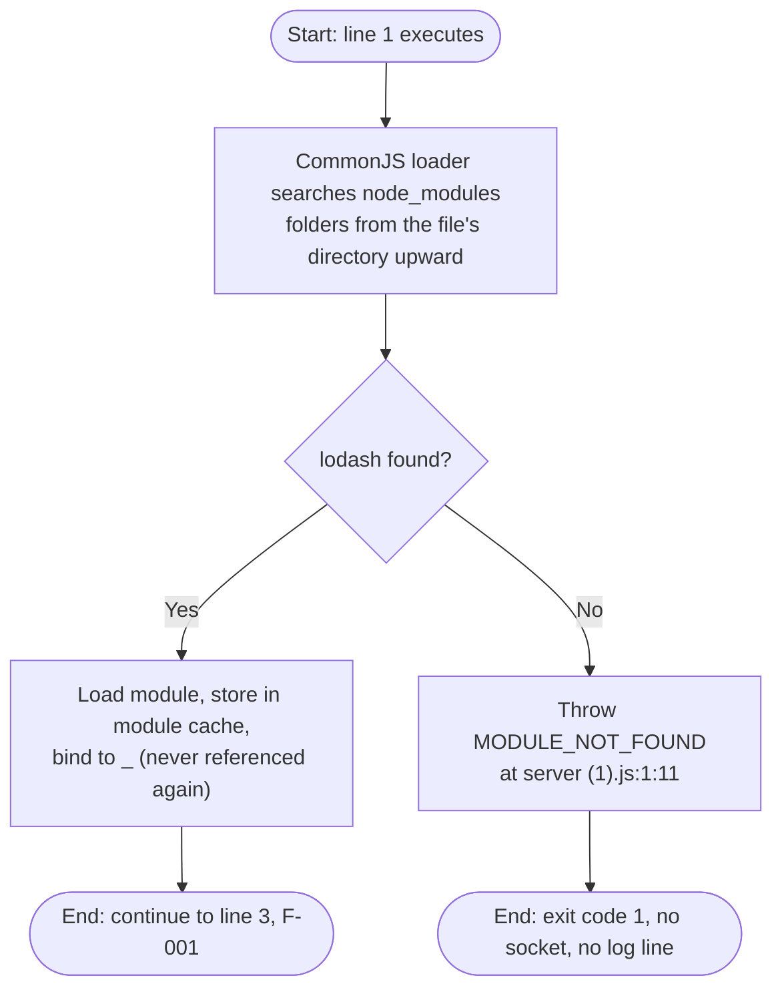
```mermaid
flowchart TD
    A1(["Start: line 1 executes"]) --> A2["CommonJS loader searches node_modules<br/>folders from the file's directory upward"]
    A2 --> A3{"lodash found?"}
    A3 -- Yes --> A4["Load module, store in module cache,<br/>bind to _ (never referenced again)"]
    A4 --> A5(["End: continue to line 3, F-001"])
    A3 -- No --> A6["Throw MODULE_NOT_FOUND<br/>at server (1).js:1:11"]
    A6 --> A7(["End: exit code 1, no socket, no log line"])
```

#### 4.4.2.2 F-001 HTTP Server Initialization (line 3)

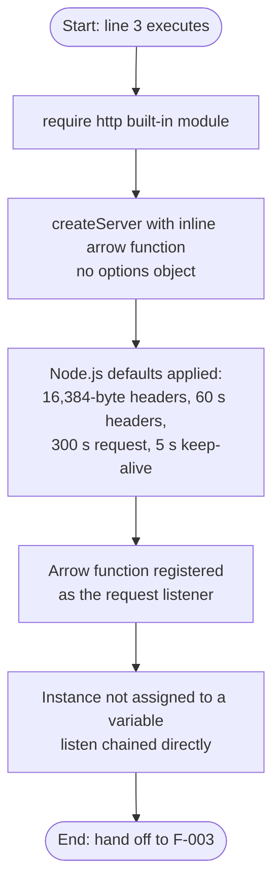
```mermaid
flowchart TD
    B1(["Start: line 3 executes"]) --> B2["require http built-in module"]
    B2 --> B3["createServer with inline arrow function<br/>no options object"]
    B3 --> B4["Node.js defaults applied:<br/>16,384-byte headers, 60 s headers,<br/>300 s request, 5 s keep-alive"]
    B4 --> B5["Arrow function registered<br/>as the request listener"]
    B5 --> B6["Instance not assigned to a variable<br/>listen chained directly"]
    B6 --> B7(["End: hand off to F-003"])
```

#### 4.4.2.3 F-003 TCP Listener on Port 3000 (line 5)

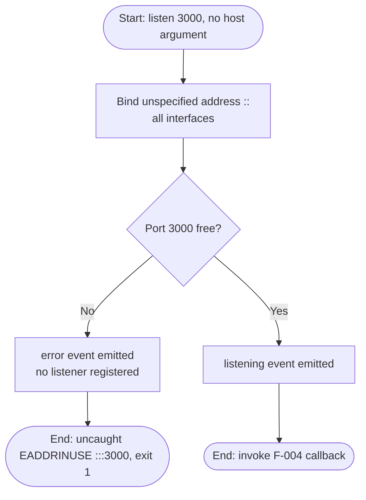
```mermaid
flowchart TD
    C1(["Start: listen 3000, no host argument"]) --> C2["Bind unspecified address ::<br/>all interfaces"]
    C2 --> C3{"Port 3000 free?"}
    C3 -- No --> C4["error event emitted<br/>no listener registered"]
    C4 --> C5(["End: uncaught EADDRINUSE :::3000, exit 1"])
    C3 -- Yes --> C6["listening event emitted"]
    C6 --> C7(["End: invoke F-004 callback"])
```

#### 4.4.2.4 F-004 Startup Readiness Logging (line 5)

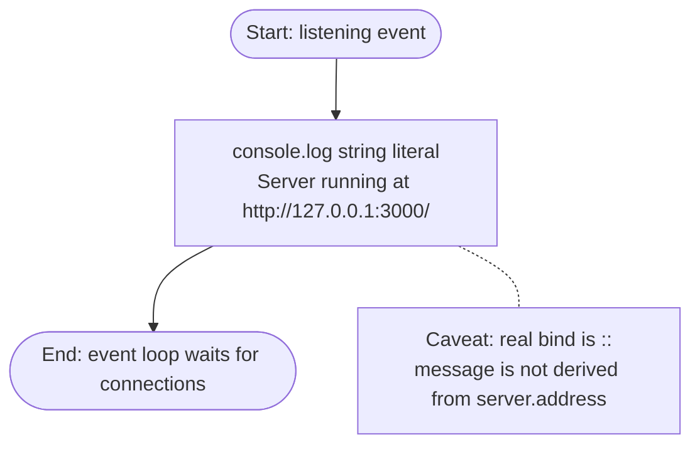
```mermaid
flowchart TD
    D1n(["Start: listening event"]) --> D2n["console.log string literal<br/>Server running at http://127.0.0.1:3000/"]
    D2n --> D3n(["End: event loop waits for connections"])
    D2n -.- D4n["Caveat: real bind is ::<br/>message is not derived from server.address"]
```

#### 4.4.2.5 F-002 Uniform Fixed-Response Handling (lines 3–4)

The parser gates are checked while bytes are read, not in a fixed order. They are drawn in sequence for readability.

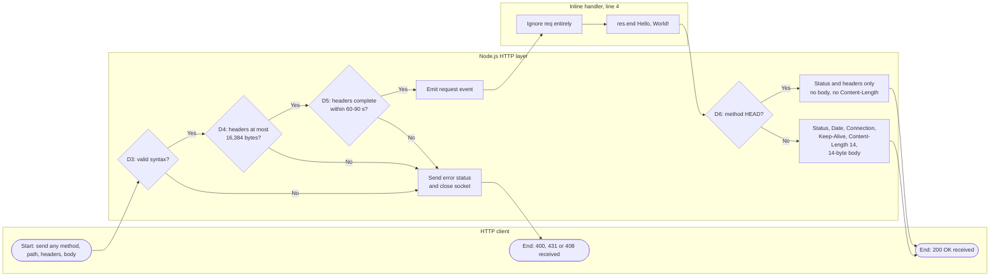
```mermaid
flowchart LR
    subgraph ClLane["HTTP client"]
        Send(["Start: send any method, path, headers, body"])
        Got200(["End: 200 OK received"])
        GotErr(["End: 400, 431 or 408 received"])
    end
    subgraph NodeLane["Node.js HTTP layer"]
        Syn{"D3: valid syntax?"}
        Size{"D4: headers at most<br/>16,384 bytes?"}
        Time{"D5: headers complete<br/>within 60-90 s?"}
        Emit["Emit request event"]
        Head{"D6: method HEAD?"}
        WithBody["Status, Date, Connection,<br/>Keep-Alive, Content-Length 14,<br/>14-byte body"]
        NoBody["Status and headers only<br/>no body, no Content-Length"]
        CloseErr["Send error status<br/>and close socket"]
    end
    subgraph HLane["Inline handler, line 4"]
        Ignore["Ignore req entirely"]
        EndRes["res.end Hello, World!"]
    end
    Send --> Syn
    Syn -- No --> CloseErr
    Syn -- Yes --> Size
    Size -- No --> CloseErr
    Size -- Yes --> Time
    Time -- No --> CloseErr
    Time -- Yes --> Emit --> Ignore --> EndRes --> Head
    Head -- No --> WithBody --> Got200
    Head -- Yes --> NoBody --> Got200
    CloseErr --> GotErr
```

### 4.4.3 Error Handling Flowcharts

The flowchart groups errors by who sees them. Startup errors reach the operator through stderr and the exit code. Request errors reach only the affected client. Termination affects every connection. Every recovery loop is manual, because the code has no retry, fallback or supervisor.

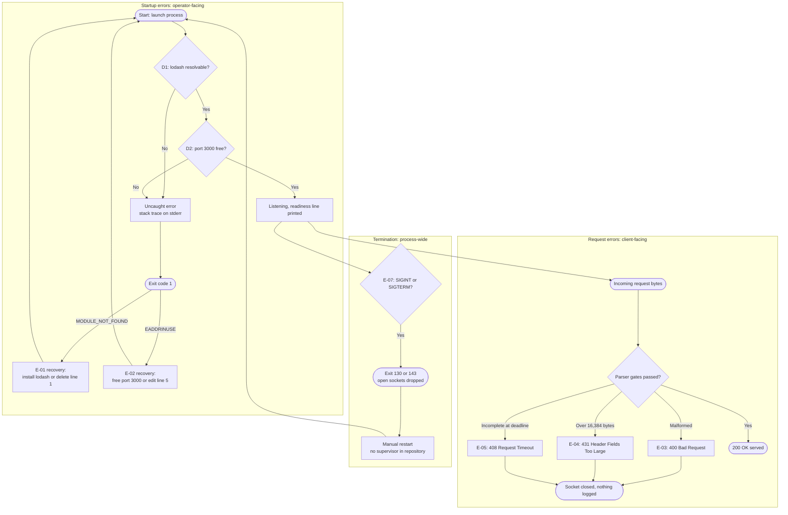
```mermaid
flowchart TD
    subgraph StartupErr["Startup errors: operator-facing"]
        Launch(["Start: launch process"])
        Q1{"D1: lodash resolvable?"}
        Q2{"D2: port 3000 free?"}
        Fatal["Uncaught error<br/>stack trace on stderr"]
        Exit1(["Exit code 1"])
        Fix1["E-01 recovery:<br/>install lodash or delete line 1"]
        Fix2["E-02 recovery:<br/>free port 3000 or edit line 5"]
        Up["Listening, readiness line printed"]
    end
    subgraph RequestErr["Request errors: client-facing"]
        Inb(["Incoming request bytes"])
        Gate{"Parser gates passed?"}
        R400["E-03: 400 Bad Request"]
        R431["E-04: 431 Header Fields Too Large"]
        R408["E-05: 408 Request Timeout"]
        Drop(["Socket closed, nothing logged"])
        Ok(["200 OK served"])
    end
    subgraph TermErr["Termination: process-wide"]
        Sig{"E-07: SIGINT or SIGTERM?"}
        Killed(["Exit 130 or 143<br/>open sockets dropped"])
        Restart["Manual restart<br/>no supervisor in repository"]
    end
    Launch --> Q1
    Q1 -- No --> Fatal
    Q1 -- Yes --> Q2
    Q2 -- No --> Fatal
    Q2 -- Yes --> Up
    Fatal --> Exit1
    Exit1 -->|"MODULE_NOT_FOUND"| Fix1 --> Launch
    Exit1 -->|"EADDRINUSE"| Fix2 --> Launch
    Up --> Inb --> Gate
    Gate -- "Malformed" --> R400 --> Drop
    Gate -- "Over 16,384 bytes" --> R431 --> Drop
    Gate -- "Incomplete at deadline" --> R408 --> Drop
    Gate -- Yes --> Ok
    Up --> Sig
    Sig -- Yes --> Killed --> Restart --> Launch
```

### 4.4.4 Integration Sequence Diagrams

#### 4.4.4.1 Startup Integration

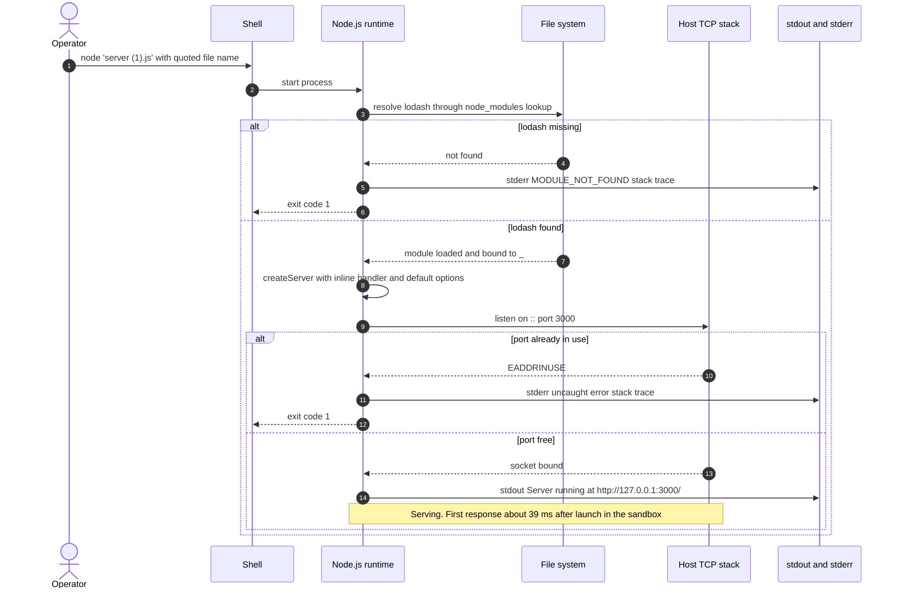
```mermaid
sequenceDiagram
    autonumber
    actor Op as Operator
    participant Sh as Shell
    participant Rt as Node.js runtime
    participant FS as File system
    participant Tcp as Host TCP stack
    participant Out as stdout and stderr
    Op->>Sh: node 'server (1).js' with quoted file name
    Sh->>Rt: start process
    Rt->>FS: resolve lodash through node_modules lookup
    alt lodash missing
        FS-->>Rt: not found
        Rt->>Out: stderr MODULE_NOT_FOUND stack trace
        Rt-->>Sh: exit code 1
    else lodash found
        FS-->>Rt: module loaded and bound to _
        Rt->>Rt: createServer with inline handler and default options
        Rt->>Tcp: listen on :: port 3000
        alt port already in use
            Tcp-->>Rt: EADDRINUSE
            Rt->>Out: stderr uncaught error stack trace
            Rt-->>Sh: exit code 1
        else port free
            Tcp-->>Rt: socket bound
            Rt->>Out: stdout Server running at http://127.0.0.1:3000/
            Note over Rt,Tcp: Serving. First response about 39 ms after launch in the sandbox
        end
    end
```

#### 4.4.4.2 Request–Response with Keep-Alive

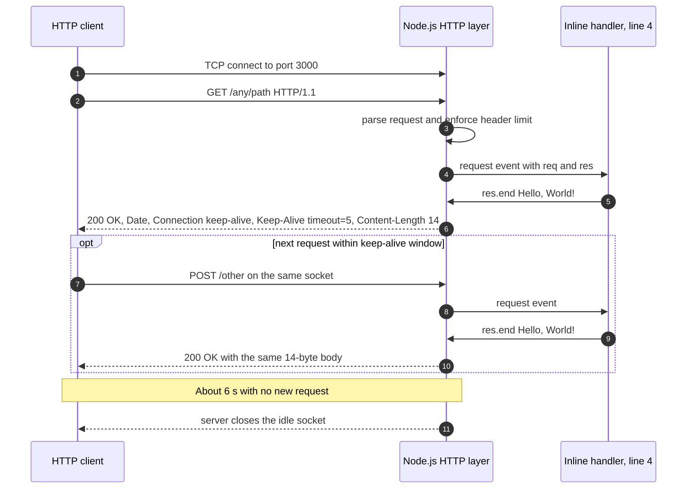
```mermaid
sequenceDiagram
    autonumber
    participant C as HTTP client
    participant P as Node.js HTTP layer
    participant H as Inline handler, line 4
    C->>P: TCP connect to port 3000
    C->>P: GET /any/path HTTP/1.1
    P->>P: parse request and enforce header limit
    P->>H: request event with req and res
    H->>P: res.end Hello, World!
    P-->>C: 200 OK, Date, Connection keep-alive, Keep-Alive timeout=5, Content-Length 14
    opt next request within keep-alive window
        C->>P: POST /other on the same socket
        P->>H: request event
        H->>P: res.end Hello, World!
        P-->>C: 200 OK with the same 14-byte body
    end
    Note over C,P: About 6 s with no new request
    P-->>C: server closes the idle socket
```

#### 4.4.4.3 Rejected Requests

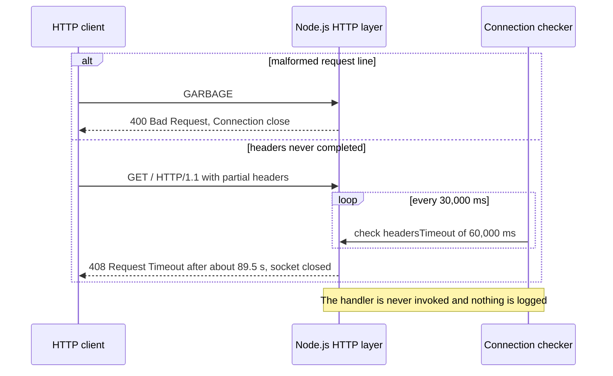
```mermaid
sequenceDiagram
    participant C as HTTP client
    participant P as Node.js HTTP layer
    participant K as Connection checker
    alt malformed request line
        C->>P: GARBAGE
        P-->>C: 400 Bad Request, Connection close
    else headers never completed
        C->>P: GET / HTTP/1.1 with partial headers
        loop every 30,000 ms
            K->>P: check headersTimeout of 60,000 ms
        end
        P-->>C: 408 Request Timeout after about 89.5 s, socket closed
    end
    Note over P,K: The handler is never invoked and nothing is logged
```

### 4.4.5 State Transition Diagrams

#### 4.4.5.1 Process Lifecycle

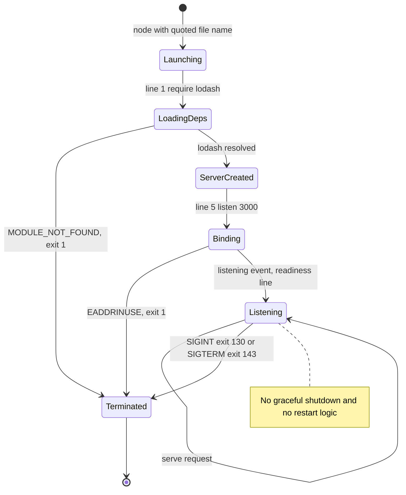
```mermaid
stateDiagram-v2
    [*] --> Launching: node with quoted file name
    Launching --> LoadingDeps: line 1 require lodash
    LoadingDeps --> Terminated: MODULE_NOT_FOUND, exit 1
    LoadingDeps --> ServerCreated: lodash resolved
    ServerCreated --> Binding: line 5 listen 3000
    Binding --> Terminated: EADDRINUSE, exit 1
    Binding --> Listening: listening event, readiness line
    Listening --> Listening: serve request
    Listening --> Terminated: SIGINT exit 130 or SIGTERM exit 143
    Terminated --> [*]
    note right of Listening : No graceful shutdown and no restart logic
```

#### 4.4.5.2 Connection Lifecycle

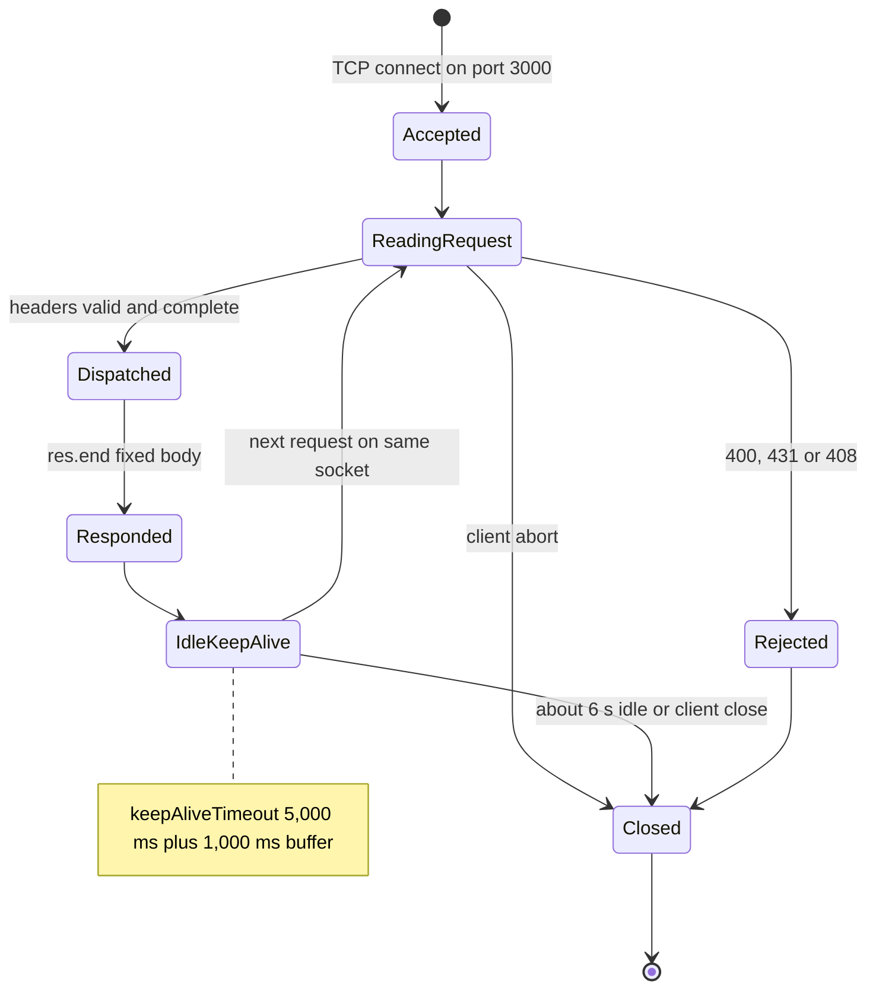
```mermaid
stateDiagram-v2
    [*] --> Accepted: TCP connect on port 3000
    Accepted --> ReadingRequest
    ReadingRequest --> Dispatched: headers valid and complete
    ReadingRequest --> Rejected: 400, 431 or 408
    ReadingRequest --> Closed: client abort
    Dispatched --> Responded: res.end fixed body
    Responded --> IdleKeepAlive
    IdleKeepAlive --> ReadingRequest: next request on same socket
    IdleKeepAlive --> Closed: about 6 s idle or client close
    Rejected --> Closed
    Closed --> [*]
    note right of IdleKeepAlive : keepAliveTimeout 5,000 ms plus 1,000 ms buffer
```

## 4.5 References

#### Repository Files and Folders

- `server (1).js`: the only source file (commit `f0ba73b`). Line 1 holds the lodash import (WF-01, D1, E-01). Line 3 creates the HTTP server and registers the inline request listener. Line 4 holds the fixed `res.end('Hello, World!\n')` response (WF-02). Line 5 holds `listen(3000)` with the readiness log callback (D2, E-02, F-004). There are no error, signal or `clientError` handlers.
- `` (repository root): holds only `server (1).js` and `.git`. There are no `.blitzyignore`, manifest, lockfile, configuration, tests, CI or supervisor files, which establishes that there is no persistence, caching, retry, fallback, authorization or batch processing.

#### Runtime Verification (Node.js v22.23.3, lodash made resolvable in a scratch copy)

- Clean-checkout launch: `MODULE_NOT_FOUND` at `server (1).js:1:11`, exit 1.
- Second instance on an occupied port: `EADDRINUSE :::3000`, exit 1.
- Default response: `200 OK` with `Date`, `Connection: keep-alive`, `Keep-Alive: timeout=5`, `Content-Length: 14`.
- Parser rejections: `400` for the request line `GARBAGE`, `431` for a 20 KB header, `408` about 89.5 s after incomplete headers.
- Keep-alive: connection reused; idle socket closed about 6,011 ms after the response.
- Runtime defaults: `headersTimeout` 60,000, `requestTimeout` 300,000, `keepAliveTimeout` 5,000, `keepAliveTimeoutBuffer` 1,000, `connectionsCheckingInterval` 30,000, `server.timeout` 0, `maxRequestsPerSocket` 0, `maxHeaderSize` 16,384.
- Signals: SIGINT exit 130, SIGTERM exit 143.
- Client abort mid-request: the server stays up.
- Server not running: connection refused.
- Timing (observed, not commitments): first response about 39 ms after startup; about 0.40 ms per loopback request.
- Diagram validation: all 14 Mermaid diagrams in this section render without errors in `mmdc` 11.17.0.

#### Cross-Referenced Technical Specification Sections

- Section 1.2 System Overview: current limitations, the summary startup and request flowchart, and measurable objectives with no instrumented KPIs.
- Section 2.1 Feature Catalog: feature IDs F-001 to F-005 and their source lines.
- Section 2.2 Functional Requirements: requirement IDs F-001-RQ-001 to F-005-RQ-003 and validation rules per feature.
- Section 2.4 Implementation Considerations: security exposure on `::` and the lack of graceful shutdown.
- Section 2.6 Assumptions, Constraints and Requirement Versioning: assumptions A-002 and A-003, constraints C-001 to C-005.
- Section 3.6 Development & Deployment: no process supervision (3.6.3) and the as-built deployment flow (3.6.5).

# 5. System Architecture

## 5.1 High-Level Architecture

This section describes the architecture of commit `f0ba73b`, which is identical on `main` and `0610_02`. The whole system is the single file `server (1).js`. Runtime behaviour was confirmed on Node.js v22.23.3 (assumption A-002, Section 2.6.1).

### 5.1.1 System Overview

#### Architecture Style and Rationale

The system is a **single-process, single-file, event-driven HTTP service**. `server (1).js` holds three code statements that run top to bottom as a CommonJS script. They build one `http.Server` from Node.js's built-in `http` module and bind it to TCP port 3000. After startup, all work happens in callbacks on the Node.js event loop. Nothing sits between the network socket and the request handler: no tiers, layers, modules or services.

| Style Attribute | As Built | Evidence |
|---|---|---|
| Deployment unit | One script and one OS process, with no build step | Repository root; Section 3.6.2 |
| Execution model | Non-blocking I/O on one JavaScript event-loop thread. No `cluster` module or worker threads | Lines 3–5; runtime check: JavaScript runs on the main thread, alongside Node.js's internal helper threads |
| Interaction model | Synchronous HTTP/1.1 request–response | Lines 3–4 |
| State model | Stateless. Nothing is kept between requests | Line 4; Section 4.3.1 |
| Configuration model | Literals in code, with no external configuration | Line 5; constraint C-001 |

**Rationale.** The repository records no design rationale: there is no README, code comment or decision record (assumption A-001). The structure matches the canonical minimal Node.js "Hello, World" server, the smallest program that accepts HTTP connections and answers them (Section 1.2.1). Every property in this section follows from that minimalism. None comes from a stated requirement.

#### Key Architectural Principles and Patterns

- **Event-driven callbacks.** The code registers exactly two listeners: the `'request'` handler passed to `createServer` (line 3) and the `'listening'` callback passed to `listen` (line 5). Node.js defaults govern every other event (Section 4.1.2).
- **Stateless request handling.** The handler never reads `req` and always writes the same constant. Every request is independent, and any two instances behave identically (F-002-RQ-005).
- **Runtime defaults over configuration.** Neither `createServer` nor `listen` receives an options object. Node.js supplies the status code, headers, parser limits, timeouts and keep-alive behaviour.
- **Fail-fast startup.** The code has no `try`/`catch` and no `'error'` listener. A missing module or an occupied port ends the process with exit code 1 before any request is served (E-01, E-02, Section 4.3.2).
- **Fire-and-forget construction.** `createServer(...)` is chained straight into `.listen(...)`, and the instance is never assigned to a variable. No code can reconfigure, extend or close the server afterwards (Section 2.4.1).
- **No framework.** There is no web framework, router, middleware chain or dependency injection. The only third-party package, lodash, is loaded but never used (F-005-RQ-003).

The code has none of these patterns: layered or MVC structure, routing, middleware, externalised configuration, health endpoints, structured logging, graceful shutdown.

#### System Boundaries and Major Interfaces

The system boundary encloses the code in `server (1).js`. The Node.js runtime is the platform that code runs on. lodash, the host network stack, the operator console and the parent process are all external.

| Interface | Direction | Contract | Source |
|---|---|---|---|
| HTTP endpoint | Inbound | HTTP/1.1 over plaintext TCP on all interfaces (`::`), port 3000. Any method and path; always `200 OK` with `Hello, World!\n` | Lines 3–5 |
| Module resolution | Inbound, at startup | `require('lodash')`, resolved through the `node_modules` folders above the file's directory | Line 1 |
| Readiness output | Outbound | One stdout line: `Server running at http://127.0.0.1:3000/` | Line 5 |
| Fatal diagnostics | Outbound | Node.js stack trace on stderr | Node.js default (E-01, E-02) |
| Process exit status | Outbound | `1` (startup failure), `130` (SIGINT), `143` (SIGTERM) | Node.js default (Section 4.3.2) |
| OS signals | Inbound | SIGINT and SIGTERM cause default termination; the code registers no handlers | WF-04 (Section 4.1) |

#### Architectural Assumptions

| ID | Assumption | Basis |
|---|---|---|
| AA-01 | The code as built is the architecture. No intended target architecture is recorded | A-001 |
| AA-02 | Node.js v22.23.3 defaults stand for the runtime's behaviour. Other versions were not checked | A-002, C-003 |
| AA-03 | lodash is supplied from outside the repository for every run | A-003, C-002 |
| AA-04 | The bind to `::` is the real network exposure. The `127.0.0.1` in the log is display text only | A-004 |
| AA-05 | Any network access control, TLS termination, process supervision or load balancing comes from the host environment, outside the repository | Section 3.6.3 |

### 5.1.2 Core Components

The code has no classes, named functions or exports. Its components are the four inline elements of `server (1).js`, named as in Section 1.2.2. A fifth component, the Node.js HTTP layer, is not implemented in the repository, but the code relies on it for all protocol behaviour. The table data is split in two to keep each table to four columns.

**Responsibilities and Dependencies**

| Component Name | Primary Responsibility | Key Dependencies | Location |
|---|---|---|---|
| Lodash Import | Loads lodash into `_`. The binding is never read | The lodash package on the module resolution path; the CommonJS loader | Line 1 |
| HTTP Server Factory | Builds one `http.Server` with an inline handler and no options | Node.js built-in `http` module | Line 3 |
| Request Handler | Ends every response with `Hello, World!\n` | `http.ServerResponse` (`res.end`) | Lines 3–4 |
| Listener and Startup Callback | Binds TCP port 3000 on `::` and prints the readiness line | Host TCP stack; `console.log` to stdout | Line 5 |
| Node.js HTTP Layer (runtime) | Parses requests, enforces limits and timeouts, writes the default status and headers, manages keep-alive | Node.js v22.23.3 internals: llhttp 9.4.3 parser, libuv 1.51.0 event loop | Runtime, outside the repository |

**Integration Points and Critical Considerations**

| Component Name | Integration Points | Critical Considerations |
|---|---|---|
| Lodash Import | Host file system (`node_modules`), at startup only | Undeclared and unpinned. A missing module aborts startup (E-01). Deleting line 1 changes no other behaviour |
| HTTP Server Factory | Node.js `http` API | The instance is never referenced, so it cannot be closed, tuned or given more listeners (C-004) |
| Request Handler | `'request'` event from the HTTP layer | Ignores all request input, sends no `Content-Type`, and cannot throw |
| Listener and Startup Callback | Host network (`::`, port 3000); stdout | Port is a literal (C-001). With no `'error'` listener, a port conflict crashes the process (E-02). The logged URL understates the real exposure (AA-04) |
| Node.js HTTP Layer (runtime) | TCP sockets, Request Handler, HTTP clients | Behaviour depends on the unpinned Node.js version (C-003). Its defaults are the only protections: a 16,384-byte header limit, a 60 s headers timeout and a 300 s request timeout |

### 5.1.3 Data Flow Description

#### Primary Data Flows

**Startup flow (WF-01).** At startup, data moves one way: from the host into process memory, then out to stdout. The CommonJS loader reads `server (1).js`. It then resolves `lodash` from `node_modules` synchronously and binds the module object to `_`, where it stays unread. `require('http')` returns the built-in module. `createServer` returns an `http.Server` that holds a reference to the handler. `listen(3000)` asks the OS for a socket on `::`. When the bind succeeds, the `'listening'` event triggers the only stdout write.

**Request flow (WF-02, WF-03).** Client bytes arrive on the TCP socket. The Node.js HTTP layer parses them into an `IncomingMessage` (`req`) and a `ServerResponse` (`res`), then emits `'request'`. The handler passes a constant string to `res.end`. Node.js encodes the string as UTF-8 and adds `Content-Length: 14`, `Date`, `Connection: keep-alive` and `Keep-Alive: timeout=5`. It then writes `200 OK`, the headers and the body to the socket. The method, URL, headers and body all enter the process, but no application code reads them. Request data goes no further than the parser and the `req` object.

#### Integration Patterns and Protocols

| Flow | Pattern | Protocol / Format | Frequency |
|---|---|---|---|
| Module load | Synchronous in-process call | CommonJS `require`, returning a JavaScript module object | Once, at startup |
| Request–response | Synchronous request–response over a reusable connection | HTTP/1.1 over plaintext TCP; text body with no declared media type | Per request |
| Readiness signal | One-shot notification | Plain-text line on stdout | Once, after the bind |
| Fatal diagnostics | Uncaught exception | Node.js stack trace on stderr | Only on startup failure |
| Exit status | Process termination | Integer exit code to the parent process | Once, at exit |

#### Data Transformation Points

The application code transforms no data. The two transformations both happen inside the Node.js HTTP layer:

1. **Parsing (bytes to `req`).** Raw request bytes become an `IncomingMessage`. Requests that are malformed, have oversized headers or arrive too slowly are rejected at this point with `400`, `431` or `408`. The handler never runs for them (D3–D5, Section 4.1.1).
2. **Serialisation (string to HTTP response).** The literal `'Hello, World!\n'` becomes an HTTP/1.1 response: status line, default headers, computed `Content-Length` and a UTF-8 body. For `HEAD` requests the body is left out (D6).

#### Key Data Stores and Caches

There are none. The process opens no database, writes no file, and keeps no session or in-memory application cache. The only data it retains is the `_` binding and the CommonJS module cache entries for `lodash` and `http`. Both last for the life of the process and are gone at exit (Section 4.3.1). With no state, there is nothing to replicate, back up or migrate.

### 5.1.4 External Integration Points

The code calls no external API, database, message broker, identity provider or observability service (Section 1.2.1). Every integration is with the hosting environment. The data is split into two tables to keep each to four columns.

**Integration Type, Pattern and Protocol**

| System Name | Integration Type | Data Exchange Pattern | Protocol/Format |
|---|---|---|---|
| HTTP clients | Inbound network service | Synchronous request–response with keep-alive reuse | HTTP/1.1 over plaintext TCP, `::` port 3000 |
| lodash package | In-process library, unused | One synchronous load at startup | CommonJS module from `node_modules` |
| Node.js runtime (`http` built-in) | Platform API | In-process calls and event callbacks | JavaScript API: `createServer`, `listen`, `res.end` |
| Host OS network stack | Socket bind and accept | One bind at startup, then one accept per connection | TCP on the IPv6 wildcard address `::` |
| Operator console | Output streams | One-way writes | Plain text on stdout and stderr |
| Parent process or supervisor | Process control | Signals in, exit code out | POSIX signals; integer exit codes |

**SLA Requirements**

The repository defines no SLA for any integration. The right-hand column shows the limits that apply in practice, observed on Node.js v22.23.3.

| System Name | SLA Defined in Repository | Governing Limits in Practice |
|---|---|---|
| HTTP clients | None | Headers ≤ 16,384 bytes; headers must arrive within 60 s (`headersTimeout`, enforced 60–90 s after the connection opens) and the request within 300 s (`requestTimeout`); idle keep-alive sockets close after about 6 s |
| lodash package | None, and the version is unpinned | Must be resolvable at startup, or the process exits with code 1 |
| Node.js runtime | None, and the version is unpinned | Behaviour confirmed on v22.23.3 only (AA-02) |
| Host OS network stack | None | Port 3000 must be free; one instance per host |
| Operator console | None | The readiness line appeared about 39 ms after launch in the verification environment |
| Parent process or supervisor | None. The repository ships no supervisor | Restarting is external; termination does not drain in-flight requests |

## 5.2 Component Details

Each component below is documented with the same five attributes. Four components are inline code in `server (1).js`. The fifth, the Node.js HTTP layer, is runtime-provided and is included because it carries all protocol behaviour. Runtime values come from Node.js v22.23.3 (AA-02).

### 5.2.1 Lodash Import (Line 1)

| Attribute | Specification |
|---|---|
| Purpose and responsibilities | Loads the lodash module into the constant `_`. Nothing reads `_`, so the component's only effect is a hard startup dependency (F-005) |
| Technologies and frameworks | CommonJS `require`; lodash, MIT licence, no transitive dependencies. The version is whatever copy the host resolves; the current release is 4.18.1 (Section 3.3.2) |
| Key interfaces and APIs | Exposes none. Consumes Node.js module resolution, which searches `node_modules` folders from the file's directory upward |
| Data persistence requirements | None. The module object lives in the CommonJS module cache until the process exits |
| Scaling considerations | Loaded once per process, synchronously. Every host or image must supply lodash, or startup fails with exit code 1 (E-01) |

```javascript
const _ = require('lodash');   // line 1, binding never referenced
```

### 5.2.2 HTTP Server Factory (Line 3)

| Attribute | Specification |
|---|---|
| Purpose and responsibilities | Builds the one `http.Server` instance and registers the inline arrow function as its `'request'` listener |
| Technologies and frameworks | Node.js built-in `http` module, `createServer(requestListener)` with no options object. No web framework |
| Key interfaces and APIs | The returned instance goes straight to `.listen(...)` and is never assigned. No other code can reach it |
| Data persistence requirements | None |
| Scaling considerations | One server per process. Without a reference, nothing can add listeners, tune limits or call `close()` (C-004). The `cluster` module and worker threads are not used |

Because no options are passed, these Node.js defaults apply to the instance:

| Setting | Default Value | Effect |
|---|---|---|
| `maxHeaderSize` | 16,384 bytes | Larger request headers get `431` (D4) |
| `headersTimeout` | 60,000 ms | Late headers get `408`. The connection checker runs every 30,000 ms, so enforcement falls 60–90 s after the connection opens (D5) |
| `requestTimeout` | 300,000 ms | Upper bound on receiving a whole request |
| `keepAliveTimeout` | 5,000 ms | Advertised as `Keep-Alive: timeout=5`. Idle sockets were observed closing at about 6 s (D7) |
| `timeout` / `maxRequestsPerSocket` | 0 / 0 | No socket inactivity timeout, and no limit on requests per connection |

### 5.2.3 Request Handler (Lines 3–4)

| Attribute | Specification |
|---|---|
| Purpose and responsibilities | Answers every dispatched request with the fixed body `Hello, World!\n`, whatever the method, path, query, headers or body (F-002) |
| Technologies and frameworks | Anonymous arrow function `(req, res) => { res.end('Hello, World!\n'); }`, using only the `ServerResponse` API |
| Key interfaces and APIs | Input: `req` (`http.IncomingMessage`, never read) and `res` (`http.ServerResponse`). Output: `200 OK` with `Content-Length: 14` and no `Content-Type`. `HEAD` gets headers only (Section 4.1.2) |
| Data persistence requirements | None. There is no shared mutable state, session or I/O |
| Scaling considerations | Constant CPU cost per request and no I/O. Being stateless, it can be replicated horizontally with no coordination. The single event loop is the throughput ceiling: in the verification environment, 20,000 keep-alive requests over 50 concurrent sockets from the same host finished in 770 ms (about 26,000 requests/s), every one `200 OK` with the exact body |

### 5.2.4 Listener and Startup Callback (Line 5)

| Attribute | Specification |
|---|---|
| Purpose and responsibilities | Binds the server to TCP port 3000. When the `'listening'` event fires, writes the readiness line (F-003, F-004) |
| Technologies and frameworks | `server.listen(port, callback)` with no host argument, so Node.js binds the wildcard `::`. Output goes through `console.log` |
| Key interfaces and APIs | Network: `::` port 3000 (reachable over IPv4 at `127.0.0.1`). Console: `Server running at http://127.0.0.1:3000/` |
| Data persistence requirements | None. The log line persists only if the parent shell or a supervisor captures stdout |
| Scaling considerations | Because the port is a literal, each host or network namespace runs one instance. More instances need separate hosts or containers with port mapping (AA-05). A second instance on the same host crashes with `EADDRINUSE :::3000` and leaves the first running (E-02) |

```javascript
}).listen(3000, () => console.log('Server running at http://127.0.0.1:3000/'));
```

### 5.2.5 Node.js HTTP Layer (Runtime-Provided)

| Attribute | Specification |
|---|---|
| Purpose and responsibilities | Accepts connections, parses requests, enforces size and time limits, rejects bad input, writes the default status and headers, and manages keep-alive. None of this is in the repository |
| Technologies and frameworks | Node.js v22.23.3 with the llhttp 9.4.3 HTTP parser, libuv 1.51.0 event loop and V8 12.4. The repository pins no version (C-003) |
| Key interfaces and APIs | Emits `'request'` and `'listening'`, which the code handles, and `'error'` and `'clientError'`, which it does not. `clientError` falls back to the built-in `400`/`431`/`408` replies, and an unhandled `'error'` becomes an uncaught exception (Section 4.1.2) |
| Data persistence requirements | None. Connection state is held in memory per socket |
| Scaling considerations | JavaScript runs on one thread. The process had 7 OS threads in total, the others being Node.js and V8 helper threads. Resident memory was about 47 MB idle and peaked at about 61 MB during the 20,000-request run (verification environment only) |

### 5.2.6 Component Interaction Diagram

The diagram shows how the four code components and the runtime layer interact with the host environment. Solid arrows are normal flows; dashed arrows are failure or rejection paths.

```mermaid
flowchart LR
    Client["HTTP clients"]
    subgraph Host["Host environment"]
        FS["File system<br/>node_modules/lodash"]
        TCP["Host TCP stack<br/>:: port 3000"]
        Out["stdout and stderr"]
        Parent["Parent process<br/>or supervisor"]
    end
    subgraph Proc["Node.js process running server (1).js"]
        LI["Lodash Import<br/>line 1"]
        SF["HTTP Server Factory<br/>line 3"]
        RH["Request Handler<br/>lines 3-4"]
        LS["Listener and Startup Callback<br/>line 5"]
        Sig["Default signal handling<br/>no handlers in code"]
        subgraph RT["Node.js HTTP Layer (runtime)"]
            Parser["llhttp parser<br/>limits and timeouts"]
            Writer["Response writer<br/>default status and headers"]
            KA["Keep-alive timers and<br/>connection checker"]
        end
    end
    FS -->|"require, once at startup"| LI
    LI -.->|"MODULE_NOT_FOUND, exit 1"| Out
    SF -->|"registers request listener"| RH
    SF -->|"chained listen 3000"| LS
    LS -->|"bind ::, port 3000"| TCP
    LS -->|"listening: readiness line"| Out
    LS -.->|"EADDRINUSE, exit 1"| Out
    Client -->|"HTTP/1.1 bytes"| TCP
    TCP --> Parser
    Parser -->|"request event"| RH
    Parser -.->|"400, 431 or 408"| Client
    RH -->|"res.end constant"| Writer
    Writer -->|"200 OK, 14-byte body"| Client
    KA -.->|"idle close after about 6 s"| Client
    Parent -->|"SIGINT or SIGTERM"| Sig
    Sig -->|"exit 130 or 143"| Parent
```

### 5.2.7 State Transition Diagram

The process moves through a short startup sequence and then stays in `Listening`. The composite state shows the lifecycle each connection goes through while the server listens; many connections can be in it at once. State names follow Section 4.3.1, and Section 4.4.5 diagrams the two lifecycles separately.

```mermaid
stateDiagram-v2
    [*] --> LoadingDependencies: node launches the script
    LoadingDependencies --> Terminated: lodash missing, exit 1
    LoadingDependencies --> ServerCreated: createServer with handler
    ServerCreated --> Binding: listen 3000
    Binding --> Terminated: EADDRINUSE, no error listener, exit 1
    Binding --> Listening: listening event, readiness line
    state Listening {
        [*] --> Accepted: TCP connection on port 3000
        Accepted --> ReadingRequest
        ReadingRequest --> Dispatched: request parsed
        ReadingRequest --> Rejected: 400, 431 or 408
        ReadingRequest --> Closed: client abort
        Dispatched --> Responded: res.end, 200 OK
        Responded --> IdleKeepAlive
        IdleKeepAlive --> ReadingRequest: next request on same socket
        IdleKeepAlive --> Closed: about 6 s idle or client close
        Rejected --> Closed
        Closed --> [*]
    }
    Listening --> Terminated: SIGINT exit 130, SIGTERM exit 143
    Terminated --> [*]
```

### 5.2.8 Sequence Diagrams for Key Flows

#### Process Startup (WF-01)

The two `alt` blocks are the only branch points at startup: D1, whether lodash resolves, and D2, whether port 3000 is free.

```mermaid
sequenceDiagram
    autonumber
    actor Op as Operator
    participant Proc as Node.js process
    participant Loader as CommonJS loader
    participant FS as node_modules
    participant Http as http built-in
    participant OS as Host TCP stack
    Op->>Proc: node "server (1).js"
    Proc->>Loader: require('lodash') at line 1
    Loader->>FS: Resolve lodash upward from the file directory
    alt lodash not found
        FS-->>Loader: Not found
        Loader-->>Op: stderr MODULE_NOT_FOUND, exit 1
    else lodash found
        FS-->>Loader: Module object
        Loader-->>Proc: Bound to _ and never read
        Proc->>Http: createServer(handler) at line 3
        Http-->>Proc: http.Server, not assigned to a variable
        Proc->>OS: listen(3000) with no host at line 5
        alt port 3000 in use
            OS-->>Proc: error event EADDRINUSE :::3000
            Proc-->>Op: Uncaught, stderr stack trace, exit 1
        else port free
            OS-->>Proc: Bound to :: port 3000
            Proc-->>Op: stdout Server running at http://127.0.0.1:3000/
        end
    end
```

#### Request–Response with Keep-Alive (WF-02, WF-03)

The runtime layer rejects invalid requests before the handler sees them. Every request it dispatches gets the identical response.

```mermaid
sequenceDiagram
    autonumber
    participant C as HTTP client
    participant L as Node.js HTTP layer
    participant H as Request Handler
    C->>L: TCP connect to port 3000
    C->>L: Request with any method, path, headers and body
    alt Malformed, headers over 16,384 bytes, or headers late
        L-->>C: 400, 431 or 408, then socket closed
    else Valid request
        L->>H: request event with req and res
        Note over H: req is never read
        H->>L: res.end with the Hello, World! literal
        L-->>C: 200 OK, Date, keep-alive headers, Content-Length 14, body
        opt Next request within the keep-alive window
            C->>L: Request on the same socket
            L->>H: request event
            H->>L: res.end with the same literal
            L-->>C: Identical 200 OK response
        end
        L-->>C: Idle socket closed after about 6 s
    end
```

## 5.3 Technical Decisions

The repository contains no decision records, design notes or code comments (AA-01). The decisions below are reconstructed from what `server (1).js` does at commit `f0ba73b`. Each is labelled **implicit**: the code embodies it, but nothing records that it was deliberately chosen. Rationale is inferred from the code's minimal "Hello, World" purpose (Section 1.2.1). Tradeoffs and consequences are observed.

### 5.3.1 Architecture Style Decisions and Tradeoffs

| Decision | As Built | Benefit | Tradeoff |
|---|---|---|---|
| Program structure | One file with two anonymous inline callbacks; no classes, named functions or exports | No build step. The whole system can be read at once | No module boundaries or test seams; nothing can import and test the handler (C-006) |
| Framework | Node.js built-in `http` only | No framework dependency or framework overhead | No routing, middleware, body parsing or central error handling |
| Concurrency model | One process on one event loop | No coordination, locking or shared state to manage | Uses one CPU core. A crash or a blocked loop stops all service. No in-process redundancy |
| Server lifecycle | `createServer(...).listen(...)` chained; the instance is never assigned | Minimal code | No graceful shutdown, runtime reconfiguration or extra listeners (C-004) |
| Configuration | Port, body and log text are literals | Deterministic; no configuration parsing | Changing the port means editing code. The port in the log message and the `listen` argument must be kept in step by hand (Section 2.4.4) |
| Dependency management | `lodash` is required, with no manifest | None. The binding is never used | Startup fails on clean hosts; the version loaded is unknown (C-002) |

The style fits a fixed-response demonstration server. It does not fit anything that needs routing, configuration, observability or controlled shutdown. Each of those would need structural changes, not just additions.

### 5.3.2 Communication Pattern Choices

| Concern | Choice | Inferred Rationale | Implication |
|---|---|---|---|
| Client protocol | HTTP/1.1 over plaintext TCP | Built into Node.js and universally supported | Traffic is neither encrypted nor integrity-protected (Section 5.3.5) |
| Exchange style | Synchronous request–response | A fixed response needs nothing more | No streaming, push or asynchronous processing |
| Connection management | Node.js keep-alive defaults (`Keep-Alive: timeout=5`) | Connection reuse comes free | Idle sockets stay open about 6 s; there is no per-socket request limit |
| Internal communication | Direct in-process event callbacks | One process needs no IPC | No queues, brokers or service-to-service calls |
| Operational signalling | One stdout line plus the exit code | The simplest possible readiness signal | Unstructured. The logged URL does not match the real bind address (AA-04) |

The code uses none of these: HTTP/2, HTTPS, WebSockets, gRPC, message queues, event buses or outbound HTTP calls.

### 5.3.3 Data Storage Solution Rationale

The system has no storage, by construction. The response body is a string literal fixed when the code was written, so there is nothing to read, write or look up at runtime.

| Data Category | Storage | Rationale and Consequence |
|---|---|---|
| Response content | String literal on line 4 | Constant, so no data source is needed. Changing it means editing code and restarting |
| Request data | Not stored, not read | The handler ignores `req`, so nothing is retained |
| Session or user data | None | No users or sessions exist |
| Logs | Not stored by the process | stdout and stderr persist only if captured externally (Section 4.3.1) |

With no data, there are no database drivers, schemas, migrations or backups. Every instance is disposable, and horizontal replicas need no shared store.

### 5.3.4 Caching Strategy Justification

| Layer | Strategy | Justification |
|---|---|---|
| Application cache | None | The body is a constant, so there is nothing expensive to compute or fetch |
| HTTP caching | No `Cache-Control`, `ETag`, `Last-Modified` or `Expires` headers | No decision is recorded. Caching is left to whatever clients and intermediaries do by default |
| Shared or distributed cache | None | With no state, there is nothing to share between instances |
| Module cache | Node.js CommonJS cache holds `lodash` and `http` | Runtime behaviour, not application logic. Each module loads once per process (Section 4.3.1) |

Adding a cache would buy nothing. Serving the response already takes one `res.end` call on a constant, with no I/O.

### 5.3.5 Security Mechanism Selection

The code selects no security mechanism. The protections that exist come from Node.js defaults and from whatever the host environment adds (AA-05).

| Concern | Mechanism in Place | Source | Residual Exposure |
|---|---|---|---|
| Transport security | None: the `http` module, not `https` | Line 3 | Requests and responses cross the network in cleartext |
| Authentication and authorization | None | Lines 3–4 | Anyone who can reach port 3000 gets a response (Section 5.4.4) |
| Network exposure | Bind to `::`, all interfaces | Line 5 | Only host firewalls and network policy limit reachability (AA-04) |
| Input handling | Application never reads input. Node.js parser rejects malformed requests (`400`) and headers over 16,384 bytes (`431`) | Line 4; Node.js defaults | Smallest possible application input surface |
| Slow-client protection | `headersTimeout` 60 s and `requestTimeout` 300 s | Node.js defaults | No rate limiting, connection cap or request-per-socket limit |
| Response hardening | Default headers only: no `Content-Type`, no security headers | Line 4 | Clients must guess the media type |
| Supply chain | None: lodash is unpinned, with no lockfile or integrity hash | Line 1; Section 3.3.4 | A copy in the advisory range (≤ 4.17.23) would load silently. No code path calls the affected functions |

### 5.3.6 Decision Tree

The tree runs through the design questions the code answers implicitly. Solid edges are the branches the code takes. Dashed edges are alternatives it does not implement. "Not addressed" marks questions the code never handles; the as-built behaviour is the default outcome.

```mermaid
flowchart TD
    Goal(["Observed goal: answer any HTTP request<br/>with a fixed text body"]) --> Q1{"Routing, middleware<br/>or body parsing needed?"}
    Q1 -- "No: one fixed response" --> A1["Built-in http module, one file,<br/>inline handler<br/>ADR-001, ADR-002"]
    Q1 -.->|"Yes: not taken"| X1["Web framework"]
    A1 --> Q2{"State or data kept<br/>between requests?"}
    Q2 -- "No: constant body" --> A2["Stateless handler,<br/>no storage, no cache<br/>ADR-004"]
    Q2 -.->|"Yes: not taken"| X2["Database or cache"]
    A2 --> Q3{"More than one CPU core<br/>per host?"}
    Q3 -- "No" --> A3["Single process,<br/>single event loop<br/>ADR-003"]
    Q3 -.->|"Yes: not taken"| X3["cluster module<br/>or worker threads"]
    A3 --> Q4{"Port or host varies<br/>by environment?"}
    Q4 -- "Not addressed" --> A4["Literal port 3000, no host,<br/>binds ::<br/>ADR-005"]
    Q4 -.->|"Yes: not taken"| X4["Environment variable<br/>or CLI flag"]
    A4 --> Q5{"Startup and runtime<br/>errors handled in code?"}
    Q5 -- "Not addressed" --> A5["Fail fast with exit 1,<br/>Node.js defaults for the rest<br/>ADR-006"]
    Q5 -.->|"Yes: not taken"| X5["error listener, signal handlers,<br/>graceful shutdown"]
    A5 --> Q6{"TLS or authentication<br/>in the process?"}
    Q6 -- "Not addressed" --> A6["Plain HTTP,<br/>open access<br/>ADR-007"]
    Q6 -.->|"Yes: not taken"| X6["https module,<br/>authentication checks"]
    A6 --> Q7{"Third-party library<br/>needed?"}
    Q7 -- "No, yet lodash is required" --> A7["Unused lodash import,<br/>no manifest<br/>ADR-008"]
    Q7 -.->|"Declared dependency: not taken"| X7["package.json<br/>and lockfile"]
```

### 5.3.7 Architecture Decision Records

Every record has the status **Implicit, as built at `f0ba73b`**. None was written by the authors; each is reconstructed from the code.

| ADR | Decision | Context | Consequences |
|---|---|---|---|
| ADR-001 | Single-file script with inline anonymous callbacks | A fixed-response server needs very little code (lines 1–5) | Easy to read and run. No test seams or reuse; file name must be quoted to run (C-005) |
| ADR-002 | Node.js built-in `http`, no framework | No routes or middleware are needed | One fewer dependency. All protocol behaviour comes from the unpinned runtime (C-003) |
| ADR-003 | Single process on one event loop | The handler does constant, I/O-free work | One core per instance. The process is a single point of failure (C-004) |
| ADR-004 | Stateless constant response; no storage or caching | The body is a literal | No data to lose or sync, and replicas need no coordination |
| ADR-005 | Port `3000` as a literal, with no host argument | No configuration mechanism exists | Binds `::` on all interfaces. One instance per host; a port conflict crashes the process (C-001, E-02) |
| ADR-006 | Fail fast; leave runtime defaults in place for errors, timeouts and signals | No error handling in the code | Startup errors exit 1 with a stack trace. Signals end the process without draining connections (E-01, E-02, E-07) |
| ADR-007 | Plain HTTP with no authentication | Demonstration scope; nothing to protect in the response | Cleartext and open access. Security depends on the host network (AA-05) |
| ADR-008 | `require('lodash')` with no manifest | None evident; `_` is never used | Startup dependency with no function. Unpinned version and unverified supply chain (C-002, E-01) |

The diagram ties each ADR to the constraints (Section 2.6.2), error paths (Section 4.3.2) and assumptions it produces.

```mermaid
flowchart LR
    subgraph Decisions["Implicit architecture decisions at f0ba73b"]
        ADR1["ADR-001<br/>Single-file script"]
        ADR2["ADR-002<br/>Built-in http, no framework"]
        ADR3["ADR-003<br/>Single process, one event loop"]
        ADR4["ADR-004<br/>Stateless, no storage or cache"]
        ADR5["ADR-005<br/>Literal port 3000, bind ::"]
        ADR6["ADR-006<br/>Fail fast, runtime defaults"]
        ADR7["ADR-007<br/>Plain HTTP, no auth"]
        ADR8["ADR-008<br/>Unused lodash, no manifest"]
    end
    subgraph Effects["Recorded constraints, error paths and benefits"]
        C001["C-001 Port hard-coded"]
        C002["C-002 lodash unpinned"]
        C003["C-003 Node.js not pinned"]
        C004["C-004 Single process,<br/>no error handling"]
        C006["C-006 No tests or CI"]
        E01["E-01 MODULE_NOT_FOUND"]
        E02["E-02 EADDRINUSE"]
        E07["E-07 Signal exit, no drain"]
        AA04["AA-04 Exposure on all interfaces"]
        B1["Benefit: replicas need<br/>no coordination"]
    end
    ADR1 -.->|"no test seams"| C006
    ADR2 --> C003
    ADR3 --> C004
    ADR4 --> B1
    ADR5 --> C001
    ADR5 --> E02
    ADR5 --> AA04
    ADR6 --> C004
    ADR6 --> E02
    ADR6 --> E07
    ADR7 --> AA04
    ADR8 --> C002
    ADR8 --> E01
```

## 5.4 Cross-Cutting Concerns

The code implements none of the usual cross-cutting capabilities: no observability, authentication, error handling or recovery. This section records what exists, what the Node.js runtime provides by default, and what is left to the host environment (AA-05). Measured values come from the verification environment (Node.js v22.23.3, client on the same host). They are baselines, not commitments.

### 5.4.1 Monitoring and Observability Approach

The process exposes no metrics, health endpoint, readiness endpoint or instrumentation (Section 1.2.3). Monitoring has to rely on the few signals it produces as side effects.

| Signal | Produced By | Availability | Monitoring Use |
|---|---|---|---|
| Readiness line on stdout | Listener and Startup Callback (line 5) | Once per successful start | Confirms the bind succeeded |
| `200 OK` on any method and path | Request Handler (line 4) | Every dispatched request | External liveness probe. Any path works; no dedicated health route exists |
| Process exit code | Node.js runtime | At termination: `1`, `130` or `143` | Lets a supervisor detect a crash or stop |
| Stack trace on stderr | Node.js runtime | Fatal startup errors only (E-01, E-02) | Diagnosis by the operator |
| CPU, memory, socket counts | Host OS only | Through external tooling | Capacity monitoring. Resident memory was about 47 MB idle and about 61 MB under load |
| Application metrics, tracing, alerts | None | — | — |

Because there is no dedicated health route, a probe of `/` cannot tell a healthy process from one stuck after accepting a connection. It only tells success from refusal or timeout.

### 5.4.2 Logging and Tracing Strategy

| Log Event | Destination | Format | Status |
|---|---|---|---|
| Startup readiness | stdout | Plain-text literal: `Server running at http://127.0.0.1:3000/` | Present. The URL text does not match the `::` bind (AA-04) |
| Fatal startup error | stderr | Node.js default stack trace | Present, from the runtime |
| Request access log | — | — | Absent. Requests leave no server-side trace (F-004-RQ-003) |
| Protocol rejections (`400`, `431`, `408`) | — | — | Absent. Only the affected client sees them |
| Shutdown | — | — | Absent. Signals end the process silently |

- **Format:** unstructured text, with no log levels, timestamps, instance identifiers or correlation IDs. Output from several instances cannot be told apart (Section 2.4.4).
- **Retention:** the process writes no files. Output persists only if the parent shell or a supervisor redirects it.
- **Distributed tracing:** none. The handler never reads request headers, so incoming trace-context headers are ignored and nothing is propagated. The server makes no downstream calls that could be traced.

### 5.4.3 Error Handling Patterns

The code has no error-handling statements. Errors are handled by four default patterns, each owned by the Node.js runtime. The full catalogue (E-01 to E-08) and recovery procedures are in Section 4.3.2.

| Pattern | Where It Applies | Behaviour | Errors |
|---|---|---|---|
| Fail fast through an uncaught exception | Startup: line 1 (`require`) and line 5 (`listen`) | Stack trace on stderr, exit code 1, no socket left serving | E-01, E-02 |
| Runtime-delegated rejection | Node.js HTTP parser and connection checker | Default `clientError` handling sends `400`, `431` or `408`, then closes the socket. Other connections are unaffected | E-03, E-04, E-05 |
| Silent discard | Client socket close | The socket is dropped and the server keeps serving | E-06 |
| Default signal termination | SIGINT and SIGTERM | Immediate exit (`130` or `143`); open connections are dropped without draining | E-07 |

Patterns that are absent: retry with backoff, fallback responses, circuit breakers, an `'error'` listener on the server, `process.on('uncaughtException')`, and graceful shutdown. The Request Handler is infallible: one `res.end` on a constant, with no I/O. So no error can arise once a request has been dispatched.

#### Error Handling Flow

```mermaid
flowchart TD
    Start(["Error or abnormal event"]) --> Origin{"Where does it arise?"}
    Origin -- "Startup, line 1" --> E01["E-01 Cannot find module lodash"]
    Origin -- "Startup, line 5" --> E02["E-02 listen EADDRINUSE :::3000"]
    Origin -- "Request parsing" --> Parse{"Parser condition"}
    Origin -- "Client socket" --> E06["E-06 Client aborts mid-request"]
    Origin -- "Operating system" --> E07["E-07 SIGINT or SIGTERM"]
    Origin -- "Request handler" --> NoFail["Cannot fail: constant res.end,<br/>no I/O"]
    E01 --> AppCheck{"Handler in<br/>application code?"}
    E02 --> AppCheck
    AppCheck -- "No: no try/catch,<br/>no error listener" --> Uncaught["Uncaught exception"]
    Uncaught --> Trace["Node.js stack trace on stderr"]
    Trace --> Exit1["Exit code 1, nothing served"]
    Parse -- "Malformed request" --> R400["400 Bad Request"]
    Parse -- "Headers over 16,384 bytes" --> R431["431 Request Header Fields Too Large"]
    Parse -- "Headers not complete in time" --> R408["408 Request Timeout"]
    R400 --> CloseSock["Node.js closes that socket"]
    R431 --> CloseSock
    R408 --> CloseSock
    E06 --> Discard["Socket discarded silently"]
    CloseSock --> Continue["Server keeps serving,<br/>nothing logged server-side"]
    Discard --> Continue
    E07 --> SigExit["Default termination: exit 130 or 143,<br/>in-flight requests dropped"]
    Exit1 --> Supervisor{"External supervisor<br/>present?"}
    SigExit --> Supervisor
    Supervisor -- "None in repository" --> Manual["Operator fixes the cause<br/>and relaunches"]
    Supervisor -.->|"Only if the host adds one"| AutoRestart["Automatic restart"]
    Manual --> Verify["Check readiness line,<br/>then curl returns 200 OK"]
    AutoRestart --> Verify
```

### 5.4.4 Authentication and Authorization Framework

There is none. Every client that can reach `::` port 3000 is anonymous and gets the same response.

| Layer | Mechanism | Status |
|---|---|---|
| Identity and credentials | None. No tokens, keys, cookies or `Authorization` header handling | Absent (lines 3–4) |
| Authorization and roles | None. No per-path or per-method access rules | Absent |
| Session management | None | Absent; the handler is stateless |
| Transport security | None. Plain `http`, no TLS | Absent (line 3) |
| Network-level access control | Not in the repository | Delegated to host firewalls and network policy (AA-05) |

Impact is limited by what the response contains: a fixed 14-byte greeting with no data. The observed response headers (`Date`, `Connection`, `Keep-Alive`, `Content-Length`) include no `Server` header, so no runtime version is disclosed. Open access does mean any reachable client can use connection slots and event-loop time without limit (Section 5.3.5).

### 5.4.5 Performance Requirements and SLAs

The repository defines no performance requirements, SLAs or SLOs. The values below are observed baselines.

| Metric | Observed Value | Conditions |
|---|---|---|
| Startup to first successful response | About 39 ms | Process launch to first `200 OK`, lodash present |
| Request latency | 0.06 ms to connect, 0.40 ms in total | One `curl` over loopback |
| Throughput | About 26,000 requests/s: 20,000 requests in 770 ms, all `200 OK` | 50 concurrent keep-alive sockets; client on the same host |
| Burst concurrency | 200 simultaneous requests, all `200 OK` | Separate `curl` processes |
| Resident memory | About 47 MB idle; peak about 61 MB | Before and after the 20,000-request run |
| Protocol time limits | Headers within 60 s, enforced 60–90 s after the connection opens; request within 300 s; keep-alive idle about 6 s | Node.js defaults (Section 5.2.2) |

**Scalability implications:**

- **Vertical:** throughput is capped by one event-loop thread on one CPU core. Extra cores go unused (ADR-003).
- **Horizontal:** the handler is stateless, so replicas need no coordination (ADR-004). But the literal port allows only one instance per host or network namespace (ADR-005). Running more than one needs separate hosts or containers and an external load balancer, none of which the repository provides.
- **Latency stability:** per-request work is constant and does no I/O, so latency is bounded by the network and event-loop queueing, not by application logic.

### 5.4.6 Disaster Recovery Procedures

The system holds no data, so disaster recovery means restoring the service only.

| DR Attribute | Position |
|---|---|
| Recoverable assets | Source only: `server (1).js` at commit `f0ba73b`, on branches `main` and `0610_02` and on the `origin` remote |
| Recovery point objective (RPO) | Not applicable. No data is created or stored |
| Recovery time objective (RTO) | Not defined. Technical restart takes about 39 ms, but there is no supervisor, so real recovery time is however long an operator takes to respond |
| Redundancy | None. One process on one host is a single point of failure |
| Backups | Not needed beyond the Git remote; no runtime state exists |

| Failure Scenario | Impact | Recovery Procedure |
|---|---|---|
| Process crash or termination (E-07) | All clients get connection refused (E-08) | Relaunch with `node "server (1).js"`, then verify |
| Port 3000 taken by another process (E-02) | The new instance exits with code 1 | Stop the conflicting process, or change the port literal and the log text on line 5 together, then relaunch |
| Host lost or rebuilt | Service unavailable; there is no replica | Provision Node.js, check out `f0ba73b`, provide lodash or delete line 1, launch, verify |
| lodash missing on a new host (E-01) | Exit code 1 at startup | Install lodash (`^4.18.1`, Section 3.3.3) or delete the unused line 1 |
| Different Node.js version on a new host | Defaults may differ from those documented here (AA-02) | Recheck response headers and timeouts against Section 5.2.2 |

Host rebuild and verification sequence:

```bash
git checkout f0ba73b && npm install lodash@^4.18.1   # or delete line 1 of the script
node "server (1).js"                                 # wait for the readiness line
curl -i http://127.0.0.1:3000/                       # expect 200 OK, Content-Length: 14
```

## 5.5 References

#### Repository Files and Folders

- `server (1).js` - The entire system: the Lodash Import (line 1), HTTP Server Factory (line 3), Request Handler (lines 3–4) and Listener and Startup Callback (line 5). Source of every component, interface, data flow and decision documented here
- `/` (repository root) - Holds only `server (1).js`: no manifest, lockfile, configuration, tests, CI, container or infrastructure files. Basis for ADR-001, ADR-008 and constraints C-001 to C-006. Branches `main` and `0610_02` both sit at the single commit `f0ba73b`

#### Technical Specification Sections Cross-Referenced

- Section 1.2 System Overview - Component names (1.2.2), limitations (1.2.1) and the absence of KPIs or instrumentation (1.2.3)
- Section 2.4 Implementation Considerations - Per-feature constraints, scalability and security notes for F-001 to F-005
- Section 2.6 Assumptions, Constraints and Requirement Versioning - Assumptions A-001 to A-005 and constraints C-001 to C-006, which AA-01 to AA-05 and the ADRs build on
- Section 3.3 Open Source Dependencies - lodash version landscape, the verified `^4.18.1` manifest, and advisories GHSA-r5fr-rjxr-66jc, GHSA-f23m-r3pf-42rh and GHSA-xxjr-mmjv-4gpg
- Section 3.6 Development & Deployment - No build step, no container, IaC or process supervision
- Section 4.1 System Workflows - Workflow IDs WF-01 to WF-04, decision points D1 to D7, data-flow and event tables
- Section 4.3 Technical Implementation - Process and connection state models, caching layers, error catalogue E-01 to E-08 and recovery procedures
- Section 4.4 Required Diagrams - Separate process and connection state diagrams (4.4.5)

#### Runtime Verification Evidence

- Node.js v22.23.3, with lodash stubbed in a copy outside the repository - Bind to `::` port 3000; default headers and the absent `Server` header; protocol limits and timeouts; exit codes 1, 130 and 143; 7 OS threads with JavaScript on the main thread; resident memory about 47 MB idle and about 61 MB peak; 20,000 keep-alive requests in 770 ms; startup to first response about 39 ms

No web sources were used for this section.

# 6. SYSTEM COMPONENTS DESIGN

## 6.1 Core Services Architecture

### 6.1.1 Applicability Statement

**Core Services Architecture is not applicable for this system.**

The system at commit `f0ba73b`, identical on `main` and `0610_02`, is one five-line file, `server (1).js`, run as one Node.js process. It has no microservices, no distributed components and no separately deployable services. Every check that would indicate a services architecture comes back negative:

| Indicator of a Services Architecture | Observed in Repository | Evidence |
|---|---|---|
| More than one deployable service | One script run as one process. Every branch and remote ref contains only `server (1).js` | Repository root; Section 3.6.2 |
| Calls between services | None. No outbound HTTP (`http.request`, `http.get`, `fetch`) and no client libraries | `server (1).js` lines 1–5; Section 5.3.2 |
| Distributed or multi-process runtime | None. No `cluster`, `worker_threads` or `child_process` | `server (1).js` lines 1–5; ADR-003 (Section 5.3.7) |
| Shared or remote state | None. The handler returns a constant and stores nothing | Line 4; Section 5.3.3 |
| Deployment or orchestration descriptors | None. No Dockerfile, Compose, Kubernetes manifests, IaC or service units | Section 3.6.3 |
| Service registry, API gateway, service mesh or load-balancer configuration | None | Repository root |

**Why it does not apply.** The code is a minimal fixed-response "Hello, World" HTTP server (Section 1.2.1). Its parts are inline elements of a single file: the Lodash Import, HTTP Server Factory, Request Handler, and Listener and Startup Callback, plus the Node.js HTTP layer underneath them (Section 5.1.2). They talk to each other only through in-process event callbacks (`'request'` and `'listening'`), never over a network (Section 5.3.2). lodash is an in-process library loaded once at startup. The code never uses it, and it is not a service (F-005-RQ-003). With one process, one listener and no downstream dependencies, there are no service boundaries to define, no service-to-service traffic to route or protect, and no distributed state to replicate.

The remaining sub-sections give the as-built position for each area this section normally covers (service components, scalability and resilience) so that each question has an evidence-based answer. Where a capability is missing from the code, the text says whether the host environment would have to supply it (assumption AA-05, Section 5.1.1). These sub-sections describe what exists. They do not propose a target design.

**Evidence coverage:** complete. The repository's only file was read in full and run on Node.js v22.23.3. Assumption AA-02 (Section 5.1.1) applies to any other runtime version.

### 6.1.2 Service Components (As-Built Position)

#### 6.1.2.1 Service Boundaries and Responsibilities

There is one boundary: the operating-system process that runs `server (1).js`. Everything inside that boundary is one deployable unit with one network interface, HTTP/1.1 on `::` port 3000. The components are internal code elements, not services (Section 5.1.2):

| Component | Responsibility | Location |
|---|---|---|
| Lodash Import | Loads lodash into `_` at startup. The binding is never read | Line 1 |
| HTTP Server Factory | Creates one `http.Server` with an inline handler and no options | Line 3 |
| Request Handler | Ends every response with `Hello, World!\n` | Lines 3–4 |
| Listener and Startup Callback | Binds port 3000 on `::` and prints the readiness line | Line 5 |
| Node.js HTTP Layer | Parses requests, enforces limits and timeouts, writes default headers, manages keep-alive | Node.js runtime, outside the repository |

Everything else sits outside the boundary and belongs to the host environment: HTTP clients, the host TCP stack, the `node_modules` folder that supplies lodash, the console streams, and the parent shell or supervisor (Section 5.1.4).

#### 6.1.2.2 Service Pattern Assessment

| Pattern | Status | Evidence | Consequence |
|---|---|---|---|
| Inter-service communication | Not present. Components share one process and talk only through the `'request'` and `'listening'` callbacks | Lines 3–5; Section 5.3.2 | No queues, brokers, RPC, gRPC or service-to-service HTTP |
| Service discovery | Not present. Clients must learn the host and port 3000 some other way | Line 5 | The only advertisement is the stdout line, which names `127.0.0.1`. The real bind is `::`, all interfaces (AA-04) |
| Load balancing | Not present in the repository. One listening socket on one event loop accepts every connection | Lines 3–5; ADR-003 | Spreading load across instances would need an external load balancer, which the repository does not provide (AA-05) |
| Circuit breaker | Not applicable. The process has no outbound dependency that could fail | Lines 1–5; Section 5.1.4 | Nothing to trip or isolate |
| Retry | Not present. A missing lodash (E-01) or an occupied port (E-02) ends startup on the first attempt with exit code 1. There is no backoff | Lines 1 and 5; Section 4.3.2 | Recovery means a manual or external relaunch. Any request retries happen on the client side |
| Fallback | Not present, and not needed in the handler: it performs one `res.end` on a constant with no I/O, so it cannot fail | Line 4; Section 5.4.3 | No alternative response or degraded mode exists |

#### 6.1.2.3 Service Interaction Diagram

The diagram shows the single deployable unit inside its host environment. Solid edges are runtime request traffic. Dashed edges are startup-time or control interactions. The node on the right records that the process has no downstream services.

```mermaid
flowchart LR
    Client(["HTTP clients<br/>any method, any path"])
    subgraph HostEnv["Host environment, outside the repository"]
        NetStack["Host TCP stack<br/>:: port 3000"]
        NodeModules[("node_modules<br/>lodash, supplied by hand")]
        Console["stdout and stderr"]
        Parent["Parent shell or supervisor<br/>signals in, exit code out"]
        subgraph Unit["Single deployable unit: one Node.js process running server (1).js"]
            LodashImport["Lodash Import<br/>line 1, binding never read"]
            Factory["HTTP Server Factory<br/>line 3"]
            HttpLayer["Node.js HTTP Layer<br/>parser, limits, keep-alive"]
            Handler["Request Handler<br/>lines 3-4, res.end constant"]
            Listener["Listener and Startup Callback<br/>line 5"]
        end
    end
    NoDown["No downstream services:<br/>no outbound HTTP, database,<br/>broker or cache"]
    Client -->|"HTTP/1.1 plaintext TCP"| NetStack
    NetStack --> HttpLayer
    HttpLayer -->|"'request' event, in-process"| Handler
    Handler -->|"200 OK, Hello, World!"| HttpLayer
    HttpLayer --> NetStack
    NetStack --> Client
    NodeModules -.->|"require at startup only"| LodashImport
    Parent -.->|"launch; later SIGINT or SIGTERM"| LodashImport
    LodashImport -->|"then"| Factory
    Factory --> Listener
    Listener -->|"bind once"| NetStack
    Listener -->|"readiness line"| Console
    Handler ~~~ NoDown
```

### 6.1.3 Scalability Design (As-Built Position)

The repository contains no scalability design. The code does not mention scaling, and no deployment artefact exists that could (Section 3.6.3). The positions below come from the code and from load tests in the verification environment: Node.js v22.23.3 on a 44-core host, with load generators on the same host and lodash replaced by an empty stub. Measured values are baselines, not SLAs.

#### 6.1.3.1 Horizontal and Vertical Scaling Approach

| Dimension | As Built | Evidence | Limit |
|---|---|---|---|
| Vertical: CPU | One JavaScript event-loop thread handles all requests. No `cluster` and no worker threads | Lines 3–5; ADR-003 | Under saturation the process ran at 100% of one core while the other 43 cores did no request work. More cores per host add no capacity |
| Vertical: memory | No heap or memory flags; Node.js defaults apply | Launch command `node "server (1).js"` (Section 3.6.2) | Resident memory was about 47 MB idle and about 75 MB at saturation. Memory is not the constraint |
| Horizontal: same host | Not possible without editing the code. Port `3000` is a literal, and `listen` is given no `reusePort` option | Line 5; constraint C-001 | A second instance exits with `EADDRINUSE :::3000` and code 1 (E-02). One instance per host or network namespace |
| Horizontal: across hosts | Possible in principle. The handler is stateless and there is no shared store, so replicas need no coordination | Line 4; ADR-004 | The repository has no container image, IaC, load balancer or replica definition (Section 3.6.3). Anything that runs replicas must come from outside |

#### 6.1.3.2 Auto-Scaling Triggers and Rules

None are defined, and the process provides nothing for an autoscaler to use:

- No orchestrator, scaling policy or replica count exists in the repository (Section 3.6.3).
- The process exposes no metrics endpoint, health route or readiness route (Section 5.4.1).
- The only scaling signals available are host-level CPU and memory, read with external tools. Because work runs on one thread, process CPU close to 100% of one core is the observed saturation point.
- The literal port means each extra instance needs its own host or network namespace (Section 6.1.3.1).

#### 6.1.3.3 Resource Allocation Strategy

| Resource | Allocation in Repository | Effective Value (Node.js v22.23.3) |
|---|---|---|
| CPU | None: no limits, affinity or process count | One core for request work; 7 OS threads in total (one event loop plus runtime helpers) |
| Memory | None: no `--max-old-space-size` or container limit | About 47 MB idle, about 75 MB at saturation |
| Connections | None: no `maxConnections` and no per-socket request limit | `maxRequestsPerSocket` 0 (unlimited); idle keep-alive sockets close after about 6 s |
| Request time | None: no timeout options passed | `headersTimeout` 60 s (enforced 60–90 s), `requestTimeout` 300 s, header size limit 16,384 bytes |
| Network ports | Literal `3000` on `::` | One port per instance, all interfaces |

These are Node.js runtime defaults, not choices made in the code. They change if the unpinned runtime version changes (constraint C-003).

#### 6.1.3.4 Performance Optimization Techniques

The code applies no explicit optimisation. Its performance comes from how little it does:

- **Constant response with no I/O.** Each request is one `res.end` on a 14-byte literal, with no computation, storage access or downstream call (line 4).
- **No framework overhead.** Requests go from the Node.js parser straight to the handler, with no routing or middleware (ADR-002).
- **Connection reuse by default.** Node.js keep-alive (`Keep-Alive: timeout=5`) lets clients send many requests over one socket (Section 5.3.2).

The code does not use multi-core clustering, response compression, HTTP caching headers, HTTP/2 or response caching. A cache would add nothing, because the body is already a constant (Section 5.3.4).

#### 6.1.3.5 Capacity Planning Guidelines

The repository defines no capacity targets. Observed baselines:

| Measurement | Observed Value | Conditions |
|---|---|---|
| Client-bound throughput | About 26,000 requests/s: 20,000 requests in 770 ms | One load-generator process, 50 keep-alive sockets (Section 5.4.5) |
| Saturated throughput | About 80,000 requests/s: 240,000 requests in about 3.0 s, all `200 OK` | Four load-generator processes, each with 64 keep-alive sockets (256 in total). Server at 100% of one core |
| Resident memory | About 47 MB idle; about 75 MB at saturation | Same runs |
| Startup to first `200 OK` | About 39 ms | Lodash present (Section 5.4.5) |

The two throughput figures do not conflict. With one client process, the client was the bottleneck. With four, the server's single event loop was.

Planning rules that follow from the evidence:

1. **One instance is one CPU core.** Adding cores to a host does not raise an instance's throughput (ADR-003).
2. **One instance per host or network namespace.** The port is fixed at 3000 (ADR-005).
3. **Memory is not the constraint.** Resident memory stayed under 100 MB in every run.
4. **Re-measure in the target environment.** These figures cover a 14-byte response over loopback. Real network latency, external TLS termination or a different Node.js version (AA-02) will change them.

#### 6.1.3.6 Scalability Architecture Diagram

The upper part shows the as-built topology and where it limits scaling. The lower part shows the scale-out path. Its dashed edges mark infrastructure that the stateless design would allow but the repository does not contain.

```mermaid
flowchart TB
    subgraph AsBuilt["As built at f0ba73b: one host, one instance"]
        Port3000["Literal port 3000 on ::<br/>no host argument, no env variable"]
        subgraph Proc["Node.js process: 7 OS threads"]
            Loop["One JavaScript event-loop thread<br/>runs every request"]
            Helpers["Runtime helper threads<br/>V8 and libuv internals"]
        end
        Core1["One CPU core<br/>100 percent under saturation"]
        IdleCores["Remaining host cores<br/>not used for request work"]
        Port3000 --> Loop
        Loop --> Core1
        Core1 ~~~ IdleCores
    end
    Second["Second instance<br/>on the same host"] -->|"listen 3000"| Crash["EADDRINUSE :::3000<br/>exit code 1"]
    subgraph NotProvided["Scale-out path: none of this exists in the repository"]
        ExtLB["External load balancer"]
        HostA["Host or container A<br/>one instance on port 3000"]
        HostB["Host or container B<br/>one instance on port 3000"]
        ExtLB -.-> HostA
        ExtLB -.-> HostB
    end
    Stateless["Stateless handler, no shared store:<br/>replicas need no coordination"]
    Stateless -.->|"enables"| ExtLB
    Second -.->|"alternative: separate hosts<br/>or network namespaces"| ExtLB
```

### 6.1.4 Resilience Patterns (As-Built Position)

The code implements no resilience patterns. The only protections are Node.js defaults that act on single connections. At process level, any failure ends the service until someone relaunches it. Error identifiers E-01 to E-08 are defined in Section 4.3.2.

#### 6.1.4.1 Fault Tolerance Mechanisms

| Fault Scope | Mechanism | Owner | Outcome |
|---|---|---|---|
| Malformed request, headers over 16,384 bytes, or headers too slow (E-03 to E-05) | Default `clientError` handling replies `400`, `431` or `408` and closes the socket | Node.js HTTP layer | Only that connection is affected. The process keeps serving |
| Client disconnects mid-request (E-06) | Socket discarded silently | Node.js HTTP layer | Only that connection is affected |
| Fault inside the Request Handler | None needed: one `res.end` on a constant, no I/O | Application, line 4 | Cannot occur (Section 5.4.3) |
| lodash missing or port 3000 taken (E-01, E-02) | None: no `try`/`catch` and no `'error'` listener | Application, lines 1 and 5 | Uncaught exception, stack trace on stderr, exit code 1 |
| SIGINT or SIGTERM (E-07) | None: no signal handlers and no graceful drain | Node.js default | Immediate exit (`130` or `143`); in-flight connections dropped |

The single process is a single point of failure. Faults are contained at connection level only. Nothing contains them at process or host level.

#### 6.1.4.2 Disaster Recovery Procedures

The system creates and stores no data, so recovery means restarting the service. Recovery point objective (RPO) does not apply. The recovery time objective (RTO) is not defined: a technical restart takes about 39 ms, but no supervisor exists, so actual recovery time depends on the operator. The full failure-scenario table and the host rebuild sequence are in Section 5.4.6. In short:

```bash
node "server (1).js"              # lodash must be resolvable, or delete line 1
curl -i http://127.0.0.1:3000/    # expect 200 OK, Content-Length: 14
```

#### 6.1.4.3 Data Redundancy Approach

At runtime there is no data to make redundant: no database, files, sessions or caches (Section 5.3.3). Logs exist only if the parent process captures stdout and stderr (Section 5.4.2). The only asset worth recovering is the source, `server (1).js` at commit `f0ba73b`. It is held on local branches `main` and `0610_02` and on remote branches `origin/main` and `origin/0610_02`. These copies are the only redundancy, and nothing extra is needed for a stateless system.

#### 6.1.4.4 Failover Configurations

| Failover Element | Status | Evidence |
|---|---|---|
| Replica or standby instance | None. One instance; a second cannot share the host's port (E-02) | Line 5; Section 6.1.3.1 |
| Process supervisor or automatic restart | None. After SIGTERM the process stayed down, and clients got connection refused (E-08; `curl` exit code 7) | Section 3.6.3; runtime check |
| Health or readiness endpoint | None. Any path returns `200 OK`, so `GET /` works as a liveness probe. It cannot detect a process that has stopped answering after accepting a connection | Line 4; Section 5.4.1 |
| Traffic redirection (DNS, load balancer, virtual IP) | None in the repository | Repository root; AA-05 |

Failover can only come from the host environment. If the host adds it, the stateless handler means a restarted or replacement instance answers exactly as the original did (ADR-004).

#### 6.1.4.5 Service Degradation Policies

There are none. The service either sends the full fixed response or nothing:

- **No load shedding, rate limiting or connection cap.** Every reachable client can take connection slots and event-loop time without limit (Section 5.3.5).
- **No degraded mode.** The response does not depend on anything that could be partly unavailable, so no reduced-function response exists or is needed.
- **Overload behaviour.** Requests wait in line on the single event loop. In the saturation test (Section 6.1.3.5), all 240,000 requests got `200 OK` with no errors while the process ran at 100% of one core. The test did not find a point at which requests fail.
- **Slow-client bounds.** Only the Node.js defaults apply: headers within 60 s (enforced 60–90 s) and the full request within 300 s (Section 6.1.3.3).
- **Shutdown.** No graceful drain. Termination drops open connections immediately (E-07).

#### 6.1.4.6 Resilience Pattern Diagram

The flowchart shows the two fault scopes. Connection-level faults are contained by the Node.js HTTP layer. Process-level faults cause an outage until someone relaunches the process. The dashed branch is recovery the host would have to provide.

```mermaid
flowchart TD
    Fault(["Fault occurs"]) --> Scope{"Fault scope"}
    Scope -- "One connection:<br/>malformed, oversized or slow request" --> Reject["Node.js HTTP layer replies<br/>400, 431 or 408, closes that socket"]
    Scope -- "One connection:<br/>client aborts" --> Drop["Socket discarded silently"]
    Reject --> Isolated["Other connections unaffected,<br/>process keeps serving"]
    Drop --> Isolated
    Scope -- "Whole process:<br/>startup error, signal or crash" --> Down["Process exits<br/>code 1, 130 or 143"]
    Down --> Refused["Clients get connection refused<br/>no replica, no standby"]
    Refused --> Sup{"Supervisor or<br/>failover target present?"}
    Sup -- "None in repository" --> Manual["Operator removes cause<br/>and relaunches node server (1).js"]
    Sup -.->|"Only if the host adds one"| Auto["External restart or<br/>traffic shift to a replica"]
    Manual --> Verify["Readiness line on stdout,<br/>then GET / returns 200 OK"]
    Auto --> Verify
    Verify --> Restored(["Service restored<br/>no data to recover"])
```

### 6.1.5 References

**Repository files and folders**

- `server (1).js` - The whole system. Line 1 loads lodash (unused). Lines 3–4 create the single `http.Server` with a constant-response handler. Line 5 binds the literal port 3000 on `::` and logs the readiness line. The file has no `cluster`, `worker_threads`, `child_process`, outbound HTTP, retry, circuit-breaker, error-listener, signal-handler or environment-configuration code. It was also the subject of the runtime checks: load saturation of one core, memory, and no restart after SIGTERM.
- `` (repository root) - Contains only `server (1).js` on every branch and remote ref (`main`, `0610_02`, `origin/main`, `origin/0610_02`) at the single commit `f0ba73b`. It has no Dockerfile, Compose, Kubernetes, IaC, CI, service-unit, registry, gateway or load-balancer configuration.

**Technical Specification cross-references**

- Section 1.2.1 Project Context - The system's purpose is a minimal "Hello, World" server.
- Section 3.6 Development & Deployment (3.6.2, 3.6.3) - Launch command; no container, IaC or process supervision.
- Section 4.3.2 Error Handling - Error catalogue E-01 to E-08 used in Sections 6.1.2.2 and 6.1.4.
- Section 5.1 High-Level Architecture (5.1.1, 5.1.2, 5.1.4) - Single-process style, assumptions AA-02, AA-04 and AA-05, the component inventory, and external integration points.
- Section 5.3 Technical Decisions (5.3.2–5.3.5, 5.3.7) - In-process communication, no storage or caching, security exposure, ADR-002 to ADR-005.
- Section 5.4 Cross-Cutting Concerns (5.4.1–5.4.3, 5.4.5, 5.4.6) - Monitoring signals, logging, error-handling patterns, performance baselines, and disaster recovery procedures.
- Section 2.6.2 Constraints - C-001 (literal port) and C-003 (unpinned Node.js).

**Web sources**

- None used.

## 6.2 Database Design

### 6.2.1 Applicability Statement

**Database Design is not applicable to this system.**

The system at commit `f0ba73b`, identical on `main`, `0610_02` and both `origin` branches, is one five-line file, `server (1).js`. It neither uses a database nor persists any data. Every indicator of a data tier is absent:

| Indicator of a Data Tier | Observed in Repository | Evidence |
|---|---|---|
| Database driver, ORM or query builder | None. The only modules loaded are `lodash` (unused) and the built-in `http` | `server (1).js` lines 1 and 3 |
| Schema, model or migration files | None. The repository holds no file other than `server (1).js` | Repository root, every ref |
| Connection strings or data-store configuration | None. No `process.env` access, no configuration or `.env` files, no Compose or container definitions | Lines 1–5; Section 3.6.3 |
| File or object storage | None. No `fs` usage; the process opens no regular data files at runtime | Lines 1–5; runtime check |
| Cache or session store | None. No in-process collections, no cookies or sessions, no cache client | Lines 1–5; Section 5.3.4 |
| Mutable application state | None. The only binding is `const _`, which is never read. The handler returns a string literal | Lines 1 and 4; Section 4.3.1 |

**Why it does not apply.** The code is a fixed-response "Hello, World" HTTP server (Section 1.2.1). Its only data is the 14-byte literal `Hello, World!\n` on line 4, fixed when the code was written. The handler never reads the request (`req` is unused), so nothing arrives that could be stored. Section 3.5 and Section 5.3.3 record the same outcome, and ADR-004 (Section 5.3.7) gives the stateless design. With no data to store, there are no entities, schemas, indexes, replicas, migrations or backups to design.

**Runtime confirmation.** On Node.js v22.23.3, with lodash replaced by an empty stub, the process was sent `POST /users?id=N` requests with form bodies, then `GET /`. Every response was the fixed literal. The process's file descriptors held one socket, the listener on `::` port 3000 in `LISTEN` state, with no outbound connection and no data file. Nothing was written to disk except the startup line, which went to stdout. The request bodies were not logged.

The sub-sections that follow give the as-built position for each area this section normally covers, so that each question has an evidence-based answer. The required diagrams show the runtime data objects, the path data takes, and the only copies that exist. They describe what is built and propose no target design. **Evidence coverage:** complete for Node.js v22.23.3. Assumption AA-02 (Section 5.1.1) covers other runtime versions.

### 6.2.2 Schema Design (As-Built Position)

No schema exists: no tables, collections, documents or key spaces. The system handles a few transient runtime objects, and the Node.js runtime owns all of them. They are listed here because they are the system's entire data model.

#### 6.2.2.1 Entity Relationships and Data Models

| Data Object | Origin | Lifetime | Persisted |
|---|---|---|---|
| TCP connection | Node.js accepts it on `::` port 3000 (line 5) | Until the client closes it or it sits idle for about 6 s (keep-alive) | No |
| HTTP request (`req`) | Node.js HTTP parser | One request. The handler never reads it (lines 3–4) | No |
| HTTP response (`res`) | Node.js, completed by `res.end` (line 4) | One request | No |
| Response literal `Hello, World!\n` | Source code, line 4 | The whole process; restored from source on every launch | Source code only |

Relationships: one connection carries zero or more requests (zero when Node.js rejects the input with `400`, `431` or `408` before dispatch, per Section 4.3.2). Each dispatched request gets exactly one response. Every response carries the same literal as its body.

The ERD below is a **conceptual runtime model, not a database schema**. No entity is stored. The attributes are the fields Node.js exposes on each object, annotated with how the code uses them. No primary or foreign keys exist.

```mermaid
erDiagram
    TCP_CONNECTION ||--o{ HTTP_REQUEST : "carries, reused by keep-alive"
    HTTP_REQUEST ||--|| HTTP_RESPONSE : "answered by exactly one"
    RESPONSE_LITERAL ||--o{ HTTP_RESPONSE : "is the body of every"
    TCP_CONNECTION {
        string remoteAddress "client address, never read"
        int localPort "3000 on ::"
        int keepAliveIdleMs "about 6000, Node.js default"
    }
    HTTP_REQUEST {
        string method "any, ignored"
        string url "any path and query, ignored"
        string headers "max 16384 bytes, ignored"
        string body "never read"
    }
    HTTP_RESPONSE {
        int statusCode "200, Node.js default"
        string headers "Date, Connection, Keep-Alive, Content-Length"
        int contentLength "14"
    }
    RESPONSE_LITERAL {
        string value "Hello, World! plus newline"
        string location "server (1).js line 4"
        string lifetime "whole process"
    }
```

#### 6.2.2.2 Indexes and Constraints

**Indexes:** none. There is no data store to index, and nothing is ever looked up. The handler does not branch on method, path or headers, so nothing works like a routing table or key lookup either.

**Database constraints:** none. There are no primary keys, foreign keys, unique, check or not-null constraints. The only rules that restrict the system's data come from the literal in the code and from Node.js defaults:

| Constraint | Kind | Enforced By | Evidence |
|---|---|---|---|
| Response body is exactly `Hello, World!\n` (14 bytes) | Fixed value | Application (string literal) | Line 4 |
| Status is `200` and `Content-Length` is `14` on every dispatched request | Fixed value | Node.js defaults; no headers are set in code | Line 4; Section 2.2 (F-002) |
| Request headers no larger than 16,384 bytes, or `431` | Size limit | Node.js HTTP parser | Section 4.3.2 (E-04) |
| Well-formed HTTP/1.1 request line and headers, or `400` | Format | Node.js HTTP parser | Section 4.3.2 (E-03) |
| Headers within 60 s (enforced 60–90 s) and the full request within 300 s, or `408` | Time limit | Node.js connection checker | Section 4.3.2 (E-05) |

The Node.js-enforced rules depend on the unpinned runtime version (constraint C-003, Section 2.6.2).

#### 6.2.2.3 Partitioning, Replication and Backup

| Concern | As Built | Evidence |
|---|---|---|
| Partitioning or sharding | Not applicable. No dataset exists to split by range, hash or tenant | Lines 1–5 |
| Replication | None at runtime: no primary, replica, standby or replication stream. The only replicated asset is the source file, on local branches `main` and `0610_02` and on `origin/main` and `origin/0610_02` | Repository refs; Section 6.1.4.3 |
| Backup | No runtime backup, because there is nothing to back up. The Git remote is the only backup of the source, and Section 5.4.6 finds no more is needed | Section 5.4.6 |
| Instance-to-instance consistency | Guaranteed by construction. Every instance serves the same literal from the same source, so replicas need no synchronisation | Line 4; ADR-004 (Section 5.3.7) |

**Replication architecture.** The diagram shows the as-built position. Solid edges exist. Dashed edges and the "Not present" group mark data-tier elements that the repository does not have.

```mermaid
flowchart LR
    subgraph RuntimeTier["Runtime: one Node.js process, no data tier"]
        Proc["server (1).js process<br/>listening on :: port 3000"]
        Mem["Process memory only<br/>response literal, module cache"]
        Proc --> Mem
    end
    subgraph Absent["Not present in the repository"]
        NoPrimary[("Primary database")]
        NoReplica[("Read replica or standby")]
        NoPrimary -.->|"no replication stream"| NoReplica
    end
    Proc -.->|"no connection, no driver"| NoPrimary
    subgraph SourceCopies["Only replicated asset: source at commit f0ba73b"]
        LocalMain["Local branch main"]
        LocalFeat["Local branch 0610_02"]
        Remote["origin remote<br/>origin/main, origin/0610_02"]
    end
    LocalMain <-->|"git push and fetch, manual"| Remote
    LocalFeat <-->|"git push and fetch, manual"| Remote
    Remote -->|"checkout, then launch"| Proc
```

### 6.2.3 Data Management (As-Built Position)

#### 6.2.3.1 Migration Procedures and Versioning Strategy

There are no database migrations, migration tool, seed data or schema version table. The repository's only versioned artefact is the source code, kept in Git. That history has one commit, `f0ba73b` ("Add files via upload"), and the requirements baseline v1.0 is fixed at that commit (Section 2.6.3).

The only "data change" possible is editing the response literal, and it works like a code deployment:

| Step | Action | Effect on Data |
|---|---|---|
| 1 | Edit the literal on line 4 and commit it | A new source version. No schema or data conversion is needed |
| 2 | Stop the running process (SIGINT or SIGTERM) | In-flight connections are dropped (E-07, Section 4.3.2). No state needs saving |
| 3 | Relaunch with `node "server (1).js"` | Every response carries the new literal. Rolling back means checking out the previous commit and relaunching |

The fixed body sets `Content-Length` automatically, so a new literal needs no other change. If the port changes, the log text on line 5 must change with it (Section 2.4.4).

#### 6.2.3.2 Archival Policies

None exist, and none are needed. No records build up, so nothing ages out or needs moving to cold storage. The startup line and any fatal stack trace go to stdout and stderr. Whether they are kept, and for how long, depends on the parent shell or supervisor. The repository configures neither (Sections 3.6.3 and 5.4.2).

#### 6.2.3.3 Data Storage and Retrieval Mechanisms

| Data | Where It Lives | How It Is Retrieved | Lifetime |
|---|---|---|---|
| Response literal | Source line 4, then process memory | Used directly as the argument to `res.end`. No query or lookup | Process; reloaded from source on each launch |
| lodash module | `node_modules`, supplied by the host, then the Node.js module cache | `require('lodash')` once at startup (line 1); the binding is never read | Process |
| Request data | Node.js parser buffers and the `req` object | Never retrieved by application code | One request |
| Readiness line | stdout | Read by the operator or a supervisor | External to the process |

There is no read path to a store, no write path, and no transaction. Each request–response exchange is self-contained and ends at `res.end`, with nothing to commit or roll back (Section 4.3.1, F-002-RQ-005).

#### 6.2.3.4 Caching Policies

| Cache Layer | Policy | Evidence |
|---|---|---|
| Application or query cache | None. The body is a constant, so there is nothing to compute or fetch | Line 4; Section 5.3.4 |
| Distributed cache (for example Redis or Memcached) | None. No client library or configuration | Lines 1–5 |
| HTTP caching | No `Cache-Control`, `ETag`, `Last-Modified` or `Expires` headers. Clients and intermediaries apply their own defaults | Line 4; runtime response headers |
| Module cache | Node.js loads `lodash` and `http` once per process. This is runtime behaviour, not an application policy | Lines 1 and 3; Section 4.3.1 |

Invalidation, TTL and eviction policies do not apply, because the application caches nothing.

#### 6.2.3.5 Data Flow Diagram

Request data comes in, is parsed by Node.js, and is released without being read. The response comes from the literal alone. The only output that outlives a request is the readiness line on stdout, and it persists only if the host captures it. No edge leads to a data store.

```mermaid
flowchart LR
    Client(["HTTP client"]) -->|"method, path, headers, body"| Parser["Node.js HTTP parser<br/>transient buffers"]
    Parser -->|"400, 431 or 408 on bad input"| Client
    Parser -->|"'request' event: req, res"| Handler["Request Handler<br/>server (1).js line 4"]
    Handler -.->|"req never read"| Discard["Request data released<br/>with the request objects"]
    Literal[("String literal<br/>Hello, World!")] -->|"constant, no lookup"| Handler
    Handler -->|"res.end, 14 bytes"| Writer["Node.js response writer<br/>adds Date, Connection,<br/>Keep-Alive, Content-Length"]
    Writer -->|"200 OK"| Client
    Startup["Listener and Startup Callback<br/>line 5"] -->|"readiness line"| Stdout["stdout"]
    Stdout -.->|"only if the host redirects it"| ExtLog["External log capture<br/>not in repository"]
    NoStore["No database, file,<br/>cache or session store"]
    Handler ~~~ NoStore
```

### 6.2.4 Compliance Considerations (As-Built Position)

The repository names no regulatory or data-protection framework and contains no compliance documentation. The positions below follow from the code: a process that reads no request data and stores nothing has very little data-compliance surface. The gaps that remain are in transport and observability, and the host environment must cover them (AA-05, Section 5.1.1).

#### 6.2.4.1 Data Retention Rules

| Data | Retention by the Application | Governing Factor |
|---|---|---|
| Request method, path, headers, body, client address | Held in memory only while Node.js handles the request; never read, copied or logged by the code | Node.js object lifecycle (lines 3–4) |
| Idle keep-alive connection | About 6 s after the last response, then closed | Node.js default `keepAliveTimeout` (Section 4.3.1) |
| Response literal | For as long as the source exists | Git history (`f0ba73b`) |
| Readiness line and fatal stack traces | Not retained by the process | Whatever the host does with stdout and stderr (Section 5.4.2) |

No retention schedule, purge job or deletion workflow exists, and none is needed: the process retains nothing between requests.

#### 6.2.4.2 Backup and Fault Tolerance Policies

| Policy Area | Position | Evidence |
|---|---|---|
| Data backup | Not applicable. There is no runtime data | Section 5.4.6 |
| Recovery point objective (RPO) | Not applicable. A failure loses no data | Section 5.4.6 |
| Recovery time objective (RTO) | Not defined. A technical restart takes about 39 ms, but no supervisor exists, so recovery waits for an operator | Sections 5.4.5 and 5.4.6 |
| Fault tolerance | Connection level only. Node.js rejects bad input (`400`, `431`, `408`) and keeps serving. Process-level faults stop the service, and there is no replica | Section 6.1.4.1 |
| Source protection | Git copies on `main`, `0610_02` and the `origin` remote | Section 6.1.4.3 |

Because the handler is stateless, a restarted or replacement instance behaves exactly like the original (ADR-004).

#### 6.2.4.3 Privacy Controls

- **Data minimisation, by construction.** The handler never touches `req`. Headers, cookies, query strings, bodies and the client address are never read, logged or stored. In the runtime check, form bodies sent to `/users` did not appear in any output.
- **No identifiers issued.** The server sets no cookies, session IDs or tracking headers. The only headers it sends are the runtime defaults `Date`, `Connection`, `Keep-Alive` and `Content-Length`.
- **No data sharing.** The process makes no outbound calls, so nothing is passed to a third party (Section 5.3.2).
- **No encryption.** None at rest, because nothing is stored. None in transit either: the server uses plain `http` without TLS, so anything a client sends crosses the network in cleartext (line 3; Section 5.3.5). Encrypting traffic would need TLS termination in front of the process, and the repository provides none.

#### 6.2.4.4 Audit Mechanisms

| Audit Concern | Mechanism | Status |
|---|---|---|
| Request access log | None. Requests leave no server-side trace (F-004-RQ-003) | Absent |
| Data-change audit trail | Not applicable. Runtime data never changes | Not applicable |
| Administrative or startup events | One unstructured readiness line on stdout, with no timestamp or instance ID | Present (line 5) |
| Code-change history | Git: one commit, `f0ba73b` | Present, repository level |

Any request-level audit would need an external proxy or load balancer that writes access logs. The repository has none (Section 3.6.3).

#### 6.2.4.5 Access Controls

| Access Layer | Control | Evidence |
|---|---|---|
| Database users, roles and grants | Not applicable. No database or credentials exist | Lines 1–5 |
| Client authentication and authorisation | None. Every client that can reach `::` port 3000 gets the same response | Lines 3–5; Section 5.4.4 |
| Network reachability | Not set in code. The process binds all interfaces, so host firewalls and network policy are the only limit | Line 5; AA-04 and AA-05 |
| Filesystem | The process needs read access to `server (1).js` and to lodash in `node_modules`. The runtime check saw no writes, so no write access to storage is needed | Lines 1 and 3; runtime check |
| Secrets management | Not applicable. No keys, passwords or connection strings exist | Lines 1–5 |

### 6.2.5 Performance Optimization (As-Built Position)

The system has no data tier, so data-access cost is zero by construction. Each request is one `res.end` call on a 14-byte constant, with no I/O (line 4). The positions below cover each data-tier technique. The measured figures come from the verification environment (Node.js v22.23.3, load generators on the same host). They are baselines, not SLAs.

#### 6.2.5.1 Query Optimization Patterns

Not applicable. The code issues no queries, scans and joins nothing, and builds no query plans, so there are no N+1 patterns, projections or prepared statements to tune. The handler does not branch on its input, so its cost does not vary with method, path or headers.

#### 6.2.5.2 Caching Strategy

None is applied, and none would help. The response is already a constant held in memory, and a cache in front of it would only add a lookup to a path with no I/O (Section 5.3.4). The policies per layer are in Section 6.2.3.4. The code also omits HTTP caching headers, so it gives clients and intermediaries no explicit freshness information.

#### 6.2.5.3 Connection Pooling

| Connection Type | Pooling | Evidence |
|---|---|---|
| Database or cache connections | Not applicable. No data store and no client library | Lines 1–5 |
| Outbound HTTP (`http.Agent` pools) | Not applicable. The process makes no outbound calls | Section 5.3.2 |
| Inbound client connections | No pool in code. Node.js HTTP/1.1 keep-alive lets one client socket carry many requests. Idle sockets close after about 6 s, and there is no per-socket request limit (`maxRequestsPerSocket` 0) | Line 5; Section 6.1.3.3 |

Keep-alive is the only form of connection reuse. It comes from Node.js defaults, not from configuration in the code.

#### 6.2.5.4 Read/Write Splitting

Not applicable. There are no writes, and reads touch only the in-memory literal, so there is nothing to route to a primary or a replica. If the host scales out, every replica is a full, identical read path that needs no shared store (ADR-004, Section 6.1.3.1).

#### 6.2.5.5 Batch Processing Approach

None. The repository has no scheduled jobs, queues, bulk loaders, ETL steps or background workers. The only unit of work is one HTTP request, handled synchronously on the single event loop (ADR-003, Section 5.3.7).

#### 6.2.5.6 Observed Performance Without a Data Tier

| Measurement | Observed Value | Conditions |
|---|---|---|
| Request latency | 0.06 ms to connect, 0.40 ms in total | One `curl` over loopback (Section 5.4.5) |
| Client-bound throughput | About 26,000 requests/s | One load generator, 50 keep-alive sockets (Section 5.4.5) |
| Saturated throughput | About 80,000 requests/s, all `200 OK` | 256 keep-alive sockets; server at 100% of one core (Section 6.1.3.5) |
| Resident memory | About 47 MB idle, about 75 MB at saturation | Same runs (Section 6.1.3.5) |

Throughput is limited by the single event-loop thread, not by data access. Scaling it means adding processes on separate hosts or network namespaces, not tuning a data tier (Section 6.1.3).

### 6.2.6 References

**Repository files and folders**

- `server (1).js` - The whole system and the only evidence for this section. Line 1 loads lodash (never used). Line 3 loads the built-in `http` and creates the server. Line 4 is the only data, the literal `Hello, World!\n`, and the handler never reads `req`. Line 5 binds port 3000 on `::` and prints the readiness line. The file contains no database driver, ORM, `fs`, cache, session, cookie or `process.env` code. It was also the subject of the runtime check: one listening socket, no data files, no writes, request bodies not logged.
- `` (repository root) - Contains only `server (1).js` on every ref (`main`, `0610_02`, `origin/main`, `origin/0610_02`) at the single commit `f0ba73b`. It holds no schema, model, migration, seed, data-store configuration, `.env`, Compose or container files.

**Technical Specification cross-references**

- Section 1.2.1 Project Context - The system's purpose: a minimal "Hello, World" server.
- Section 2.2 Functional Requirements and Section 2.6 (2.6.2, 2.6.3) - F-002 fixed-response rules, F-002-RQ-005 statelessness, F-004-RQ-003 no request logging, constraint C-003 (unpinned runtime), requirements baseline v1.0 at `f0ba73b`.
- Section 2.4.4 - The port literal and the log text must change together.
- Section 3.5 Databases & Storage - No database, persistence, cache or file storage.
- Section 3.6.3 - No container, IaC, supervision or log capture configured.
- Section 4.3 Technical Implementation (4.3.1, 4.3.2) - No persistence points, caching layers, transaction boundaries, keep-alive timing; errors E-03 to E-05 and E-07.
- Section 5.1.1 - Assumptions AA-02, AA-04 and AA-05.
- Section 5.3 Technical Decisions (5.3.2–5.3.5, 5.3.7) - No outbound calls, data storage rationale, caching justification, security exposure, ADR-003 and ADR-004.
- Section 5.4 Cross-Cutting Concerns (5.4.2, 5.4.4–5.4.6) - Logging and retention, absence of authentication, performance baselines, disaster recovery (RPO, RTO, backups).
- Section 6.1 Core Services Architecture (6.1.3, 6.1.4) - Scaling limits, resource defaults, saturation baselines, fault tolerance, data redundancy.

**Web sources**

- None used.

## 6.3 Integration Architecture

### 6.3.1 Applicability Statement

**Integration Architecture is not applicable for this system.**

The system at commit `f0ba73b`, identical on `main` and `0610_02`, is the single five-line file `server (1).js`. It integrates with no external system or service. It makes no outbound calls, consumes no messages, and exposes no designed API. Its only interface is an inbound HTTP listener that returns the same constant for every request. Every check for an integration architecture comes back negative:

| Indicator of an Integration Architecture | Observed in Repository | Evidence |
|---|---|---|
| Outbound calls to external APIs or services | None. No `http.request`, `http.get`, `https`, `fetch` or client library. At runtime the process held no outbound connections, only its listening socket | `server (1).js` lines 1–5; runtime socket check |
| Designed API surface (routes, schemas, versions) | None. The handler never reads `req`, so method, path, query, headers and body have no effect | Lines 3–4 |
| Authentication, authorization or rate limiting | None. Credentials are ignored and a 5,000-request burst got 5,000 `200 OK` responses | Lines 3–4; Section 5.4.4 |
| Message queues, event streams or batch jobs | None. No broker client, stream pipeline, timer or scheduler | Lines 1–5; Section 5.3.2 |
| Third-party SDKs or service credentials | None. No environment variables, secrets or service SDKs are read or loaded | Lines 1–5; Section 3.4 |
| API gateway, proxy or interface definition files | None. No gateway configuration, OpenAPI document or contract files exist | Repository root |

**Why it does not apply.** The code is a minimal fixed-response "Hello, World" server (Section 1.2.1). Its parts communicate only through in-process event callbacks (`'request'` and `'listening'`) on one event loop (Section 5.3.2). The only package it loads, lodash, is an in-process library read from `node_modules` at startup and never used (F-005-RQ-003). It is not a service. The npm public registry is the only external system in the picture, and only an operator installing lodash by hand contacts it. The repository contains no step that does so (Section 3.4). With no downstream dependencies and no meaningful inbound contract, there are no endpoints to version, no consumers to authenticate, no messages to route and no partner contracts to govern.

The sub-sections below give the as-built position for each area this section normally covers: API design, message processing and external systems. Each question gets an evidence-based answer. Where a capability is missing, the text says when the host environment would have to supply it (assumption AA-05, Section 5.1.1). These sub-sections describe what exists. They do not propose a target design.

**Evidence coverage:** complete. The repository's only file was read in full and its interface tested on Node.js v22.23.3, with lodash replaced by an empty stub. Assumption AA-02 (Section 5.1.1) applies to other runtime versions.

### 6.3.2 API Design (As-Built Position)

The system has no designed API. It has one catch-all HTTP listener whose behaviour comes from a single `res.end` call (line 4) and the Node.js HTTP layer defaults. The tables below set out that de facto contract as observed on Node.js v22.23.3.

#### 6.3.2.1 Protocol Specifications

| Protocol Attribute | As Built | Evidence |
|---|---|---|
| Transport | Plaintext TCP on the IPv6 wildcard `::` (all interfaces), port `3000`. The readiness line advertises `127.0.0.1`, but that is display text only (AA-04) | Line 5; Section 5.1.1 |
| Application protocol | HTTP/1.1, served by the built-in `http` module. HTTP/1.0 requests are answered as `HTTP/1.1 200 OK` with `Connection: close` and no `Content-Length` | Line 3; runtime check |
| HTTP/2 and TLS | Not supported. An HTTP/2 preface or a TLS ClientHello gets a plaintext `HTTP/1.1 400 Bad Request` and the socket is closed. An `Upgrade: h2c` request is served as HTTP/1.1 | Line 3 (plain `http`); runtime check |
| Methods | Any of the 35 methods the Node.js parser recognises, including `GET`, `POST`, `PUT`, `PATCH`, `DELETE`, `OPTIONS` and `HEAD`, gets `200 OK`. An unrecognised token such as `FOO` gets `400` from the parser | Lines 3–4; runtime check |
| Paths and query strings | Any. `/`, `/secure`, `/api/v1/users` and `/v2/anything` return identical responses | Line 4 |
| Request headers | Not read. HTTP/1.1 requests must still carry a `Host` header (`400` otherwise), and headers must total no more than 16,384 bytes (`431` otherwise) | Node.js defaults; Section 4.3.2 (E-03, E-04) |
| Request body | Never read. A chunked body and a 10 MB `POST` both got `200 OK` (the 10 MB request took 3 ms). `Expect: 100-continue` is answered with `100 Continue` automatically | Line 4; runtime check |
| Connection management | Keep-alive by default (`Keep-Alive: timeout=5`). Idle sockets close after about 6 s. Three pipelined requests on one socket got three `200 OK` responses | Node.js defaults; Section 4.1 (WF-03) |
| Protocol upgrade | No `'upgrade'` listener. A WebSocket upgrade request gets the normal `200 OK` body and the socket is then closed. No WebSocket session is set up | Lines 3–5; runtime check |
| Timeouts | Headers must arrive within 60 s (enforced 60–90 s after the connection opens) and the whole request within 300 s | Node.js defaults; Section 5.1.4 |

**Endpoint catalogue.** There is one logical endpoint, and it matches everything:

| Method | Path | Request Contract | Response Contract |
|---|---|---|---|
| Any recognised method | Any path and query | No parameters, headers or body are read. Credentials, `Accept` and `Origin` are ignored | `200 OK`, body `Hello, World!\n` (14 bytes). For `HEAD`, the headers only |

**Response contract.** These are the only fields a consumer can rely on:

| Element | Value | Source |
|---|---|---|
| Status | `200 OK` on every dispatched request | Node.js default (`res.statusCode` never set) |
| Headers | `Date`, `Connection: keep-alive`, `Keep-Alive: timeout=5`, `Content-Length: 14` | Node.js defaults; no `setHeader` or `writeHead` in the code |
| Absent headers | `Content-Type`, `Server`, `Cache-Control`, `Access-Control-*`, `X-RateLimit-*`, `Retry-After` | Runtime header capture across 5,000 responses |
| Body | `Hello, World!` followed by a newline, UTF-8, no declared media type | Line 4 |

**Error responses.** The application code produces no error status. Every non-`200` response comes from the Node.js HTTP layer before the handler runs:

| Status | Trigger | Connection Outcome |
|---|---|---|
| `400 Bad Request` | Malformed request line, unrecognised method, missing `Host` on HTTP/1.1, HTTP/2 preface, TLS handshake bytes | Socket closed (E-03) |
| `431 Request Header Fields Too Large` | Headers over 16,384 bytes | Socket closed (E-04) |
| `408 Request Timeout` | Headers not complete within the `headersTimeout` window | Socket closed (E-05) |
| No response (connection refused) | Process not running | Client-side failure (E-08) |

#### 6.3.2.2 Authentication Methods

There are none. Every caller is anonymous (Section 5.4.4).

| Mechanism | Status | Evidence |
|---|---|---|
| Bearer tokens, API keys, Basic auth | Not implemented. A request with `Authorization: Bearer abc` to `/secure` got the standard `200 OK` | Lines 3–4; runtime check |
| Sessions and cookies | Not implemented. No `Set-Cookie` is sent and no `Cookie` header is read | Line 4 |
| Mutual TLS or client certificates | Not possible. The server has no TLS layer | Line 3 |
| Identity provider integration (for example Auth0) | Not used | Section 3.4 |

Network position is the only gate. Any client that can reach `::` port 3000 gets the full service. Restricting access is left to host firewalls or an external proxy (AA-05, Section 2.4.3).

#### 6.3.2.3 Authorization Framework

There is none. The code has no roles, scopes, permissions or per-route rules, and no request input can change the outcome. `DELETE` and `PATCH` get the same `200 OK` as `GET`. That carries no data risk, because no handler mutates or exposes anything (Section 5.3.3).

**Cross-origin policy.** None is defined. A CORS preflight (`OPTIONS` with `Origin` and `Access-Control-Request-Method`) gets `200 OK` with no `Access-Control-*` headers. Browsers therefore block cross-origin scripts from reading the response, by browser default, not by server policy.

#### 6.3.2.4 Rate Limiting Strategy

There is none. The code sets no request quotas, connection caps or throttling, and sends no rate-limit signalling headers.

| Control | As Built | Observed Effect |
|---|---|---|
| Per-client request rate | None | 5,000 back-to-back requests on one keep-alive socket all got `200 OK` in 353 ms. None got `429` |
| Connection cap | None: no `maxConnections`; `maxRequestsPerSocket` 0 (unlimited) | Every reachable client can hold sockets until the keep-alive or request timeouts close them |
| Throughput ceiling | Implicit: one event loop on one CPU core | About 80,000 requests/s at saturation, with no errors (Section 6.1.3.5) |
| Slow-client bounds | Node.js defaults only: 16,384-byte headers, 60 s headers timeout, 300 s request timeout | `431` or `408`, then the socket is closed |

Any quota enforcement would have to come from an external proxy or gateway. The repository contains none (Section 6.3.4.3).

#### 6.3.2.5 Versioning Approach

The interface has no versioning. Paths that look versioned (`/api/v1/users`, `/v2/anything`) get the same response as `/`. There is no version header, media-type versioning or content negotiation: an `Accept: application/json` request still gets the untyped text body. The only version identifier is the Git commit `f0ba73b`.

The response contract can still change without any code change. Its status line, headers, timeouts and parser limits all come from the Node.js runtime, whose version the repository does not pin (constraint C-003). The contract in Section 6.3.2.1 holds for v22.23.3 only (AA-02).

#### 6.3.2.6 Documentation Standards

The repository has no API documentation: no OpenAPI or Swagger file, README, JSDoc, code comments or example requests. The interface is documented only in this specification: requirements F-002-RQ-001 to F-002-RQ-005 (Section 2.2), the interface table in Section 5.1.1, and Section 6.3.2.1. The only self-description at runtime is the readiness line, `Server running at http://127.0.0.1:3000/`. It names a loopback URL, which understates the actual all-interfaces bind (AA-04).

#### 6.3.2.7 API Architecture Diagram

The diagram traces a request from client to handler. The top group lists edge layers that a production API would usually have and that this repository lacks. The invisible links only position that group in the layout. Every request goes straight to the process socket.

```mermaid
flowchart LR
    Client(["HTTP client<br/>any method, any path"])
    subgraph Absent["Edge layers not present in the repository"]
        NoGw["No API gateway<br/>or reverse proxy"]
        NoTls["No TLS termination"]
        NoAuth["No authentication<br/>or authorization"]
        NoRl["No rate limiting<br/>or CORS policy"]
    end
    subgraph Proc["Node.js process running server (1).js"]
        Sock["TCP listener<br/>:: port 3000, plaintext"]
        subgraph Runtime["Node.js HTTP layer, runtime defaults"]
            Parser["llhttp parser<br/>HTTP/1.0 and HTTP/1.1"]
            Guards["Protocol guards<br/>Host header, 16,384-byte headers,<br/>60 s headers, 300 s request"]
            Serializer["Response serializer<br/>200 OK, Date, Connection,<br/>Keep-Alive, Content-Length"]
        end
        Handler["Request Handler, lines 3-4<br/>ignores req, res.end constant"]
    end
    Reject["400, 431 or 408<br/>socket closed"]
    Client -->|"direct connection"| Sock
    Client ~~~ NoGw
    NoGw ~~~ NoTls
    NoTls ~~~ NoAuth
    NoAuth ~~~ NoRl
    Sock --> Parser
    Parser --> Guards
    Guards -->|"valid request"| Handler
    Guards -->|"malformed, oversized or slow"| Reject
    Handler -->|"Hello, World!"| Serializer
    Serializer --> Sock
    Sock -->|"same response for every route"| Client
```

### 6.3.3 Message Processing (As-Built Position)

The system processes no messages in the integration sense. It has no broker, queue, stream pipeline or batch job. The only "messages" are in-process events that the Node.js runtime dispatches on its one event loop, plus the HTTP requests described in Section 6.3.2.

#### 6.3.3.1 Event Processing Patterns

The `http.Server` built on line 3 is a Node.js event emitter. The code subscribes to two of its events. Node.js defaults handle every other event that matters to the interface:

| Event | Listener in Code | Behaviour | Evidence |
|---|---|---|---|
| `'request'` | Arrow function passed to `createServer` | Runs once per parsed request and calls `res.end('Hello, World!\n')` | Lines 3–4 |
| `'listening'` | Arrow function passed to `listen` | Runs once after the bind and prints the readiness line | Line 5 |
| `'clientError'` | None | Node.js default replies `400`, `431` or `408` and closes the socket (E-03 to E-05) | Section 4.3.2 |
| `'checkContinue'` | None | Node.js default sends `100 Continue`, then emits `'request'` | Runtime check |
| `'upgrade'` | None | The request is passed to the `'request'` handler and the socket is closed after the response | Runtime check |
| `'error'` | None | A bind failure becomes an uncaught exception, so the process exits with code 1 (E-02) | Line 5; Section 4.3.2 |
| `SIGINT`, `SIGTERM` | None (`process.on` is absent) | Default termination with exit code `130` or `143`; open connections are dropped (E-07) | Section 4.1 (WF-04) |

**Dispatch model.** All events are delivered synchronously on the single JavaScript event-loop thread, in the order the runtime raises them. The request listener does no I/O and cannot block or fail, so each event finishes before the next is taken. There is no fan-out, no subscriber registry and no event persistence. Nothing is published outside the process.

#### 6.3.3.2 Message Queue Architecture

None exists. The code loads no broker client (AMQP, Kafka, Redis, SQS or similar) and keeps no in-memory queue: `server (1).js` contains no `queue`, `amqp` or `kafka` references and makes only two `require` calls, `lodash` and `http`. The only queuing that happens is implicit and belongs to the platform:

| Implicit Queue | Owner | Ordering and Durability |
|---|---|---|
| TCP accept backlog | Host OS (`listen` given no backlog argument) | FIFO, in memory, lost on exit |
| Event-loop work queue | Node.js and libuv | Processed one at a time, in memory, lost on exit |
| Pipelined requests on one socket | Node.js HTTP layer | Answered in order: three pipelined requests got three `200 OK` responses |

None of these is durable or visible to the application, and none is configured by the code.

#### 6.3.3.3 Stream Processing Design

The application does no stream processing. The code has no `stream` or `pipe` usage and never reads the `req` readable stream. The response is a single `res.end` call with a 14-byte constant, so nothing is streamed or chunked by the code. Request bodies are discarded: a 10 MB `POST` got its `200 OK` after 3 ms, before the body could have been processed. Node.js handles request framing (chunked or `Content-Length`) internally.

#### 6.3.3.4 Batch Processing Flows

None exist. The code has no timers (`setInterval`, `setTimeout`), schedulers, cron definitions, CLI commands or background workers. The repository has no `package.json` scripts or job definitions (Section 3.6). The process does work only in response to its startup sequence and to inbound requests.

#### 6.3.3.5 Error Handling Strategy

The system has no message-level error handling: no retries, dead-letter queues, poison-message handling or compensating actions. None is needed, because no message is ever stored or forwarded. The strategy, such as it is, comes from runtime defaults (Section 5.4.3):

| Failure Point | Handling | Consequence for Consumers |
|---|---|---|
| Event raised with no listener (`'error'` at bind) | Uncaught exception; stderr trace; exit code 1 (E-02) | Service unavailable; connection refused (E-08) |
| Protocol fault before dispatch | Default `'clientError'` reply, then the socket is closed (E-03 to E-05) | Only the faulty connection is affected |
| Client aborts mid-request | Socket discarded silently (E-06) | None for other clients |
| Process termination | Default signal exit; no drain (E-07) | In-flight requests lost; clients must retry |
| Request handler | Cannot fail: one `res.end` on a constant, no I/O | — |

**Retry safety.** Every request is effectively idempotent. The handler has no side effects and always returns the same bytes, so clients can safely retry any method after a connection failure. Delivery guarantees, if any, are the client's responsibility.

#### 6.3.3.6 Message Flow Diagram

The diagram shows every event source in the process, the event it raises, and who consumes it. The node at the bottom records that no messaging infrastructure exists.

```mermaid
flowchart TD
    subgraph Producers["Event sources, all inside one process"]
        Bind["listen 3000 succeeds"]
        Conn["Inbound HTTP request parsed"]
        ParseErr["Parser or timeout fault"]
        ListenErr["Bind fails, EADDRINUSE"]
        Sig["SIGINT or SIGTERM"]
    end
    subgraph EventLoop["Single Node.js event loop, synchronous dispatch"]
        EvListening["'listening' event"]
        EvRequest["'request' event"]
        EvClientErr["'clientError' event"]
        EvError["'error' event"]
    end
    subgraph Consumers["Consumers"]
        StartCb["Startup callback, line 5<br/>console.log readiness line"]
        ReqCb["Request handler, lines 3-4<br/>res.end constant"]
        DefClient["Node.js default<br/>400, 431 or 408, close socket"]
        Crash["No listener: uncaught,<br/>stderr trace, exit 1"]
        DefSig["Node.js default termination<br/>exit 130 or 143"]
    end
    NoBroker["No queue, broker, stream,<br/>scheduler or batch job"]
    Bind --> EvListening --> StartCb
    Conn --> EvRequest --> ReqCb
    ParseErr --> EvClientErr --> DefClient
    ListenErr --> EvError --> Crash
    Sig --> DefSig
    ReqCb ~~~ NoBroker
```

### 6.3.4 External Systems (As-Built Position)

The code integrates with no external system. Its only counterparts are parts of the hosting environment: HTTP clients, the module resolution path, the Node.js runtime, the host network stack, the console and the parent process (Section 5.1.4). The npm public registry is involved only when an operator installs lodash by hand.

#### 6.3.4.1 Third-Party Integration Patterns

| Integration Pattern | Status | Evidence |
|---|---|---|
| Outbound REST, SOAP or GraphQL calls | Not present. No HTTP client code or library; zero outbound sockets at runtime | Lines 1–5; runtime socket check |
| Service SDKs (cloud, payments, identity, observability) | Not present. The only package loaded is lodash | Line 1; Section 3.4 |
| Webhooks or callbacks to or from partners | Not present. The handler cannot tell one caller or path from another | Line 4 |
| Polling or scheduled synchronisation | Not present. No timers or schedulers | Lines 1–5 |
| In-process third-party library | lodash, loaded synchronously once at startup from `node_modules`. The `_` binding is never read | Line 1; F-005-RQ-003 |
| Package registry | npm public registry (`https://registry.npmjs.org/`), contacted only during a manual `npm install lodash`. The repository has no manifest or install step | Section 3.3.3; Section 3.4 |

The lodash import is the only third-party touchpoint, and it is a hard startup dependency. If lodash cannot be resolved, the process exits with code 1 before it opens a listener (E-01). Deleting line 1 removes the dependency and changes nothing else (Section 5.1.2).

#### 6.3.4.2 Legacy System Interfaces

None exist. The code has no file-drop, FTP, database-link, mainframe, SOAP or proprietary-protocol interfaces. The Git history holds one commit, `f0ba73b` ("Add files via upload"), with no predecessor system or migration artefacts.

#### 6.3.4.3 API Gateway Configuration

The repository contains no API gateway, reverse proxy, ingress or load-balancer configuration: no nginx, Envoy, Kong, cloud API gateway or Kubernetes ingress definitions (Section 3.6.3). Clients connect straight to the process on `::` port 3000. The server does not read `X-Forwarded-For`, `X-Forwarded-Proto` or any other proxy header.

If the host environment puts a gateway in front of the process (AA-05), the as-built behaviour constrains its configuration:

| Gateway Concern | As-Built Behaviour Behind a Gateway | Evidence |
|---|---|---|
| Upstream protocol | Plaintext HTTP/1.x on port 3000. The gateway must terminate TLS and must not send HTTP/2 upstream (it gets `400`) | Section 6.3.2.1 |
| Health checking | No dedicated route. Any path returns `200 OK`, so a probe of `/` detects only refusal or timeout | Section 5.4.1 |
| Authentication, quotas, CORS | None upstream, so the gateway would have to enforce all of them | Sections 6.3.2.2–6.3.2.4 |
| Content typing | The upstream sends no `Content-Type`. A gateway that needs a declared media type would have to add one | Section 6.3.2.1 |
| Exposure | The process binds all interfaces, so it is also reachable without going through the gateway unless the host blocks port 3000 | Line 5; AA-04 |

#### 6.3.4.4 External Service Contracts

The system has no contracts with external service providers: no API keys, SLAs, quotas or usage terms. The table records the implicit contracts with each counterpart in the environment:

| Counterpart | Contract Direction | Terms as Built | Guarantee |
|---|---|---|---|
| HTTP clients | Inbound | The de facto contract in Section 6.3.2.1: any request gets `200 OK` and `Hello, World!\n` | None stated. Node.js defaults bound headers and timeouts |
| lodash package via `node_modules` | Inbound at startup | Any resolvable version satisfies `require('lodash')`. The dependency is undeclared and unpinned (C-002) | Startup fails with exit code 1 if it is missing (E-01) |
| npm public registry | Operator-initiated, install time only | Public, unauthenticated package download; the latest version is `4.18.1` (MIT) | None. Only manual installs reach it |
| Node.js runtime | Platform API | `http.createServer`, `listen`, `res.end`; version unpinned (C-003) | Verified on v22.23.3 only (AA-02) |
| Host OS network stack | Bind and accept | Port 3000 on `::` must be free | A conflict ends startup with `EADDRINUSE :::3000` (E-02) |
| Console and parent process | Outbound | One readiness line on stdout; stack traces on stderr; exit codes `1`, `130`, `143` | Fixed text; no structured format (Section 5.4.2) |

#### 6.3.4.5 External Dependency Inventory

This is the complete list of everything outside the repository that the system depends on.

| Dependency | Type | Version and Source | When Required |
|---|---|---|---|
| Node.js runtime with built-in `http` | Platform | Unpinned. v22.23.3 verified (llhttp 9.4.3, libuv 1.51.0) | Always |
| lodash | npm package (CommonJS) | Undeclared and unpinned. Supplied by hand from the npm public registry. Versions up to 4.17.23 carry published advisories; `^4.18.1` audits clean (Section 3.3) | At startup only; never called |
| npm public registry | Package distribution service | `https://registry.npmjs.org/` | Only when an operator installs lodash |
| Host TCP/IP stack | OS facility | Port 3000 on the IPv6 wildcard `::` | Bind at startup, then for every connection |
| stdout and stderr | OS streams | Inherited from the parent process | Readiness line and fatal errors |
| Parent shell or supervisor | Process control | Not provided by the repository | Launch, signals and exit-code handling |

No other dependencies exist: no databases, caches, brokers, identity providers, monitoring backends or cloud services (Sections 3.4, 3.5).

#### 6.3.4.6 Integration Flow Diagram

The diagram shows every integration across the system boundary. Dashed edges happen at install time, by hand, outside the repository. Solid edges happen at runtime. The node on the right records that the system has no outbound integrations.

```mermaid
flowchart LR
    subgraph InstallTime["Install time, manual and outside the repository"]
        Operator["Operator"]
        Registry[("npm public registry<br/>registry.npmjs.org")]
        NodeMods[("node_modules/lodash<br/>on the resolution path")]
        Operator -.->|"npm install lodash"| Registry
        Registry -.->|"package tarball"| NodeMods
    end
    subgraph RunTime["Run time"]
        Clients(["HTTP clients"])
        subgraph App["Node.js process: server (1).js"]
            L1["Line 1<br/>require lodash, unused"]
            L3["Lines 3-4<br/>http.createServer and handler"]
            L5["Line 5<br/>listen 3000 and log"]
            ExitSt["Process exit status<br/>1, 130 or 143"]
        end
        Console["stdout and stderr"]
        Parent["Parent shell or supervisor"]
    end
    NoOut["No outbound integrations:<br/>no HTTP clients, SDKs, databases,<br/>brokers, identity or cloud services"]
    NodeMods -->|"synchronous require at startup"| L1
    L1 --> L3 --> L5
    Clients <-->|"HTTP/1.1 plaintext, :: port 3000"| L3
    L5 -->|"readiness line"| Console
    Parent -->|"launch, SIGINT or SIGTERM"| L1
    ExitSt -->|"on termination"| Parent
    L3 ~~~ NoOut
```

### 6.3.5 Key Integration Sequences

The three sequences cover every interaction across the system boundary: startup with dependency resolution, the request–response exchange, and how the listener responds to protocols it does not support. Workflow identifiers follow Section 4.1, and error identifiers follow Section 4.3.2.

#### 6.3.5.1 Startup and Dependency Resolution (WF-01)

The optional block is the only time an external service, the npm registry, is involved. The repository automates none of it. Both failure branches end the process before any client can connect.

```mermaid
sequenceDiagram
    autonumber
    actor O as Operator
    participant NPM as npm public registry
    participant FS as node_modules
    participant P as Node.js process
    participant OS as Host TCP stack
    participant Out as stdout and stderr
    opt Manual dependency install, no repository step exists
        O->>NPM: npm install lodash
        NPM-->>FS: lodash package, latest 4.18.1
    end
    O->>P: node "server (1).js"
    P->>FS: require('lodash'), line 1
    alt lodash not resolvable
        FS-->>P: MODULE_NOT_FOUND
        P->>Out: stack trace on stderr
        P-->>O: exit code 1, no listener opened
    else lodash resolved
        FS-->>P: module object bound to _, never used
        P->>P: require('http') and createServer, line 3
        P->>OS: listen(3000), no host argument
        alt Port 3000 already in use
            OS-->>P: EADDRINUSE :::3000
            P->>Out: uncaught error trace on stderr
            P-->>O: exit code 1
        else Bind succeeds on ::
            OS-->>P: 'listening' event
            P->>Out: Server running at http://127.0.0.1:3000/
        end
    end
```

#### 6.3.5.2 Request–Response Exchange (WF-02, WF-03)

This is the system's only runtime integration. Protocol faults are rejected by the Node.js HTTP layer before the handler runs (E-03 to E-05). Every valid request gets the same response, whatever it contains.

```mermaid
sequenceDiagram
    autonumber
    participant C as HTTP client
    participant T as Host TCP stack (:: port 3000)
    participant H as Node.js HTTP layer
    participant R as Request Handler (lines 3-4)
    C->>T: TCP connect, plaintext
    T->>H: accept socket
    C->>H: Request line, headers, optional body
    alt Malformed, no Host header, unknown method or headers over 16,384 bytes
        H-->>C: 400 or 431, Connection close
    else Headers incomplete after 60-90 s
        H-->>C: 408 Request Timeout, socket closed
    else Valid request
        opt Expect: 100-continue
            H-->>C: HTTP/1.1 100 Continue
        end
        H->>R: 'request' event (req, res)
        Note over R: req is never read, so path, query,<br/>headers, credentials and body are ignored
        R->>H: res.end('Hello, World!\n')
        alt HTTP/1.1 client
            H-->>C: 200 OK, Content-Length 14, Keep-Alive timeout=5
            Note over C,H: Socket reusable for further or pipelined requests,<br/>closed by server about 6 s after going idle
        else HTTP/1.0 client
            H-->>C: 200 OK, Connection close, body, then close
        end
    end
```

#### 6.3.5.3 Unsupported Protocol Negotiation

These are the observed outcomes when clients try integration protocols the server does not implement. TLS and HTTP/2 prior-knowledge attempts fail at the parser. Upgrade requests are served as plain HTTP/1.1.

```mermaid
sequenceDiagram
    autonumber
    participant C as Client
    participant H as Node.js HTTP layer on :: port 3000
    participant R as Request Handler
    C->>H: TLS ClientHello to https://host:3000
    H-->>C: Plaintext HTTP/1.1 400 Bad Request, socket closed
    Note over C: TLS client reports wrong version number
    C->>H: HTTP/2 connection preface, prior knowledge
    H-->>C: HTTP/1.1 400 Bad Request, socket closed
    Note over C: HTTP/2 client sees connection reset
    C->>H: GET with Upgrade h2c
    H->>R: 'request' event, upgrade header ignored
    R-->>C: HTTP/1.1 200 OK, Hello, World!
    C->>H: GET with Upgrade websocket
    Note over H: No 'upgrade' listener registered,<br/>request falls through to 'request'
    H->>R: 'request' event
    R-->>C: HTTP/1.1 200 OK, Hello, World!
    H-->>C: Connection closed, no WebSocket session
```

### 6.3.6 References

**Repository files and folders**

- `server (1).js` - The whole system and the only integration surface. Line 1 is the lodash import, the only third-party touchpoint, which is never used. Lines 3–4 hold the single `http.Server` and its catch-all handler, which never reads `req`. Line 5 binds the literal port 3000 on `::` and registers the `'listening'` callback. The file contains no outbound client, broker, stream, timer, authentication, CORS, rate-limiting, versioning, environment-variable or API-documentation code. It was the subject of the interface runtime checks: credentials ignored, CORS preflight, versioned paths, HTTP/1.0, `100-continue`, WebSocket and h2c upgrades, HTTP/2 preface and TLS handshake rejected with `400`, the 5,000-request burst, pipelining, unknown method, missing `Host`, a 10 MB body, and zero outbound sockets.
- `` (repository root) - Contains only `server (1).js` on every branch and remote ref (`main`, `0610_02`, `origin/main`, `origin/0610_02`) at the single commit `f0ba73b`. There is no manifest, OpenAPI file, README, gateway or proxy configuration, or deployment descriptor.

**Technical Specification cross-references**

- Section 1.2.1 Project Context - The system's purpose is a minimal "Hello, World" server.
- Section 2.2 Functional Requirements - F-002-RQ-001 to F-002-RQ-005 (response contract) and F-005-RQ-003 (lodash never used).
- Section 2.4.3 - Network exposure controlled by the host.
- Section 3.3 Open Source Dependencies (3.3.3) - lodash installation, version and advisory position.
- Section 3.4 Third-Party Services - No third-party services; the npm registry is the only external system.
- Section 3.5 Databases & Storage and Section 3.6 Development & Deployment (3.6.3) - No data stores, scripts, containers, gateways or supervisors.
- Section 4.1 System Workflows - WF-01 to WF-04, used in Section 6.3.5.
- Section 4.3.2 Error Handling - Error catalogue E-01 to E-08.
- Section 5.1 High-Level Architecture (5.1.1, 5.1.2, 5.1.4) - Interface table, assumptions AA-02, AA-04 and AA-05, components, external integration points and SLA limits.
- Section 5.3 Technical Decisions (5.3.2, 5.3.3) - In-process communication only; stateless, no storage.
- Section 5.4 Cross-Cutting Concerns (5.4.1–5.4.4) - Monitoring signals, logging and tracing, error-handling patterns, absence of authentication and authorization.
- Section 6.1 Core Services Architecture (6.1.3.5) - Saturation throughput baseline.
- Section 2.6.2 Constraints - C-002 (lodash unpinned) and C-003 (Node.js unpinned).

**Web sources**

- None. The latest lodash version (`4.18.1`, MIT) and the default registry URL were read directly from the npm registry with `npm view` and `npm config get registry`.

## 6.4 Security Architecture

### 6.4.1 Applicability Statement

**Detailed Security Architecture is not applicable for this system.**

The system at commit `f0ba73b`, identical on `main` and `0610_02`, is the single five-line file `server (1).js`. It has no users, credentials, secrets or stored data. Every caller gets the same public 14-byte constant, `Hello, World!\n`, so there is nothing to authenticate, authorize, encrypt or mask. Every check for a dedicated security architecture comes back negative:

| Indicator of a Security Architecture | Observed in Repository | Evidence |
|---|---|---|
| Identities, credentials or an identity provider | None. No user model, login, password, token, cookie or `Authorization` handling. Auth0 and similar providers are not used | `server (1).js` lines 1–5; Section 3.4 |
| Access-control rules (roles, scopes, ACLs, route guards) | None. The handler never reads `req`, so no input can change the outcome | Lines 3–4; Section 6.3.2.3 |
| Sensitive data or protected resources | None. The only output is a string literal. Nothing is stored, cached or read from disk | Line 4; Section 6.2 |
| Secrets, keys or certificates | None in the source or the Git history. No `process.env` reads, configuration files or key material | Lines 1–5; scan of the history of commit `f0ba73b` |
| Cryptography or TLS | None. The plain `http` module is used. The OpenSSL 3.5.8 bundled with Node.js v22.23.3 is never invoked | Line 3; runtime check |
| Security or audit logging | None. The only log output is the startup readiness line | Line 5; Section 5.4.2 |
| Regulated data (personal, payment, health) | None processed or retained by application code | Lines 3–4 |

**Why it does not apply.** The code is a minimal fixed-response "Hello, World" server (Section 1.2.1). With no confidential data and no reflected input, the usual security domains have no asset to protect. The real security concerns are the process and its host: network exposure on all interfaces (AA-04), availability under load, the unpinned runtime and third-party module, and running the process with least privilege. Standard practices cover all of these. Some are met by the code or by Node.js defaults; the rest fall to the host environment (assumption AA-05, Section 5.1.1).

**Standard security practices applied instead.** Status is as built at `f0ba73b` on Node.js v22.23.3:

| Standard Practice | As-Built Status | Provided By | Evidence |
|---|---|---|---|
| Minimal attack surface: no input processing or reflection | **Met.** Request line, headers and body are never read. A request carrying `<script>` in its path, query and headers got exactly `Hello, World!\n` | Code | Lines 3–4; runtime check |
| No secrets in source control | **Met.** No credentials, keys or tokens in the file or the history | Code | Git history scan |
| Hardened HTTP parsing | **Met.** Requests with both `Content-Length` and `Transfer-Encoding`, duplicate `Content-Length`, no `Host`, or malformed request lines get `400`. Headers over 16,384 bytes get `431` | Node.js defaults | Runtime check; Section 3.2.1 |
| No information disclosure in responses | **Met.** No `Server` or `X-Powered-By` header. Parser rejections have empty bodies. Stack traces go only to stderr | Node.js defaults | Runtime check; Section 5.4.4 |
| Slow-client bounds | **Partially met.** 60 s `headersTimeout` and 300 s `requestTimeout`. No connection cap or rate limit | Node.js defaults | Section 6.3.2.4 |
| Least-privilege process identity | **Possible, not enforced.** Port 3000 needs no privilege, and the server ran correctly as the unprivileged user `nobody`. The repository sets no user | Host | Runtime check |
| Encryption in transit | **Not met in process.** Plaintext only; TLS must be terminated in front of the process | Host (AA-05) | Line 3; Section 6.3.4.3 |
| Network access restriction | **Delegated.** The process binds `::` on all interfaces. Only host firewalls or network policy limit reachability | Host (AA-05) | Line 5; Section 2.4.3 |
| Dependency pinning and vulnerability scanning | **Not met.** lodash is undeclared and unpinned, with no lockfile (C-002) | — | Line 1; Section 3.3.4 |
| Supported, patched runtime | **Not enforced.** Node.js is not pinned (C-003). v22 receives maintenance fixes until 2027-04-30 | Host | Section 3.2.3 |
| Security testing in CI | **Not met.** No tests, linters or scanners (C-006) | — | Repository root |

**Evidence coverage:** complete. The repository's only file was read in full. Its security behaviour was tested on Node.js v22.23.3, with lodash replaced by an empty stub. Assumption AA-02 (Section 5.1.1) applies to other runtime versions. The sub-sections below give the as-built position for each area this section normally covers. They describe what exists; they do not propose a target design.

### 6.4.2 Authentication Framework (As-Built Position)

The system authenticates no one. Every caller who can reach `::` port 3000 is anonymous and gets the full service (Section 5.4.4). The code contains no reference to `auth`, `token`, `jwt`, `session`, `cookie`, `password`, `bcrypt`, `argon`, `scrypt`, `pbkdf2` or `crypto`.

#### 6.4.2.1 Identity Management

| Identity Type | As Built | Evidence |
|---|---|---|
| End users | None. No user model, registration, directory or identity store | Lines 1–5 |
| External identity provider | None. No OIDC, SAML or OAuth integration; Auth0 is not used | Section 3.4 |
| Service-to-service identity | None. The server makes no outbound calls and accepts no client certificates (it has no TLS layer) | Section 6.3.4.1 |
| Client network identity | Not inspected. The handler never reads the socket address or `X-Forwarded-For` | Lines 3–4; Section 6.3.4.3 |
| Process (OS) identity | Chosen by whoever launches the process; the repository sets none. Port 3000 is unprivileged, and the server ran correctly as `nobody` | Runtime check |

#### 6.4.2.2 Multi-Factor Authentication

Not applicable. With no first factor there is nothing to strengthen with a second. The code has no one-time-password, WebAuthn or push-verification logic. Any MFA requirement for reaching the service would have to be enforced by an access proxy in front of it (AA-05).

#### 6.4.2.3 Session Management

There are no sessions. The handler is stateless (ADR-004, Section 5.3.7): it sends no `Set-Cookie`, reads no `Cookie` header and keeps nothing between requests. A request with `Cookie: sid=123` got the standard response with no `Set-Cookie`.

The only per-client state is the transport-level HTTP keep-alive connection, which Node.js manages:

| Connection Attribute | Value | Security Relevance |
|---|---|---|
| Keep-alive advertised | `Keep-Alive: timeout=5` | Not a session. No identity is bound to the socket |
| Idle close | About 6 s after the last response | Bounds idle socket lifetime (Section 4.1, WF-03) |
| Requests per socket | Unlimited (`maxRequestsPerSocket` 0) | One client can hold and reuse a socket indefinitely while active |
| Session fixation, hijacking and CSRF | Not applicable | No session token exists to fix, steal or ride |

#### 6.4.2.4 Token Handling

No tokens are issued, validated, refreshed, stored or revoked. The `Authorization` header is never read: `Authorization: Bearer abc.def.ghi` to `/admin` and Basic credentials `admin:wrong` both got `200 OK`. No `WWW-Authenticate` challenge is ever sent.

Tokens are also never logged. After the credential probes, stdout held only the readiness line. One residual risk remains: a client that sends real credentials to this server sends them over plaintext HTTP (Section 6.4.4.5), where network observers can read them.

#### 6.4.2.5 Password Policies

None exist, and none are needed. There are no passwords to set, store, hash, rotate or lock out, and no password-hashing library is loaded. The only third-party module is lodash, which provides no authentication functions and is never called (F-005-RQ-003).

**Authentication policy summary:**

| Policy Area | Defined in Repository | Effective Behaviour |
|---|---|---|
| Credential requirement | No | Anonymous access for every reachable client |
| Password complexity, rotation, lockout | No | Not applicable: no passwords |
| MFA | No | Not applicable: no first factor |
| Session timeout | No | No sessions. Idle sockets close after about 6 s (Node.js default) |
| Token lifetime and signing | No | Not applicable: no tokens |
| Credential transport | No | Any client-supplied credential travels in cleartext and is ignored |

#### 6.4.2.6 Authentication Flow Diagram

The sequence shows what happens to a request, with or without credentials. The first branch is the only gate that can refuse a caller, and it exists only if the host adds one. Inside the process, no step looks at identity.

```mermaid
sequenceDiagram
    autonumber
    participant C as HTTP client (anonymous)
    participant N as Host network path
    participant H as Node.js HTTP layer, :: port 3000
    participant R as Request Handler (lines 3-4)
    C->>N: TCP connect, plaintext
    alt Host firewall or network policy blocks port 3000 (AA-05, not in repository)
        N-->>C: Connection refused or dropped
    else Port 3000 reachable
        N->>H: Accept socket, no TLS handshake
        C->>H: Request with or without credentials
        Note over C,H: Authorization Bearer, Basic, Cookie<br/>and client certificates have no effect
        alt Protocol fault, no Host header or headers over 16,384 bytes
            H-->>C: 400 or 431, socket closed
        else Valid HTTP/1.x request
            H->>R: 'request' event (req, res)
            Note over R: req never read: no identity lookup,<br/>no credential check, no session created
            R->>H: res.end('Hello, World!\n')
            H-->>C: 200 OK, no Set-Cookie, no WWW-Authenticate
        end
    end
```

### 6.4.3 Authorization System (As-Built Position)

The system makes no authorization decisions. The handler on lines 3–4 runs the same single statement for every request, so method, path, headers and body cannot change the outcome. Access is decided only by whether a client can reach the socket at all.

#### 6.4.3.1 Role-Based Access Control

None. No roles, groups, scopes or claims are defined, assigned or checked. The code has no reference to `role`, `permission`, `acl` or `user`. Every caller has, in effect, one implicit role: anonymous, with full access to the one public response.

#### 6.4.3.2 Permission Management

There are no permissions to grant, revoke or review, and no administrative interface. Write-style methods carry no extra rights: `DELETE`, `PATCH`, `PUT` and `POST` get the same `200 OK` as `GET` and change nothing, because the handler has no side effects (Section 6.3.2.3).

#### 6.4.3.3 Resource Authorization

| Resource | Exposure | Protection | Evidence |
|---|---|---|---|
| Response body `Hello, World!\n` | Public to every reachable client | None needed: constant, non-sensitive | Line 4 |
| Host file system | Not exposed. The process opens no files at runtime; `/../../etc/passwd` sent with `--path-as-is` returned only the constant | No file-serving code exists | Lines 3–4; runtime check |
| Process internals (versions, stack traces) | Not exposed to clients. No `Server` header; parser rejections have empty bodies | Node.js defaults | Runtime check |
| Cross-origin reads from browsers | No CORS policy. A preflight gets `200 OK` with no `Access-Control-*` headers, so browsers block cross-origin reads by default | Browser default, not server policy | Section 6.3.2.3 |
| Port 3000 on every interface | Reachable from any network the host is attached to | Host firewall or network policy only (AA-05) | Line 5; AA-04 |

#### 6.4.3.4 Policy Enforcement Points

No enforcement point exists in application code. Requests are filtered only before the handler, by the host (if it adds controls) and by Node.js protocol guards:

| Enforcement Point | Location | What It Enforces | Status |
|---|---|---|---|
| PEP 1: host firewall, network policy or reverse proxy | Outside the repository | Which clients can reach `::` port 3000 | Host-provided only; nothing in the repository (Section 6.3.4.3) |
| PEP 2: Node.js HTTP parser | Node.js `http` layer (llhttp 9.4.3) | Well-formed HTTP/1.x; `Host` required; no conflicting `Content-Length` / `Transfer-Encoding`; headers ≤ 16,384 bytes | Active: `400` or `431`, then the socket is closed |
| PEP 3: Node.js connection timers | Node.js `http` layer | Headers within 60 s (enforced 60–90 s); full request within 300 s | Active: `408`, then the socket is closed |
| PEP 4: application authorization | Request Handler, lines 3–4 | Nothing | Absent: every dispatched request is allowed |
| Rate or quota enforcement | None | — | Absent: a 5,000-request burst got 5,000 `200 OK` responses (Section 6.3.2.4) |

PEP 2 and PEP 3 protect protocol integrity and availability. They are not access control: any well-formed request passes them.

#### 6.4.3.5 Audit Logging

No audit trail exists. The code's only output is `console.log` on line 5, and it writes no files:

| Security-Relevant Event | Recorded? | Where |
|---|---|---|
| Successful startup and bind | Yes, as unstructured text with no timestamp | stdout: `Server running at http://127.0.0.1:3000/` |
| Fatal startup error (E-01, E-02) | Yes, by the runtime | stderr stack trace |
| Each request (who, what, when, outcome) | No | — |
| Credential presentation or access denial | No (no such checks) | — |
| Protocol rejections (`400`, `431`, `408`) | No | Seen only by the affected client |
| Shutdown by signal (E-07) | No | Exit code `130` or `143` to the parent process |

The readiness line names `127.0.0.1`, but the process listens on `::`, so the one log record understates the real exposure (AA-04). Who launched or stopped the process can only be traced through host-level records such as the shell history or supervisor logs, none of which the repository provides. Log retention and integrity protection are external concerns (Section 5.4.2).

#### 6.4.3.6 Authorization Flow Diagram

The flow covers every path a request can take. Rejections come only from the host (optional) and from Node.js protocol guards. Once a request reaches the handler, it is always allowed. Dashed edges mark outcomes that leave no audit record.

```mermaid
flowchart TD
    Req(["Inbound request: any method, path, headers, body"]) --> PEP1{"PEP 1: host firewall or<br/>network policy on port 3000?"}
    PEP1 -- "Blocked, host-provided only (AA-05)" --> Deny1["Connection refused or dropped"]
    PEP1 -- "Allowed, or no host control" --> PEP2{"PEP 2: Node.js HTTP parser<br/>protocol guards"}
    PEP2 -- "Malformed, CL plus TE, duplicate<br/>Content-Length, no Host" --> Deny2["400 Bad Request, socket closed"]
    PEP2 -- "Headers over 16,384 bytes" --> Deny3["431, socket closed"]
    PEP2 -- "Headers incomplete in 60-90 s" --> Deny4["408, socket closed"]
    PEP2 -- "Well-formed" --> Handler["Request Handler, lines 3-4"]
    Handler --> NoDecision["No authorization decision:<br/>no roles, scopes, ACLs or route rules"]
    NoDecision --> Allow["200 OK, Hello, World!<br/>identical for every caller"]
    Allow -.-> NoAudit["No audit record:<br/>nothing written to stdout or disk"]
    Deny2 -.-> NoAudit
    Deny3 -.-> NoAudit
    Deny4 -.-> NoAudit
```

### 6.4.4 Data Protection (As-Built Position)

The system holds no data worth protecting for confidentiality. Its output is a public constant, and request data is never read or kept (Section 6.2). What remains is integrity and confidentiality in transit, which the process does not provide.

#### 6.4.4.1 Data Inventory and Classification

| Data Item | Classification | Handling in the Process | Evidence |
|---|---|---|---|
| Response body `Hello, World!\n` | Public | String literal sent on every request | Line 4 |
| Request line, headers and body (may include client credentials or cookies) | Uncontrolled client input; potentially sensitive | Parsed by Node.js in memory, never read by application code, never logged or stored | Lines 3–4; runtime check |
| Client network address | Potentially personal data under some privacy regimes | Held by the socket only for the life of the connection; never read or logged | Lines 3–4 |
| Readiness log line | Public operational text | Written once to stdout; contains no request data | Line 5 |
| Source code | No secrets | One file in Git at `f0ba73b` | Repository root |

#### 6.4.4.2 Encryption Standards

| Scope | As Built | Evidence |
|---|---|---|
| Data at rest | Not applicable. The process writes no files and has no database or cache | Section 6.2.1 |
| Data in transit (client to server) | None. Plaintext HTTP/1.x via the `http` module. A TLS ClientHello gets a plaintext `HTTP/1.1 400 Bad Request` and the socket is closed | Line 3; Section 6.3.2.1 |
| Cryptographic libraries | None used. Node.js v22.23.3 bundles OpenSSL 3.5.8, but no `crypto`, `tls` or `https` module is loaded | Lines 1–5; `process.versions` |
| Hashing and integrity | None at runtime. No lockfile, so the lodash code loaded at startup is not checked against an integrity hash | Section 3.3.4 |

#### 6.4.4.3 Key Management

There is no key material to manage. The repository holds no TLS certificates, private keys, API keys, signing keys or encryption keys. The code reads no environment variables, so it cannot receive secrets at runtime either. A scan of the full Git history found no credential, token or private-key patterns. Key generation, storage, rotation and revocation are therefore not applicable. If TLS is terminated in front of the process (AA-05), its certificates and keys live in that host-side component, outside this system.

#### 6.4.4.4 Data Masking Rules

No masking rules exist, and none are needed:

- **Responses:** the body is a constant and never includes request input. No value can leak back to a client.
- **Logs:** the readiness line contains no request data. Credentials, cookies, headers and client addresses never reach stdout or stderr.
- **Errors:** Node.js parser rejections (`400`, `431`, `408`) carry empty bodies. Stack traces appear only on the operator's stderr, and only for fatal startup errors (E-01, E-02).

#### 6.4.4.5 Secure Communication

| Channel | Protocol and Protection | Risk Noted |
|---|---|---|
| HTTP clients ↔ server, `::` port 3000 | Plaintext HTTP/1.x. No TLS, HSTS or HTTP/2 | Responses can be read or altered in transit. Any client-sent credentials are exposed |
| Server → external services | None. Zero outbound sockets at runtime | None |
| Operator install: `npm install lodash` | HTTPS to `https://registry.npmjs.org/`, manual and outside the repository | With no lockfile, nothing pins or verifies the tarball later |
| Process ↔ console and parent | Local stdout, stderr, signals and exit codes | Host-local only |

**Response hardening headers.** None is set. The code calls neither `setHeader` nor `writeHead`, and only `Date`, `Connection`, `Keep-Alive` and `Content-Length` are sent:

| Header | Present | Practical Effect Here |
|---|---|---|
| `Content-Type` | No | Clients must guess the media type. The constant body contains no markup, so there is no content-sniffing XSS vector |
| `X-Content-Type-Options`, `Content-Security-Policy` | No | No defence-in-depth for browsers. Little impact while the body stays constant |
| `Strict-Transport-Security` | No | Not meaningful without TLS |
| `X-Frame-Options`, `Referrer-Policy` | No | The page can be framed; it carries no interactive or sensitive content |
| `Server`, `X-Powered-By` | No | The runtime version is not disclosed |

#### 6.4.4.6 Compliance Controls

The repository names no regulatory or industry framework and records no compliance requirement. Applicability follows from the data the system handles:

| Framework or Obligation | Applicability | Basis |
|---|---|---|
| Privacy law (for example GDPR) | Minimal | No personal data is stored, logged or processed by application code. Client addresses exist only in transient socket state |
| PCI DSS, HIPAA | Not applicable | No payment card or health data |
| Data retention and deletion | Not applicable | Nothing is retained (Section 6.2) |
| Audit-trail requirements | Not met if imposed | No request or access logging exists (Section 6.4.3.5) |
| Encryption-in-transit mandates | Not met in process | Plaintext only. A host-side TLS terminator would be needed (AA-05) |
| Open-source licence compliance | Low risk | lodash is MIT-licensed, has no transitive dependencies, and is never called (Section 3.3.1) |

### 6.4.5 Security Zones and Threat Exposure

The system has no internal trust tiers. All of its code runs in one process, on one event loop, with one level of trust. The zones below mark the trust boundaries around that process: where traffic enters, where third-party code comes from, and what the host controls.

#### 6.4.5.1 Security Zone Model

| Zone | Contents | Trust Level | Boundary Control |
|---|---|---|---|
| Zone 0: untrusted network | Any HTTP client on any network the host is attached to | Untrusted, anonymous | None in the repository |
| Zone 1: host boundary | Firewall, network policy or reverse proxy, if the host adds one | Host-defined | Entirely outside the repository (AA-05). Can be bypassed unless port 3000 is blocked directly (AA-04, Section 6.3.4.3) |
| Zone 2: Node.js process | Listener on `::` port 3000, Node.js HTTP layer defaults, Request Handler, the lodash module | Single trust level shared by all code in the process | Node.js parser and timeouts (PEP 2 and PEP 3, Section 6.4.3.4) |
| Zone 3: supply chain | npm public registry and the `node_modules/lodash` copy on the resolution path | Unverified: undeclared version, no lockfile, no integrity hash | Operator discretion at install time (Section 3.3.4) |
| Zone 4: operator and host | Launching shell or supervisor, OS user account, stdout and stderr | Trusted administrative | Host OS permissions. The OS user is chosen by the launcher, not the repository |

#### 6.4.5.2 Security Zone Diagram

Solid edges are runtime paths. Dashed edges are the manual install step and the direct path that bypasses any host edge control unless port 3000 is blocked.

```mermaid
flowchart LR
    subgraph Untrusted["Zone 0: untrusted network"]
        Client(["Any HTTP client<br/>anonymous, plaintext"])
    end
    subgraph HostEdge["Zone 1: host boundary, outside the repository"]
        FW["Firewall, network policy<br/>or reverse proxy, if the host adds one"]
    end
    subgraph Proc["Zone 2: Node.js process running server (1).js"]
        Listener["TCP listener<br/>:: all interfaces, port 3000, no TLS"]
        Guards["Node.js HTTP layer defaults<br/>llhttp parser, Host check,<br/>16,384-byte headers, 60 s and 300 s timeouts"]
        Handler["Request Handler, lines 3-4<br/>constant 14-byte body, req unread"]
        Lodash["lodash, line 1<br/>loaded, never called"]
    end
    subgraph Supply["Zone 3: supply chain, install time"]
        Registry[("npm public registry")]
        Mods[("node_modules/lodash<br/>unpinned, no lockfile")]
    end
    subgraph Ops["Zone 4: operator and host"]
        Console["stdout and stderr"]
        Parent["Parent shell or supervisor<br/>user identity chosen by host"]
    end
    Client -->|"HTTP/1.x cleartext"| FW
    FW -->|"allowed traffic"| Listener
    Client -.->|"direct path unless host blocks 3000 (AA-04)"| Listener
    Listener --> Guards --> Handler
    Registry -.->|"manual npm install"| Mods
    Mods -->|"require at startup"| Lodash
    Handler -->|"readiness line only"| Console
    Parent -->|"launch, signals"| Listener
```

#### 6.4.5.3 Threat Exposure Summary

The threats are grouped by STRIDE category and assessed against the as-built code and the runtime checks.

| Threat | As-Built Exposure | Mitigation in Place | Residual Risk |
|---|---|---|---|
| Spoofing | No identities exist to impersonate. Without TLS, a network attacker can impersonate the server to clients | None | Low: the response has no trust value |
| Tampering | Responses travel in cleartext and can be altered in transit. Request input cannot alter server behaviour | Handler ignores `req`; the parser rejects request-smuggling patterns | Low for the server; clients cannot verify integrity |
| Repudiation | No request, access or shutdown logs | None | Accepted: there are no actions to attribute |
| Information disclosure | Nothing sensitive is served. No version banner. Client-sent credentials cross the network in cleartext | No `Server` header; empty error bodies; no request logging | Low; depends on what clients send |
| Denial of service | No rate limit or connection cap. One event loop serves all clients. Large bodies are ignored, and a 10 MB `POST` completed in 3 ms | Header limit, `headersTimeout`, `requestTimeout`, idle keep-alive close | Moderate: any reachable client can use connection slots and event-loop time (Section 5.3.5) |
| Elevation of privilege | No input reaches code that could execute it. Process privilege is whatever the launcher grants | Constant handler; lodash functions never called; runs unprivileged if launched that way | Low, if the host does not run it as root |
| Supply-chain compromise | Any lodash copy on the resolution path is loaded and executed at startup. Versions ≤ 4.17.23 carry advisories, including GHSA-r5fr-rjxr-66jc (High, CVSS 8.1) | No vulnerable function is called | Moderate: unverified third-party code runs in the process (C-002) |
| Runtime vulnerabilities | Node.js version not pinned. An end-of-life line such as v20 gets no fixes | None in the repository | Host-dependent (C-003, Section 3.2.4) |

### 6.4.6 Security Control Matrix and Compliance Requirements

#### 6.4.6.1 Security Control Matrix

Status values: **Implemented** (by the code's design), **Runtime default** (Node.js v22.23.3 behaviour the code leaves unchanged), **Host-delegated** (must come from the environment, AA-05), **Absent** (no control anywhere in the repository), **N/A** (nothing to protect).

| Control Domain | Control | Status | Evidence |
|---|---|---|---|
| Authentication | Credential verification | Absent | Lines 3–4; Section 6.4.2 |
| Authentication | Multi-factor authentication | N/A | Section 6.4.2.2 |
| Authentication | Session management | N/A: stateless | ADR-004; Section 6.4.2.3 |
| Authorization | Roles, permissions, route rules | Absent | Section 6.4.3.1 |
| Authorization | Network reachability restriction | Host-delegated | Line 5 binds `::`; AA-04 |
| Input handling | Application-level validation | N/A: input never read | Lines 3–4 |
| Input handling | HTTP protocol validation and smuggling defence | Runtime default | Section 6.4.3.4 |
| Output handling | No reflection of request data | Implemented | Line 4; runtime check |
| Data protection | Encryption in transit | Absent | Line 3; Section 6.4.4.2 |
| Data protection | Encryption at rest | N/A: no data stored | Section 6.2 |
| Data protection | Secrets and key management | N/A: no secrets | Section 6.4.4.3 |
| Availability | Slow-client timeouts and header size limit | Runtime default | Section 3.2.1 |
| Availability | Rate limiting and connection caps | Absent | Section 6.3.2.4 |
| Availability | Process supervision and restart | Host-delegated | Section 3.6.3 |
| Logging | Security and audit logging | Absent | Section 6.4.3.5 |
| Logging | Sensitive data kept out of logs | Implemented | Line 5; runtime check |
| Hardening | Version banner suppression | Runtime default | Section 5.4.4 |
| Hardening | Security response headers | Absent | Section 6.4.4.5 |
| Hardening | Least-privilege OS user | Host-delegated | Runtime check as `nobody` |
| Supply chain | Dependency declaration, pinning and lockfile | Absent | C-002; Section 3.3.4 |
| Supply chain | Runtime version pinning | Absent | C-003; Section 3.2.4 |
| Secure development | Security testing and scanning in CI | Absent | C-006 |

#### 6.4.6.2 Security Policy Register

No security policy is written down in the repository. The effective policies are the implicit results of the code and of Node.js defaults:

| Policy | Defined in Repository | Effective Policy (Node.js v22.23.3) |
|---|---|---|
| Access | No | Open to every client that can reach `::` port 3000 |
| Transport | Implicitly, by use of `http` (line 3) | Plaintext HTTP/1.x only; TLS and HTTP/2 attempts get `400` |
| Bind scope | Implicitly, by omitting a host argument (line 5) | All interfaces (`::`) |
| Maximum request header size | No | 16,384 bytes; larger gets `431` |
| Header receipt timeout | No | 60 s, enforced 60–90 s after connect; then `408` |
| Full request timeout | No | 300 s |
| Keep-alive idle timeout | No | `timeout=5` advertised; closed after about 6 s |
| Requests per socket and concurrent connections | No | Unlimited |
| `Host` header | No | Required on HTTP/1.1; missing gets `400` |
| Parser leniency | No | Strict (`insecureHTTPParser` off) |
| Logging | Implicitly, by line 5 | Readiness line only; no request data |
| Dependency acceptance | No | Any resolvable lodash copy is loaded |
| Runtime version | No | Any installed Node.js; only v22.23.3 verified (AA-02) |

#### 6.4.6.3 Compliance Requirements

The repository records no compliance requirement, certification target or security standard. Section 6.4.4.6 sets out applicability by framework: privacy obligations are minimal, PCI DSS and HIPAA do not apply, and audit-trail or encryption-in-transit mandates cannot be met by the process alone.

The standard practices that are not met in the code (Section 6.4.1) become obligations on the deployment environment. Each closes a gap in the control matrix:

| Host Obligation | Gap Closed | Smallest Documented Change | Reference |
|---|---|---|---|
| Block or restrict port 3000 at the network edge | Open reachability on all interfaces | Firewall or network policy on the host | AA-04; Section 2.4.3 |
| Terminate TLS in front of the process when traffic crosses untrusted networks | No encryption in transit | TLS-terminating reverse proxy forwarding plaintext HTTP/1.x to port 3000 | Section 6.3.4.3 |
| Run as a non-root OS user | Process privilege is set by the launcher | Launch under an unprivileged account; verified working as `nobody` | Section 6.4.2.1 |
| Provide a supported Node.js line | Unpinned runtime (C-003) | v22 (maintenance until 2027-04-30) or a later LTS line | Section 3.2.3 |
| Remove or pin lodash | Unverified third-party code (C-002) | Delete line 1, or declare and lock `lodash` at `^4.18.1`, which audits clean | Sections 3.3.3, 3.3.4 |
| Enforce rate limits and connection caps if exposed | No DoS controls beyond timeouts | Quotas at a proxy or gateway | Section 6.3.2.4 |
| Capture access and audit logs if required | No audit trail | Access logging at the proxy; capture stdout and stderr from the supervisor | Sections 5.4.2, 6.4.3.5 |

Until these obligations are met by the host, the system suits only trusted networks and demonstration use. That matches its observed purpose (Section 1.2.1).

### 6.4.7 References

**Repository files and folders**

- `server (1).js` - The whole system and its entire security surface. Line 1 loads lodash, which is undeclared, unpinned and never called. Line 3 uses the plain `http` module, with no TLS. Line 4 is the catch-all handler, which never reads `req` and returns a constant. Line 5 binds the literal port 3000 on `::` and logs a readiness line containing no request data. The file has no authentication, authorization, session, token, password, cryptography, security-header, environment-variable or audit code. It was the subject of the security runtime checks: Bearer and Basic credentials and cookies ignored; no reflection of script payloads; path traversal inert; no security or banner headers; request-smuggling patterns, missing `Host` and malformed lines rejected with `400`; oversized headers rejected with `431`; TLS handshake failure; bind on `::`; correct operation as the unprivileged user `nobody`; and no credentials in stdout.
- `` (repository root) - Contains only `server (1).js` on every branch and remote ref (`main`, `0610_02`, `origin/main`, `origin/0610_02`) at the single commit `f0ba73b`. There are no manifests, lockfiles, certificates, key files, environment files, proxy configuration or CI security tooling. A scan of the Git history found no secrets.

**Technical Specification cross-references**

- Section 1.2.1 Project Context - Minimal "Hello, World" purpose that sets the security scope.
- Section 2.2 Functional Requirements - F-005-RQ-003: lodash is never used.
- Section 2.4 Implementation Considerations (2.4.3) - Bind to `::`; the host network decides reachability.
- Section 2.6.2 Constraints - C-002 (lodash unpinned), C-003 (Node.js unpinned), C-006 (no tests or CI).
- Section 3.2 Frameworks & Libraries (3.2.1, 3.2.3, 3.2.4) - Node.js HTTP defaults, release-line support dates, and security implications of the unpinned runtime.
- Section 3.3 Open Source Dependencies (3.3.1, 3.3.3, 3.3.4) - lodash footprint and licence, verified `^4.18.1` manifest, and advisory table.
- Section 3.4 Third-Party Services - No identity provider or other third-party service.
- Section 3.6 Development & Deployment (3.6.3) - No container, gateway or supervisor.
- Section 4.1 System Workflows - WF-03, connection lifecycle and keep-alive idle close.
- Section 4.3.2 Error Handling - Errors E-01, E-02 and E-07.
- Section 5.1 High-Level Architecture (5.1.1) - Assumptions AA-02, AA-04 and AA-05.
- Section 5.3 Technical Decisions (5.3.5, 5.3.7) - Security mechanism selection; ADR-004 (stateless) and ADR-007 (plain HTTP, no authentication).
- Section 5.4 Cross-Cutting Concerns (5.4.2, 5.4.4) - Logging position and the absence of authentication and authorization.
- Section 6.2 Database Design (6.2.1) - No data stores or persistence.
- Section 6.3 Integration Architecture (6.3.2.1–6.3.2.4, 6.3.4.1, 6.3.4.3) - Protocol contract, authentication methods, cross-origin behaviour, rate-limiting absence, no outbound integrations, and gateway obligations.

**Web sources**

- None. The lodash advisory data (GHSA-r5fr-rjxr-66jc, GHSA-f23m-r3pf-42rh, GHSA-xxjr-mmjv-4gpg) and the clean audit of `^4.18.1` came from `npm audit` against the npm public registry. Runtime library versions came from `process.versions` on Node.js v22.23.3.

## 6.5 Monitoring and Observability

### 6.5.1 Applicability Statement

**Detailed Monitoring Architecture is not applicable for this system.**

The system at commit `f0ba73b`, identical on `main` and `0610_02`, is the single five-line file `server (1).js`. One process returns the constant 14-byte body `Hello, World!\n` to every request. It has no runtime dependencies to watch, no data, no business transactions and no service-level commitments, and it emits no telemetry. Every check for a monitoring architecture comes back negative:

| Indicator of a Monitoring Architecture | Observed in Repository | Evidence |
|---|---|---|
| Metrics instrumentation (Prometheus, StatsD, OpenTelemetry, `perf_hooks`) | None. No metrics library, counter or timer. `GET /metrics` returns `Hello, World!\n` | Lines 1–5; runtime check |
| Health, readiness or liveness endpoints | None. `/health`, `/healthz`, `/ready`, `/readyz`, `/livez` and `/status` all get the same `200 OK` and 14-byte body as `/` | Lines 3–4; runtime check |
| Structured, access or error logging | None. A single `console.log` (line 5). No logging library such as winston, pino, morgan or bunyan | Line 5 |
| Distributed tracing | None. Request headers are never read, and the server makes no outbound calls | Lines 3–4; Section 5.4.2 |
| Alert rules, dashboards, on-call configuration | None. The repository holds no configuration files of any kind | Repository root |
| Deployment probes (container `HEALTHCHECK`, Kubernetes probes, service units) | None. No Dockerfile, manifests or supervisor configuration | Section 3.6.3 |
| SLAs, SLOs or KPIs | None defined or instrumented | Sections 1.2.3, 5.4.5 |
| Runtime diagnostic hooks (`process.on`, server `'error'` listener, `diagnostics_channel`) | None | Lines 1–5 |

**Why it does not apply.** The code is a minimal fixed-response "Hello, World" server (Section 1.2.1). It has no internal state, queues, caches, downstream calls or data, so there is nothing inside it that a metric could usefully track. Its failure modes are few and binary: the process is not running (E-01, E-02, E-07, E-08 in Section 4.3.2), it is running but not responding, or a different process answers on port 3000. An external probe combined with the process exit status detects all three. Monitoring therefore comes down to basic health checking done by the host, in line with assumption AA-05 (Section 5.1.1).

**Basic monitoring practices followed instead.** Status is as built at `f0ba73b` on Node.js v22.23.3:

| Basic Practice | Mechanism | Provided By | Evidence |
|---|---|---|---|
| Startup readiness confirmation | Wait for the 41-byte stdout line `Server running at http://127.0.0.1:3000/`, which appeared 25 ms after spawn. The text names `127.0.0.1`, but the bind is `::` (AA-04) | Code (line 5); host watches stdout | Runtime check |
| Liveness and correctness probe | `GET /` with a `Host` header; expect `200 OK`, `Content-Length: 14` and body `Hello, World!\n`. Any path works | Code (lines 3–4); host prober | Runtime check; Section 6.5.3.1 |
| Process state tracking | Exit status to the parent: `1` startup failure, `130` SIGINT, `143` SIGTERM, `137` SIGKILL. The server never exits on its own | Node.js runtime; host supervisor | Runtime check |
| Fatal error capture | stderr stays empty in normal operation. Any output there is a fatal startup stack trace (E-01, E-02) | Node.js runtime; host captures the stream | Runtime check |
| Resource monitoring | CPU, resident memory, threads and sockets of the process, read from the host (`/proc`, `ps` or an agent) | Host | Runtime check; Section 6.5.3.5 |
| Request-level visibility | Request rate, status mix and latency from a reverse proxy or load balancer access log | Host (AA-05) | Section 6.4.6.3 |
| Post-failure diagnostics (opt-in) | Launch with `node --report-uncaught-exception` to write a JSON diagnostic report on a fatal exception. No code change needed | Node.js runtime flag set by the launcher | Runtime check (Section 6.5.4.5) |
| Short-term request debugging (opt-in) | `NODE_DEBUG=http` writes per-connection trace lines to stderr. Node.js warns that this can expose passwords, tokens and authentication headers, so it is not for steady-state use | Node.js runtime environment variable | Runtime check |

**Evidence coverage:** complete. The repository's only file was read in full, and every signal listed here was observed on Node.js v22.23.3 with lodash replaced by an empty stub. Assumption AA-02 (Section 5.1.1) applies to other runtime versions. The sub-sections below give the as-built position for each area this section normally covers. Where the repository is silent, they state the basic practice and the evidence it rests on. They do not propose a full monitoring design.

### 6.5.2 Monitoring Infrastructure (As-Built Position)

The repository contains no monitoring infrastructure. The process makes no outbound connections, so it cannot push telemetry anywhere, and it exposes no endpoint from which telemetry could be pulled. Each sub-section below states what the process supplies and what the host must add to carry out the basic practices in Section 6.5.1.

#### 6.5.2.1 Metrics Collection

The process exports no metrics: no endpoint, no push client and no in-process counters. The source contains no reference to `metrics`, `prom`, `statsd`, `opentelemetry`, `perf_hooks`, `memoryUsage` or `cpuUsage`. Every metric has to be collected outside the process.

| Metric | Collection Point | Source | As-Built Availability |
|---|---|---|---|
| Probe result (up or down) | External prober | HTTP `GET /` or TCP connect to port 3000 | Available. `200 OK` versus refusal or timeout |
| Probe latency | External prober | Timing of the probe request | Available externally only |
| Process running, exit code | Parent shell or supervisor | Process wait status | Available only if the parent records it |
| CPU utilisation | Host | `/proc/<pid>/stat`, `ps` | Available externally only |
| Resident memory (RSS, peak) | Host | `/proc/<pid>/status` (`VmRSS`, `VmHWM`) | Available externally only |
| Thread count | Host | `/proc/<pid>/status` | Available. 7 threads observed |
| Open sockets and file descriptors | Host | `/proc/<pid>/fd`, `/proc/<pid>/net/tcp6` | Available externally only |
| Request count, rate and status codes | Reverse proxy or load balancer | Access log | Not available from the process, which counts nothing |
| Event-loop lag, heap, garbage collection | — | Needs `perf_hooks` or an APM agent | Not available. Nothing is instrumented |
| Restart count | Supervisor | Supervisor state | Only if a supervisor exists (none in the repository) |

#### 6.5.2.2 Log Aggregation

The process writes to two streams and creates no files:

| Stream | Content | When Written | Format |
|---|---|---|---|
| stdout | `Server running at http://127.0.0.1:3000/` (41 bytes) | Once per successful start (line 5) | Plain text. No timestamp, level, PID or instance identifier |
| stderr | Node.js stack trace, for example `Error: Cannot find module 'lodash'` (22 lines) or `Error: listen EADDRINUSE: address already in use :::3000` | Only on fatal startup errors (E-01, E-02) | Node.js default uncaught-exception output |
| stderr (opt-in) | `HTTP <pid>: SERVER new http connection` and similar lines | Per connection, only when launched with `NODE_DEBUG=http` | Node.js debug text, preceded by a sensitive-data warning |
| Files | None | Never | — |

Log volume is constant. After 5,000 requests and deliberate `400` and `431` rejections, stdout still held only the readiness line and stderr was empty. Requests, protocol rejections and shutdowns leave no log record (Section 5.4.2).

**Aggregation position:** none in the repository. Output is kept only if the parent shell or a supervisor redirects it. A collector must therefore:

- add receipt timestamps, because the readiness line has none;
- label each stream with host and PID, because output from several instances is identical (Section 2.4.4);
- treat any stderr output while running as an error, because normal operation writes none;
- not take `127.0.0.1` in the readiness line as the bind scope: the listener is on `::` (AA-04).

#### 6.5.2.3 Distributed Tracing

No tracing exists, and tracing would add little: the request path has a single hop with no downstream calls.

| Tracing Element | As Built | Evidence |
|---|---|---|
| Inbound trace context (`traceparent`, B3 headers) | Ignored. The handler never reads request headers | Lines 3–4 |
| Span creation | None. No tracer is loaded | Lines 1–5 |
| Outbound propagation | Not applicable. Zero outbound sockets at runtime | Section 6.3 |
| Correlation IDs in logs | None. There are no request logs to correlate | Section 5.4.2 |
| Local request tracing | Opt-in `NODE_DEBUG=http` on stderr. Per process, uncorrelated, and may expose credentials | Runtime check |

A trace of a request through this system is just the span recorded by whatever proxy sits in front of it, if there is one.

#### 6.5.2.4 Alert Management

There are no alert rules, notification integrations or on-call definitions. The process cannot raise an alert itself: it has no `'error'` listener, no `process.on` handler and no outbound connection. Alert management belongs entirely to the host. Section 6.5.4.1 gives the thresholds and Section 6.5.4.2 the routing.

| Alert Source | Signal Available | Owner |
|---|---|---|
| External prober | Connection refused, timeout, unexpected status or body | Host |
| Supervisor or parent | Exit code, restart loop | Host |
| Log capture | Any stderr bytes; missing readiness line after launch | Host |
| Host resource collector | CPU at 100% of one core, RSS growth | Host |
| The process itself | None | — |

#### 6.5.2.5 Dashboard Design

The repository defines no dashboards. A basic dashboard can show only the externally collected signals from Section 6.5.2.1. The layout below arranges them in four rows, from the top-level availability question down to diagnostics.

```mermaid
flowchart TB
    subgraph Row1["Row 1: Availability"]
        direction LR
        P1["Probe status<br/>200, refused or timeout"]
        P2["Process state<br/>running, or last exit code"]
        P3["Last readiness line<br/>capture time of the stdout line"]
    end
    subgraph Row2["Row 2: Responsiveness"]
        direction LR
        P4["Probe latency<br/>p50, p95, p99 against baseline"]
        P5["Request rate and status mix<br/>proxy or load balancer only"]
    end
    subgraph Row3["Row 3: Capacity"]
        direction LR
        P6["CPU, % of one core<br/>saturates at 100%"]
        P7["Resident memory<br/>about 49 MB idle, about 75 MB loaded"]
        P8["Open sockets and descriptors<br/>no connection cap in code"]
    end
    subgraph Row4["Row 4: Diagnostics and lifecycle"]
        direction LR
        P9["stderr tail<br/>empty in normal operation"]
        P10["Restart count<br/>supervisor only"]
        P11["Node.js line and support date<br/>v22 maintenance until 2027-04-30"]
    end
    Row1 ~~~ Row2
    Row2 ~~~ Row3
    Row3 ~~~ Row4
```

| Panel | Data Source | Normal Value (Observed) | Purpose |
|---|---|---|---|
| Probe status | External prober | `200 OK`, 14-byte body | Is the service up and correct? |
| Process state | Supervisor or parent | Running; no exit code | Was there a crash or stop? |
| Last readiness line | Log capture | One line per start | When did the current instance start? |
| Probe latency | External prober | p99 0.189 ms on loopback | Is the event loop responsive? |
| Request rate and status mix | Proxy access log | Not measurable in process | Traffic and protocol rejections (`400`, `431`, `408`) |
| CPU | Host collector | Near 0% idle; 100% of one core at saturation | Saturation warning |
| Resident memory | Host collector | About 49 MB idle; 59–75 MB under load | Growth warning |
| Open sockets | Host collector | 1 listening socket plus client connections | Connection pressure |
| stderr tail | Log capture | 0 bytes | Fatal error detail |
| Restart count | Supervisor | 0 | Restart loops |
| Runtime line | Host inventory | Node.js v22.23.3 | Support lifecycle (Section 3.2.3) |

#### 6.5.2.6 Monitoring Architecture Diagram

The diagram shows the three groups involved. The process emits four side-effect signals. The host must provide every collection, alerting and display component. The middle group lists capabilities that do not exist anywhere in the repository. The dashed edge is passive sampling of process resources by the host.

```mermaid
flowchart LR
    subgraph Proc["Node.js process: server (1).js"]
        Listener["HTTP listener<br/>:: port 3000, line 5"]
        Handler["Request Handler, lines 3-4<br/>200 OK, 14-byte body"]
        Ready["console.log readiness line<br/>line 5, once per start"]
        RtErr["Node.js runtime<br/>fatal stack trace on stderr"]
        ExitSt["Exit status<br/>1, 130, 137 or 143"]
        ProcStats["Process resources<br/>CPU, RSS, threads, sockets"]
    end
    subgraph Absent["Not present in the repository"]
        NoMetrics["No metrics endpoint:<br/>/metrics returns the greeting"]
        NoAccess["No access, error or shutdown log"]
        NoTrace["No trace context or spans"]
        NoRules["No alert rules, dashboards or SLOs"]
    end
    subgraph HostMon["Host-provided monitoring, outside the repository (AA-05)"]
        Prober["External prober<br/>TCP connect, HTTP GET /"]
        Supervisor["Parent shell or supervisor"]
        LogCap["stdout and stderr capture"]
        HostMet["Host resource collector<br/>/proc, ps or agent"]
        AlertDash["Alerting and dashboards<br/>host-defined"]
    end
    Prober -->|"probe"| Listener
    Listener --> Handler
    Handler -->|"200 OK, or refusal or timeout"| Prober
    Ready -->|"stdout"| LogCap
    RtErr -->|"stderr"| LogCap
    ExitSt -->|"wait status"| Supervisor
    Supervisor -->|"redirects streams"| LogCap
    HostMet -.->|"samples"| ProcStats
    Prober --> AlertDash
    LogCap --> AlertDash
    HostMet --> AlertDash
    Supervisor --> AlertDash
```

### 6.5.3 Observability Patterns (As-Built Position)

The code implements none of the standard observability patterns. What can be observed comes from the constant behaviour of the Request Handler (lines 3–4), the readiness line (line 5) and Node.js runtime defaults. Measured values come from the verification environment: Node.js v22.23.3 on a 44-core host, with the client on the same host. They are baselines, not commitments.

#### 6.5.3.1 Health Checks

There is no dedicated health route. Every method and path gets the same `200 OK`, so `GET /` serves as the liveness probe. Once listening, the process is fully ready: it has no runtime dependencies, warm-up or degraded state. Readiness and liveness are therefore the same thing.

| Probe | Healthy Result | Failure Results | What It Detects |
|---|---|---|---|
| TCP connect to port 3000 | Connection accepted | Connection refused (E-08) | Process not listening. It cannot detect a stalled process: with the process stopped by SIGSTOP, the kernel still accepted the connection from the listen backlog |
| HTTP `GET /` with a timeout | `200 OK`, `Content-Length: 14`, body `Hello, World!\n` | Refused, no response before the timeout, or any other status or body | Process down, event loop stalled (verified: no response within 2 s while stopped), or a different process on port 3000 |
| Readiness line on stdout | Line present after launch | Missing, with exit code `1` and a stack trace on stderr | Whether the bind succeeded (E-01, E-02) |
| Process exit status | Process still running | `1`, `130`, `137` or `143` | Crash or stop |

**Probe requirements.** These follow from Node.js defaults (Sections 6.3, 6.4.6.2):

- Send a `Host` header. An HTTP/1.1 request without one gets `400 Bad Request` from the parser.
- Use plaintext HTTP/1.x. TLS and HTTP/2 prior-knowledge attempts get `400` and a closed socket.
- Check the body or `Content-Length`, not just the status. Only that tells this server apart from another process holding port 3000.
- `HEAD /` is a lighter alternative. It returns `200 OK` with no body, so only the status can be checked.

```mermaid
sequenceDiagram
    autonumber
    participant P as External prober (host)
    participant S as Node.js listener, :: port 3000
    participant R as Request Handler (lines 3-4)
    P->>S: TCP connect
    alt Process not running (E-08)
        S-->>P: Connection refused
        Note over P: Critical: service down
    else Event loop blocked or host saturated
        S-->>P: No response before the probe timeout
        Note over P: Critical: unresponsive
    else Listening and responsive
        P->>S: GET / HTTP/1.1 with Host header
        S->>R: 'request' event
        R->>S: res.end with constant body
        S-->>P: 200 OK, Content-Length 14
        alt Body or length differs from Hello, World!
            Note over P: Critical: another process answers on port 3000
        else Body matches
            Note over P: Healthy. No dependency to check
        end
    end
```

#### 6.5.3.2 Performance Metrics

The process records no performance data. The baselines below were measured externally.

| Metric | Observed Value | Conditions | Source |
|---|---|---|---|
| Spawn to readiness line | 25 ms | Process launch to the stdout line | Runtime check |
| Spawn to first `200 OK` | 39–48 ms | Two separate measurements | Section 5.4.5; runtime check |
| Request latency p50 / p95 / p99 / max | 0.060 / 0.112 / 0.189 / 5.963 ms | 5,000 sequential `GET /` on one keep-alive socket, loopback; all `200` | Runtime check |
| Single-socket throughput | 5,000 requests in 347 ms (about 14,400 requests/s) | Same run | Runtime check |
| Throughput, 50 sockets | About 26,000 requests/s | 20,000 requests, keep-alive | Section 5.4.5 |
| Saturation throughput | About 80,000 requests/s; server CPU at 100% of one core | 4 load generators × 64 sockets, 240,000 requests, all `200` | Section 6.1.3.5 |
| Resident memory | 49 MB idle; 59 MB after 5,000 requests; about 75 MB under saturation | — | Runtime check; Section 6.1.3.5 |
| Threads | 7 (one JavaScript event loop plus runtime helpers) | Idle and under load | Runtime check |

Per-request work is constant and involves no I/O, so latency depends only on the network and event-loop queueing (Section 5.4.5). A latency rise therefore points to host load or connection pressure, never to application logic.

#### 6.5.3.3 Business Metrics

None exist, and none can be derived from the process. It has no users, transactions, content or conversions, and every request gets the same constant. The only volume measure, request count, can be taken only at a proxy or load balancer, because the process counts nothing and logs no requests (F-004-RQ-003).

#### 6.5.3.4 SLA Monitoring

The repository defines no SLA, SLO or error budget (Sections 1.2.3, 5.4.5). The table records the service-level requirements as they stand and where each could be measured.

| Service-Level Element | Defined in Repository | Effective Position | Measurement Point |
|---|---|---|---|
| Availability target | No | No target. One process, no redundancy, no supervisor. RTO is undefined (Section 5.4.6) | External prober |
| Latency target | No | No target. Loopback baseline p99 is 0.189 ms | External prober |
| Throughput target | No | No target. Saturates at about 80,000 requests/s on one core in the verification environment | Load test or proxy |
| Error-rate target | No | The handler cannot fail. Non-`200` responses come only from the Node.js parser (`400`, `431`, `408`) | Proxy access log only |
| Response correctness | Implicitly, in the code | `200 OK` with the 14-byte body for every method and path | Prober body check |
| Protocol time bounds | No (Node.js defaults) | Headers within 60 s (enforced 60–90 s), full request within 300 s, keep-alive idle close after about 6 s | Not monitored; fixed by the runtime |
| Recovery time | No | Technical restart takes 25–48 ms. Real recovery depends on operator response | Supervisor or prober timeline |
| Runtime support window | No (Node.js not pinned, C-003) | v22 receives maintenance fixes until 2027-04-30 | Host inventory (Section 3.2.3) |

Any SLA adopted for this system would have to be measured entirely from outside. The service-level indicators the process supports are:

| Indicator | Definition | Data Source |
|---|---|---|
| Availability | Share of probes that return `200` with the 14-byte body | External prober |
| Latency | Probe response-time percentiles | External prober |
| Correctness | Share of probe bodies equal to `Hello, World!\n` | External prober |
| Uptime per instance | Time since the last readiness line | Log capture with receipt timestamps |

#### 6.5.3.5 Capacity Tracking

The code sets no resource limits and records no usage. Capacity is bounded by the single-process design (ADR-003) and the literal port (ADR-005).

| Resource | Observed Usage | Ceiling | Tracking Method |
|---|---|---|---|
| CPU | One core of 44; 100% of it at saturation | One event-loop thread. Other cores stay idle | Process CPU on the host |
| Memory | 49 MB idle to about 75 MB under saturation | None set in code; Node.js heap defaults | RSS and `VmHWM` on the host |
| Concurrent connections | Unlimited (`maxConnections` unset, `maxRequestsPerSocket` 0) | Host file-descriptor limit | Socket count under `/proc/<pid>` |
| Instances per host | 1. A second instance exits with `EADDRINUSE :::3000` while the first keeps serving | Port `3000` is a literal (line 5) | Process count |
| Disk | None. No files are written | — | Not needed |
| Network per response | 14-byte body plus 4 headers (`Date`, `Connection`, `Keep-Alive`, `Content-Length`) | Host network interface | Host network counters |

Growing beyond one core needs more instances on separate hosts or containers behind a load balancer (Section 5.4.5). The repository provides none of these, so no capacity trend is recorded anywhere.

### 6.5.4 Incident Response (As-Built Position)

The repository defines no incident process: no on-call rota, alert receivers, runbooks or post-mortem template. The minimum set below is derived from the error catalogue E-01 to E-08 (Section 4.3.2), the recovery procedures (Section 5.4.6) and the runtime checks for this section. Every component that executes it belongs to the host (AA-05).

#### 6.5.4.1 Alert Threshold Matrix

No threshold is configured anywhere. The conditions below rest on verified invariants of the as-built code: the server never exits on its own, always returns the same 14-byte body, and writes nothing to stderr while healthy. Probe interval and timeout are host choices. The observed baselines (p99 0.189 ms; maximum 5.963 ms) leave wide headroom for any practical timeout.

| Condition | Detection Signal and Threshold | Severity | Basis |
|---|---|---|---|
| Service unavailable | Probe gets connection refused; any occurrence | Critical | E-08. Only a stopped or crashed process refuses |
| Unresponsive process | TCP connect succeeds but `GET /` times out | Critical | Verified with SIGSTOP: connect accepted, no HTTP response |
| Wrong responder | Well-formed `GET /` gets a status other than `200`, or a body other than `Hello, World!\n` (`Content-Length` not 14) | Critical | The handler returns a constant (line 4) |
| Startup failure | Exit code `1` with a stack trace on stderr; no readiness line | Critical | E-01, E-02. Deterministic, so a restart does not fix it |
| Unplanned termination | Exit code `130`, `137` or `143` with no operator action | Critical | E-07. Default signal handling, no graceful drain |
| Restart loop | Supervisor restarts the process more than once for the same cause | Critical | Usually E-01 or E-02 recurring |
| CPU saturation | Process CPU sustained at 100% of one core | Warning | Single event loop (ADR-003); about 80,000 requests/s ceiling (Section 6.1.3.5) |
| Memory growth | RSS sustained above the 75 MB observed under saturation | Warning | No cache or per-request state, so steady growth is unexpected |
| Unexpected stderr | Any stderr bytes while running, outside a `NODE_DEBUG` session | Warning | stderr is empty in normal operation |
| Planned stop | Exit code `130` or `143` following an operator command | Info | Expected; record only |
| Runtime nearing end of support | Node.js line approaching its end date (v22: 2027-04-30) | Info | C-003; Section 3.2.3 |

Protocol rejections (`400`, `431`, `408`) cannot be alerted on from the process, which records none of them. They are visible only in a proxy access log.

#### 6.5.4.2 Alert Routing

There is no routing configuration: no email, chat, paging or webhook integration. The process opens no outbound connections, so every alert starts in host tooling. The basic routing by severity is:

| Severity | Meaning | Route | Notes |
|---|---|---|---|
| Critical | Service down, unresponsive, wrong or failing to start | Immediate notification to the operator through the host's alert channel | If a supervisor exists, it restarts first. Startup failures (exit `1`) go straight to the operator |
| Warning | Saturation, memory growth or unexpected stderr | Review queue or ticket for the operator | Needs host resource collection or log capture |
| Info | Planned stop, runtime lifecycle | Dashboard or inventory record only | No notification |

The flow below takes each detection signal through classification, optional automatic restart, the runbook and verification.

```mermaid
flowchart TD
    Sig(["Detection signal"]) --> Kind{"Which signal?"}
    Kind -- "Probe refused or timed out" --> Crit1["Critical: service unavailable"]
    Kind -- "Probe body or length wrong" --> Crit2["Critical: wrong responder on port 3000"]
    Kind -- "Exit code 1 with stderr stack" --> Crit3["Critical: startup failure E-01 or E-02"]
    Kind -- "Exit code 130, 137 or 143" --> Planned{"Stop initiated<br/>by the operator?"}
    Kind -- "CPU at 100% of one core,<br/>or RSS above observed peak" --> Warn1["Warning: saturation or growth"]
    Kind -- "Unexpected stderr output" --> Warn2["Warning: inspect stderr"]
    Planned -- "Yes" --> Info1["Info: planned stop, no alert"]
    Planned -- "No" --> Crit4["Critical: unplanned termination E-07"]
    Crit1 --> Sup{"Host supervisor<br/>present?"}
    Crit4 --> Sup
    Sup -- "Yes, host-provided" --> Restart["Automatic restart"]
    Sup -- "No, as built" --> Notify["Notify operator<br/>host channel, not in repository"]
    Restart -- "Exit code 1 again" --> Notify
    Restart -- "Started" --> Verify{"Readiness line and<br/>200 with 14-byte body?"}
    Crit2 --> Notify
    Crit3 --> Notify
    Warn1 --> Notify
    Warn2 --> Notify
    Notify --> Runbook["Apply runbook,<br/>Section 6.5.4.4"]
    Runbook --> Verify
    Verify -- "Yes" --> Resolved(["Resolved: record cause and timeline"])
    Verify -- "No" --> Escalate["Escalate to the<br/>repository maintainer"]
```

#### 6.5.4.3 Escalation Procedures

No escalation path is defined. As built, the only responder is whoever launched the process. The basic chain separates the issues a restart can fix from those that need a host change or a code change:

| Level | Responder | Trigger | Action |
|---|---|---|---|
| 0: automatic | Host supervisor, if one is added (none in the repository) | Process exit or probe failure | Restart. Ineffective for exit `1`, which recurs on every attempt |
| 1: operator | Person or team running the host | Any Critical alert, a failed restart, or a persistent Warning | Apply the runbook (Section 6.5.4.4) and verify |
| 2: host or network administrator | Owner of the host, firewall or proxy | Port conflict with another service, host loss, saturation needing more instances | Free port 3000, rebuild the host, or add instances behind a load balancer |
| 3: repository maintainer | Owner of `server (1).js` | Recovery needs a code change: port literal, lodash line or Node.js compatibility | Edit lines 1 or 5, commit, redeploy |

#### 6.5.4.4 Runbooks

Each runbook maps an alert to its cause in the error catalogue (Section 4.3.2) and ends with the same verification.

| Runbook | Symptoms | Diagnosis | Recovery |
|---|---|---|---|
| RB-01 lodash missing (E-01) | Exit `1`; stderr `Error: Cannot find module 'lodash'`; no readiness line | No `node_modules/lodash` on the resolution path of `server (1).js` | Install `lodash@^4.18.1` (Section 3.3.3) or delete the unused line 1, then relaunch |
| RB-02 port conflict (E-02) | Exit `1`; stderr `Error: listen EADDRINUSE: address already in use :::3000` | Another process holds port 3000; find it with the host's socket tools | Stop the other process, or change the literal port and the log text on line 5 together, then relaunch |
| RB-03 process terminated (E-07, E-08) | Probes refused; exit `130`, `137` or `143` recorded | Check the supervisor or shell history for who sent the signal | Relaunch `node "server (1).js"` |
| RB-04 unresponsive process | TCP connect succeeds; `GET /` times out | Check process state (`T` means stopped) and CPU (100% of one core means saturation) | Send SIGCONT if stopped; shed load at the proxy if saturated; otherwise restart |
| RB-05 wrong responder | Probe status or body does not match | A different process answers on port 3000 | Stop that process; relaunch this server; confirm the body |
| RB-06 sustained saturation | CPU at 100% of one core; latency rising | Traffic exceeds one event loop (ADR-003) | Add instances on separate hosts or containers behind a load balancer; rate-limit at the proxy (Section 6.3.2.4) |

Verification for every runbook:

```bash
node "server (1).js"                            # expect: Server running at http://127.0.0.1:3000/
curl -si http://127.0.0.1:3000/ | head -n 1     # expect: HTTP/1.1 200 OK (Content-Length: 14)
```

#### 6.5.4.5 Post-Mortem Processes

No post-mortem process, template or incident log exists. The evidence available to reconstruct an incident is limited:

| Evidence Artifact | Available As Built | Retention |
|---|---|---|
| stderr stack trace | Yes, for fatal startup errors only | Only if the parent captured stderr |
| Exit code | Yes | Only if the parent or supervisor recorded it |
| Start time | The readiness line has no timestamp | Only as the collector's receipt time |
| Request history | No. No access log | Proxy logs, if a proxy exists |
| Diagnostic report | Opt-in. With `--report-uncaught-exception`, the E-01 failure wrote a JSON report with sections `header`, `javascriptStack`, `javascriptHeap`, `nativeStack`, `resourceUsage`, `libuv` and `workers` | The report directory on the host |
| Code version | Git commit `f0ba73b` | Git remote. The readiness line does not state the version, so deployment records must link incidents to commits |

The basic practice is to record, for each incident, the timeline from prober and supervisor records, the cause mapped to an E-xx code, the runbook used and any follow-up change. A follow-up change is then tracked as in Section 6.5.4.6.

#### 6.5.4.6 Improvement Tracking

The repository has no issue-tracker configuration, CI pipeline or tests (C-006), so improvements are not tracked in it. The observability gaps found in this section are recorded below. Each has the smallest change that would close it.

| Gap | Effect on Monitoring | Smallest Change | Reference |
|---|---|---|---|
| No supervisor or probe definition | Failures are detected only when someone notices; no automatic restart | Host service unit or container health check using `GET /` | Section 3.6.3 |
| Startup failures surface only at run time | A clean checkout fails with E-01 on first launch | CI smoke test: launch, wait for the readiness line, expect `200` with the 14-byte body | C-006 |
| Unpinned lodash and Node.js | E-01 on new hosts; runtime defaults may drift (AA-02) | `package.json` with `engines` and a lockfile, or delete line 1 | C-002, C-003 |
| Readiness line has no timestamp, PID or version | Collectors must add context; instances cannot be told apart | Extend the log text on line 5 | Section 6.5.2.2 |
| Readiness URL disagrees with the bind | The log suggests loopback-only exposure while the listener is on `::` | Align the text or the bind host on line 5 | AA-04 |
| No access or rejection logging | No request rate, status mix or latency from the server | Access logging at a reverse proxy | Sections 5.4.2, 6.4.6.3 |
| No shutdown log or `'error'` listener | Stops and crashes appear only as exit codes | Supervisor records exit codes; or add handlers in code | Section 5.4.3 |

### 6.5.5 References

**Repository files and folders**

- `server (1).js` - The whole system and every monitoring signal it produces. Line 1 loads lodash; a missing copy causes the E-01 startup failure (exit `1`, 22-line stderr trace). Lines 3–4 are the catch-all handler that returns `200 OK` with the 14-byte constant on every path, which makes `GET /` the liveness probe. Line 5 binds port 3000 on `::` and writes the single 41-byte readiness line, the code's only `console.log`. The file has no metrics, health routes, logging library, tracing, `process.on` handlers, `'error'` listener or diagnostic hooks. It was the subject of this section's runtime checks: health-style paths and `/metrics` returned the greeting; stdout and stderr stayed unchanged under load and rejections; latency percentiles and RSS were measured; exit codes `1`, `130`, `137` and `143` were confirmed; a second instance failed with `EADDRINUSE`; SIGSTOP showed that TCP connect still succeeds while HTTP stalls; and the opt-in `NODE_DEBUG=http` output and `--report-uncaught-exception` report were captured.
- `` (repository root) - Contains only `server (1).js` on every branch and remote ref (`main`, `0610_02`, `origin/main`, `origin/0610_02`) at the single commit `f0ba73b`. There are no monitoring configurations, alert rules, dashboards, container health checks, orchestration probes, supervisor units or CI pipelines.

**Technical Specification cross-references**

- Section 1.2 System Overview (1.2.1, 1.2.3) - Minimal "Hello, World" purpose; no KPIs instrumented.
- Section 2.2 Functional Requirements - F-004-RQ-003: no per-request output.
- Section 2.4 Implementation Considerations (2.4.4) - Output from several instances cannot be told apart.
- Section 3.2 Frameworks & Libraries (3.2.3) - Node.js v22 maintenance support until 2027-04-30.
- Section 3.3 Open Source Dependencies (3.3.3) - Verified `lodash@^4.18.1` install used in RB-01.
- Section 3.6 Development & Deployment (3.6.3) - No container, supervision or infrastructure definitions.
- Section 4.3 Technical Implementation (4.3.2) - Error catalogue E-01, E-02, E-07 and E-08 used for alerts and runbooks.
- Section 5.1 High-Level Architecture (5.1.1) - Assumptions AA-02, AA-04 and AA-05.
- Section 5.3 Technical Decisions (5.3.7) - ADR-003 (single process) and ADR-005 (literal port).
- Section 5.4 Cross-Cutting Concerns (5.4.1–5.4.3, 5.4.5, 5.4.6) - Monitoring signals, logging position, error patterns, performance baselines and disaster recovery.
- Section 6.1 Core Services Architecture (6.1.3.5) - Saturation at about 80,000 requests/s on one core, RSS about 75 MB under load.
- Section 6.3 Integration Architecture (6.3.2.4) - No outbound connections; protocol limits; no rate limiting.
- Section 6.4 Security Architecture (6.4.6.2, 6.4.6.3) - Effective runtime policies and host obligations, including log capture.
- Section 2.6 Assumptions, Constraints and Requirement Versioning (2.6.2) - Constraints C-002, C-003 and C-006.

**Web sources**

- None. All values come from the repository and from runtime checks on Node.js v22.23.3.

## 6.6 Testing Strategy

### 6.6.1 Applicability Statement

**Detailed Testing Strategy is not applicable for this system.**

The repository holds one 5-line script, `server (1).js`, on every branch (`main`, `0610_02`, single commit `f0ba73b`). It has no tests and no test tooling. Each of its 18 requirements has been verified only by hand (Section 2.5.1, constraint C-006).

| Indicator | Observed in Repository | Evidence |
|---|---|---|
| Test files or folders | None (no `test/`, `__tests__/`, `*.test.js`, `*.spec.js`) | Repository root listing |
| Test framework or runner config | None (no Jest, Mocha, Vitest, c8 or nyc config) | Repository root listing |
| Package manifest and `test` script | None (no `package.json` or lockfile) | Section 3.6.1 |
| CI pipeline | None (no `.github/workflows/` or other CI files) | Section 3.6.4 |
| Lint or static-analysis config | None | Section 3.6.1 |
| Units of code under test | Two anonymous arrow callbacks (lines 3–4 and line 5). No exports and no named functions | `server (1).js` |
| Data stores, external services, UI | None | Sections 6.2, 6.3, 5.1.4 |

#### Why a Detailed Strategy Does Not Apply

- **No logic to partition.** The request handler ignores `req` and makes one `res.end('Hello, World!\n')` call. It has no branches, validation or I/O. The line 5 callback prints a single constant line.
- **No integration surface.** There is no database (Section 6.2), no outbound call or message queue (Section 6.3), and no third-party service (Section 3.4). Database integration tests, contract tests and service virtualisation would have nothing to exercise.
- **No user interface.** The response is 14 bytes of plain text and carries no `Content-Type`. There are no pages, so UI automation and cross-browser testing do not apply.
- **No configuration matrix.** Port `3000` is a literal and the script reads no environment variables (constraint C-001), so there are no configuration variants to test.

#### What Applies Instead

A basic testing approach is enough. It has two tiers on Node.js's built-in `node:test` runner and needs no third-party test framework:

1. **Unit tier (Section 6.6.2).** Runs in-process with `http.createServer` and `console.log` mocked. It gives full line, branch and function coverage of `server (1).js` in about 0.1 s.
2. **Process-level black-box tier (Section 6.6.3).** Spawns the real script and checks the requirements that come from Node.js runtime defaults, such as `431`, `HEAD` handling, `EADDRINUSE` and exit behaviour. Mocks cannot check these.

Every command, test pattern and measurement in Section 6.6 comes from a prototype run on Node.js v22.23.3 in a scratch directory outside the repository. The prototype has 24 tests and passed 24/24 on 20 consecutive serial runs. **None of these artifacts are committed.** Sections 6.6.2 to 6.6.5 describe what they would add.

**Evidence coverage: complete.** The repository holds one source file, and all of its lines were inspected and exercised.

### 6.6.2 Basic Unit Testing Approach

The unit tier loads `server (1).js` in-process with its two Node.js collaborators replaced by test doubles. It captures both anonymous callbacks and checks their observable effects without opening a socket. Nothing in this sub-section exists in the repository yet (Section 6.6.1).

#### 6.6.2.1 Testing Frameworks and Tools

The toolchain uses only what ships with Node.js, plus one lint tool. This matches the system's no-framework design (Section 5.3.7, ADR-002).

| Tool | Version Verified | Role |
|---|---|---|
| `node:test` (built-in) | Node.js v22.23.3 | Test runner, `describe`/`it`, `before`/`after` hooks, `mock` API |
| `node:assert/strict` (built-in) | Node.js v22.23.3 | Strict equality and pattern assertions |
| `--experimental-test-coverage` (built-in) | Node.js v22.23.3 | V8 line, branch and function coverage, with `--test-coverage-*` thresholds |
| Built-in reporters | `spec`, `tap`, `dot`, `junit`, `lcov` | Console output, CI test reports and coverage export |
| ESLint with `@eslint/js` and `globals` | ESLint 9.39.5 | Static check (`no-unused-vars`) for F-005-RQ-003 |
| npm (`npm ci`, `npm audit`) | npm 11.18.0 | Installs `lodash` from a lockfile and audits it |
| `lodash` | 4.18.1 (range `^4.18.1`) | Runtime dependency. Line 1 must resolve it before any test can load the file |

Prerequisite: the repository has no `package.json`. The test tooling needs one that declares `engines` `>=22`, the `lodash` dependency and the test scripts. The prototype manifest installed `lodash` 4.18.1 from `https://registry.npmjs.org/` with a `sha512` integrity hash, and `npm audit --omit=dev` reported 0 vulnerabilities. The `^4.18.1` floor follows Section 3.3.4.

#### 6.6.2.2 Test Organization Structure

| Path | Tier | Tests | Purpose |
|---|---|---|---|
| `test/unit/server.unit.test.js` | Unit | 7 | Handler, port literal and readiness line with mocks |
| `test/integration/helpers.js` | Shared | — | `startServer`, `stopServer`, `request` helpers |
| `test/integration/http.int.test.js` | Black-box | 7 | HTTP contract on port 3000 |
| `test/integration/lifecycle.int.test.js` | Black-box | 3 | Startup failures and termination |
| `test/integration/security.int.test.js` | Black-box | 6 | Security probes (Section 6.6.3.8) |
| `test/integration/perf.smoke.test.js` | Black-box | 1 | Throughput smoke (Section 6.6.3.7) |
| `eslint.config.js` | Static | — | Flat config: recommended rules, CommonJS, Node.js globals |

Discovery rules verified on Node.js v22.23.3:

- **Pass globs, not directories.** `node --test test/unit/` treats the directory as a single file and fails with `MODULE_NOT_FOUND`. Use `"test/unit/**/*.test.js"` instead.
- **Use an explicit glob for the full suite.** A bare `node --test` also runs `test/integration/helpers.js` as a test file, so it reports 25 tests instead of 24. Scripts should pass `"test/**/*.test.js"`.
- **Quote the file name.** Any flag that names `server (1).js`, such as `--test-coverage-include`, must quote it (constraint C-005).

| npm Script | Command |
|---|---|
| `test:unit` | `node --test "test/unit/**/*.test.js"` |
| `test:blackbox` | `node --test --test-concurrency=1 "test/integration/**/*.test.js"` |
| `test:coverage` | Unit glob plus `--experimental-test-coverage --test-coverage-include="server (1).js"` and the three 100% thresholds |
| `test` | `node --test --test-concurrency=1 "test/**/*.test.js"` |

#### 6.6.2.3 Mocking Strategy

Two features of the source make it mockable without code changes. Line 3 looks up `createServer` on the `http` module object at call time. Line 5 reaches `console.log` the same way.

| Collaborator | Test Double | Reason |
|---|---|---|
| `http.createServer` | `mock.method(http, 'createServer', fn)` returns a fake server whose `listen(port, cb)` records `port` and calls `cb` | Captures the handler and the listen callback without binding port 3000 |
| `console.log` | `mock.method(console, 'log', () => {})` | Records the readiness line and keeps test output clean |
| `res` | Plain object with `end`, `setHeader`, `writeHead`, `write` as `mock.fn()` | Proves exactly one `end` call and no header or status writes |
| `req` | Plain object; the handler ignores it | A method and path matrix shows the response does not depend on the request |
| `lodash` | Real install (4.18.1). Optional `mock.module` trap | See below |
| Module cache | `delete require.cache[SERVER]` before `require` | The script's side effects run only on first load |

`mock.restoreAll()` runs in the `after` hook. The Node.js HTTP parser, socket layer and timeouts are never mocked; the black-box tier covers them (Section 6.6.3).

`mock.module('lodash', …)` needs `--experimental-test-module-mocks`, which prints an `ExperimentalWarning` on v22.23.3. It also needs `lodash` to be resolvable from the test file: without `node_modules` it fails with `ERR_MODULE_NOT_FOUND`. It therefore cannot replace a missing `lodash`. With `lodash` installed, a `Proxy` trap passed to `mock.module` confirmed that `_` is never read. ESLint gives the same answer (F-005-RQ-003) without an experimental flag.

#### 6.6.2.4 Code Coverage Requirements

| Metric | Measured (Unit Tier) | Required |
|---|---|---|
| Lines | 100% (5 of 5) | 100% |
| Branches (V8 block counters) | 100% (3 of 3) | 100% |
| Functions | 100% (2 of 2 arrow callbacks) | 100% |

- **The gate is enforced by the runner.** A deliberately partial test, which loaded the file without calling either callback, produced `80.00% line coverage does not meet threshold of 100%` and `0.00% function coverage does not meet threshold of 100%`. Line 4 was uncovered and the process exited with code 1.
- **Coverage comes from the unit tier only.** Servers spawned by the black-box tier are stopped with SIGTERM and do not flush V8 coverage data. A black-box-only run reported 80% lines and 0% functions even though every test passed.
- **Scope.** `--test-coverage-include="server (1).js"` keeps test files and `node_modules` out of the report.

#### 6.6.2.5 Test Naming Conventions

- **Files** end in `.test.js` so the glob can find them. Use `<subject>.unit.test.js` for the unit tier, `<area>.int.test.js` for the black-box tier and `perf.smoke.test.js` for the throughput check.
- **`describe` titles** name the subject and how it is isolated, for example `server (1).js — unit (http.createServer mocked)`.
- **`it` titles** start with the requirement IDs (Section 2.2) and error IDs (Section 4.3.2) they verify, followed by the expected behaviour. Examples: `F-003-RQ-001 listens on literal port 3000` and `F-003-RQ-003 / E-02 second instance crashes with EADDRINUSE; first keeps serving`.
- **Why IDs lead the title.** `--test-name-pattern="F-002"` can then select a feature's tests, and each JUnit `testcase` name maps directly to a row of Section 2.5.1.

#### 6.6.2.6 Test Data Management

All test data are constants declared inside the test files. There are no fixture files, seed scripts, generated data, personal data or secrets.

| Data Item | Value | Used By |
|---|---|---|
| Expected body | `'Hello, World!\n'`, 14 bytes | Unit and black-box assertions |
| Readiness line | `'Server running at http://127.0.0.1:3000/'` | Unit log spy; black-box readiness wait |
| Port | `3000` | Unit `listen` check; black-box client target |
| Request matrix | `GET /`, `POST /a/b?x=1`, `DELETE /x`, and `POST /users?id=1` with body `name=alice` | Shows the response ignores the request |
| Oversized header | `x-big`, 20 KB (limit 16,384 bytes) | `431` check (E-04) |
| Raw payloads | `GARBAGE`, CL+TE smuggling attempt, request with no `Host` | `400` checks (E-03, Section 6.6.3.8) |
| Clean checkout | Copy of the script in an `fs.mkdtempSync` directory under `os.tmpdir()` | `MODULE_NOT_FOUND` check (E-01) |

The expected constants deliberately repeat the literals on lines 4 and 5. Any edit to those lines then fails the suite and prompts the version-table update that Section 2.6.3 requires.

#### 6.6.2.7 Example Test Patterns

Capture the handler without binding a port:

```javascript
mock.method(http, 'createServer', (h) => { handler = h; return fakeServer; });
delete require.cache[SERVER]; require(SERVER);
```

Check the fixed response (F-002-RQ-001):

```javascript
const res = { end: mock.fn() }; handler({ method: 'POST', url: '/a/b?x=1' }, res);
assert.deepEqual(res.end.mock.calls[0].arguments, ['Hello, World!\n']);
```

Check the readiness line and port (F-004-RQ-001, F-003-RQ-001):

```javascript
assert.deepEqual(logSpy.mock.calls[0].arguments, ['Server running at http://127.0.0.1:3000/']);
assert.equal(listenArgs.port, 3000);
```

Run the unit tier with the coverage gate:

```bash
node --test --experimental-test-coverage --test-coverage-include="server (1).js" \
  --test-coverage-lines=100 --test-coverage-branches=100 --test-coverage-functions=100 "test/unit/**/*.test.js"
```

#### 6.6.2.8 Test Strategy Matrix (Requirement to Test)

| Requirement | Tier | Prototype Test File | Key Assertion |
|---|---|---|---|
| F-001-RQ-001 | Unit | `server.unit.test.js` | `createServer` called once with a function |
| F-001-RQ-002 | Unit, black-box | `server.unit.test.js`, `http.int.test.js` | GET, POST and DELETE on different paths give the same result |
| F-001-RQ-003 | Unit, static | `server.unit.test.js` | One server instance; no worker or cluster APIs in source |
| F-001-RQ-004 | Black-box | `http.int.test.js` | 20 KB header returns `431` |
| F-002-RQ-001 | Unit, black-box | both | Body is exactly `Hello, World!\n` |
| F-002-RQ-002 | Black-box | `http.int.test.js` | Status `200` |
| F-002-RQ-003 | Unit, black-box | both | No `setHeader`/`writeHead` calls; no `Content-Type`; `Content-Length: 14` |
| F-002-RQ-004 | Black-box | `http.int.test.js` | `HEAD /` returns `200` with an empty body |
| F-002-RQ-005 | Black-box | `http.int.test.js` | 100 concurrent requests all return `200` |
| F-003-RQ-001 | Unit, black-box | both | `listen` port is `3000`; `127.0.0.1:3000` answers |
| F-003-RQ-002 | Black-box | `lifecycle.int.test.js` | Conflict message names `:::3000`, so the bind address is `::` |
| F-003-RQ-003 | Black-box | `lifecycle.int.test.js` | Second instance exits 1 with `EADDRINUSE`; the first still answers |
| F-004-RQ-001 | Unit, black-box | both | stdout is exactly the readiness line plus a newline |
| F-004-RQ-002 | Black-box | `lifecycle.int.test.js` | stdout is empty on `lodash` or port failure |
| F-004-RQ-003 | Unit, black-box | both | No extra log call; stdout and stderr unchanged after requests |
| F-005-RQ-001 | Black-box | `helpers.js` (`startServer`) | Readiness line appears when `lodash` is installed |
| F-005-RQ-002 | Black-box | `lifecycle.int.test.js` | Clean copy exits 1; stderr contains `Cannot find module 'lodash'` |
| F-005-RQ-003 | Static | `eslint.config.js` | `no-unused-vars` reports `'_'` at line 1, column 7 |

The F-005-RQ-003 check fails against the code as built: ESLint exits 1 because the binding is unused, which is exactly the behaviour the requirement describes. Section 6.6.5.4 covers how the gate treats this finding.

### 6.6.3 Integration and End-to-End Testing (As-Built Position)

The repository has no integration or end-to-end tests (constraint C-006). The system integrates with nothing beyond the Node.js runtime, `lodash` and the host network stack, so one process-level black-box tier covers both integration and end-to-end concerns. It runs the unmodified script as a child process and observes it only through its external interfaces: HTTP on port 3000, stdout, stderr, the exit code and signals (Section 5.1.1).

#### 6.6.3.1 Service Integration Test Approach

The system under test is a single process, so integration means the script working together with the real Node.js HTTP layer and the real `lodash` package. The shared helper module `test/integration/helpers.js` provides three functions:

| Helper | Behaviour | Verified Outcome |
|---|---|---|
| `startServer({ cwd, timeoutMs })` | `spawn(process.execPath, ['server (1).js'])` with stdout and stderr piped. Resolves once the readiness line appears and rejects after `timeoutMs` (default 5,000 ms) or on early exit | Resolved on every run; the readiness line normally appears within tens of milliseconds (Section 6.5) |
| `stopServer(child)` | Sends SIGTERM and resolves with `{ code, signal }` | `code` is `null` and `signal` is `'SIGTERM'`. The shell reports the same exit as 143 (E-07) |
| `request(opts, body)` | `http.request` to `127.0.0.1:3000` with `agent: false`. Resolves with status, headers and body | Used by every HTTP assertion |

Each black-box file starts one server in `before` and stops it in `after`. The server holds no per-request state (F-002-RQ-005), so tests within a file can share it safely.

#### 6.6.3.2 API Testing Strategy

The HTTP API is a single behaviour: any method on any path returns the same response (Section 6.3). API tests therefore check that this response stays fixed and that the runtime defaults Node.js applies in front of the handler still hold.

| Case | Request | Expected Result | Reference |
|---|---|---|---|
| Fixed response | `GET /` | `200`, body `Hello, World!\n`, `Content-Length: 14`, no `Content-Type` | F-002-RQ-001 to RQ-003 |
| Body suppression | `HEAD /` | `200`, empty body | F-002-RQ-004 |
| Request independence | `POST /users?id=1` with body `name=alice` | Same as `GET /` | F-001-RQ-002 |
| Header limit | 20 KB `x-big` header | `431` | F-001-RQ-004, E-04 |
| Malformed request | Raw `GARBAGE\r\n\r\n` over `net.connect` | Reply starts `HTTP/1.1 400 Bad Request` | E-03 |
| Concurrency | 100 parallel `GET /` | All `200` with the exact body | F-002-RQ-005 |
| Quiet operation | Any request | stdout still holds only the readiness line; stderr is empty | F-004-RQ-003 |

Not in the default suite:

- **E-05 (`408`).** The connection checker fires 60–90 s after a stalled header (Section 4.3.2). A test would need a separate long-running job.
- **E-06 (client abort) and the protocol variants.** HTTP/1.0, `Expect: 100-continue`, HTTP/2 prior knowledge and TLS ClientHello were verified by hand in Sections 4.3.2 and 6.3. Each is a candidate for a new `http.int.test.js` case.

#### 6.6.3.3 Database Integration Testing and External Service Mocking

- **Database integration testing does not apply.** The process opens no database, file store or cache (Section 6.2). There is nothing to seed, migrate or roll back.
- **No external service needs mocking.** The process makes no outbound connections at runtime (Section 6.3), so HTTP interception libraries and service virtualisation are unnecessary. Black-box traffic stays on loopback.
- **`lodash` is used for real, not mocked.** It is installed with `npm ci`. The npm registry is contacted only during installation and `npm audit`, never while tests run.

#### 6.6.3.4 Test Environment Management

| Need | Requirement | Reason |
|---|---|---|
| Runtime | Node.js 22.x (`engines` `>=22`) | Parser limits and timeouts are runtime defaults, verified only on v22.23.3 (assumption A-002, constraint C-003) |
| Dependency | `lodash` installed through `npm ci` | Line 1 fails without it (E-01) |
| Network | TCP port 3000 free on `::` and loopback | The port is a literal (C-001). If it is taken, every `startServer` call rejects with exit 1 |
| Scheduling | Black-box files run serially (`--test-concurrency=1`) | Only one listener can hold port 3000 (Section 6.6.4.3) |
| Scratch space | Writable `os.tmpdir()` | Clean-checkout copy for E-01; removed in `finally` |
| Excluded | Containers, databases, environment variables, secrets | The script uses none of them |

The `after` hooks stop every spawned server. After 20 consecutive full-suite runs, no `server (1).js` process was left behind.

#### 6.6.3.5 End-to-End Test Scenarios

For this system, an end-to-end scenario is one pass through the process lifecycle (WF-01 to WF-04, Section 4.1).

| ID | Scenario | Expected Outcome | Test |
|---|---|---|---|
| E2E-01 | Start from a clean checkout with no `node_modules` | Exit 1; stderr `Cannot find module 'lodash'`; stdout empty (E-01, F-004-RQ-002) | `lifecycle.int.test.js` |
| E2E-02 | Provisioned start, then serve | Readiness line, then `200` with the 14-byte body (WF-01, WF-02). This matches the recovery check in Section 4.3.2, step 4 | `http.int.test.js` |
| E2E-03 | Port conflict | Second instance exits 1 with `EADDRINUSE :::3000`; the first keeps answering `200` (E-02) | `lifecycle.int.test.js` |
| E2E-04 | Termination | SIGTERM ends the process. The next request is rejected with `ECONNREFUSED` (WF-04, E-07, E-08) | `lifecycle.int.test.js` |

Test data setup and teardown:

| Stage | Action |
|---|---|
| Unit setup | Install mocks, clear the module cache, `require` the script |
| Black-box setup | `startServer()` in `before`; wait for the readiness line |
| Per-test data | None. Inline constants only (Section 6.6.2.6); the server keeps no state |
| Clean-checkout setup | `fs.mkdtempSync` under `os.tmpdir()`, then copy the script |
| Teardown | `mock.restoreAll()`; `stopServer()` in `after`; `fs.rmSync(dir, { recursive: true, force: true })` in `finally` |

#### 6.6.3.6 UI Automation and Cross-Browser Testing

Neither applies. The server returns plain text with no `Content-Type`, HTML, script or stylesheet, and it sends no CORS headers (Section 6.3). Browser automation tools such as Playwright or Selenium would have no interface to drive, and browsers would differ only in how they render 14 bytes of text.

#### 6.6.3.7 Performance Testing Requirements

The suite runs one smoke test, not a load test. The threshold is set loosely enough that shared CI runners do not cause false failures.

| Measure | Threshold in Suite | Observed (Prototype) |
|---|---|---|
| 5,000 keep-alive `GET /` over 50 sockets (`http.Agent`, `maxSockets: 50`) | Under 5,000 ms, 0 non-`200` responses | 318.3 ms, all `200` |
| Readiness wait | Under 5,000 ms (helper timeout) | Never exceeded in 20 runs |

Reference baselines from earlier sections: about 26,000 req/s with 50 sockets (Section 5.4.5), about 80,000 req/s at single-core saturation (Section 6.1.3.5), and per-request latency in Section 6.5. These are sandbox measurements, not SLAs. No load, soak or stress tooling exists, and none is required for a constant response. A dedicated load test belongs outside the gating pipeline.

#### 6.6.3.8 Security Testing Requirements

| Check | Expected Result | Method |
|---|---|---|
| Input reflection (`<script>` path, `` query, `<b>` header) | Body is exactly `Hello, World!\n` | `security.int.test.js` |
| Credentials (`Authorization: Bearer`, `Cookie`) | `200`; no `Set-Cookie` or `WWW-Authenticate` | `security.int.test.js` |
| Request smuggling (`Content-Length` plus `Transfer-Encoding`) | `400 Bad Request` | `security.int.test.js` (raw socket) |
| Missing `Host` header | `400 Bad Request` | `security.int.test.js` (raw socket) |
| Version disclosure | No `Server` or `X-Powered-By` header | `security.int.test.js` |
| Rejected requests produce no output | stderr empty after `GARBAGE` | `security.int.test.js` |
| Dependency vulnerabilities | 0 advisories; `npm audit --omit=dev` passes | Pipeline gate. `lodash` 4.17.21 would fail with 1 high advisory (Section 3.3.4) |
| Static analysis | ESLint recommended rules | Pipeline gate (Section 6.6.5.4) |

All six probes passed. The tests are written to the current design, which has plain HTTP and no authentication (Section 5.3.7, ADR-007). They record today's behaviour and do not claim protections the code lacks. TLS, authentication and rate limiting must be tested at whatever host layer provides them (Section 6.4).

### 6.6.4 Test Automation (As-Built Position)

No automation exists: there is no CI configuration, no `test` script and no hook (Section 3.6.4). The repository's `origin` remote is hosted on `github.com`, so GitHub Actions is the obvious place to run a pipeline. Any CI service that provides Node.js 22.x and a free port 3000 can run the commands below unchanged.

#### 6.6.4.1 CI/CD Integration

| Stage | Command | Blocks Merge |
|---|---|---|
| 1. Install | `npm ci` | Yes |
| 2. Static analysis | `npx eslint .` | Yes (Section 6.6.5.4) |
| 3. Dependency audit | `npm audit --omit=dev` | Yes |
| 4. Unit tier and coverage gate | `npm run test:coverage` | Yes |
| 5. Black-box tier | `npm run test:blackbox` (serial) | Yes |
| 6. Publish reports | Upload `reports/junit.xml` and `reports/lcov.info` | No. Runs even when earlier stages fail |

There is no build or deployment stage, because the source file is the deployable artifact (Section 3.6.2). The pipeline therefore stops at the quality-gate verdict. Section 6.6.6.1 diagrams the flow.

#### 6.6.4.2 Automated Test Triggers

| Trigger | Scope | Reason |
|---|---|---|
| Push or pull request to `main` or `0610_02` | Full pipeline | These are the only two branches |
| Change to `server (1).js`, `package.json`, the lockfile or `test/` | Full pipeline | Any of these can change verified behaviour |
| Schedule (for example, weekly) | Audit plus the full suite | Advisories and runtime patches arrive without code changes. `lodash` 4.17.21 now carries three advisories (Section 3.3.4) |
| Local `npm test` before pushing | Full suite, about 1 s | Fast enough to run on every change |

Assumption A-002 says Node.js defaults were verified only on v22.23.3. Running the suite on 24.x as well would test that assumption, but the prototype has not been run on 24.x.

#### 6.6.4.3 Parallel Test Execution

`node:test` normally runs test files in parallel subprocesses (`os.availableParallelism()` reported 8 in the sandbox). With that default, all 6 trial runs failed 2 tests. `http.int.test.js` held port 3000, so the lifecycle test's first `startServer` failed with `EADDRINUSE`. With `--test-concurrency=1`, 20 out of 20 runs passed.

| Scope | Parallel | Reason |
|---|---|---|
| Unit test files | Yes | They mock `createServer` and never open a socket |
| Black-box test files | No; serial | The literal port 3000 allows one listener per host (C-001) |
| CI jobs on one host, such as a runtime matrix on a self-hosted runner | Must not overlap the black-box stage | They share the host's port 3000 |
| Sharding (`--test-shard`) | Not used | The whole suite takes about 0.93 s |

Black-box files can only run in parallel if the port becomes configurable, which is a source change (constraint C-001), not a test change.

#### 6.6.4.4 Test Reporting Requirements

One run can write to several reporters at once:

```bash
node --test --test-concurrency=1 --test-reporter=spec --test-reporter-destination=stdout \
  --test-reporter=junit --test-reporter-destination=reports/junit.xml --test-reporter=lcov --test-reporter-destination=reports/lcov.info "test/**/*.test.js"
```

| Artifact | Format | Consumer |
|---|---|---|
| Console output | `spec` | Developer and CI log |
| `reports/junit.xml` | JUnit XML, one `testsuite` per `describe`. A three-file prototype run produced 17 `testcase` elements | CI test summary; requirement IDs in names (Section 6.6.2.5) |
| `reports/lcov.info` | LCOV (`SF:server (1).js`, `LF:5`, `LH:5`, `FNF:2`, `FNH:2`) | Coverage viewers and trend tracking |
| Perf diagnostic | TAP comment, for example `# perf: 5000 req in 318.3 ms` | Throughput trend across runs |
| Server stderr | Attached to `startServer` rejections | Diagnosing startup failures (E-01, E-02) |

#### 6.6.4.5 Failed Test Handling

| Failure Class | Signal | Required Action |
|---|---|---|
| Dependency install | `npm ci` exits non-zero | Fix the lockfile or registry access. No tests run |
| Coverage below 100% | `… coverage does not meet threshold of 100%`, exit 1 | Add unit tests for the uncovered lines and callbacks |
| Assertion failure | `not ok` in TAP; `failure` in JUnit | Fix the regression. If the change is intended, update the expected constants and the Section 2.2, 2.5 and 2.6.3 rows together |
| Environment: port 3000 taken | `startServer` rejects with exit 1; stderr has `EADDRINUSE :::3000` | Free the port or move to a clean runner. This is not a code defect |
| Hang | `--test-timeout=30000` cancels the test (full suite verified passing with this flag) | Inspect the readiness wait and teardown |
| Orphaned server | None observed: 0 leftover processes after 20 runs | `after` hooks always call `stopServer` |

#### 6.6.4.6 Flaky Test Management

No flakes occurred: 20 consecutive serial runs all passed 24 of 24 tests. The system under test is deterministic (a constant response, no clock, no randomness, no I/O), so any intermittent failure comes from the environment and should be treated that way.

| Flake Source | Mitigation |
|---|---|
| Another process or job holds port 3000 | Serial black-box tier; a dedicated runner; read `EADDRINUSE` in stderr as an environment failure |
| Slow runner misses the readiness wait | `startServer` takes a `timeoutMs` (default 5,000 ms), against an observed startup of tens of milliseconds |
| Noisy host slows the perf smoke | 5,000 ms threshold against 318.3 ms observed, roughly 15× headroom |
| Timing-window tests (E-05, `408` after 60–90 s) | Kept out of the gating suite |
| Keep-alive state leaking between tests | `request` uses `agent: false`; the perf test destroys its agent |

Policy: no automatic retries. A retry would hide port conflicts, which are the main real risk. If a test must be quarantined, mark it with `node:test`'s `skip` or `todo` option, give a reason, and link it to its requirement ID so the gap stays visible in the reports.

### 6.6.5 Quality Metrics

The repository defines no quality metrics, thresholds or gates (constraint C-006). The targets below are sized to a 5-line, deterministic script. Each one was met or measured in the prototype unless the table says otherwise.

#### 6.6.5.1 Code Coverage Targets

| Scope | Target | Measured | Rationale |
|---|---|---|---|
| `server (1).js` lines | 100% | 100% (5 of 5) | Every line is either an import or a side effect; an uncovered line is an untested behaviour |
| `server (1).js` branches | 100% | 100% (3 of 3 V8 counters) | No conditional logic, so full coverage takes no extra tests |
| `server (1).js` functions | 100% | 100% (2 of 2) | One test per callback is enough; 0% function coverage means neither callback ran |
| Test files, `node_modules` | Excluded | — | `--test-coverage-include="server (1).js"` |

Only the unit tier produces coverage that counts toward the gate (Section 6.6.2.4).

#### 6.6.5.2 Test Success Rate Requirements

| Measure | Requirement | Observed |
|---|---|---|
| Pass rate per gating run | 100%. Any `not ok` fails the run | 24 of 24 |
| Run-to-run stability | 0 intermittent failures | 20 of 20 serial runs passed |
| Unexplained skips | 0. Every `skip` or `todo` gives a reason and a requirement ID | 0 |
| Requirement coverage | All 18 requirements of Section 2.2 mapped to a test | 18 of 18 (Section 6.6.2.8) |
| Error catalogue coverage (Section 4.3.2) | Every entry automated or explicitly excluded | 6 of 8 automated (E-01 to E-04, E-07, E-08). E-05 and E-06 excluded (Section 6.6.3.2) |

#### 6.6.5.3 Performance Test Thresholds

These thresholds catch regressions. They are not service levels; no SLA or SLO is defined (Section 6.5).

| Metric | Threshold | Observed | Gating |
|---|---|---|---|
| 5,000 keep-alive requests over 50 sockets | Under 5,000 ms | 318.3 ms | Yes |
| Non-`200` responses during the smoke | 0 | 0 | Yes |
| Spawn to readiness line | Under 5,000 ms | Tens of milliseconds | Yes (helper timeout) |
| Full-suite wall time | Informational | 0.96 s (unit tier about 0.10 s) | No |

#### 6.6.5.4 Quality Gates

| Gate | Pass Criterion | Result Against Current Code |
|---|---|---|
| G1 Install | `npm ci` exits 0 | **Cannot run.** There is no `package.json` or lockfile. A clean checkout fails at line 1 (E-01) |
| G2 Static analysis | `npx eslint .` reports 0 errors | **Fails.** `'_' is assigned a value but never used` at line 1, column 7. The test files lint clean |
| G3 Dependency audit | `npm audit --omit=dev` exits 0 | **Passes** with `lodash` 4.18.1. Fails with 4.17.21 (1 high, exit 1). Unpinned hosts are not covered (C-002) |
| G4 Unit coverage | 100% lines, branches and functions | **Passes** in the prototype |
| G5 Black-box suite | 100% pass, run serially | **Passes**, 24 of 24 (unit and black-box tiers together) |
| G6 Perf smoke | Under 5,000 ms, 0 errors | **Passes**, 318.3 ms |

G2 can be cleared in two ways. Both were checked, and the choice is up to the project owner:

1. **Delete line 1.** No other line uses it (F-005-RQ-003). This also removes failure mode E-01 and the need for `lodash` (Section 4.3.2, recovery step 1). F-005 would need a new row in Section 2.6.3, and the `MODULE_NOT_FOUND` tests would be dropped.
2. **Keep line 1 as built.** Configure `'no-unused-vars': ['error', { varsIgnorePattern: '^_$' }]` in `eslint.config.js`. ESLint then exits 0 with no source change.

G1 needs the `package.json` and lockfile prerequisite from Section 6.6.2.1. Section 3.6.6 lists both as tooling gaps.

#### 6.6.5.5 Documentation Requirements

- **Traceability.** Every test title starts with its requirement or error IDs (Section 6.6.2.5). Once tests exist, the "Verification and Result" column of Section 2.5.1 changes from manual runtime checks to the test file names in Section 6.6.2.8.
- **Change control.** A behaviour change to `server (1).js` updates three things in the same commit: the test constants, a new row in Section 2.6.3, and the affected rows of Sections 2.2 and 2.5.
- **Runbook for contributors.** The repository has no README. One should list `npm ci`, `npm test`, the free port 3000 requirement, and the need to quote the file name on the command line (C-005).
- **Quarantine records.** Every `skip` or `todo` gives a reason and a requirement ID.
- **Report retention.** `junit.xml` and `lcov.info` are kept as CI artifacts for each run.

#### 6.6.5.6 Test Execution Resource Requirements

| Resource | Requirement | Observed in Prototype |
|---|---|---|
| Runtime | Node.js 22.x and npm | v22.23.3, npm 11.18.0 |
| CPU | One core is enough; the black-box tier is serial | Full suite 0.96 s wall time, 1.33 s user CPU |
| Memory | About 256 MB free | Peak combined RSS of the runner, test-file subprocesses and server child: about 240 MB |
| Network | Port 3000 free on the host. Registry access only for `npm ci` and `npm audit` | Loopback traffic only while tests run |
| Disk | `node_modules` (`lodash`, 1 package; the ESLint toolchain adds 87), `reports/`, temporary clean-checkout directory | Temporary directory removed after each run |
| Operating system | POSIX signals and a writable temporary directory | Verified on Linux only. SIGTERM behaviour on other platforms was not checked |

### 6.6.6 Test Diagrams

The three diagrams show the testing approach of Sections 6.6.2 to 6.6.5. None of these components exist in the repository yet (Section 6.6.1).

#### 6.6.6.1 Test Execution Flow

This is the gating sequence from Section 6.6.4.1. Gates G1 to G6 are those of Section 6.6.5.4. Every failure after installation still publishes reports. Against the current code, the run stops at G2.

```mermaid
flowchart TD
    Trigger(["Trigger<br/>push, pull request, schedule or local npm test"]) --> Checkout["Checkout<br/>server (1).js, test/, package.json, lockfile"]
    Checkout --> Setup["Set up Node.js 22.x<br/>engines >=22"]
    Setup --> Install["npm ci<br/>lodash 4.18.1 from lockfile"]
    Install --> InstallOk{"G1 install<br/>exit 0?"}
    InstallOk -- "No" --> FailInstall["Fail: dependency stage"]
    InstallOk -- "Yes" --> Lint["G2 npx eslint ."]
    Lint --> Audit["G3 npm audit --omit=dev"]
    Audit --> StaticOk{"G2 and G3<br/>pass?"}
    StaticOk -- "No" --> FailStatic["Fail: static or audit gate<br/>as built, ESLint flags unused _ on line 1"]
    StaticOk -- "Yes" --> Unit["Unit tier, parallel-safe<br/>mocked http.createServer and console.log"]
    Unit --> Cov{"G4 coverage 100%<br/>lines, branches, functions?"}
    Cov -- "No" --> FailCov["Fail: coverage gate"]
    Cov -- "Yes" --> Black["Black-box tier, serial<br/>--test-concurrency=1<br/>http, lifecycle, security, perf smoke"]
    Black --> PortOk{"startServer reached<br/>readiness line?"}
    PortOk -- "No, EADDRINUSE or timeout" --> FailEnv["Fail: environment<br/>port 3000 unavailable"]
    PortOk -- "Yes" --> Results{"G5 and G6<br/>all tests pass?"}
    Results -- "No" --> FailTest["Fail: assertion<br/>server stderr attached"]
    Results -- "Yes" --> Pass["Gate passed"]
    FailCov --> Publish["Publish junit.xml and lcov.info"]
    FailEnv --> Publish
    FailTest --> Publish
    Pass --> Publish
    Publish --> Done(["Quality gate verdict"])
```

#### 6.6.6.2 Test Environment Architecture

One host runs everything. The `node --test` parent starts one subprocess per test file. Unit files load the script in-process behind mocks. Black-box files spawn the script as a separate child that listens on `::` port 3000, so black-box files must run one at a time (Section 6.6.4.3). The npm registry is contacted only during installation and auditing.

```mermaid
flowchart LR
    subgraph Host["Test host: developer machine or CI runner"]
        subgraph Runner["node --test parent process"]
            Orchestrator["Test orchestrator<br/>reporters spec, junit, lcov"]
        end
        subgraph UnitProc["Unit test file subprocess"]
            UnitSpec["server.unit.test.js"]
            Mocks["mock.method<br/>http.createServer, console.log"]
            SUTin["server (1).js<br/>loaded in-process"]
        end
        subgraph IntProc["Black-box test file subprocess"]
            IntSpec["http, lifecycle, security,<br/>perf smoke tests"]
            Helpers["helpers.js<br/>startServer, stopServer, request"]
        end
        subgraph ServerProc["Server child process"]
            SUTout["node server (1).js<br/>listening on :: port 3000"]
        end
        Modules[("node_modules<br/>lodash 4.18.1")]
        CleanDir[("os.tmpdir clean copy<br/>no node_modules")]
        Reports[("reports/<br/>junit.xml, lcov.info")]
    end
    Registry[["npm registry<br/>install and audit only"]]
    Orchestrator --> UnitSpec
    Orchestrator --> IntSpec
    UnitSpec --> Mocks
    Mocks --> SUTin
    SUTin --> Modules
    IntSpec --> Helpers
    Helpers -- "spawn, SIGTERM" --> SUTout
    Helpers -- "HTTP over 127.0.0.1:3000" --> SUTout
    SUTout --> Modules
    IntSpec -- "spawnSync, expect exit 1" --> CleanDir
    Orchestrator --> Reports
    Registry -. "npm ci, npm audit" .-> Modules
```

#### 6.6.6.3 Test Data Flow

All test data are constants inside the test files (Section 6.6.2.6). On the unit path, a fake `res` records the handler's single `end` call. On the black-box path, the client reads the status, headers and body from the real server, and the helper captures its stdout, stderr, exit code and signal. Both paths meet in strict assertions against the same expected constants, then tear down and report.

```mermaid
flowchart TB
    subgraph Fixtures["Inline test data, no external fixtures"]
        Matrix["Method and path matrix<br/>GET /, POST /a/b?x=1, DELETE /x"]
        Payloads["Raw payloads<br/>GARBAGE, CL+TE, no Host"]
        BigHeader["x-big header<br/>20 KB"]
        Expected["Expected constants<br/>Hello, World! newline, 14 bytes,<br/>readiness line, port 3000"]
    end
    subgraph UnitPath["Unit path, in-process"]
        FakeReq["Fake req and res<br/>res.end as mock.fn"]
        Handler["Captured request handler"]
        Captured["Captured calls<br/>res.end args, listen port, log args"]
    end
    subgraph BlackPath["Black-box path, over loopback"]
        Client["http.request or net.connect"]
        Server["Server child on port 3000"]
        Observed["Observed status, headers, body,<br/>stdout, stderr, exit code, signal"]
    end
    Assert{"node:assert/strict<br/>comparisons"}
    Teardown["Teardown<br/>SIGTERM child, rm temp dir,<br/>mock.restoreAll"]
    Out[("TAP events to reporters<br/>spec, junit.xml, lcov.info")]
    Matrix --> FakeReq
    FakeReq --> Handler
    Handler --> Captured
    Matrix --> Client
    Payloads --> Client
    BigHeader --> Client
    Client --> Server
    Server --> Observed
    Captured --> Assert
    Observed --> Assert
    Expected --> Assert
    Assert --> Teardown
    Assert --> Out
```

### 6.6.7 References

#### Repository Files and Folders

- `server (1).js` - The only source file (lines 1–5). Gave the test seams: `require('lodash')` on line 1; `require('http').createServer` looked up at call time on line 3; the constant `res.end('Hello, World!\n')` on line 4; the literal `listen(3000, …)` and its `console.log` readiness line on line 5; no exports. Every expected constant in the tests comes from these lines.
- `` (repository root) - Holds only `server (1).js` on every branch (`main`, `0610_02`, single commit `f0ba73b`). It has no test files, test runner config, `package.json`, lockfile, lint config or CI workflows. The `origin` remote is hosted on `github.com`.

#### Technical Specification Cross-References

- Section 2.2 Functional Requirements - The 18 requirement IDs (F-001-RQ-001 to F-005-RQ-003) used in test titles and the test strategy matrix.
- Section 2.5 Traceability Matrix - Manual verification of all 18 requirements, which the automated tiers would replace.
- Section 2.6 Assumptions, Constraints and Requirement Versioning - A-002 (defaults verified on v22.23.3 only); C-001 (literal port), C-002 (unpinned `lodash`), C-003 (unpinned runtime), C-005 (quoted file name), C-006 (no tests or CI); version tracking in Section 2.6.3.
- Section 3.3 Open Source Dependencies - `lodash` advisories and the `^4.18.1` floor (Section 3.3.4).
- Section 3.4 Third-Party Services - No external services to mock.
- Section 3.6 Development & Deployment - No testing, linting or CI tooling (Sections 3.6.1 and 3.6.4); the source file is the artifact (Section 3.6.2); tooling gaps (Section 3.6.6).
- Section 4.1 System Workflows - WF-01 to WF-04, the basis for the end-to-end scenarios.
- Section 4.3 Technical Implementation - Error catalogue E-01 to E-08 and the recovery-verification steps (Section 4.3.2).
- Section 5.1 High-Level Architecture - External interfaces observed by the black-box tier (Section 5.1.1); no external integrations (Section 5.1.4).
- Section 5.3 Technical Decisions - ADR-002 (no framework) and ADR-007 (plain HTTP, no authentication) in Section 5.3.7.
- Section 5.4 Cross-Cutting Concerns - Throughput baselines (Section 5.4.5).
- Section 6.1 Core Services Architecture - Saturation baseline (Section 6.1.3.5).
- Section 6.2 Database Design - No persistence, so database integration testing does not apply.
- Section 6.3 Integration Architecture - Any-method, any-path API behaviour; no outbound calls; no CORS; protocol variants verified by hand.
- Section 6.4 Security Architecture - Security controls left to the host layer, which therefore must be tested there.
- Section 6.5 Monitoring and Observability - Latency and startup measurements; no SLAs or SLOs.

#### Web Sources

- None used.

# 7. User Interface Design

## 7.1 User Interface Applicability

**No user interface required**

The repository at commit `f0ba73b` (identical on `main` and `0610_02`) is the single file `server (1).js`: a plaintext HTTP service that answers every request with a fixed string. It has no screens, pages, templates, stylesheets, client-side scripts or interactive console. The UI topics this section would otherwise cover (core UI technologies, use cases, UI/backend boundaries, UI schemas, screens, user interactions, visual design) have nothing to document.

**Basis for the note**

| UI Indicator | Observed in Repository | Evidence |
|---|---|---|
| Frontend source files (HTML, CSS, JSX/TSX, Vue, Svelte) or images | None in any branch or commit | Repository root; all refs contain only `server (1).js` |
| Templates or view engine (EJS, Pug, Handlebars) | None. The only `require` calls load `lodash` and `http` | `server (1).js` lines 1, 3 |
| Frontend framework or package manifest | None; there is no `package.json` | Repository root; Section 5.1.1 ("No framework") |
| Static asset serving | None. `/index.html`, `/style.css`, `/favicon.ico` and `/app.js` each return the same 14-byte greeting | `server (1).js` line 4; runtime check on Node.js v22.23.3 |
| Response media type | No `Content-Type`, `setHeader` or `writeHead`; the body carries no markup | `server (1).js` line 4; Section 1.3.2 |
| Interactive terminal input | None. No stdin, `readline` or prompt handling | `server (1).js` lines 1–5 |

**Human-facing outputs that are not a UI**

The system's only outputs a person can see are an unformatted response body and one console line. Neither has layout, navigation, input controls or styling:

```text
HTTP response (any method, any path): 200 OK, body "Hello, World!\n", no Content-Type
stdout at startup:                    Server running at http://127.0.0.1:3000/
```

A browser pointed at port 3000 gets only that text. The two user groups in Section 1.3.1.2 work without a UI. Anonymous HTTP clients use the protocol interface described in Sections 5.1.1 and 6.3. Operators start and stop the process from a shell (Section 1.3.1.1).

**Evidence coverage:** complete. The whole of `server (1).js` was read, and every local and remote branch was checked for frontend artefacts.

## 7.2 References

**Repository files and folders**

- `server (1).js` - Entire system (lines 1–5). Line 1 loads lodash, line 3 creates the HTTP server, line 4 returns the fixed `Hello, World!\n` body without a `Content-Type`, and line 5 binds port 3000 and logs the readiness line. No markup, templates, styles, static assets or stdin handling exist.
- `` (repository root) `/` - Holds only `server (1).js` at commit `f0ba73b` on every local and remote branch. No frontend folders (`public/`, `static/`, `views/`, `templates/`), no frontend files and no `package.json`.

**Technical Specification cross-references**

- Section 1.3.1.1 (Core Features and Functionalities) - Primary user workflows: operators start and stop the process; HTTP clients send requests.
- Section 1.3.1.2 (Implementation Boundaries) - User groups: anonymous HTTP clients and operators.
- Section 1.3.2 (Out-of-Scope) - Response metadata (`Content-Type`) not implemented; serving dynamic content, files or APIs unsupported.
- Section 5.1.1 (System Overview) - "No framework" principle and the system's interfaces table.
- Section 6.3 (Integration Architecture) - The HTTP protocol interface used by clients.

**Web sources**

- None used.

# 8. Infrastructure

## 8.1 Applicability Statement

**Detailed Infrastructure Architecture is not applicable for this system.**

The repository holds one 5-line Node.js script, `server (1).js`, on every branch (`main`, `0610_02`, single commit `f0ba73b`). It has no deployment, packaging, provisioning or delivery artifacts of any kind. The script is a standalone process. It runs wherever an operator starts it with a Node.js runtime, and it listens on TCP port 3000.

| Indicator | Observed in Repository | Evidence |
|---|---|---|
| Infrastructure as Code | None (no Terraform, CloudFormation, Pulumi or Ansible files) | Repository root listing |
| Container definitions | None (no `Dockerfile`, `.dockerignore` or Compose file) | Section 3.6.3 |
| Orchestration manifests | None (no Kubernetes, Helm or Nomad files) | Repository root listing |
| CI/CD configuration | None (no `.github/workflows/` or other CI files) | Section 3.6.4 |
| Package manifest or lockfile | None (no `package.json`, `package-lock.json`, `.nvmrc`) | Section 3.6.1 |
| Runtime configuration | None. Port `3000` is a literal on line 5. Setting `PORT=8080`, `HOST=127.0.0.1` and `NODE_ENV=production` changed nothing: port 3000 still answered `200` and 8080 refused connections | `server (1).js` line 5 |
| Cloud SDKs or service clients | None. The only `require` calls are `lodash` (line 1) and the built-in `http` (line 3) | `server (1).js` |
| Stateful resources | None (no database, volume, cache or queue) | Section 6.2 |
| Environment definitions | None (no dev, staging or production settings) | Repository root listing |
| Releases | No Git tags. History is one commit, "Add files via upload" | Git history |

#### Why It Does Not Apply

- **There is no topology to deploy.** The system is one process with one event-loop thread and one listener (Section 5.3.7, ADR-003). It has no tiers, services or data stores to place on infrastructure.
- **A host needs only three things.** A Node.js runtime, `lodash` on the module resolution path, and a free TCP port 3000 (Section 3.6.3).
- **Environments cannot differ.** The script reads no environment variables or configuration files. A development, staging and production instance would run byte-identical code with identical behaviour.
- **There is no state.** No data is created, so there is nothing to back up, replicate or migrate (Section 6.2). Recovery means relaunching the process (Section 5.4.6).
- **Platform concerns sit with the host.** TLS, network access control, process supervision, log retention and load balancing are not defined in the repository. Whatever host runs the script must supply them (Section 5.1.1, AA-05).

#### What This Section Documents Instead

| Sub-Section | Content |
|---|---|
| 8.2 Infrastructure Area Status | Each infrastructure area of a full specification, and why it is not used |
| 8.3 Minimal Build Requirements | Build environment, dependency management, artifacts and quality gates |
| 8.4 Minimal Distribution and Deployment Requirements | Distribution channel, deployment workflow, environment promotion, rollback, validation and release management |
| 8.5 Host Environment, Resource Sizing and Cost Estimates | Host and network requirements, sizing, scaling limits, costs and external dependencies |
| 8.6 Operations: Monitoring, Maintenance, Backup and Recovery | Infrastructure monitoring, maintenance procedures, disaster recovery and hosting security |

Commands and measurements in this section come from verification runs on Node.js v22.23.3 and npm 11.18.0 (Ubuntu 24.04.5 LTS, Linux x86_64), in scratch directories outside the repository. Artifacts used there, such as a prototype `package.json`, are **not** committed. They are labelled "prototype" wherever they appear.

**Evidence coverage: complete.** The repository holds one source file. All of its lines and all Git refs were inspected.

## 8.2 Infrastructure Area Status

This sub-section goes through each area a full infrastructure specification would cover. For each, it records what the repository provides and why the area is not used.

### 8.2.1 Status Summary

| Area | As Built | Why Not Used | Minimum the Host Must Provide |
|---|---|---|---|
| Deployment environment | Not declared; any host with Node.js | One process with no topology (Section 8.1) | A POSIX host with Node.js 22.x (Section 8.5.1) |
| Infrastructure as Code | None | Nothing to provision except a runtime | Manual setup or the host's own tooling |
| Configuration management | None. Literal port, no environment variables | Behaviour cannot be configured | Port 3000 kept free for the process |
| Environment promotion | None. `main` and `0610_02` point to the same commit | Environments cannot differ | Promotion by commit SHA (Section 8.4.3) |
| Cloud services | None | No cloud SDK, managed service or outbound call | Optional: one small VM (Section 8.5.4) |
| Containerization | None | No image definition | Optional (Section 8.2.4) |
| Orchestration | None | One instance per host; nothing to schedule | None |
| CI/CD pipeline | None | No manifest, tests or workflow files | A minimal gated pipeline (Section 8.3.4) |
| Infrastructure monitoring | None | No metrics or health endpoint | Host-level process and HTTP probes (Section 8.6.1) |
| Backup and disaster recovery | Git remote only | No data to protect | The re-provisioning procedure (Section 8.6.3) |

### 8.2.2 Deployment Environment

#### 8.2.2.1 Target Environment Assessment

| Aspect | Position | Evidence |
|---|---|---|
| Environment type | Host-agnostic. The repository targets no on-premises, cloud, hybrid or multi-cloud environment. It runs on any machine that has a Node.js runtime | No infrastructure files (Section 8.1) |
| Geographic distribution | None. One instance per host, with no multi-region, CDN or data-residency requirement. The process stores no data | Sections 5.4.5 and 6.2 |
| Resource requirements | One CPU core, under 100 MB resident memory, about 1.4 MB of installed dependencies, and inbound TCP port 3000 | Section 8.5.2 |
| Compliance and regulatory | None defined. No personal data is collected or stored. Traffic is unencrypted HTTP, so any regime that requires encryption in transit must be met by a TLS-terminating proxy on the host | Sections 6.2 and 6.4 |

#### 8.2.2.2 Environment Management

| Concern | Position |
|---|---|
| Infrastructure as Code | None. Host, network and firewall setup are outside the repository (Section 3.6.3) |
| Configuration management | None. The port and the readiness text are literals on line 5. Changing the port is a source edit that must update both together (Section 5.4.6, constraint C-001) |
| Environment promotion | None defined. Section 8.4.3 gives a minimal SHA-based promotion path |
| Backup and disaster recovery | Source on the Git remote is the only asset (Section 8.6.3) |

### 8.2.3 Cloud Services

**The system does not use cloud services.** The script loads no cloud SDK, calls no managed service and makes no outbound connection while serving (Section 6.3). It holds no state that would need a managed database, object store or queue (Section 6.2). The default stack's AWS components are not used (Section 3.4).

A cloud virtual machine is one valid host among many. Section 8.5.4 gives instance sizing and on-demand costs. If the script is hosted in a cloud, the provider's security group or firewall must restrict port 3000, and any TLS must be terminated by a load balancer or proxy in front of the process (Section 8.6.4).

### 8.2.4 Containerization

**The system does not use containers.** There is no `Dockerfile`, `.dockerignore` or Compose file, so no image, base-image policy, image versioning or image scanning exists (Section 3.6.3). The code also gives no reason to need one: there is a single runtime dependency and no system packages or build step.

If an image is added later, the repository's behaviour sets these requirements:

| Requirement | Reason |
|---|---|
| Pin the Node.js base image to the 22.x line | Runtime defaults were verified only on v22.23.3 (assumption A-002) |
| Install `lodash` `^4.18.1` from a lockfile, or delete line 1 | Line 1 fails with `MODULE_NOT_FOUND` otherwise (E-01) |
| Publish container port 3000 | The port is a literal. The process binds `::`, so the published port works without code changes |
| Run as a non-root user | Verified: the process serves normally as the unprivileged `nobody` user, since port 3000 needs no privilege |
| No volumes | The process writes no files (Section 6.2) |

### 8.2.5 Orchestration

**The system does not require orchestration.** It is one process with no replicas, no service discovery and no scheduling needs (Section 6.1). The literal port allows only one instance per host or network namespace (Section 5.3.7, ADR-005). Three properties of the code would limit any orchestrator added later:

- **No health route.** Probes can only request `/`, which returns `200` on every path (Section 6.5).
- **No graceful shutdown.** SIGTERM ends the process at once with exit code 143 and drops in-flight requests (E-07). Rolling updates would drop open connections.
- **No configurable port.** Running more than one replica on a node needs separate network namespaces, such as containers or pods.

## 8.3 Minimal Build Requirements

The script runs unchanged, with no transpilation, bundling or asset pipeline. The source file is the deployable artifact (Section 3.6.2). "Build" here means preparing a host or CI runner so that the file can load.

### 8.3.1 Build Environment Requirements

| Requirement | Minimum | Verified With | Notes |
|---|---|---|---|
| Operating system | A POSIX host | Ubuntu 24.04.5 LTS, Linux x86_64 | Signal and exit-code behaviour was checked on Linux only |
| Runtime | Node.js 22.x LTS | v22.23.3 | Not pinned by the repository (constraint C-003). The 22.x line is in maintenance LTS until 2027-04-30 |
| Package manager | npm | npm 11.18.0. Node.js v22.23.3 itself ships npm 10.9.9 | Needed only to install `lodash` |
| Network at install time | HTTPS to `registry.npmjs.org` | `lodash` 4.18.1 tarball fetched | Not needed while serving (Section 6.3) |
| Disk | About 1.4 MB for `node_modules` plus the 185-byte script | Measured | The Node.js binary itself is about 125 MB (124,827,920 bytes, x64) |
| CPU architecture | Any with an official Node.js build | x86_64 | Node.js v22.23.3 publishes `linux-x64`, `linux-arm64`, `linux-x64-musl` and other builds |

### 8.3.2 Dependency Management

**As built.** No manifest declares `lodash`, so a clean checkout exits with code 1 (`MODULE_NOT_FOUND`, E-01). Hosts that install it by hand get whatever version they choose. Version 4.17.21 carries three advisories, one of them high severity (Section 3.3.4).

**Minimum requirement.** Either declare the dependency or remove it:

1. **Declare it.** Add a manifest such as the prototype below. `npm install` then writes a lockfile that records `https://registry.npmjs.org/lodash/-/lodash-4.18.1.tgz` with a `sha512` integrity hash. `npm ci` reproduced the install exactly ("added 1 package in 264ms"), and `npm audit --omit=dev` reported 0 vulnerabilities.
2. **Remove it.** Line 1 is never used (F-005-RQ-003), so deleting it leaves the script with no dependencies beyond Node.js. This also removes failure mode E-01 (Section 6.6.5.4).

```json
{ "private": true, "engines": { "node": ">=22" }, "dependencies": { "lodash": "^4.18.1" } }
```

### 8.3.3 Build Procedure and Artifacts

| Artifact | Size | Produced By | Stored In |
|---|---|---|---|
| `server (1).js` | 185 bytes | Commit `f0ba73b` | Git remote (`origin`, hosted on `github.com`) |
| Full clone | 29,614 bytes, including `.git` | `git clone` | Host working directory |
| Source tarball | 351 bytes, gzip | `git archive --format=tar.gz HEAD` | Not produced today. A CI step could attach it to a release |
| `node_modules` | 1,414,119 bytes, 1 package | `npm install` or `npm ci` | Host only; never committed |
| Lockfile | — | `npm install` with a manifest | Prototype only. It would be committed with the manifest |

There is no artifact registry, no `npm publish` and no container registry. Launch commands must quote the file name because it contains a space and parentheses (constraint C-005):

```bash
npm ci && node "server (1).js"
```

### 8.3.4 Build Pipeline and Quality Gates

**As built, no pipeline exists** (Section 3.6.4). No source-control trigger runs any check, so a defect or vulnerable dependency is found only when someone runs the script.

The minimal pipeline is the gated sequence designed and prototyped in Section 6.6.4. The `origin` remote is hosted on `github.com`, so GitHub Actions is the natural runner. Any CI service with Node.js 22.x and a free port 3000 can run the same commands.

| Trigger | Scope |
|---|---|
| Push or pull request to `main` or `0610_02` | Full pipeline |
| Change to `server (1).js`, `package.json`, the lockfile or `test/` | Full pipeline |
| Weekly schedule | Dependency audit plus the full test suite, to catch new advisories and runtime patches |

| Gate | Command | Pass Criterion | Result Against Current Code |
|---|---|---|---|
| G1 Install | `npm ci` | Exit 0 | **Cannot run:** no `package.json` or lockfile |
| G2 Static analysis | `npx eslint .` | 0 errors | **Fails:** unused `_` at line 1, column 7 |
| G3 Dependency audit | `npm audit --omit=dev` | Exit 0 | **Passes** with `lodash` 4.18.1; fails with 4.17.21 |
| G4 Unit coverage | `npm run test:coverage` | 100% lines, branches, functions | **Passes** in the prototype |
| G5 Black-box suite | `npm run test:blackbox`, serial | 100% pass | **Passes**, 24 of 24 |
| G6 Performance smoke | Part of the black-box suite | 5,000 requests under 5,000 ms | **Passes**, 318.3 ms |

The pipeline has no build stage and no deploy stage. It ends at the quality-gate verdict, and its only outputs are `reports/junit.xml` and `reports/lcov.info` (Section 6.6.4.4). Section 8.4 covers what happens after a green verdict. Section 6.6.5.4 gives the two ways to clear G2.

## 8.4 Minimal Distribution and Deployment Requirements

The repository has no deployment pipeline. Deployment is the manual path shown in Section 3.6.5. This sub-section sets out the minimum procedure that path needs to be repeatable and reversible.

### 8.4.1 Distribution Channel

| Channel | Status | Notes |
|---|---|---|
| Git remote (`origin`, hosted on `github.com`) | **The only channel.** `main` and `0610_02` both point to `f0ba73b` | Hosts get the code with `git clone` or `git checkout` |
| Git tags or releases | None (0 tags) | No version identifier exists apart from the commit SHA |
| npm package | None | There is no manifest, so nothing can be published |
| Container image | None | Section 8.2.4 |
| OS package or installer | None | — |

Deploy a commit SHA, not a branch name. The two branches are identical today, but a branch head can move between deployments.

### 8.4.2 Deployment Procedure

| Step | Action | Success Signal | Failure Signal |
|---|---|---|---|
| 1. Provision runtime | Install Node.js 22.x | `node -v` prints `v22.x` | — |
| 2. Fetch source | `git clone`, then `git checkout <SHA>` | `server (1).js` present, 185 bytes for `f0ba73b` | — |
| 3. Provide dependency | `npm ci` from a committed lockfile, or delete line 1 | `added 1 package` | Install error; G1 fails |
| 4. Stop previous instance | Send SIGTERM to the old process | Exit code 143 | Port stays occupied |
| 5. Launch | `node "server (1).js"`, with the file name quoted | Readiness line on stdout | Exit 1: `MODULE_NOT_FOUND` (E-01) or `EADDRINUSE :::3000` (E-02) |
| 6. Validate | Section 8.4.5 | `200 OK`, `Content-Length: 14` | Roll back (Section 8.4.4) |

#### Deployment Workflow Diagram

The diagram shows one deployment of a commit SHA to one host, including both startup failure modes and the rollback loop.

```mermaid
flowchart TD
    Start(["Deploy commit SHA"]) --> RtOk{"Node.js 22.x<br/>on host?"}
    RtOk -- "No" --> InstallRt["Install Node.js 22.x LTS"]
    InstallRt --> Fetch
    RtOk -- "Yes" --> Fetch["git clone or git checkout SHA"]
    Fetch --> DepOk{"lodash resolvable<br/>from the script folder?"}
    DepOk -- "No" --> InstallDep["npm install lodash@^4.18.1<br/>or delete unused line 1"]
    InstallDep --> Stop
    DepOk -- "Yes" --> Stop["Stop running instance<br/>SIGTERM, exit 143"]
    Stop --> Launch["node server (1).js<br/>file name quoted"]
    Launch --> Started{"Readiness line<br/>on stdout?"}
    Started -- "No: exit 1, MODULE_NOT_FOUND" --> FixDep["Provide lodash"]
    FixDep --> Launch
    Started -- "No: exit 1, EADDRINUSE :::3000" --> FreePort["Free port 3000"]
    FreePort --> Launch
    Started -- "Yes" --> Probe{"curl -i returns 200<br/>and Content-Length 14?"}
    Probe -- "No" --> Rollback["Roll back: checkout previous SHA,<br/>relaunch, verify again"]
    Rollback --> Launch
    Probe -- "Yes" --> Done(["Serving on :: port 3000"])
```

### 8.4.3 Deployment Strategy and Environment Promotion

#### 8.4.3.1 Deployment Strategy

The code supports only one strategy on a single host: **recreate**, meaning stop the old process, then start the new one. Because the port is a literal, a second instance cannot start next to the first; it exits with `EADDRINUSE` (E-02).

In three measured in-place redeployments, the new instance printed its readiness line 38.9–42.9 ms after the old one received SIGTERM, and answered its first `200` after 42.0–46.1 ms. Requests sent in that window were refused (`ECONNREFUSED`). Requests in flight on the old process were dropped, because there is no graceful drain (E-07).

| Strategy | Feasible | Constraint |
|---|---|---|
| Recreate on one host | Yes | About 45 ms of refused connections; in-flight requests are dropped |
| Blue-green on one host | No | The literal port blocks a second listener (ADR-005) |
| Blue-green across hosts | Only with an external load balancer or DNS switch | Neither exists in the repository |
| Rolling across hosts | Only with an external load balancer | Hosts are stateless (ADR-004), but connections are not drained on stop |
| Canary | Only with weighted routing at a load balancer | Every version returns the same 14 bytes, so a canary can show only availability |

#### 8.4.3.2 Environment Promotion

No development, staging or production environments are defined. The script reads no configuration, so a commit that passes the gates in CI behaves the same on every host. The one remaining variable is the Node.js version (assumption A-002). Every environment should therefore run the same Node.js release. The unit of promotion is the commit SHA together with its lockfile.

The diagram contrasts the as-built path with the minimal promotion path. The minimal path is not implemented.

```mermaid
flowchart LR
    subgraph AsBuilt["As built: one undeclared environment"]
        Commit["Commit f0ba73b<br/>main and 0610_02"]
        Manual["Manual checkout<br/>no gates"]
        OneHost["Whichever host runs it"]
    end
    subgraph Minimal["Minimal promotion path, not implemented"]
        Change["Change on a branch"]
        Gates{"CI gates G1 to G6<br/>pass?"}
        Merge["Merge to main<br/>tag the SHA"]
        Target["Deploy the same SHA<br/>to the target host"]
        Check{"Post-deploy check<br/>200, 14 bytes?"}
        Live(["Release recorded"])
        Back["Redeploy previous tag"]
    end
    Commit --> Manual
    Manual --> OneHost
    Change --> Gates
    Gates -- "No" --> Change
    Gates -- "Yes" --> Merge
    Merge --> Target
    Target --> Check
    Check -- "Yes" --> Live
    Check -- "No" --> Back
    Back --> Target
```

### 8.4.4 Rollback Procedures

Today there is nothing to roll back to: the history has a single commit, `f0ba73b`. Once more versions exist, a rollback is a redeployment of the previous known-good SHA or tag:

1. `git checkout <previous SHA>`, then `npm ci` so the lockfile restores the earlier `lodash` version.
2. Stop the current process with SIGTERM and relaunch with `node "server (1).js"`.
3. Run the post-deployment checks in Section 8.4.5.

Rollback carries no data-compatibility risk, because there is no schema, store or session state (Section 6.2). Its cost is one recreate cycle: about 45 ms of refused connections, plus the `npm ci` time (264 ms in the prototype) if the dependency changed.

### 8.4.5 Post-Deployment Validation

| Check | Method | Expected Result |
|---|---|---|
| Process started | stdout | Exactly `Server running at http://127.0.0.1:3000/`. The URL is fixed text; the actual bind is `::` (AA-04) |
| No startup error | stderr | Empty |
| HTTP response | `curl -i http://127.0.0.1:3000/` | `HTTP/1.1 200 OK`, `Content-Length: 14`, body `Hello, World!` |
| Listener address | The host's socket table | One TCP listener on `::` port 3000 |
| Network exposure | Request from outside the host | `200` only where exposure is intended; refused where the firewall blocks it |
| Runtime version | `node -v` | The same 22.x release used in CI |

### 8.4.6 Release Management

**As built.** There are no version numbers, tags, changelog or release notes. The only version record is the requirement baseline v1.0 at commit `f0ba73b` in Section 2.6.3.

**Minimum requirement:**

- Tag each deployed SHA, for example `v1.0.0` for `f0ba73b`, so that rollback targets have names.
- Add a row to the version table in Section 2.6.3 for each behaviour change, in the same commit as the updated test constants (Section 6.6.5.5).
- Optionally attach the `git archive` tarball (351 bytes) to the GitHub release as an immutable distribution artifact.

## 8.5 Host Environment, Resource Sizing and Cost Estimates

### 8.5.1 Host and Network Requirements

| Requirement | Value | Evidence |
|---|---|---|
| Inbound traffic | TCP port 3000 on `::`, which accepts both IPv4 and IPv6. Plain HTTP/1.1 only, with no TLS or HTTP/2 | The process socket table shows one listener, `::` port `0BB8` (3000); Section 6.3 |
| Outbound traffic while serving | None | Section 6.3 |
| Outbound traffic at install or deploy time | HTTPS to `registry.npmjs.org` (`npm ci`, `npm audit`) and to `github.com` (`git fetch`) | Sections 8.3.2 and 8.4.1 |
| Transport security | None in the process. A reverse proxy or load balancer must terminate TLS if one is needed | Sections 5.4.4 and 6.4 |
| Privileges | An unprivileged account is enough. Verified: the process served `200` running as `nobody`. It needs read access to the script and `node_modules`, and no write access | Port 3000 is above 1024; the process writes no files (Section 6.2) |
| Supervision | None in the repository. A host supervisor should restart the process on exit codes 1, 137 and 143 | Sections 3.6.3 and 4.3.2 |
| Log capture | stdout and stderr only. Retention depends on whatever captures them | Section 5.4.2 |

#### 8.5.1.1 Infrastructure Architecture Diagram

The diagram separates what the repository supplies (one file), what an operator must supply by hand, and the host capabilities that exist only if someone adds them. Dashed edges are install-time or optional paths.

```mermaid
flowchart LR
    subgraph Remote["Source distribution"]
        GitRemote[("GitHub-hosted origin remote<br/>branches main, 0610_02<br/>commit f0ba73b")]
        NpmReg[["npm public registry<br/>registry.npmjs.org"]]
    end
    subgraph HostBox["Single host: VM, bare metal or developer machine"]
        subgraph InRepo["Supplied by the repository"]
            Script["server (1).js<br/>185 bytes, run unchanged"]
        end
        subgraph Operator["Supplied by the operator"]
            NodeRt["Node.js runtime<br/>22.x verified, not pinned"]
            Mods[("node_modules/lodash<br/>installed by hand")]
            Proc["node server (1).js<br/>one process, one core<br/>listens on :: port 3000"]
        end
        subgraph HostOpt["Host capabilities, absent unless added"]
            Fw["Firewall or security group"]
            Proxy["Reverse proxy with TLS"]
            Sup["Process supervisor"]
            LogCap["stdout and stderr capture"]
        end
    end
    Clients(["HTTP clients"])
    GitRemote -- "git clone or checkout" --> Script
    NpmReg -. "npm install, install time only" .-> Mods
    NodeRt --> Proc
    Script --> Proc
    Mods -- "require at line 1" --> Proc
    Clients --> Fw
    Fw -.-> Proxy
    Proxy -.-> Proc
    Fw -- "plain HTTP if no proxy" --> Proc
    Sup -. "start, restart" .-> Proc
    Proc -. "readiness line, stack traces" .-> LogCap
```

#### 8.5.1.2 Network Architecture Diagram

The listener binds every interface, even though the log line names `127.0.0.1` (AA-04). Exposure is therefore decided entirely by the host firewall. The process opens no outbound connections while it serves.

```mermaid
flowchart LR
    subgraph Untrusted["Client networks"]
        Ext(["Internet or LAN clients"])
        Local(["Local clients on the host"])
    end
    subgraph Edge["Host network edge, outside the repository"]
        FwRule{"Inbound TCP 3000<br/>allowed?"}
        Tls["Optional reverse proxy<br/>TLS on 443"]
    end
    subgraph NodeHost["Host running the process"]
        Listener["Listener :: port 3000<br/>IPv4 and IPv6, plain HTTP/1.1"]
        Loop["Loopback 127.0.0.1:3000<br/>URL printed in the log"]
        OpAct["Operator commands<br/>npm install, npm audit, git fetch"]
    end
    subgraph Outbound["Outbound connections"]
        Reg[["registry.npmjs.org HTTPS<br/>install and audit only"]]
        Gh[["github.com HTTPS<br/>git fetch only"]]
        NoneOut["None while serving"]
    end
    Ext --> FwRule
    FwRule -- "Yes, direct" --> Listener
    FwRule -- "Blocked" --> Refused["Connection refused or dropped"]
    Ext -.-> Tls
    Tls -. "proxied HTTP" .-> Listener
    Local --> Loop
    Loop --> Listener
    Listener -.-> NoneOut
    OpAct -. "install time" .-> Reg
    OpAct -. "deploy time" .-> Gh
```

### 8.5.2 Resource Sizing Guidelines

Measured on Node.js v22.23.3 with the client on the same host. These are baselines, not service levels.

| Resource | Measured | Minimum | Recommended |
|---|---|---|---|
| CPU | One event-loop thread (7 OS threads in total). Saturates one core at about 80,000 req/s (Section 6.1.3.5) | 1 vCPU; burstable is fine | 1–2 vCPU. Further cores go unused by one process (ADR-003) |
| Memory (process RSS) | 53.6 MB idle; 71.8 MB after 40,000 requests; about 75 MB at saturation | 128 MB available to the process | 512 MB host or more, to leave room for the OS (not measured on such a host) |
| Disk | Node.js binary about 125 MB; npm 19 MB; `lodash` 1.4 MB; clone 29.6 KB | About 200 MB including the runtime | The host image's default volume |
| Network | 14-byte body per response. 24,679–27,133 req/s over 50 keep-alive sockets | Inbound TCP 3000 | Sized to expected client traffic |
| Startup | Readiness line at 49 ms; first `200` at 58 ms | — | Supervisor restart delay of 1 s or more |

CI runners need one core and about 256 MB free memory for the full test suite (Section 6.6.5.6).

### 8.5.3 Scalability Requirements

The repository defines no scalability targets.

- **Vertical:** throughput is capped by one event-loop thread on one core. More vCPUs do not help a single process.
- **Horizontal:** instances are stateless and need no coordination (ADR-004). The literal port allows one instance per host or network namespace (ADR-005), so scaling out needs more hosts or containers plus an external load balancer. The repository provides neither.
- **Practical ceiling:** one instance at about 80,000 req/s of 14-byte responses exceeds any load the repository describes. Horizontal scaling therefore matters for redundancy, not capacity.

### 8.5.4 Infrastructure Cost Estimates

The repository defines no hosting target. The figures below price the smallest suitable cloud hosts as a reference. Source: AWS EC2 on-demand Linux prices for US East (N. Virginia), in the price file published 2026-09-25, at 730 hours per month.

| Instance | vCPU / Memory | USD per Hour | USD per Month |
|---|---|---|---|
| `t4g.nano` (Arm64) | 2 / 0.5 GiB | 0.0042 | 3.07 |
| `t3.nano` (x86_64) | 2 / 0.5 GiB | 0.0052 | 3.80 |
| `t4g.micro` (Arm64) | 2 / 1 GiB | 0.0084 | 6.13 |
| `t3.micro` (x86_64) | 2 / 1 GiB | 0.0104 | 7.59 |
| `t4g.small` (Arm64) | 2 / 2 GiB | 0.0168 | 12.26 |

| Scenario | Composition | Compute, USD per Month |
|---|---|---|
| Single instance (equivalent to the as-built design) | 1 × `t4g.nano` | 3.07 |
| Single instance, x86_64 | 1 × `t3.nano` | 3.80 |
| Redundant pair | 2 × `t4g.nano` | 6.13, plus a load balancer |
| Development and test | Existing developer machine or CI runner | No extra compute |

**Not included:** block storage, public IPv4 addresses, data transfer, load balancers, TLS certificates and CI minutes. Add these from the provider's current price list. The Arm64 options assume the official `linux-arm64` Node.js build; the script itself was verified on x86_64 only.

**Cost optimization:**

- **Use the smallest burstable instance.** One process uses one core and under 100 MB of memory, so larger instances buy idle capacity.
- **Prefer Arm64 where available.** `t4g.nano` is about 19% cheaper than `t3.nano` for the same vCPU and memory.
- **Co-locate.** The process fits on an existing host at no extra compute cost, provided port 3000 is free there.
- **Do not add replicas for capacity.** One instance already exceeds stated load (Section 8.5.3). Add them only for redundancy.

### 8.5.5 External Dependencies

| Dependency | Type | Needed When | Notes |
|---|---|---|---|
| Node.js 22.x | Runtime | Always | Not pinned (C-003). The 22.x line reaches end of life on 2027-04-30 |
| `lodash` `^4.18.1` (MIT) | npm library | Startup (line 1) | The binding is unused; pin it or delete the line (Section 8.3.2) |
| npm public registry (`registry.npmjs.org`) | Package source | Install and audit | Never contacted while serving |
| GitHub (`origin` remote) | Source hosting | Deploy and rollback | The only distribution channel (Section 8.4.1) |
| Host network stack and firewall | Platform | Always | Decide who can reach `::` port 3000 |
| Reverse proxy or load balancer | Platform, optional | When TLS or redundancy is needed | Not provided |
| Process supervisor | Platform, optional | For automatic restart | Not provided |
| CI runner, such as GitHub Actions | Platform, optional | For quality gates | Not configured (Section 8.3.4) |

## 8.6 Operations: Monitoring, Maintenance, Backup and Recovery

### 8.6.1 Infrastructure Monitoring

**As built, nothing is monitored.** The process exposes no metrics, health route or access log (Section 6.5). It signals its state only through the readiness line, its exit code and its HTTP responses. Infrastructure monitoring therefore has to come from the host.

| Area | As Built | Minimum Host Practice |
|---|---|---|
| Resource monitoring | None | Track process CPU against the one-core ceiling, RSS against the 54–75 MB baseline, and open socket counts |
| Performance metrics | None; no access log | Probe `GET /` with a timeout and record latency. A TCP-only probe is not enough: a stopped (`SIGSTOP`) process still completed TCP connects but sent no HTTP response (Section 6.5) |
| Availability | None | HTTP probe expecting `200` and a 14-byte body, plus exit codes reported by the supervisor (1, 130, 137, 143) |
| Cost monitoring | None | A provider billing alert set just above the expected monthly cost (Section 8.5.4) |
| Security monitoring | None. Requests and rejections leave no server-side trace | Firewall or proxy access logs, the weekly `npm audit` run (Section 8.3.4) and Node.js security-release tracking |
| Compliance auditing | None | Git history as the change record. Proxy access logs where an access audit is required |

### 8.6.2 Maintenance Procedures

| Task | When | Procedure |
|---|---|---|
| Node.js patch update | Each 22.x security release | Install the patched release, rerun gates G1–G6, then recreate the process (Section 8.4.2) |
| Node.js major upgrade | Before 2027-04-30, when 22.x reaches end of life | Move to 24.x (maintenance LTS from 2026-10-20, end of life 2028-04-30). Recheck the runtime defaults recorded in Section 5.2.2 (assumption A-002) |
| Dependency review | Weekly scheduled pipeline | `npm audit --omit=dev`. Update the lockfile on an advisory, or delete line 1 to remove the dependency |
| Port check | Each deployment | Make sure no other process holds port 3000 (E-02) |
| Log handling | Host policy | Each start writes one 41-byte line, and failures write a stack trace. Volume is negligible, so rotation is only a host-policy matter |
| Release hygiene | Each release | Deploy tagged SHAs, never moving branch heads (Section 8.4.6) |

### 8.6.3 Backup and Disaster Recovery

The system holds no data, so disaster recovery means restoring the service only. The full position and failure-scenario table are in Section 5.4.6.

| Attribute | Position |
|---|---|
| Assets to protect | Source only: `server (1).js` at `f0ba73b` on `main`, `0610_02` and the `origin` remote. A manifest and lockfile would join them once committed |
| Backups | Git replication only. A mirror of the remote is the only optional extra; there is no runtime state |
| RPO | Not applicable; no data is created |
| RTO | Not defined. A technical restart takes about 45 ms (Section 8.4.3.1). Without a supervisor, real recovery time is the operator's response time |
| Redundancy | None. One process on one host is a single point of failure. A redundant pair costs about USD 6.13 per month in compute (Section 8.5.4), plus a load balancer |

Host-loss recovery sequence:

1. Provision a host that meets Section 8.5.1 and install Node.js 22.x.
2. `git clone` the remote and `git checkout` the recorded SHA.
3. `npm ci`, or `npm install lodash@^4.18.1` while no lockfile exists, or delete line 1.
4. `node "server (1).js"`, under a supervisor if one is available.
5. Run the checks in Section 8.4.5.

### 8.6.4 Hosting Security Requirements

These requirements follow from Section 6.4, which leaves every network-level control to the host.

| Control | Requirement | Reason |
|---|---|---|
| Network exposure | Allow inbound TCP 3000 only from intended clients, or only from a local proxy | The process binds `::`, not the `127.0.0.1` shown in the log (AA-04) |
| Encryption in transit | Terminate TLS at a proxy or load balancer | The process serves plain HTTP only (ADR-007) |
| Least privilege | Run under a dedicated unprivileged account with read-only access to the files | Verified to work as `nobody`; the process writes nothing |
| Dependency integrity | Install with `npm ci` from a lockfile with `sha512` hashes | An unpinned `lodash` may be a vulnerable version (C-002) |
| Runtime currency | Stay on a supported Node.js line | 22.x reaches end of life on 2027-04-30 |
| Abuse limits | Enforce connection and rate limits at the proxy | The process has no rate limiting (Section 6.3) |
| Secrets | None needed | The process uses no keys, tokens or certificates |

## 8.7 References

#### Repository Files and Folders

- `server (1).js` - The only source file. Line 1 requires `lodash` (the dependency to install or delete). Line 3 creates a plain `http` server. Line 5 hard-codes port `3000` and the readiness text. The file reads no environment variables or configuration. It was used for every runtime measurement: footprint, startup, RSS, throughput, the unprivileged run and the redeploy gap.
- `` (repository root) - Contains only `server (1).js` on every ref (`main`, `0610_02`, `origin/main`, `origin/0610_02`), at single commit `f0ba73b`, with no tags. It has no IaC, container, orchestration, CI, manifest, lockfile or environment files. The `origin` remote is hosted on `github.com`.

#### Technical Specification Cross-References

- Section 2.6 Assumptions, Constraints and Requirement Versioning - A-002 (runtime defaults verified on v22.23.3 only); C-001, C-002, C-003, C-005, C-006; the version baseline in Section 2.6.3.
- Section 3.3 Open Source Dependencies - `lodash` advisories and the `^4.18.1` floor (Section 3.3.4).
- Section 3.4 Third-Party Services - No cloud or third-party services.
- Section 3.6 Development & Deployment - No build step; container and IaC gaps; no CI; the as-built deployment flow; tooling gaps (Sections 3.6.2 to 3.6.6).
- Section 4.3 Technical Implementation - Error catalogue E-01 to E-08 (Section 4.3.2).
- Section 5.1 High-Level Architecture - AA-04 (log URL compared with the `::` bind) and AA-05 (host-supplied capabilities).
- Section 5.2 Component Details - Node.js runtime defaults (Section 5.2.2).
- Section 5.3 Technical Decisions - ADR-003, ADR-004, ADR-005 and ADR-007 (Section 5.3.7).
- Section 5.4 Cross-Cutting Concerns - Logging (Section 5.4.2), authentication and transport (Section 5.4.4), performance baselines (Section 5.4.5), disaster recovery (Section 5.4.6).
- Section 6.1 Core Services Architecture - Single-core saturation baseline (Section 6.1.3.5).
- Section 6.2 Database Design - No persistence and no file writes.
- Section 6.3 Integration Architecture - No outbound connections while serving; no rate limiting.
- Section 6.4 Security Architecture - Network controls delegated to the host.
- Section 6.5 Monitoring and Observability - Basic monitoring practices; the SIGSTOP probe finding.
- Section 6.6 Testing Strategy - Pipeline stages, triggers and gates G1–G6 (Sections 6.6.4 and 6.6.5.4); reporting (Section 6.6.4.4); CI resources (Section 6.6.5.6).

#### Web Sources

- [web] AWS EC2 on-demand price file, Linux, US East (N. Virginia) (`b0.p.awsstatic.com/pricing/2.0/meteredUnitMaps/ec2/USD/current/ec2-ondemand-without-sec-sel/`), published 2026-09-25 - Hourly prices and vCPU/memory for `t4g.nano`, `t3.nano`, `t4g.micro`, `t3.micro` and `t4g.small`.
- [web] Node.js Release schedule (`raw.githubusercontent.com/nodejs/Release/main/schedule.json`) - 22.x end of life 2027-04-30; 24.x maintenance from 2026-10-20 and end of life 2028-04-30.
- [web] Node.js distribution index (`nodejs.org/dist/index.json`) - v22.23.3 bundles npm 10.9.9 and publishes `linux-x64`, `linux-arm64` and `linux-x64-musl` builds.

# 9. Appendices

## 9.1 Additional Technical Information

This sub-section records repository facts that Sections 1 to 8 do not state, then consolidates reference data that is spread across them. Every new fact was checked against commit `f0ba73b` on 2026-10-06. The repository holds a single tracked file, `server (1).js`, so all file-level data below refers to it.

### 9.1.1 Source File Metadata and Integrity

| Attribute | Value | Significance |
|---|---|---|
| Path | `server (1).js` at the repository root | The only tracked file on every ref (`main`, `0610_02`, `origin/main`, `origin/0610_02`) |
| Size and lines | 185 bytes; 5 lines, each ending in a newline | Matches the artifact size in Section 8.3.3 |
| Line lengths (characters, newline excluded) | 28 / 0 / 44 / 29 / 79 | Line 5 holds the port literal, the listen callback and the log text, which must change together (Section 2.4.4) |
| Character set | ASCII only (no byte above `0x7F`); no byte order mark | The file decodes identically as ASCII or UTF-8 |
| Line endings | LF only (no CR bytes) | Unix line endings |
| Git file mode | `100644` (regular, not executable) | The file must be launched through `node` (Section 9.1.3) |
| Git blob ID | `8869fb6d2b8ccb3bb83fb6822325d12bbea38480` | Git's content address for the file |
| Git root tree ID | `2777d2aa968cd06d1cc8911bd4dfc64983008801` | The tree has one entry, the file above |
| SHA-256 checksum | `7f27a6663b7656d9f7c838d207d038a6ef003805c90e64f89f3d56297f6ea203` | Lets anyone confirm that a copy outside Git, such as a host deployment or the `git archive` tarball in Section 8.3.3, is unmodified |

```bash
git ls-files -s "server (1).js"   # 100644 8869fb6d2b8ccb3bb83fb6822325d12bbea38480 0  server (1).js
sha256sum "server (1).js"          # 7f27a6663b7656d9f7c838d207d038a6ef003805c90e64f89f3d56297f6ea203
```

**Byte layout of the two fixed outputs:**

| Output | Bytes | Encoding Detail |
|---|---|---|
| Response body `Hello, World!\n` (line 4) | 14 | `48 65 6c 6c 6f 2c 20 57 6f 72 6c 64 21 0a`. ASCII, so the UTF-8 length Node.js computes for `Content-Length` equals the character count |
| Readiness line (line 5) | 41 | 40 characters plus the newline that `console.log` appends (Section 6.5.2.2) |

### 9.1.2 Commit Provenance

| Attribute | Value |
|---|---|
| Commit | `f0ba73b4b728e8d592fdc4f89f385527e433dc37`. Root commit with no parent; the only commit in the history |
| Author | `lakshya-blitzy <lakshya@blitzy.com>` |
| Committer | `GitHub <noreply@github.com>` |
| Timestamp | 2026-10-06 12:52:01 UTC (18:22:01 +0530), the same for author and committer |
| Message | `Add files via upload` |
| Signature | OpenPGP signature, key ID `B5690EEEBB952194`, primary key fingerprint `9684 79A1 AFF9 27E3 7D1A 566B B569 0EEE BB95 2194` |
| Signature check | `git verify-commit f0ba73b` reports **Good signature from "GitHub <noreply@github.com>"** when checked against the public key published at `https://github.com/web-flow.gpg`. The key is not certified in a local web of trust, so GPG marks its trust level as unknown |
| Object database | Three objects: one commit, one tree, one blob |
| Tags | None (Section 8.4.1) |

**Implication.** Section 3.6.1 calls it an *inference* that the file was uploaded through a web interface. The committer identity and the valid GitHub web-flow signature confirm it: GitHub itself created and signed the commit on behalf of the authenticated account `lakshya-blitzy`. The signature proves GitHub produced the commit object. It says nothing about where the file content came from. The ` (1)` suffix in the file name, which browsers typically add to a duplicate download, remains unexplained by any repository record.

### 9.1.3 Invocation and Parsing Semantics

| Invocation | Observed Result | Reason |
|---|---|---|
| `node "server (1).js"` | Runs. Startup can still fail with E-01 or E-02 (Section 4.3.2) | The supported launch command (Section 3.6.2) |
| `node --check "server (1).js"` | Exit 0 | Parses without executing, so it needs neither `lodash` nor a free port. It works as a dependency-free syntax check |
| `./"server (1).js"` | `Permission denied`, exit 126 | Git mode `100644`; a checkout creates the file without the execute bit |
| `chmod +x`, then `./"server (1).js"` | `Syntax error: "(" unexpected`, exit 2 | No `#!` line, so `/bin/sh` reads the file as a shell script |

**Module and language mode:**

- **CommonJS.** No `package.json` exists, so no `"type"` field applies, and Node.js treats the `.js` file as CommonJS. That is why `require` (lines 1 and 3) is available.
- **Sloppy mode.** The file has no `'use strict'` directive. None of its three statements behaves differently in strict mode: `_` is declared with `const`, there are no implicit globals, and `this` is never used.
- **No exports.** `module.exports` is never assigned, so `require("./server (1).js")` returns an empty object, and binding the port is its only side effect (Section 6.6.2.3).

### 9.1.4 Runtime Constants Quick Reference

These are the values that govern behaviour, read from Node.js v22.23.3. The code sets none of them. They are runtime defaults, which may differ on other versions (assumption A-002).

| Setting | Value | Effect on This System | Section |
|---|---|---|---|
| `server.keepAliveTimeout` | 5,000 ms | Advertised to clients as `Keep-Alive: timeout=5` | 4.1.2 |
| `server.keepAliveTimeoutBuffer` | 1,000 ms | Added to `keepAliveTimeout` before the server itself closes an idle socket. This is why idle connections close after about 6 s, not 5 s | 4.3.1, 6.4.2.3 |
| `server.headersTimeout` | 60,000 ms | `408 Request Timeout` when headers are incomplete (E-05) | 4.3.2 |
| `server.connectionsCheckingInterval` | 30,000 ms | Timeouts are checked at this cadence, so a `408` arrives 60–90 s after connect | 4.1.2, 5.1.4 |
| `server.requestTimeout` | 300,000 ms | Deadline for receiving the whole request | 3.2.1 |
| `server.timeout` | 0 | No socket inactivity timeout | 4.3.1 |
| `server.maxRequestsPerSocket` | 0 | Unlimited requests per connection | 6.4.2.3 |
| `server.maxHeadersCount` | `null` | Node.js falls back to its built-in limit of 2,000 headers | 6.4.6.2 |
| `http.maxHeaderSize` | 16,384 bytes | Larger request headers get `431` (E-04) | 4.1.1 (D4) |
| `http.METHODS` | 35 methods | Methods the parser recognises. An unknown token such as `FOO` gets `400` from the parser; every recognised method reaches the handler | 6.3 |
| Listener in `/proc/<pid>/net/tcp6` | `::` port `0BB8` | `0x0BB8` is 3000 in hexadecimal | 8.5.1 |
| Exit status | `1`, `130`, `137`, `143` | `1` is an uncaught exception. The others follow the shell convention of 128 plus the signal number: SIGINT (2), SIGKILL (9) and SIGTERM (15) | 4.3.2, 6.5.1 |

### 9.1.5 Identifier Registry

The specification uses the identifier schemes below. Each ID is defined once, in the section shown, and only referenced elsewhere.

| Scheme | Meaning | Range in Use | Defined In |
|---|---|---|---|
| `F-XXX` | Feature | F-001 to F-005 | Section 2.1 |
| `F-XXX-RQ-YYY` | Functional requirement, numbered within its feature | 18 requirements, F-001-RQ-001 to F-005-RQ-003, all at version 1.0 | Section 2.2 (versioning in 2.6.3) |
| `A-NNN` | Requirement assumption | A-001 to A-005 | Section 2.6.1 |
| `C-NNN` | Constraint | C-001 to C-006 | Section 2.6.2 |
| `WF-NN` | Workflow | WF-01 Process Startup, WF-02 Request–Response, WF-03 Connection Lifecycle, WF-04 Process Termination | Section 4.1 |
| `Dn` | Workflow decision point | D1 to D7 | Section 4.1.1 |
| `E-NN` | Error catalogue entry | E-01 to E-08 | Section 4.3.2 |
| `AA-NN` | Architectural assumption | AA-01 to AA-05 | Section 5.1.1 |
| `ADR-NNN` | Implicit architecture decision record | ADR-001 to ADR-008 | Section 5.3.7 |
| `PEP n` | Policy enforcement point | PEP 1 (host) to PEP 4 (application; absent) | Section 6.4.3.4 |
| `Zone n` | Security zone | Zone 0 (untrusted network) to Zone 4 (operator and host) | Section 6.4.5.1 |
| Escalation level | Incident escalation tier | Level 0 (automatic) to Level 3 (repository maintainer) | Section 6.5.4.3 |
| `RB-NN` | Runbook | RB-01 to RB-06 | Section 6.5.4.4 |
| `E2E-NN` | End-to-end test scenario | E2E-01 to E2E-04 | Section 6.6.3.5 |
| `Gn` | Quality gate | G1 Install to G6 Performance smoke | Sections 6.6.5.4, 8.3.4 |
| `GHSA-…` | GitHub Security Advisory ID | GHSA-r5fr-rjxr-66jc, GHSA-f23m-r3pf-42rh, GHSA-xxjr-mmjv-4gpg | Section 3.3.4 |
| `CWE-NN` | Weakness class | CWE-94, CWE-1321 | Section 3.3.4 |

The diagram shows how the schemes link to each other across the specification.

```mermaid
flowchart LR
    subgraph Req["Requirements, Section 2"]
        F["F-001 to F-005<br/>features"]
        RQ["F-XXX-RQ-YYY<br/>18 requirements"]
        A["A-001 to A-005<br/>assumptions"]
        C["C-001 to C-006<br/>constraints"]
    end
    subgraph Beh["Behaviour, Section 4"]
        WF["WF-01 to WF-04<br/>workflows"]
        D["D1 to D7<br/>decision points"]
        E["E-01 to E-08<br/>error catalogue"]
    end
    subgraph Arch["Architecture, Section 5"]
        AA["AA-01 to AA-05<br/>architectural assumptions"]
        ADR["ADR-001 to ADR-008<br/>implicit decisions"]
    end
    subgraph Ops["Security, operations and testing, Sections 6 and 8"]
        PEP["PEP 1 to PEP 4<br/>Zone 0 to Zone 4"]
        RB["RB-01 to RB-06<br/>runbooks"]
        E2E["E2E-01 to E2E-04<br/>end-to-end scenarios"]
        G["G1 to G6<br/>quality gates"]
    end
    F -->|"decomposed into"| RQ
    F -->|"exercised by"| WF
    A -->|"basis of"| AA
    WF -->|"branch at"| D
    D -->|"no path raises"| E
    ADR -->|"produces"| C
    ADR -->|"produces"| E
    AA -->|"host controls"| PEP
    E -->|"recovered by"| RB
    E -->|"automated as"| E2E
    RQ -->|"verified under"| G
    C -.->|"C-006 closed by"| G
```

### 9.1.6 Verification Environment

Every runtime observation and measurement in this specification comes from the environment below, using scratch directories outside the repository. Performance figures were taken with the client on the same host. They are baselines, not service levels.

| Component | Value | Notes |
|---|---|---|
| Node.js | v22.23.3 ("Jod" LTS) | Embeds V8 12.4.254.21-node.57, llhttp 9.4.3, libuv 1.51.0 and OpenSSL 3.5.8. OpenSSL is never invoked by the code |
| npm | 11.18.0 | Installed separately; Node.js v22.23.3 ships npm 10.9.9 |
| Operating system | Ubuntu 24.04.5 LTS, Linux kernel 6.12.85+, x86_64 | Signal and exit-code behaviour checked on Linux only |
| Host capacity | 44 CPUs, about 354,503 MB RAM; `os.availableParallelism()` reported 8 | The server used at most one core (Section 6.1.3.5) |
| lodash | An empty stub module for behaviour checks; real 4.18.1 for install, audit and test prototypes | 4.17.21 was used only for `npm audit` comparisons (Section 3.3.4) |
| Process identity | Root by default; also verified as the unprivileged user `nobody` | Section 6.4.2.1 |
| Prototype tooling | `node:test` (built in), ESLint 9.39.5 with `@eslint/js` and `globals` | None of it is committed (Section 6.6.1) |

### 9.1.7 Documentation Conventions

| Convention | Meaning |
|---|---|
| "Line N" | Line N of `server (1).js` at commit `f0ba73b` |
| Applicability Statement | Opens Sections 6.1 to 6.6, 7.1 and 8.1 when a topic does not apply. It gives a bold verbatim statement, an indicator table, the reason, and an evidence-coverage note |
| "(As-Built Position)" | A sub-section heading that describes what exists. It does not propose a target design |
| "Prototype" | An artifact built outside the repository to verify a claim, such as `package.json`, test files or `eslint.config.js`. Never committed |
| "Implicit" (ADR status) | A decision the code embodies but that no author recorded (Section 5.3.7) |
| "Evidence coverage: complete" | Every line of the file and every Git ref was inspected |
| Control status values | Implemented, Runtime default, Host-delegated, Absent, N/A (Section 6.4.6.1) |
| Practice status values | Met, Partially met, Possible but not enforced, Delegated, Not met, Not enforced (Section 6.4.1) |
| Alert severities | Critical, Warning, Info (Section 6.5.4.1) |
| Dates | ISO 8601 (`YYYY-MM-DD`). Release-schedule status is as of 2026-10-06 |
| Numbers | Thousands separated by commas. Byte sizes are exact where measured; "about" marks a rounded value |

## 9.2 Glossary

Terms are grouped by domain and defined as this specification uses them. The documentation labels "As-Built Position", "Prototype" and "Implicit" are defined in Section 9.1.7. Acronyms are expanded in Section 9.3.

### 9.2.1 Runtime, Protocol and Network Terms

| Term | Definition | Main Sections |
|---|---|---|
| `::` (IPv6 unspecified address) | The wildcard address the listener binds when `listen` gets no host argument. It accepts connections on every interface, over both IPv6 and IPv4 | 2.4.3, 5.1.1, 8.5.1 |
| Loopback address (`127.0.0.1`) | An address reachable only from the same host. In this system it appears only as display text in the readiness line, not as the bind address | AA-04 (5.1.1), 8.5.1.2 |
| Bind | Attaching a listening socket to an address and port. Line 5 does this with `listen(3000)` | 4.1.1 (D2) |
| Listen backlog | The kernel queue of completed TCP connections waiting for the process to accept them. It explains why a TCP connect still succeeds while the process is stopped | 6.5.3.1 |
| Network namespace | An isolated copy of a host's network stack, as used by containers and pods. The only way to run more than one instance on port 3000 on one machine | 8.2.5, 8.5.3 |
| CommonJS | Node.js's original module system: synchronous `require` and `module.exports`. The default for a `.js` file when no `package.json` sets `"type"` | 3.1, 9.1.3 |
| Module resolution | The CommonJS loader's search for a bare name such as `lodash` through the `node_modules` folders in the script's directory and each parent directory | 3.3.3, 4.1.1 |
| Module cache | The loader's per-process store (`require.cache`) that keeps each loaded module, here `lodash` and `http`, until exit | 4.3.1, 5.3.4 |
| Event loop | The single-threaded scheduler that runs every JavaScript callback in the process. A blocked loop stops all service | 5.1.1, 5.3.1 |
| V8 | The JavaScript engine embedded in Node.js. It also produces the block counters used for coverage | 3.2.1, 6.6.2.4 |
| llhttp | The HTTP/1.x parser embedded in Node.js. It produces the `400` and `431` rejections before the handler runs | 3.2.1, 6.4.3.4 |
| libuv | The C library behind the event loop and TCP socket I/O | 3.2.1 |
| Node.js HTTP layer | The runtime's `http` internals: parsing, default status and headers, limits, timeouts and keep-alive. The fifth component in Section 5.1.2; not implemented in the repository | 5.1.2 |
| Keep-alive (persistent connection) | HTTP/1.1 reuse of one TCP connection for several requests. Advertised as `Keep-Alive: timeout=5`; idle sockets close after about 6 s | 4.1, 9.1.4 |
| Connection checker | The Node.js timer that enforces `headersTimeout` and `requestTimeout` every 30,000 ms, which gives the 60–90 s window for `408` | 4.1.2, 9.1.4 |
| `headersTimeout` / `requestTimeout` | The time limits for receiving the request headers (60 s) and the whole request (300 s) | 3.2.1, 4.3.2 (E-05) |
| `HEAD` request | An HTTP method that returns the status line and headers without a body. Decision point D6 | 4.1.1, 2.2 (F-002-RQ-004) |
| `Content-Length` | The response header that gives the body size in bytes, here 14 | 1.2.3, 9.1.1 |
| `Content-Type` | The response header that declares the media type. This server never sends it | 1.2.1, 6.4.4.5 |
| `Expect: 100-continue` | A client request to confirm acceptance before sending a body. Node.js answers `100 Continue` automatically | 6.3, 6.6.3.2 |
| HTTP/2 prior knowledge | A client that opens with the HTTP/2 preface and no upgrade. This server answers `400` and closes the socket | 6.3, 6.5.3.1 |
| ClientHello | The first message of a TLS handshake. Sent to this plaintext server, it gets `HTTP/1.1 400 Bad Request` | 6.4.4.2 |
| Request smuggling | An attack that exploits disagreement over request boundaries, for example a request carrying both `Content-Length` and `Transfer-Encoding`. The parser rejects it with `400` | 6.4.1, 6.4.3.4 |
| Reverse proxy | A server in front of the process that forwards client requests to it. The usual place for TLS, access logs and rate limits | 6.4.6.3, 8.5.1 |
| TLS termination | Decrypting TLS at a proxy or load balancer and forwarding plain HTTP to the process | 6.4.4, 8.6.4 |
| Load balancer | A component that spreads traffic across instances. Needed for any multi-host, blue-green, rolling or canary deployment | 5.4.5, 8.4.3.1 |

### 9.2.2 Dependency, Build and Release Terms

| Term | Definition | Main Sections |
|---|---|---|
| lodash | A general-purpose JavaScript utility library. Line 1 loads it into `_`, which is never used | 3.3, 2.2 (F-005) |
| npm public registry | `registry.npmjs.org`, the package source for `lodash`. Contacted only at install and audit time | 3.3.1, 8.5.5 |
| Dist-tag (`latest`) | A registry label that points to a version. `latest` points to lodash 4.18.1 | 3.3.2 |
| Package manifest | `package.json`: declares dependencies, `engines` and scripts. Absent from the repository | 3.6.6, 8.3.2 |
| `engines` | The manifest field that declares supported Node.js versions, for example `>=22` | 8.3.2 |
| Caret range (`^4.18.1`) | A semantic-versioning range that accepts 4.18.1 and any later 4.x release | 3.3.3 |
| Lockfile | `package-lock.json`: records the exact resolved version, tarball URL and integrity hash of each dependency | 3.3.3, 8.3.3 |
| Integrity hash | The `sha512-…` digest in the lockfile, which npm checks against each downloaded tarball | 3.3.3, 8.6.4 |
| `npm ci` | A clean install that follows the lockfile exactly and fails if it disagrees with the manifest | 8.3.2, 8.4.2 |
| `npm audit` | A check of installed packages against the public advisory database | 3.3.4, 8.3.4 (G3) |
| Transitive dependency | A dependency of a dependency. lodash has none | 3.3.1 |
| Advisory range | The package versions a security advisory affects, for example `>=4.0.0 <=4.17.23` | 3.3.4 |
| Code injection (CWE-94) | Running attacker-controlled input as code. Here, through `_.template` in affected lodash versions | 3.3.4 |
| Prototype pollution (CWE-1321) | Changing `Object.prototype` through crafted property paths. Here, through `_.unset` and `_.omit` in affected versions | 3.3.4 |
| Release line | A Node.js major version, such as v22 "Jod". It moves through Current, Active LTS and Maintenance LTS phases to end of life | 3.2.3, 8.6.2 |
| Commit SHA | The Git object ID of a commit. The unit of deployment, promotion and rollback | 8.4.1, 8.4.3.2 |
| Web-flow signature | The OpenPGP signature GitHub applies to commits it creates through its web interface | 9.1.2 |
| Deployable artifact | What gets shipped to a host. Here, the unmodified source file; there is no build step | 3.6.2, 8.3.3 |
| Recreate deployment | Stop the old process, then start the new one. The only strategy possible on one host, at the cost of about 45 ms of refused connections | 8.4.3.1 |
| Blue-green deployment | Run the new version beside the old one and switch traffic over. Blocked on one host by the literal port | 8.4.3.1 |
| Rolling deployment | Replace instances one host at a time behind a load balancer | 8.4.3.1 |
| Canary deployment | Route a small share of traffic to a new version first. Here, it can only show availability | 8.4.3.1 |
| Environment promotion | Moving the same verified commit SHA and lockfile from one environment to the next | 8.4.3.2 |
| Rollback | Redeploying the previous known-good SHA or tag | 8.4.4 |

### 9.2.3 Operations, Reliability and Security Terms

| Term | Definition | Main Sections |
|---|---|---|
| Readiness line | The single stdout line `Server running at http://127.0.0.1:3000/` (41 bytes), printed once the bind succeeds | 2.2 (F-004), 6.5.1 |
| Liveness / readiness probe | An external check that the process is up, or ready for traffic. Here they are the same check, `GET /`, because the process has no warm-up or dependencies | 6.5.3.1 |
| Wrong responder | A different process answering on port 3000. Detectable only by checking the 14-byte body (RB-05) | 6.5.4.1 |
| Process supervisor | A host tool that starts, restarts and records the exit status of a process. None is in the repository | 3.6.3, 8.5.1 |
| Fail fast | Ending the process at the first startup error with exit code 1, rather than retrying or degrading (ADR-006) | 5.1.1, 5.3.7 |
| Fire-and-forget construction | `createServer(...).listen(...)` chained, with the instance never stored, so nothing can close or reconfigure it later | 5.1.1 |
| Graceful shutdown (drain) | Finishing in-flight requests before exit. Not implemented: signals end the process at once (E-07) | 4.3.2, 8.4.3.1 |
| Stateless | Keeping no data between requests, so any two instances behave identically (ADR-004) | 5.3.3 |
| Single point of failure | A component whose failure stops the whole service. Here, the one process on one host | 5.4.6, 8.6.3 |
| Saturation | The point where the event loop uses 100% of one core, at about 80,000 requests/s in the verification environment | 6.1.3.5 |
| Baseline | A measured reference value from the verification environment. Not a commitment or service level | 5.4.5, 6.5.3.2 |
| Error budget | The share of failures a service-level objective tolerates. None is defined | 6.5.3.4 |
| Exit status | The integer a process returns to its parent: `1` for an uncaught exception, or 128 plus the signal number on signal termination | 4.3.2, 9.1.4 |
| SIGSTOP / SIGCONT | Signals that pause and resume a process. Used to show that a TCP-only probe cannot detect a stalled server | 6.5.3.1, 6.5.4.4 |
| Diagnostic report | A JSON file Node.js writes on a fatal exception when launched with `--report-uncaught-exception` | 6.5.1, 6.5.4.5 |
| `NODE_DEBUG=http` | A Node.js environment variable that prints per-connection debug lines to stderr. It can expose credentials | 6.5.1, 6.5.2.3 |
| Runbook | A step-by-step recovery procedure for one alert (RB-01 to RB-06) | 6.5.4.4 |
| Post-mortem | A record, written after an incident, of its timeline, cause, recovery and follow-up | 6.5.4.5 |
| Least privilege | Running the process under an account with only the rights it needs. Verified working as `nobody` | 6.4.1, 8.6.4 |
| Policy enforcement point | A place where an access or protocol rule is applied to a request (PEP 1 to PEP 4) | 6.4.3.4 |
| Security zone | A region of uniform trust, separated from others by a boundary control (Zone 0 to Zone 4) | 6.4.5 |
| Host-delegated | A control the repository leaves to the environment, such as firewalling, TLS or supervision (AA-05) | 6.4.6.1 |
| Burstable instance | A cloud VM class that accumulates CPU credits during idle time, such as `t4g.nano`. Suited to one mostly idle process | 8.5.4 |

### 9.2.4 Testing Terms

| Term | Definition | Main Sections |
|---|---|---|
| Unit tier | Tests that load `server (1).js` in-process with `http.createServer` and `console.log` mocked. No socket is opened | 6.6.2 |
| Black-box tier | Tests that spawn the real script as a child process and observe only HTTP, stdout, stderr, exit codes and signals | 6.6.3 |
| Test double (mock) | A stand-in for a collaborator that records calls, for example `mock.method(http, 'createServer', …)` | 6.6.2.3 |
| System under test | The code a test exercises. Here, `server (1).js`, loaded in-process or spawned as a child | 6.6.6.2 |
| Coverage gate | A runner threshold (100% of lines, branches and functions) that fails the run when coverage is lower | 6.6.2.4, 6.6.5.1 |
| Quality gate | A pipeline check that must pass before a merge (G1 to G6) | 6.6.5.4, 8.3.4 |
| Performance smoke test | A short throughput check, 5,000 requests in under 5,000 ms, that catches gross regressions. Not a load test | 6.6.3.7 |
| Reporter | A `node:test` output format: `spec`, `tap`, `dot`, `junit` or `lcov` | 6.6.4.4 |
| Flaky test | A test that fails intermittently without a code change. None observed in 20 runs | 6.6.4.6 |
| Quarantine | Marking a test `skip` or `todo`, with a reason and a requirement ID, so the gap stays visible | 6.6.4.6 |
| Serial execution | Running test files one at a time (`--test-concurrency=1`). Required because only one process can hold port 3000 | 6.6.4.3 |
| Traceability matrix | The mapping from each requirement to its source lines and its verification | 2.5, 6.6.2.8 |

## 9.3 Acronyms

Acronyms are grouped by domain. Each entry notes where the specification uses it.

### 9.3.1 Protocols, Networking and Web

| Acronym | Expansion | Usage in This Document |
|---|---|---|
| API | Application Programming Interface | The Node.js `http` API; the one implicit HTTP endpoint (Sections 4.1.2, 6.3) |
| CDN | Content Delivery Network | Not required (Section 8.2.2.1) |
| CLI | Command-Line Interface | A CLI flag is a configuration option the code does not take (Section 5.3.6) |
| CORS | Cross-Origin Resource Sharing | No CORS headers are sent (Sections 6.3, 6.4.3.3) |
| CSS | Cascading Style Sheets | No stylesheets exist (Section 7.1) |
| DNS | Domain Name System | A DNS switch is one way to do blue-green across hosts (Section 8.4.3.1) |
| EJS | Embedded JavaScript (templates) | No template engine is used (Section 7.1) |
| gRPC | gRPC Remote Procedure Calls | Not used (Section 5.3.2) |
| HTML | HyperText Markup Language | The response carries no markup (Section 7.1) |
| HTTP | Hypertext Transfer Protocol | HTTP/1.1 is the only protocol served |
| HTTP/2 | HTTP version 2 | Not supported; prior-knowledge attempts get `400` (Sections 6.3, 6.5.3.1) |
| HTTPS | HTTP Secure (HTTP over TLS) | Not served; used only for registry and GitHub access at install time (Section 8.5.1) |
| IPC | Inter-Process Communication | None; everything runs in one process (Section 5.3.2) |
| IPv4 / IPv6 | Internet Protocol version 4 / version 6 | The `::` listener accepts both (Section 8.5.1) |
| JSX / TSX | JavaScript XML / TypeScript XML | No frontend source files (Section 7.1) |
| LAN | Local Area Network | Possible client network (Section 8.5.1.2) |
| MVC | Model–View–Controller | Not used (Section 5.1.1) |
| TCP | Transmission Control Protocol | The transport for port 3000 |
| TLS | Transport Layer Security | Absent from the process; host-delegated (AA-05) |
| UI | User Interface | None required (Section 7.1) |
| URL | Uniform Resource Locator | The readiness line advertises `http://127.0.0.1:3000/` |

### 9.3.2 Security and Compliance

| Acronym | Expansion | Usage in This Document |
|---|---|---|
| ACL | Access Control List | None defined (Section 6.4.1) |
| CL+TE | `Content-Length` plus `Transfer-Encoding` | A request-smuggling pattern the parser rejects (Sections 6.4.3.6, 6.6.2.6) |
| CSRF | Cross-Site Request Forgery | Not applicable: no sessions (Section 6.4.2.3) |
| CVSS | Common Vulnerability Scoring System | lodash advisory scores, for example 8.1 (Section 3.3.4) |
| CWE | Common Weakness Enumeration | CWE-94, CWE-1321 (Section 3.3.4) |
| DoS | Denial of Service | No DoS controls beyond timeouts (Section 6.4.6.3) |
| GDPR | General Data Protection Regulation | Minimal applicability (Section 6.4.4.6) |
| GHSA | GitHub Security Advisory | Advisory ID prefix (Section 3.3.4) |
| GPG | GNU Privacy Guard | Used to verify the commit signature (Section 9.1.2) |
| HIPAA | Health Insurance Portability and Accountability Act | Not applicable (Section 6.4.4.6) |
| HSTS | HTTP Strict Transport Security | Not sent (Section 6.4.4.5) |
| JWT | JSON Web Token | No token handling exists (Section 6.4.2) |
| MFA | Multi-Factor Authentication | Not applicable (Section 6.4.2.2) |
| OAuth | Open Authorization | Not integrated (Section 6.4.2.1) |
| OIDC | OpenID Connect | Not integrated (Section 6.4.2.1) |
| OpenPGP | Open Pretty Good Privacy (signature standard) | Format of GitHub's commit signature (Section 9.1.2) |
| PCI DSS | Payment Card Industry Data Security Standard | Not applicable (Section 6.4.4.6) |
| PEP | Policy Enforcement Point | PEP 1 to PEP 4 (Section 6.4.3.4) |
| SAML | Security Assertion Markup Language | Not integrated (Section 6.4.2.1) |
| STRIDE | Spoofing, Tampering, Repudiation, Information disclosure, Denial of service, Elevation of privilege | Threat categories (Section 6.4.5.3) |
| XSS | Cross-Site Scripting | No content-sniffing XSS vector (Section 6.4.4.5) |

### 9.3.3 Operations, Reliability and Delivery

| Acronym | Expansion | Usage in This Document |
|---|---|---|
| ADR | Architecture Decision Record | ADR-001 to ADR-008 (Section 5.3.7) |
| APM | Application Performance Monitoring | No APM agent; event-loop metrics unavailable (Section 6.5.2.1) |
| CI | Continuous Integration | None configured (Section 3.6.4) |
| CI/CD | Continuous Integration / Continuous Delivery | No pipeline (Sections 3.6.4, 8.1) |
| E2E | End-to-End | E2E-01 to E2E-04 (Section 6.6.3.5) |
| IaC | Infrastructure as Code | None (Sections 3.6.3, 8.1) |
| ID | Identifier | All schemes in Section 9.1.5 |
| KPI | Key Performance Indicator | None instrumented (Section 1.2.3) |
| LCOV | LTP GCOV extension (line-coverage report format) | `reports/lcov.info` (Section 6.6.4.4) |
| LTS | Long-Term Support | Node.js release phases (Section 3.2.3) |
| N/A | Not Applicable | Control status value (Section 6.4.6.1) |
| p50 / p95 / p99 | 50th / 95th / 99th percentile | Latency baselines (Section 6.5.3.2) |
| RPO | Recovery Point Objective | Not applicable: no data (Section 8.6.3) |
| RTO | Recovery Time Objective | Not defined (Sections 5.4.6, 8.6.3) |
| SLA | Service Level Agreement | None defined (Sections 5.1.4, 6.5.3.4) |
| SLO | Service Level Objective | None defined (Section 6.5.3.4) |
| TAP | Test Anything Protocol | `node:test` event and reporter format (Sections 6.6.4.4, 6.6.6.3) |

### 9.3.4 Platforms, Formats and Units

| Acronym | Expansion | Usage in This Document |
|---|---|---|
| Arm64 | 64-bit Arm architecture | `t4g` instance family; `linux-arm64` Node.js build (Section 8.5.4) |
| ASCII | American Standard Code for Information Interchange | Character set of the source file (Section 9.1.1) |
| AWS | Amazon Web Services | Pricing reference only; not used by the system (Sections 3.4, 8.5.4) |
| BOM | Byte Order Mark | Absent from the source file (Section 9.1.1) |
| CPU | Central Processing Unit | One core used per process |
| CR / LF | Carriage Return / Line Feed | The source file uses LF only (Section 9.1.1) |
| EC2 | Elastic Compute Cloud | Instance price reference (Section 8.5.4) |
| GiB | Gibibyte (2^30 bytes) | Instance memory sizes (Section 8.5.4) |
| ISO 8601 | International Organization for Standardization date and time standard | Date format (Section 9.1.7) |
| JSON | JavaScript Object Notation | Manifests, lockfile, diagnostic report |
| KB / MB | Kilobyte / Megabyte | Header and memory sizes |
| MIT | Massachusetts Institute of Technology (MIT License) | lodash licence (Section 3.3.1) |
| ms | Millisecond | Latency and timeout values |
| npm | Node Package Manager (historical expansion; the project now treats the name as a non-acronym) | Package manager and registry |
| OS | Operating System | Host platform; process identity |
| PID | Process Identifier | `/proc/<pid>` paths; log labelling (Section 6.5.2) |
| POSIX | Portable Operating System Interface | Host requirement for signals and exit codes (Section 8.3.1) |
| RAM | Random-Access Memory | Verification host capacity (Section 9.1.6) |
| req/s | Requests per second | Throughput baselines |
| RSS | Resident Set Size | Process memory baselines |
| SHA / SHA-256 / SHA-512 | Secure Hash Algorithm (256- and 512-bit variants) | Git commit IDs, file checksum, lockfile integrity |
| USD | United States Dollar | Cost estimates (Section 8.5.4) |
| UTC | Coordinated Universal Time | Commit timestamp (Section 9.1.2) |
| UTF-8 | Unicode Transformation Format, 8-bit | Body encoding (Section 5.1.3) |
| vCPU | Virtual Central Processing Unit | Instance sizing (Section 8.5.2) |
| VM | Virtual Machine | Possible host type (Sections 8.2.3, 8.5.1.1) |
| VmRSS / VmHWM | Linux `/proc` fields: virtual-memory resident set size / high-water mark (peak RSS) | Memory measurement (Section 6.5.2.1) |
| x86_64 | 64-bit x86 architecture | Verification platform (Section 9.1.6) |
| XML | Extensible Markup Language | `reports/junit.xml` (Section 6.6.4.4) |

### 9.3.5 Error Codes and Signals

| Code or Signal | Expansion | Usage in This Document |
|---|---|---|
| `EADDRINUSE` | Error: address in use (POSIX `errno`) | Port 3000 already taken; E-02 |
| `ECONNREFUSED` | Error: connection refused (POSIX `errno`) | Client view of a stopped server; E-08 (Sections 6.6.3.5, 8.4.3.1) |
| `MODULE_NOT_FOUND` | Node.js CommonJS loader error: module not found | `lodash` missing; E-01 |
| `ERR_MODULE_NOT_FOUND` | Node.js module-loader error: module not found | Raised by `mock.module` when `lodash` is absent (Section 6.6.2.3) |
| SIGINT | Signal interrupt (signal 2, Ctrl+C) | Exit status 130 |
| SIGTERM | Signal terminate (signal 15) | Exit status 143 |
| SIGKILL | Signal kill (signal 9) | Exit status 137 |
| SIGSTOP / SIGCONT | Signal stop / signal continue (signals 19 / 18 on Linux x86_64) | Stalled-process probe test (Section 6.5.3.1) |

## 9.4 References

**Repository files and folders**

- `server (1).js` - Source of every file-level fact in Section 9.1: 185 bytes over 5 LF-terminated lines (lengths 28/0/44/29/79), ASCII only with no byte order mark, Git mode `100644`, blob `8869fb6d2b8ccb3bb83fb6822325d12bbea38480`, and SHA-256 `7f27a666…a203`. Also the byte layouts of the 14-byte body (line 4) and the 41-byte readiness line (line 5). It confirmed the invocation semantics: `node --check` passes; direct execution fails with exit 126 (no execute bit) or exit 2 (no `#!` line); no `'use strict'`; no exports. It is also the origin of the code identifiers defined in the glossary.
- `` (repository root) - Holds only `server (1).js` on every ref (`main`, `0610_02`, `origin/main`, `origin/0610_02`). Its Git history is the single root commit `f0ba73b`: author `lakshya-blitzy`, committer `GitHub <noreply@github.com>`, 2026-10-06 12:52:01 UTC, with a valid GitHub web-flow signature (key `B5690EEEBB952194`). The object database holds three objects, and there are no tags.

**Technical Specification cross-references**

- Section 1.2 System Overview - Limitations, components and success criteria used for glossary terms (readiness line, `Content-Length`, KPI).
- Section 2.2 Functional Requirements and Section 2.5 Traceability Matrix - The `F-XXX-RQ-YYY` scheme and the traceability-matrix term.
- Section 2.6 Assumptions, Constraints and Requirement Versioning - The A-001 to A-005 and C-001 to C-006 schemes, and requirement baseline v1.0.
- Section 3.2 Frameworks & Libraries - Embedded runtime component versions, Node.js defaults and release-line phases.
- Section 3.3 Open Source Dependencies - lodash versions, dist-tag, advisory IDs (GHSA, CWE, CVSS) and the caret range.
- Section 3.6 Development & Deployment - The web-upload inference (3.6.1) that Section 9.1.2 confirms; no build step; tooling gaps.
- Section 4.1 System Workflows - WF-01 to WF-04, D1 to D7, keep-alive and connection-checker behaviour.
- Section 4.3 Technical Implementation - Process and connection states, and the E-01 to E-08 error catalogue.
- Section 5.1 High-Level Architecture - AA-01 to AA-05, architectural principles (fail fast, fire-and-forget) and the Node.js HTTP layer component.
- Section 5.3 Technical Decisions - ADR-001 to ADR-008 and the "implicit" status convention.
- Section 5.4 Cross-Cutting Concerns - Baselines, disaster-recovery terms and the single point of failure.
- Section 6.1 Core Services Architecture - The saturation baseline (6.1.3.5).
- Section 6.3 Integration Architecture - Protocol variants (`100-continue`, HTTP/2 prior knowledge) and the 35 recognised methods.
- Section 6.4 Security Architecture - PEP 1 to PEP 4, Zone 0 to Zone 4, STRIDE, control and practice status values, and security acronyms.
- Section 6.5 Monitoring and Observability - Probe terms, RB-01 to RB-06, escalation levels, alert severities, the diagnostic report and `NODE_DEBUG`.
- Section 6.6 Testing Strategy - Test tiers, E2E-01 to E2E-04, G1 to G6, reporters (TAP, JUnit, LCOV) and the prototype convention.
- Section 7.1 User Interface Applicability - UI-related acronyms (HTML, CSS, JSX, TSX, EJS).
- Sections 8.1 to 8.6 Infrastructure - Applicability pattern, artifacts, deployment strategies (recreate, blue-green, rolling, canary), host sizing, AWS EC2 pricing terms and the verification environment (Ubuntu 24.04.5 LTS, npm 11.18.0).

**Web sources**

- [web] `https://github.com/web-flow.gpg` - GitHub's published web-flow public key (`GitHub <noreply@github.com>`, key ID `B5690EEEBB952194`). Checked against it, the signature on commit `f0ba73b` verified as good (Section 9.1.2).

